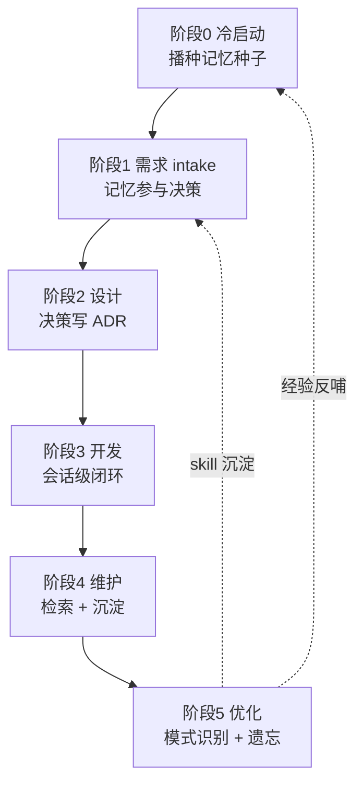
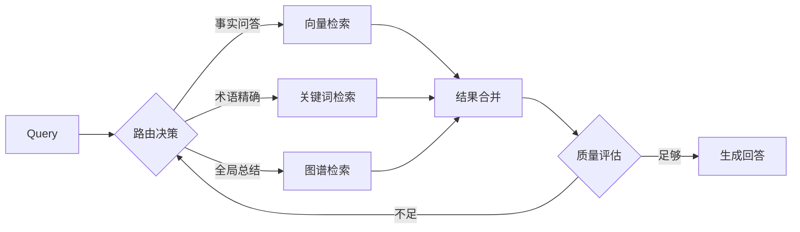
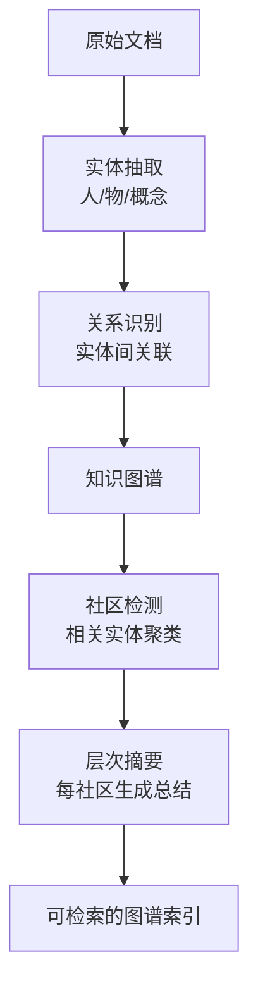
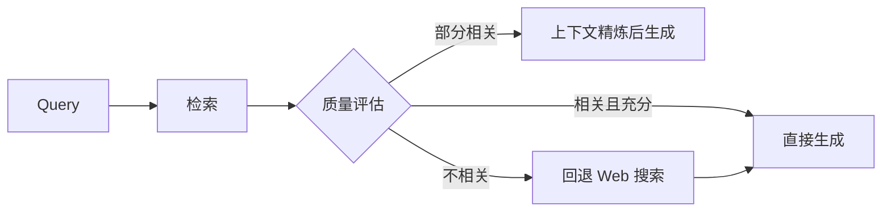
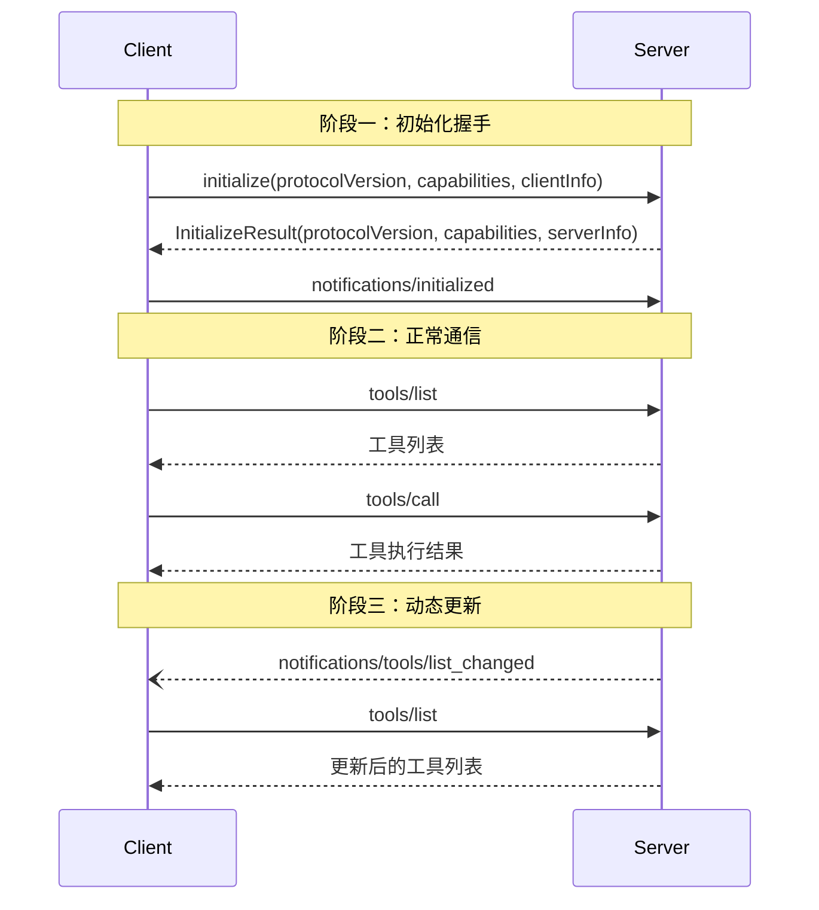

# 分类：人工智能

共 11 篇文章

---

# 世界模型：大语言模型的终结者，还是资本叙事的下一幕？
Date: 2026-07-02 | Tags: AI, 世界模型, LLM, JEPA, 物理推理 | URL: https://bsheepcoder.github.io/2026/07/02/ai-world-models/

## 一、元认知：世界模型到底在解决什么问题

> 智能的本质不是"能说会道"，而是"能想象未来"。

当你闭上眼睛想象明天的面试场景——面试官可能问什么、你如何回答、对方的表情会如何变化——你的大脑正在进行一次"世界模拟"。你不需要真的去面试，就能在脑中预演数百种可能。这种能力，认知科学家称之为**心理模拟**（mental simulation），而AI领域给它起了一个更宏大的名字：**世界模型**（World Model）。

世界模型的核心命题只有一句话：**构建一个内部的环境表示，用它来预测未来状态的变化，从而在行动之前先"想清楚"。** 这与大语言模型（LLM）的"预测下一个token"有着本质区别——LLM预测的是文本序列，世界模型预测的是**物理世界的状态转移**。

这里有一个根本矛盾需要先理解：**我们所处的物理世界是连续的、高维的、因果驱动的，而语言是离散的、低维的、相关性驱动的。** LLM通过海量文本学会了"语言的统计规律"，但它从未见过一个球从桌上滚落的物理过程，也从未理解过"推"这个动作的力学含义。它能描述这个过程，但不能**模拟**这个过程。

这正是世界模型试图填补的空白。

---

## 二、搭积木：从概念到工程的三十五年

### 2.1 远古时代：Schmidhuber的RNN世界模型（1990）

"世界模型"这个词并非新造。1990年，Jürgen Schmidhuber就提出了用循环神经网络（RNN）构建世界模型的设想：让网络从观测中学习环境的内部表示，然后用这个表示来预测未来状态，并基于预测来训练智能体（agent）的策略。

这个想法超前了三十年。当时的算力、数据和算法都不足以支撑它。但它种下了一颗种子：**智能体不应该在真实环境中反复试错，而应该先在"脑中"模拟，再付诸行动。**

### 2.2 复兴：Ha & Schmidhuber的World Models（2018）

2018年，David Ha和Schmidhuber发表了论文《Recurrent World Models Facilitate Policy Evolution》。他们的智能体学会了在虚拟赛车游戏和3D迷宫中驾驶——完全通过在自生成的"梦境"中训练，而非直接与真实环境交互。

关键工程创新：用变分自编码器（VAE）将高维像素压缩为低维潜在表示，再用RNN在潜在空间中预测未来。智能体在"梦中"学会了转弯、避障、加速。

### 2.3 LeCun的JEPA架构（2022-2026）

2022年6月，Yann LeCun发表了一篇92页的立场论文《A Path Towards Autonomous Machine Intelligence》。这篇论文不是在描述一个模型，而是在勾勒一条**通往通用人工智能的技术路线**。其核心主张：

> LLM只学了文本，而世界是高维连续空间。要实现真正的智能，必须学会在**嵌入空间**（embedding space）中做预测，而非在像素空间或文本空间。

他提出的架构叫**JEPA**（Joint Embedding Predictive Architecture，联合嵌入预测架构）：

| 组件 | 功能 |
|------|------|
| 编码器（Encoder） | 将观测（视频帧、传感器数据）压缩为嵌入向量 |
| 预测器（Predictor） | 根据当前嵌入和动作，预测未来的嵌入 |
| 正则化器（Regularizer） | 保持嵌入空间的良好结构 |

JEPA的关键洞察：**预测嵌入而非预测像素**。生成模型（如扩散模型）试图还原每一个像素细节，计算代价极高。JEPA只预测"重要的东西"——物体的位置、运动方向、因果关系——忽略纹理、光照等无关细节。

到2025年6月，Meta发布了V-JEPA 2，在视频理解和物理推理基准上达到了当时的SOTA（Something-Something、Epic-Kitchens-100等），并支持零样本机器人控制。2026年3月，LeWorldModel进一步实现了从原始像素的端到端稳定训练。同年，LeCun创立了AMI Labs（Advanced Machine Intelligence Labs），首轮融资10.3亿美元，估值35亿美元。

---

## 三、案例即原理：主流世界模型的技术路线

### 3.1 Meta路线：JEPA系列——嵌入空间预测派

**核心理念**：不生成像素，只预测嵌入。

V-JEPA 2的技术架构：
- 视觉编码器将视频帧编码为嵌入
- 预测器根据动作序列预测未来嵌入
- 训练目标：最小化嵌入空间的预测误差

**工程优势**：不依赖像素级重建，计算效率高；能处理不完整观测（如部分遮挡）。

**工程缺陷**：在IntPhys 2基准测试上，V-JEPA 2检测物理违规的能力仅略好于随机猜测（人类接近100%）。这暴露了一个根本问题：**在嵌入空间中预测，可能丢失了某些关键的物理细节。**

### 3.2 DeepMind路线：Genie系列——交互式世界生成派

**核心理念**：从视频中学习可交互的3D世界。

Genie的技术演进：
- **Genie**（2024）：从无标注互联网视频中学习交互环境
- **Genie 2**（2024年末）：增加了3D生成能力
- **Genie 3**（2025年8月）：从文本/图像提示生成照片级逼真的实时交互世界，24fps实时渲染

Genie 3的突破在于**通用性**：它不是一个专门的物理引擎，而是一个从视频数据中学会"世界如何运作"的通用模型。2026年2月，Waymo采用Genie 3构建了自动驾驶专用世界模型，能生成同步的摄像头和激光雷达输出，模拟龙卷风、异常行人行为等罕见场景。

### 3.3 NVIDIA路线：Cosmos——物理AI基础模型派

**核心理念**：为物理AI（机器人、自动驾驶）构建统一的世界基础模型。

2026年6月发布的Cosmos 3：
- 参数规模：Nano（16B）到Super（64B）
- 架构：混合Transformer（MoT）——自回归Transformer做推理，扩散Transformer做多模态生成
- 输入输出：文本、图像、视频、音频、动作序列
- 定位：开源权重，面向机器人和自动驾驶的物理推理

NVIDIA的策略是**基础设施思维**：不做最聪明的模型，做最通用的平台。

### 3.4 中国路线：从追赶到并行

- **阿里 Happy Oyster**（2026年4月）：实时流畅的世界模型，支持"导演模式"（文本/图像构建世界）和"漫游模式"（自由探索），可生成3分钟连续视频
- **李飞飞 World Labs**：发布Spark 2.0，开源3D高斯渲染引擎，面向手机级设备

### 3.5 资本涌入：信号还是噪声？

| 公司 | 融资 | 时间 | 方向 |
|------|------|------|------|
| AMI Labs（LeCun） | 10.3亿美元（估值35亿） | 2026.03 | 世界模型基础研究 |
| World Labs（李飞飞） | 未公开（传闻数亿美元） | 2024-2025 | 3D空间智能 |
| General Intuition | 1.34亿美元种子轮 | 2025.10 | 用游戏视频训练空间推理 |

仅AMI Labs和General Intuition两个公开项目，已披露资本投入就超过**11亿美元**。这不是一个实验室级别的研究方向，这是一个**产业级别的赌注**。

---

## 四、缺陷与批判：世界模型为什么还不是答案

### 4.1 物理理解的鸿沟

IntPhys 2基准测试揭示了一个令人不安的事实：当前最先进的世界模型（V-JEPA 2）在检测物理违规方面**接近随机猜测**。一个球穿过固体墙壁、一个物体悬浮在空中——这些人类婴儿都能感知的"不合理"，世界模型却视而不见。

这说明什么？**当前的世界模型可能只是学会了"视频的统计规律"，而非"物理世界的因果规律"。** 它知道球通常会往下落，但不知道为什么——因为它没有理解重力、质量、碰撞等物理概念。它学到的是相关性，不是因果性。

### 4.2 计算代价的现实

生成式世界模型（如Genie 3）需要实时渲染24fps的3D场景。这需要的算力远超文本生成。NVIDIA Cosmos 3 Super有64B参数，推理成本惊人。**世界模型要真正部署到机器人和自动驾驶上，必须在边缘设备上实时运行——这在当前硬件条件下仍然极具挑战。**

### 4.3 评估标准的缺失

LLM有标准化的基准（MMLU、HumanEval、MATH等）。世界模型呢？IntPhys 2、MVPBench、Something-Something、Epic-Kitchens-100——这些测试各自为政，没有统一的"世界模型智商测试"。DeepMind的交互评估、Waymo的生成质量指标也都是私有的。

**没有标准，就无法比较；无法比较，就无法判断谁在真正进步，谁在讲故事。**

### 4.4 从"能看"到"能做"的鸿沟

世界模型在视频生成上已经令人印象深刻。但从"生成逼真视频"到"让机器人在真实世界中可靠操作"，中间隔着一个巨大的工程鸿沟：

> 能生成一段"机器人抓杯子"的视频 ≠ 能让真实机器人成功抓起一个杯子。

sim-to-real gap（仿真到现实的差距）是机器人学的老问题。世界模型能缩小这个差距，但不能消除它。

---

## 五、回到根本：世界模型与LLM，谁颠覆谁

### 5.1 LeCun的"LLM末日论"

LeCun在2025年接受Newsweek采访时直言：

> LLMs are nearing the end. Because they are trained only on text, they have no ability to predict anything beyond text, such as real-world events.

他的论证链条：
1. LLM只在文本上训练
2. 文本是低维离散的，物理世界是高维连续的
3. 因此LLM无法理解物理世界
4. 世界模型在传感器数据（视频、激光雷达等）上训练
5. 因此世界模型能理解物理世界
6. 所以世界模型将取代LLM

这个论证有一个关键漏洞：**前提4和5之间的跳跃。** 在传感器数据上训练 ≠ 理解物理世界。IntPhys 2的测试结果已经证明了这一点。V-JEPA 2在大量视频上训练后，仍然无法可靠地检测物理违规。

### 5.2 另一种可能：共生而非颠覆

更现实的图景可能是**混合系统**：

| 层次 | 负责者 | 例子 |
|------|--------|------|
| 语言理解与规划 | LLM | 理解指令"去厨房拿一杯水" |
| 物理推理与模拟 | 世界模型 | 预测杯子的重量、水的晃动、行走路径 |
| 低级控制 | 强化学习策略 | 控制电机力矩、保持平衡 |

LLM擅长抽象推理和语言理解，世界模型擅长物理模拟和空间推理，强化学习策略擅长精细控制。**三者各司其职，而非互相替代。**

### 5.3 "GPT时刻"会来吗

要回答这个问题，先拆解GPT时刻的本质：GPT-3/ChatGPT的突破不在于某个单独的技术（Transformer、自回归训练都不是新东西），而在于**规模效应（scaling law）的突然显现**——当模型参数和数据量跨过某个临界点，涌现出了远超预期的能力。

世界模型的"GPT时刻"需要满足三个条件：

1. **统一的架构**：目前JEPA、扩散模型、自回归模型各走各路，没有一个架构像Transformer统治NLP那样统治世界建模
2. **规模效应的验证**：需要证明"模型越大、数据越多，物理理解能力就越好"——目前没有这样的证据
3. **杀手级应用**：ChatGPT让普通人第一次感受到AI的力量。世界模型的"ChatGPT时刻"可能是一个能实时生成可交互3D世界的消费级产品

**当前状态：三个条件都不满足。** 但这不代表永远不会满足。LeCun创立AMI Labs拿了10.3亿美元，NVIDIA开源了Cosmos 3，DeepMind的Genie 3已经能实时生成交互世界——这些投入正在加速条件的成熟。

### 5.4 资本叙事 vs 真实研究

诚实地说：**两者兼有。**

真实研究的部分：
- JEPA架构有扎实的理论基础（嵌入空间预测比像素生成更高效）
- 自动驾驶领域已有真实需求（Waymo使用Genie 3）
- 机器人学的sim-to-real transfer是被验证过的有效方法

资本叙事的部分：
- 已披露的融资规模（仅AMI Labs和General Intuition就超11亿美元）远超当前技术成熟度
- "世界模型取代LLM"的叙事恰好迎合了投资者寻找"下一个风口"的心理
- 许多公司的demo效果远超实际产品能力
- LeCun既是顶级研究者，也是AMI Labs的创始人——他有动机夸大世界模型的前景

---

## 总结：世界模型是什么

世界模型不是骗局，但它也不是答案——至少现在不是。

它是AI从"语言的统计学"走向"物理的因果推理"的必要路径。任何一个想要在真实世界中行动的智能体——无论是机器人、自动驾驶汽车，还是具身智能——都需要某种形式的世界模型。这个需求是真实的，不可替代的。

但当前的技术离"理解物理世界"还很远。V-JEPA 2检测物理违规接近随机猜测，Genie 3生成的世界虽然好看但不可控，NVIDIA Cosmos 3的推理成本仍然高不可攀。**世界模型目前更像一个"视频生成器"，而非"物理推理引擎"。**

GPT时刻不会在2026年到来，但资本已经提前入场。这既是信心的表现，也是泡沫的前兆。最终的赢家，不会是喊口号最响的公司，而是在三个关键问题上取得突破的团队：

1. **如何让模型真正理解因果关系，而非统计相关性？**
2. **如何在边缘设备上实时运行世界模型？**
3. **如何建立统一的评估标准，让"世界模型能力"可以被量化和比较？**

这三个问题的答案，将决定世界模型是成为AI的下一个基石，还是成为资本叙事的又一个注脚。


---

# SQLite 做 AI 开发记忆库：工程检验下的最佳实践
Date: 2026-07-01 | Tags: AI, MDD, 记忆, SQLite, opencode, MCP | URL: https://bsheepcoder.github.io/2026/07/01/ai-sqlite-memory-store/

## 一、问题：AI 开发的记忆该用什么存

2026 年，几乎所有 AI 编码工具都有某种形式的"记忆"——Aider 有 `.aider.chat.history.md`，Claude Code 有 `CLAUDE.md` + auto memory（`MEMORY.md`），opencode 有 `AGENTS.md` + skills。但它们用的都是 Markdown 文件。

同时，[记忆驱动开发（MDD）](/2026/07/01/ai-memory-driven-development/)的六阶段闭环里，"阶段 4 维护——先检索再修复"需要的是：**从过去 N 次踩坑记录中，快速找到和当前 bug 相关的那一条**。当记忆条目从 10 条增长到 1000 条时，Markdown 文件的 `Ctrl+F` 还够用吗？

这就是本文要回答的核心问题：**SQLite 做开发记忆库，有价值吗？如果有，怎么接入？对比 Markdown 式记忆，优势在哪？**

## 二、现状盘点：谁在用什么存记忆

### Markdown 派：人可读优先

| 工具 | 记忆载体 | 格式 | 检索方式 |
|------|---------|------|---------|
| Aider | `.aider.chat.history.md` + `.aider.input.history` | Markdown / 纯文本 | 人眼读、grep |
| Claude Code | `CLAUDE.md` + auto memory（`MEMORY.md` + 主题 .md） | Markdown | 启动时自动注入前 200 行/25KB |
| Cline / Roo Code | `.clinerules` / `.roomodes` | Markdown | 启动注入 |
| opencode | `AGENTS.md` + `.opencode/skills/*/SKILL.md` | Markdown | AGENTS.md 全量注入，skills 按需懒加载 |

Markdown 派的共同优势：**可 diff、可版本控制、人可直读**。你能在 git log 里看到记忆的演化历史，能在 PR 里 review 一条新规则。这是 Markdown 的杀手锏。

但它的局限同样明显：**没有结构化检索能力**。当 `lessons/` 目录下有 500 条踩坑记录时，找"上次 PostgreSQL 连接池耗尽怎么解的"，只能靠文件名约定 + 全文搜索。没有语义匹配，没有元数据过滤，没有关联查询。

### SQLite 派：机器可检索优先

| 工具/框架 | SQLite 用途 | 证据 |
|-----------|------------|------|
| LangGraph | `SqliteSaver` checkpoint（官方包 `langgraph-checkpoint-sqlite` v3.1.0，2026-05 更新） | PyPI 官方包，存对话状态/中断点 |
| Continue.dev | 本地持久化（`package.json` 依赖 `sqlite` + `sqlite3`） | 代码库已核实 |
| ChromaDB | 默认后端的元数据层（向量索引用 HNSW，元数据存 SQLite） | 28.6k stars，默认本地模式 |

注意一个细节：**ChromaDB 用 SQLite 存元数据，但向量索引不用 SQLite 存**——它用专用的 HNSW 索引。这说明 SQLite 在向量检索场景不是万能的，它的价值在**结构化数据的存储和查询**，不在向量索引本身。

### Mem0：都不用 SQLite

Mem0（最知名的 Agent 记忆框架）默认用 Qdrant 做向量存储，自托管用 pgvector（PostgreSQL）。`mem0/vector_stores/` 目录下有 qdrant/chroma/pgvector/faiss/milvus/pinecone 等 26 个 provider，**没有 `sqlite.py`**。

这能说明 SQLite 不适合做记忆吗？不能。Mem0 的场景是 SaaS 级 Agent 记忆——高并发、多租户、百万级记忆条目。而个人开发者的记忆库通常 <1 万条，SQLite 的零部署优势在这个量级远大于它的并发短板。

## 三、SQLite + 向量检索：技术栈成熟度

### sqlite-vec：可用的轻量方案

`sqlite-vec`（`asg017/sqlite-vec`，7.8k stars）是当前最活跃的 SQLite 向量扩展。核心事实：

| 维度 | 数据 |
|------|------|
| 版本 | v0.1.9 稳定（2026-03），v0.1.10-alpha 开发中 |
| 维度上限 | 8192 维（覆盖 OpenAI text-embedding-3-large 的 3072 维） |
| 距离度量 | L2（默认）、L1、cosine |
| 向量类型 | float32 / int8 / bit（支持量化） |
| 元数据过滤 | KNN 查询中支持 `=/!=/>/</<=` |
| 安装 | `pip install sqlite-vec` / `npm install sqlite-vec` |
| 平台 | Windows/Linux/macOS/WASM/Android/iOS |

关键限制：**默认暴力线性扫描，不是 ANN（近似最近邻）**。没有 HNSW 或 IVF 索引，ANN 算法在仓库里还是实验性 `.c` 文件，未进稳定版。这意味着：

- <1 万条：查询几十 ms，够用
- 1-10 万条：可接受但开始变慢
- >10 万条：明显吃力

前代 `sqlite-vss` 基于 Faiss（C++），安装麻烦，已于 2024 年停止维护，**不要用**。

### DuckDB vss：要 ANN 性能的替代

如果数据量超过 10 万条或需要毫秒级延迟，DuckDB 的 `vss` 扩展（`duckdb/duckdb-vss`，260 stars）提供真正的 HNSW 索引。但 DuckDB 是 OLAP 引擎，比 SQLite 重得多，不适合 CLI 工具的零部署场景。

### SQLite 独有的杀手锏：混合查询

这是 SQLite 记忆库最被低估的优势。一条 SQL 同时做向量检索 + 全文搜索 + 元数据过滤：

```sql
-- 找"和当前 bug 语义相似 + 包含'连接池'关键词 + 属于数据库分类"的历史经验
SELECT id, content, distance
FROM memories
WHERE embedding MATCH :current_bug_embedding
  AND k = 10
  AND content MATCH '连接池 池耗尽 timeout'
  AND category = 'database'
  AND project = 'abr'
ORDER BY distance;
```

这段查询用到了 `sqlite-vec`（向量 MATCH）+ SQLite FTS5（全文 MATCH）+ 原生 SQL（元数据过滤）。三者同一查询内 JOIN，不需要跨系统编排。Markdown 做不到，Mem0 + Qdrant 要跨两个系统才能实现。

## 四、opencode 如何接入 SQLite 记忆库

opencode 当前没有内置记忆数据库——它的"记忆"完全靠文件驱动（`AGENTS.md` 全量注入 + skills 按需懒加载）。但它提供了三个接入点，足以实现 SQLite 记忆库。

### 接入点一：自定义工具（Agent 主动查询）

`.opencode/tools/` 下定义工具，Agent 按需调用。文件名即工具名：

```typescript
// .opencode/tools/memory-query.ts
import { tool } from "@opencode-ai/plugin"
import { Database } from "bun:sqlite"
import sqliteVec from "sqlite-vec"

const db = new Database("memory.db")
db.enableLoadExtension(true)
sqliteVec.load(db)

export default tool({
  description: "检索项目记忆库中的历史经验。当遇到 bug、做技术决策、或需要参考历史方案时使用。",
  args: {
    query: tool.schema.string().describe("自然语言查询，如'PostgreSQL 连接池耗尽'"),
    limit: tool.schema.number().optional().describe("返回条数，默认 5"),
  },
  async execute(args) {
    const embedding = new Float32Array(await embed(args.query))
    const results = db.query(`
      SELECT m.id, m.content, m.type, m.created_at, v.distance
      FROM memories m
      JOIN memories_vec v ON m.id = v.id
      WHERE v.embedding MATCH ? AND k = ?
        AND m.project = ?
      ORDER BY v.distance
    `).all(embedding, args.limit ?? 5, process.cwd())
    return JSON.stringify(results, null, 2)
  },
})
```

Agent 在开发过程中遇到 bug 时，会自动调用 `memory-query` 工具检索历史经验——不需要人手动翻 `lessons/` 目录。

### 接入点二：Plugin hooks（自动写入记忆）

`.opencode/plugins/memory-sink.ts` 在会话空闲时自动提取记忆：

```typescript
// .opencode/plugins/memory-sink.ts
export default async ({ client }) => ({
  "session.idle": async (input, output) => {
    // 会话空闲时，提取本次对话中的经验
    const summary = await client.session.summarize(input.sessionID)
    const embedding = await embed(summary)
    
    db.query(`INSERT INTO memories (content, embedding, type, project) VALUES (?, ?, ?, ?)`)
      .run(summary, embedding, "experience", process.cwd())
  },
  "tool.execute.after": async (input, output) => {
    // 工具执行后，如果是修 bug，记录解法
    if (input.tool === "bash" && output.result.includes("fix")) {
      const embedding = await embed(output.result)
      db.query(`INSERT INTO memories (content, embedding, type) VALUES (?, ?, ?)`)
        .run(output.result, embedding, "bugfix")
    }
  },
})
```

`session.idle` 是最接近"对话后自动写入记忆"的 hook；`tool.execute.after` 可以在工具执行后做后处理。两者配合实现记忆的自动积累。

### 接入点三：MCP server（跨工具共享记忆）

如果同时用 opencode、Claude Code、Cursor，记忆不该锁在单一工具里。把 SQLite 记忆库包装成 MCP server，所有工具通过统一协议访问：

```jsonc
// opencode.json
{
  "mcp": {
    "memory": {
      "type": "local",
      "command": ["npx", "-y", "sqlite-memory-server"],
      "environment": { "DB_PATH": ".memory/memory.db" }
    }
  }
}
```

MCP 的价值在[MCP 协议详解](/2026/06/22/ai-mcp-protocol/)中讲过：M+N 线性解法。记忆库作为 MCP server 后，换 AI 工具不丢记忆——这正是[开源 Agent 架构拆解](/2026/06/26/ai-agent-2026-landscape/)说的"框架可换，记忆不可换"。

### 三种接入的取舍

| 接入方式 | 触发 | 适合场景 | 复杂度 |
|---------|------|---------|--------|
| 自定义工具 | Agent 主动调用 | 按需检索历史经验 | 低，单文件 |
| Plugin hooks | 事件驱动自动触发 | 自动积累记忆（无需手动记） | 中，需处理摘要/嵌入 |
| MCP server | 多工具共享 | 跨 opencode/Claude Code/Cursor | 高，需独立服务 |

个人开发者建议从自定义工具起步——一个 `.opencode/tools/memory-query.ts` 就能让 Agent 查历史经验。积累一段时间后，再加 Plugin hooks 实现自动写入。多工具协作时才上 MCP server。

## 五、对比：SQLite 记忆 vs Markdown 记忆

### 逐维度对比

| 维度 | Markdown 文件 | SQLite + sqlite-vec |
|------|-------------|---------------------|
| **可读性** | 人直读，git diff 友好 | 需 SQL 查询，不可直读 |
| **版本控制** | 原生 git diff，PR review | 二进制 .db 文件，diff 无意义 |
| **检索精度** | 全文搜索（grep/FTS） | 向量语义 + FTS5 + 元数据过滤混合 |
| **检索速度** | O(n) 扫描，<100 条够用 | <1 万条几十 ms，>10 万条吃力 |
| **结构化查询** | 不可能 | SQL 原生支持（JOIN/过滤/聚合） |
| **部署成本** | 零，纯文本 | 低，一个 .db 文件 + 一个扩展 |
| **可移植性** | 任何编辑器 | 需要 sqlite-vec 扩展 |
| **记忆量级** | <100 条舒适 | <1 万条舒适 |
| **协作友好** | PR review 天然支持 | 需要额外机制（导出/同步） |

### 各自的不可替代优势

**Markdown 的不可替代优势**：**可 diff**。一条记忆从"Proposed"改成"Accepted"，一个 git commit 就说清了。团队协作时，新规则要 PR review——Markdown 天然支持，SQLite 做不到（二进制文件无法有意义地 diff）。

**SQLite 的不可替代优势**：**结构化检索**。找"所有数据库分类的 bugfix，按时间倒序，关联到 PostgreSQL 连接池"——Markdown 要遍历所有文件正则匹配，SQLite 一条 SQL 三十毫秒返回。

### 结论：不是二选一

两者的优势不可互相替代。Markdown 的可 diff 性 SQLite 永远做不到；SQLite 的结构化检索 Markdown 永远做不到。正确的做法是**分层**。

## 六、最佳实践：分层记忆架构

经过以上分析，一个能接受工程检验的最佳实践是**三层记忆架构**——不是"用 SQLite 替代 Markdown"，而是各层各管一件事：

```
┌─────────────────────────────────────────────────┐
│  第一层：约束层（Markdown）                       │
│  AGENTS.md / CLAUDE.md / .cursor/rules          │
│  存什么：项目规则、技术栈、命名约定                  │
│  检索方式：每次会话自动注入                         │
│  版本控制：git diff，PR review                    │
│  量级：<10 个文件                                 │
├─────────────────────────────────────────────────┤
│  第二层：决策层（ADR + Markdown）                  │
│  docs/decisions/NN-标题.md                       │
│  存什么：架构决策、技术选型、为什么选 A 不选 B        │
│  检索方式：按主题 grep / 按序号                    │
│  版本控制：git diff，PR review                    │
│  量级：<100 条                                   │
├─────────────────────────────────────────────────┤
│  第三层：经验层（SQLite）                          │
│  .memory/memory.db (sqlite-vec)                  │
│  存什么：踩坑日志、bug 解法、代码片段、会话摘要       │
│  检索方式：向量语义 + FTS5 + 元数据过滤混合查询      │
│  版本控制：.gitignore（或定期导出为 Markdown 归档）  │
│  量级：<1 万条                                   │
└─────────────────────────────────────────────────┘
```

### 为什么是三层

- **约束层用 Markdown**：因为它是"每次都要加载的规则"，量小、变化少、必须可 review。SQLite 在这个场景没有任何优势。
- **决策层用 ADR（Markdown）**：因为决策的推理过程需要人写、人审、git 追踪。ADR 一旦 Accepted 不可删除，Markdown 的可 diff 性是必需的。
- **经验层用 SQLite**：因为经验是"量大、低频读、高频写、需要语义检索"的。500 条踩坑记录里找相关的 3 条，SQL + 向量检索比 grep 快三个数量级。这个场景 Markdown 没有优势。

### 程序性记忆（skills）的位置

[上一篇文章](/2026/07/01/ai-memory-driven-development/)定义的第四类记忆——程序性记忆（`.opencode/skills/*/SKILL.md`）——用 Markdown。因为 skill 是"可复用的流程"，量小、需人工审核、需版本控制。从经验层的 SQLite 记忆中提取高频模式，固化为 skill 时，是从第三层向第一层/程序层的"蒸馏"。

### SQLite 经验层的表结构

一个最小可用的记忆库 schema：

```sql
-- 记忆主表（结构化数据 + 向量）
CREATE TABLE memories (
  id INTEGER PRIMARY KEY,
  content TEXT NOT NULL,           -- 记忆正文
  type TEXT NOT NULL,              -- bugfix / decision / learning / snippet
  project TEXT NOT NULL,           -- 项目路径，隔离多项目
  tags TEXT,                       -- 逗号分隔标签
  source TEXT,                     -- 来源：session-id / tool / manual
  created_at TEXT DEFAULT (datetime('now')),
  embedding BLOB                   -- 序列化的嵌入向量（768 维 float32）
);

-- 向量索引（sqlite-vec 虚拟表）
CREATE VIRTUAL TABLE memories_vec USING vec0(
  id INTEGER PRIMARY KEY,
  embedding FLOAT[768] distance_metric=cosine
);

-- 全文索引（SQLite FTS5）
CREATE VIRTUAL TABLE memories_fts USING fts5(
  content, type, project, tags
);

-- 插入时同步三张表（触发器或应用层保证）
-- 查询示例：语义 + 全文 + 元数据混合
SELECT m.id, m.content, m.type, m.created_at, v.distance
FROM memories m
JOIN memories_vec v ON m.id = v.id
JOIN memories_fts f ON m.id = f.rowid
WHERE v.embedding MATCH :query_embedding
  AND v.k = 10
  AND m.project = :project
  AND memories_fts MATCH '连接池 池耗尽'  -- FTS5 全文
ORDER BY v.distance;
```

注意三张表的设计：`memories`（结构化数据）+ `memories_vec`（向量索引）+ `memories_fts`（全文索引）。三者通过 `id` 关联，一条 SQL 三表 JOIN 混合查询。这是 SQLite 独有的优势——向量库和关系库天然不在同一个引擎里时，这种混合查询需要跨系统编排。

### 记忆生命周期

```
产生（session.idle hook 自动写入）
  → 积累（ADD-only，不更新不删除，类似 Mem0 v3 策略）
    → 检索（memory-query 工具按需查询）
      → 蒸馏（高频模式提取为 skill / ADR）
        → 遗忘（过时记忆标记 deprecated，不物理删除）
```

"不物理删除"借鉴 ADR 的不可变原则——过时的记忆本身也是历史，能解释"为什么曾经这么做"。遗忘不是 DELETE，是标记。

## 七、缺陷与边界：诚实地说

### sqlite-vec 的 pre-v1 风险

`sqlite-vec` 明确标注 "pre-v1, expect breaking changes"。v0.1.9 可用，但 v0.2 可能改 API。生产环境使用需要锁定版本号，做好升级适配的准备。这不是一个"配好用一辈子"的稳定依赖。

### 暴力扫描的性能天花板

默认线性扫描意味着记忆条目超过 1 万条后查询明显变慢。对于个人开发者，1 万条记忆大约对应 2-3 年的持续积累——大多数人到不了这个量级。但如果你在做高频记忆写入（每次工具调用都记），可能半年就到瓶颈。解法是迁移到 DuckDB vss（HNSW）或专用向量库。

### SQLite 的并发限制

SQLite 是单写者模型。如果多个 Agent 实例同时写记忆（多窗口、多项目并行），会遇到 `database is locked`。个人开发者单窗口使用无此问题，但团队协作场景需要考虑用 WAL 模式或迁移到 PostgreSQL。

### 嵌入模型的依赖

SQLite 存向量，但生成向量需要嵌入模型。这意味着记忆库运行时需要调用 embedding API（本地 bge-small 或远程 OpenAI）。离线场景下记忆检索不可用——除非用本地模型（如 `sqlite-lembed` 加载 gguf embedding，但质量低于云端模型）。

### Markdown 的协作优势 SQLite 补不了

这是最重要的一条边界。如果团队需要 PR review 每条新记忆，SQLite 的二进制 .db 文件无法 diff，review 流程断裂。这种场景下，即使经验层用 SQLite 做检索，仍需定期将关键经验导出为 Markdown 归档——因为**团队协作的信任机制建立在可 diff 的文本上**。

## 八、总结：SQLite 记忆库的本质

回到最初的问题：SQLite 做记忆库有价值吗？

**有价值，但不是万能的。** SQLite 的不可替代价值在一个具体场景：**当记忆条目超过 100 条、需要语义检索和结构化过滤时，SQL + 向量 + FTS5 的混合查询比 Markdown grep 快三个数量级。**

但它不能替代 Markdown 的可 diff 性，不能替代 ADR 的决策留痕，不能替代 skills 的程序性复用。它只补齐了"经验检索"这一层——而这一层，恰恰是当前所有 Markdown-first 工具的共同短板。

最佳实践不是"选 SQLite 还是选 Markdown"，而是**分层**：

| 层 | 载体 | 存什么 | 为什么选它 |
|----|------|--------|-----------|
| 约束 | Markdown | 项目规则 | 可注入、可 review |
| 决策 | ADR (Markdown) | 架构权衡 | 可 diff、不可删除 |
| 经验 | SQLite + sqlite-vec | 踩坑日志 | 可语义检索、可结构化过滤 |
| 程序 | Skills (Markdown) | 可复用流程 | 可发现、可加载 |

四层各管一件事，互不替代。约束告诉你边界，决策告诉你为什么，经验告诉你上次怎么做的，skills 告诉你怎么自动做。一个成熟的 AI 开发记忆系统，四层缺一不可。

opencode 的接入路径清晰：自定义工具做检索、Plugin hooks 做写入、MCP server 做跨工具共享。从一个 `memory-query.ts` 文件起步，不需要一步到位。

---

## 参考资料

- 本站 [AI 时代开发范式演化：从 Waterfall 到 Memory-Driven 的终局](/2026/07/01/ai-memory-driven-development/) — MDD 六阶段闭环，记忆资产分层
- 本站 [开源 Agent 架构深度拆解](/2026/06/26/ai-agent-2026-landscape/) — 框架可换记忆不可换，陈述性 vs 程序性记忆
- 本站 [深入浅出 RAG](/2026/06/24/ai-rag-engineering/) — 非参数化记忆，RAG 的本质是"可更新的外部记忆"
- 本站 [MCP 协议详解](/2026/06/22/ai-mcp-protocol/) — 记忆的标准化访问接口，M+N 线性解法
- [sqlite-vec](https://github.com/asg017/sqlite-vec) — SQLite 向量扩展，7.8k stars，pre-v1
- [LangGraph SqliteSaver](https://pypi.org/project/langgraph-checkpoint-sqlite/) — 官方 SQLite checkpoint 持久化
- [opencode 文档](https://opencode.ai/docs/) — 自定义工具、Plugin hooks、MCP 配置
- [ADR 模板](https://github.com/architecture-decision-record/architecture-decision-record) — Michael Nygard 格式，16.3k stars


---

# AI 时代开发范式演化：从 Waterfall 到 Memory-Driven 的终局
Date: 2026-07-01 | Tags: AI, 开发范式, MDD, Agent, 记忆 | URL: https://bsheepcoder.github.io/2026/07/01/ai-memory-driven-development/

## 一、元认知：无状态的天才

2026 年，AI 编程能力已经到了一个奇怪的拐点：模型足够聪明，但每次对话都像失忆。

你花两小时给 Claude 讲清了项目的架构约定、命名规范、部署流程。它完美理解，交付了代码。然后你关掉终端，下次再打开——一切归零。它不记得你的项目，不记得你的偏好，不记得上次踩过的坑。你重新讲一遍。

这不是工具不好用的问题。这是所有当前开发范式的**共同天花板**：AI 的能力边界不在模型，在**上下文连续性**。

### 所有范式都在回答同一个问题

把从 Waterfall 到 Autonomous SE 的十种开发范式摆在一起，表面上是输入、驱动、自主性、适用场景的差异。但如果退后一步看本质，它们全在回答同一个问题：

> **如何向 AI 提供正确的上下文？**

差异只在于"用什么提供"和"提供多少"。但更深一层，真正的演化轴不是"AI 自主性越来越高"——那是表象。真正的轴是：

> **什么被视为可持久化、可积累的资产？**

- Waterfall 把需求文档当资产
- DevOps 把流水线配置当资产
- Prompt-Driven 把 prompt 当资产
- Spec-Driven 把规范当资产
- Autonomous SE 把治理策略当资产

这些资产有一个共同特征：它们是**静态的**。需求文档写完不变，流水线配好不变，规范定义后不变。每次 AI 介入开发，都从这些静态文件重新开始——没有经验积累，没有学习曲线，没有"上次这么做成功了，这次照着来"。

这就像一个每天失忆的外科医生：医术精湛，但每天早上要重新认识手术室的布局。

### 人脑的启示：两种记忆

人脑有两种记忆，[开源 Agent 架构拆解](/2026/06/26/ai-agent-2026-landscape/)一文的认知二讲得很清楚：

- **陈述性记忆**——"知道什么"（巴黎是法国首都）
- **程序性记忆**——"知道怎么做"（骑自行车）

陈述性记忆让 Agent"想起"你上次说了什么。程序性记忆让 Agent"会做"它上次不会的事。前者是检索增强，后者是**能力增长**。

当前所有开发范式提供的"上下文"，本质上都是陈述性记忆——一份文档、一份规范、一份 prompt。没有哪种范式把"开发过程中积累的经验"当作一等公民。

这就是 Memory-Driven Development（MDD，记忆驱动开发）要解决的问题。但在讲它之前，需要先看清整条演化链——每一步解决了什么，又留下了什么。

---

## 二、搭积木：范式演化矩阵

### 七个阶段

用"核心资产"这一维度重新审视十种范式，演化不是线性的"一个替代一个"，而是**资产类型的跃迁**。每次跃迁解决上一阶段的矛盾，又引入新的矛盾。

---

#### 阶段一：过程为王（Process-Driven）

**范式**：Waterfall、Agile/Scrum

**核心资产**：流程文档、需求规格、User Story

**解决的矛盾**：无序开发 → 结构化、可追踪

**未解问题**：过程文档是"死"的。它们是写给人读的——AI 时代到来后，这些文档既不能被 AI 直接消费，也不随项目演化自动更新。一份 200 页的需求文档，在 AI 看来是噪声而非资产。

---

#### 阶段二：流水线为王（Pipeline-Driven）

**范式**：DevOps

**核心资产**：自动化流水线、基础设施即代码（IaC）

**解决的矛盾**：手动部署不可靠 → 持续交付、可重复

**未解问题**：流水线是**无状态**的。每次构建独立运行，不积累经验。第 1000 次构建和第 1 次一样——它不会记住"上次这个测试在凌晨 3 点挂过"或"这个依赖版本组合曾导致内存泄漏"。流水线是肌肉，但肌肉没有记忆。

---

#### 阶段三：指令为王（Instruction-Driven）

**范式**：Prompt-Driven、Context-Driven、Spec-Driven

**核心资产**：Prompt / 项目上下文文件 / 规范文档

**解决的矛盾**：AI 能做事了，但需要精确指令

这个阶段内部有三个子层次，本身也是一条微演化线：

| 子范式 | 核心资产 | 持久化程度 |
|--------|---------|-----------|
| Prompt-Driven | 单次 prompt | 一次性，用完即弃 |
| Context-Driven | `CLAUDE.md`、`AGENTS.md` 等上下文文件 | 持久文件，但仍静态 |
| Spec-Driven | 可版本化、可审核的规范文档 | 持久 + 可审计，但仍非"记忆" |

从"写一个 prompt"到"维护一个上下文文件"，已经是范式转移——你开始意识到有些东西值得持久化。但 `CLAUDE.md` 是**静态文件**，不是**演化的记忆**。它记录的是规则，不是经验。Spec 文档更进一步，可版本化、可审核，但它的本质仍然是**约束**——告诉 AI 该做什么、不该做什么——而不是**积累**——让 AI 从做过的事中变聪明。

> **关键区分**：约束告诉 AI 边界在哪，记忆让 AI 知道路径在哪。两者都重要，但不是一回事。

**未解问题**：每次会话从零开始。上下文文件被重新加载，但开发过程中产生的决策、尝试、失败、成功——全部丢弃。你花了三小时调试一个棘手的 bug，解决方案不会自动沉淀。下次遇到类似问题，从零开始。

---

#### 阶段四：目标为王（Goal-Driven）

**范式**：Intent-Driven、Goal-Driven

**核心资产**：业务意图、KPI

**解决的矛盾**：指令太细，人不想管每个细节 → 给目标，让 AI 自己规划路径

**未解问题**：目标达成后，**经验不沉淀**。AI 规划了一条成功路径，完成了任务——但这条路径没有被记忆。下次同样的目标，它可能走一条完全不同的路，重复踩同样的坑。

类比：你让一个失忆的员工"把这个项目上线"。他做到了。但你问他"上次怎么做的"，他不记得。你只能希望他下次碰巧走同样的路。

---

#### 阶段五：编排为王（Orchestration-Driven）

**范式**：Workflow-Driven、Multi-Agent

**核心资产**：工作流定义、Agent 协作拓扑

**解决的矛盾**：单 Agent 能力有限 → 多 Agent 协作，专业分工

**未解问题**：工作流是**静态定义**的。你设计了一条 Agent Pipeline：需求分析 → 代码生成 → 测试 → 部署。这条 Pipeline 不会因为"上次测试 Agent 发现了 80% 的 bug 集中在数据层"而自动调整优先级。编排是骨架，但骨架不学习。

---

#### 阶段六：治理为王（Governance-Driven）

**范式**：Autonomous Software Engineering

**核心资产**：治理策略、审计日志、授权边界

**解决的矛盾**：AI 全自主后的安全、合规、问责

**未解问题**：治理是**规则**，不是**经验**。规则约束行为（"不许删生产数据库"），但不让系统变聪明。一个自治系统可能运行了半年，处理了上千个任务——但它的治理策略和第一天一模一样，没有从运行中学到任何东西。

---

#### 阶段七：记忆为王（Memory-Driven）

**范式**：Memory-Driven Development（MDD）

**核心资产**：可积累、可检索、可验证的数字记忆

**解决的矛盾**：以上所有范式的共同缺陷——**无状态**

这不是又一个并列的范式。MDD 解决的是所有范式的**共同地基问题**：每次开发从零开始，经验不积累。它是其他范式的**基底**，而非替代品。

---

### 演化矩阵

把十种范式按"核心资产"维度重新组织：

| 阶段 | 范式 | 核心资产 | 解决的矛盾 | 留下的未解问题 | 记忆角色 | 成熟度 |
|------|------|---------|-----------|--------------|---------|--------|
| 过程为王 | Waterfall / Agile | 流程文档 | 无序 → 结构化 | 文档是死的，AI 不可消费 | 无 | ⭐⭐⭐⭐⭐ |
| 流水线为王 | DevOps | 自动化流水线 | 手动 → 自动 | 无状态，不积累经验 | 无 | ⭐⭐⭐⭐⭐ |
| 指令为王 | Prompt / Context / Spec | Prompt / 上下文文件 / 规范 | AI 需精确指令 | 每次从零开始，经验不沉淀 | 静态约束 | ⭐⭐⭐⭐ |
| 目标为王 | Intent / Goal | 业务目标 / KPI | 指令太细 → 给目标 | 目标达成后路径不沉淀 | 无 | ⭐⭐⭐ |
| 编排为王 | Workflow / Multi-Agent | 工作流 / Agent 拓扑 | 单 Agent → 多 Agent | 工作流静态，不随使用演化 | 静态骨架 | ⭐⭐⭐⭐ |
| 治理为王 | Autonomous SE | 治理 / 审计 / 授权 | AI 全自主的安全合规 | 治理是规则不是经验 | 静态规则 | ⭐⭐ |
| **记忆为王** | **MDD** | **可积累可检索可验证的记忆** | **所有范式的无状态问题** | **冷启动、污染、验证** | **动态积累** | **⭐⭐⭐** |

> 最后一列的成熟度是本文的判断，不是行业共识。MDD 给三星，是因为它的各个组成部分（Agent 记忆、RAG、MCP）已经成熟，但作为完整范式尚未被命名和系统化。

---

## 三、案例即原理：MDD 最优开发流程

### 从"知道为什么"到"知道怎么做"

上一节的演化链讲清了"为什么 MDD 是终局"。但知道为什么，不等于知道明天拿到需求该先做什么。

把 Agent 记忆、RAG、MCP、上下文文件这些已存在的技术线索落到一个具体问题上：**一个开发者接手项目，从需求到维护，记忆如何贯穿全程？** 答案是一个六阶段闭环——不是理论模型，而是从公开实践中提炼的可执行流程。

### 全流程闭环



闭环的关键不是六个阶段本身，而是两条回边：阶段 5 提取的 skill 成为下一个项目的种子（反哺冷启动），阶段 4-5 积累的踩坑经验在阶段 1 需求 intake 时被检索（skill 沉淀到需求）。记忆不是线性流水线的副产品，而是驱动下一轮循环的输入。

### 记忆资产分层

闭环运转前，先看清"记忆"不是单一概念。四种记忆各司其职：

| 记忆类型 | 内容 | 载体 | 检索方式 | 公开实践 |
|---------|------|------|---------|---------|
| 陈述性·约束 | 项目规则、技术栈、命名约定 | `AGENTS.md` / `CLAUDE.md` / `.cursor/rules/*.mdc` | 每次会话自动注入 | Claude Code、Cursor、Aider `CONVENTIONS.md` |
| 陈述性·决策 | 架构选型、技术权衡、为什么选 A 不选 B | ADR（`docs/decisions/NN-标题.md`） | 按主题检索 | ADR 模板（Michael Nygard 2011，16.3k stars） |
| 陈述性·经验 | 踩坑日志、bug 解法、失败尝试 | `lessons/` 或 issue tracker | 关键词检索 | GitHub SpecKit constitution（117k stars） |
| 程序性 | 重复操作的可复用流程 | `skills/<name>/SKILL.md` | Agent 按需自动发现 | opencode skills、Claude Code skills |

前三种是陈述性记忆——"知道什么"。第四种是程序性记忆——"知道怎么做"。两者的区别在[开源 Agent 架构拆解](/2026/06/26/ai-agent-2026-landscape/)中讲过：前者是检索增强，后者是能力增长。MDD 闭环的每个阶段都在读写这四类记忆，但侧重不同。

### 六阶段详解

#### 阶段 0：冷启动——播种，不追求完美

**开发者做什么**：接手项目第一件事不是写代码，而是建 `AGENTS.md`（项目规则、技术栈、构建命令）和 `docs/decisions/`（ADR 目录）。从历史项目迁移可复用的 skill 作为种子。

**记忆如何参与**：空记忆的 MDD 等于无 MDD。冷启动期从已有上下文文件作为种子，逐步积累。

**公开案例**：Claude Code 的记忆是双系统——用户写的 `CLAUDE.md`（持久指令，每次会话自动加载）+ Claude 自己写的 auto memory（学习笔记，存于 `~/.claude/projects/<project>/memory/`）。前者是种子，后者是生长。Aider 的 `CONVENTIONS.md` 通过 `--read` 只读加载，可缓存，是更轻量的种子形态。Cursor 的 rules 从单文件 `.cursorrules` 进化到 `.cursor/rules/*.mdc` 目录（带 `description`/`globs`/`alwaysApply` frontmatter），本身就是记忆组织方式的成熟。

> 冷启动最常犯的错：追求一次性写完美的 `AGENTS.md`。正确做法是写最小可用版本，让后续阶段的使用自然补充。

#### 阶段 1：需求 intake——先检索，再动手

**开发者做什么**：拿到需求不直接开干，先写一句需求简报（一句话目标 + 验收标准），然后让 AI 检索记忆库中相似需求的历史决策和踩坑记录。

**记忆如何参与**：AI 读取 `AGENTS.md`（约束）+ 检索 ADR（相关决策）+ 检索 `lessons/`（同类需求踩过什么坑）。如果历史上有类似需求，AI 能给出"上次这么做成功了/失败了"的参考。

**公开案例**：GitHub SpecKit（`github/spec-kit`，117k stars）的工作流是这条阶段的工程化：`/speckit.constitution`（写项目原则）→ `/speckit.specify`（写 spec）→ `/speckit.plan`（技术计划）→ `/speckit.tasks`（任务拆解）→ `/speckit.implement`（执行）。每一步的输出都是下一步的输入，且 constitution（原则）会被后续步骤反复引用——这就是陈述性记忆在需求阶段的作用。

#### 阶段 2：设计——决策必须留痕

**开发者做什么**：技术方案不只是写文档，关键决策写 ADR（Architecture Decision Record）。ADR 的核心不是"决定做什么"，而是"为什么选 A 不选 B"——记录权衡。

**记忆如何参与**：AI 基于 `AGENTS.md` + 历史记忆生成方案草案，人工审核定稿。ADR 写入 `docs/decisions/NN-标题.md`，成为可检索的陈述性记忆。

**公开案例**：ADR 格式由 Michael Nygard 在 2011 年提出（[原始博文](http://thinkrelevance.com/blog/2011/11/15/documenting-architecture-decisions)），公开模板仓库 `architecture-decision-record/architecture-decision-record`（16.3k stars）。ADR 之所以是记忆而非文档，因为它记录的是决策的推理过程——下次遇到类似权衡时，AI 能检索到"上次为什么这么选"。

#### ADR 长什么样：四要素 + 真实示例

一个标准 ADR 只写四个 section（Nygard 原始格式，极简）：

| Section | 该写什么 |
|---------|---------|
| Status | 当前状态：Proposed（提议）/ Accepted（采纳）/ Rejected（否决）/ Deprecated（弃用）/ Superseded（被替代）|
| Context | 背景与动机：为什么需要做这个决策？面临什么问题？ |
| Decision | 决定做什么 |
| Consequences | 做了之后什么变容易、什么变难 |

下面是一个真实示例（精简自 ADR 仓库的数据库选型案例）：

```markdown
# ADR-007: 选择文档数据库而非关系型数据库

## Status
Accepted

## Context
应用需要灵活数据模型（字段频繁变化）、水平扩展、
快速检索，但不需要复杂事务和跨表完整性约束。

## Decision
选择文档数据库（MongoDB），不用关系型数据库。

## Consequences
变容易：schema 演化无需迁移、水平分片、索引查询快。
变困难：团队需学习文档模型、无跨文档事务、
数据一致性靠应用层保证。
```

注意 Decision 段只写"选了什么"——推理过程在 Context 和 Consequences 里。Context 解释约束，Consequences 预判代价。一个写好的 ADR，别人读完能复现你的决策逻辑，而不只是知道结论。

#### 命名约定与 Status 生命周期

- **文件名**：`NN-kebab-case-title.md`，NN 为零填充序号（如 `007-choose-document-database.md`）
- **存放**：`docs/decisions/` 目录
- **不可删除原则**：ADR 一旦 Accepted，只能被标记为 Superseded（并注明被哪个新 ADR 替代），不可删除。这是记忆的不可变性——过时的决策本身也是历史，能解释"为什么曾经这么选，后来为什么改了"。

Status 的流转：

```
Proposed → Accepted → Superseded（被新 ADR 替代）
         ↘ Rejected（提议但未采纳）
```

#### ADR 在 MDD 中的角色

ADR 是陈述性·决策记忆。它与 `lessons/`（陈述性·经验记忆）配合形成决策-验证闭环：

| 记忆 | 视角 | 回答的问题 |
|------|------|-----------|
| ADR | 向前看（决策时） | 为什么选 A 不选 B？ |
| lessons/ | 向后看（验证后） | 这个选择后来怎样了？踩了什么坑？ |

阶段 2 写 ADR（向前预判），阶段 4 维护时在 `lessons/` 记录结果（向后验证）。下次类似决策时，两者都被检索——既看上次为什么这么选，又看选了之后怎样。

#### 阶段 3：开发——会话级闭环

**开发者做什么**：任务分解 → 增量实现 → 验证循环。每个任务的开发都是一次"加载记忆 → 执行 → 沉淀新记忆"的闭环。

**记忆如何参与**：每次会话自动加载 `AGENTS.md`；开发中踩的坑实时记录到 `lessons/`；代码和记忆同步提交到版本控制。

**公开案例**：Aider 每次修改后自动 git commit，让代码变更自带"记忆锚点"。Claude Code 的 `/memory` 命令同时管理用户写的 `CLAUDE.md` 和 Claude 自己写的 auto memory——前者是约束（人教 AI），后者是经验（AI 自己学）。这个双系统在开发阶段最活跃：AI 一边执行任务，一边把学到的经验写进 auto memory。

> 开发阶段最常见的记忆缺失：只提交代码，不提交踩坑记录。结果是 bug 修了但"怎么修的"丢了，下次同类问题从零开始。

#### 阶段 4：维护——先检索，再修复

**开发者做什么**：遇到 bug，先检索记忆（"上次这个坑怎么解的"），再动手修。修复后把解法沉淀回记忆。

**记忆如何参与**：检索 `lessons/` 和 ADR；高频 bug 的解法提取为 skill（程序性记忆），让 Agent 下次自动处理。

**公开案例**：Mem0 v3（2026 年 4 月新算法）采用 ADD-only 写入策略——一次 LLM 调用提取即存储，不做 UPDATE/DELETE。这和数据库的 WAL（Write-Ahead Log）+ checkpoint 是同一思路：写入追求简单（先记下来），检索追求精准（后续整理）。ADD-only 的代价是长期积累垃圾，但换来的是写入零摩擦——维护阶段最怕的不是记忆污染，是记不住。

#### 阶段 5：优化——模式识别与遗忘

**开发者做什么**：定期回顾记忆数据，识别高频模式——反复出现的坑应固化为 skill，过时的决策应标记为 Deprecated。

**记忆如何参与**：从陈述性记忆（lessons/ADR）中提取模式，固化为程序性记忆（skill）；遗忘机制清理污染记忆和过时决策。

**公开案例**：opencode 的 skills 系统（`.opencode/skills/<name>/SKILL.md`，frontmatter 仅 `name` + `description`）让 Agent 按需自动发现并加载——从踩坑中提取的程序性记忆，成为可复用的能力。Cursor 的 rules 从 `.cursorrules` 单文件进化到 `.cursor/rules/*.mdc` 目录，本身就是"模式识别后结构化"的过程：当规则多到单文件装不下，就按主题拆分，每条 rule 带描述和适用范围。

### 闭环的自我强化

两条回边让闭环不是线性消耗，而是复利积累：

- **经验反哺冷启动**：阶段 5 提取的 skill 成为下一个项目的种子。第一次接手项目要手写 `AGENTS.md`，第三次接手同类项目可以直接迁移已有的 skills 目录。冷启动成本随项目数递减。
- **skill 沉淀到需求**：阶段 3-4 积累的踩坑经验，在阶段 1 需求 intake 时被检索。新需求不必从零评估——"上次做类似功能时这个方案失败了"是现成的决策依据。

这就是 MDD 和所有静态范式的根本区别：Spec-Driven 的规范是写完不变的，MDD 的记忆是越用越厚的。同一个项目，第十次开发的决策质量高于第一次——因为前九次的记忆在参与决策。

---

## 四、缺陷与批判：MDD 的边界

### 每个范式的边界

诚实地说，没有哪种范式是"终局"。每个范式都有它的边界：

| 范式 | 边界 |
|------|------|
| 过程为王 | AI 时代仍有价值——大型项目需要结构化思维，但不再是核心 |
| 流水线为王 | 基础设施不可少，但它不积累"知识" |
| 指令为王 | Prompt 仍是日常工具，但它是"一次性"的——写完即弃 |
| 目标为王 | 理想很美，但当前模型能力还撑不住完全自主的目标分解 |
| 编排为王 | 复杂度高，调试难，适合大型场景而非个人开发 |
| 治理为王 | 未来方向，但成熟度最低，工具链尚未形成 |

### MDD 不替代任何范式

这是最容易被误解的一点。MDD 不是"取代 Spec"或"取代 Workflow"——它是它们的**基底**。

```
没有记忆的 Spec-Driven：    每次从零写规范，不参考历史
有记忆的 Spec-Driven：      从历史经验中生成规范草案，人工审核

没有记忆的 Workflow：       手动设计每一步
有记忆的 Workflow：         从过往成功路径中自动优化编排

没有记忆的 Autonomous SE：  规则固定，不随运行学习
有记忆的 Autonomous SE：    从运行数据中持续学习，治理策略也演化
```

记忆是土壤，其他范式是长在上面的植物。没有土壤，植物也能活——但长不大。

### MDD 自身的四个硬伤

#### 一、冷启动问题

空记忆的 MDD 等于无 MDD。记忆系统需要种子——初始的项目知识、决策记录、设计经验。冷启动期的 Agent 经验不足，可能"学会错误"（Hermes skill 漂移问题的类比）。

解法不是技术上的，是**实践上的**：第三节阶段 0 的流程就是解法——从已有的上下文文件（`AGENTS.md`、`CLAUDE.md`）作为种子，逐步积累。不要追求一开始就完美——先跑起来。

#### 二、记忆污染

ADD-only 策略（写入快、不管冗余）的代价是长期使用后积累垃圾。过时的决策、错误的尝试、已被推翻的结论——这些"记忆污染"会降低检索质量，甚至误导 Agent。

人脑有遗忘机制，当前的记忆系统大部分没有。Mem0 的 ADD-only 不做 UPDATE/DELETE，GBrain 靠 dream cycle 夜间整理——但什么该忘、什么时候忘、忘了之后如何恢复，这些问题远未解决。

#### 三、验证成本

记忆可能是幻觉的传播介质。如果 Agent 从错误记忆中"学到"了一个错误的解决方案，这个错误会通过记忆系统传播到后续所有相关任务——而且比单次幻觉更危险，因为它有了"历史依据"的背书。

验证记忆的正确性需要额外的机制——人工审核、自动化测试、交叉验证。这些机制的搭建成本不低。

#### 四、工具碎片化

Mem0 做陈述性记忆，Hermes 做程序性记忆（skill），GBrain 做知识图谱，MCP 做访问协议——各个层面都有人在做，但**没有统一的记忆架构标准**。今天的记忆系统像 MCP 出现之前的工具生态：M×N 的适配噩梦。

MCP 正在解决"访问层"的标准化，但记忆的"写入策略""遗忘机制""验证流程"仍各自为政。这个问题可能需要一个类似 MCP 的"记忆协议"来解决——但那是后话。

---

## 五、总结：开发者的角色迁移

回到最根本的问题：AI 时代的开发，到底在开发什么？

### 开发的本质变了

前 AI 时代，开发是**写代码**。代码是资产，版本控制管代码，CI/CD 跑代码，code review 审代码。

AI 时代，代码越来越多由 AI 生成。开发的重心从"写代码"转移到**策展和维护一个让 AI 执行有效的知识体**——这个知识体包括项目上下文、决策记录、设计经验、用户反馈、运行数据。

这不是抽象的比喻。`AGENTS.md` 就是这个知识体的雏形——它不是代码，但 AI 没有它就写不出符合项目约定的代码。PDC 生成的 `/api/posts/*.md` 也是这个知识体——它不是给人看的 HTML，但 AI 没有它就无法零噪声读取博客内容。

### 开发者角色的迁移

```
代码编写者          →  记忆策展人
  写代码               维护记忆的质量
  管 version control   管 memory 的积累/索引/验证
  code review          memory review
```

核心能力从"写好代码"变成"维护好让 AI 写好代码的记忆"。这不是降级——维护一个高质量、可检索、可验证的记忆系统，比写代码更难，因为它需要的不只是技术能力，还有**判断什么值得记住、什么应该遗忘**的元认知。

### 终极资产

[开源 Agent 架构拆解](/2026/06/26/ai-agent-2026-landscape/)认知六的判断，在这里得到了终极验证：

> 框架是 runtime 可以换，记忆和 skill 是资产不应该换。

37 个 Agent 框架会消亡，你的代码库会被重构，你用的编程语言会更替。但你积累的——关于这个项目为什么这么设计、这个 bug 上次怎么解的、这个架构决策的权衡是什么——这些**验证过的、可检索的记忆**，是跨框架、跨语言、跨工具的真正资产。

MDD 不是未来时——它的每个组成部分都已经存在。缺的只是把它们组装起来的意识。

---

## 参考资料

- 本站 [开源 Agent 架构深度拆解](/2026/06/26/ai-agent-2026-landscape/) — Agent 记忆架构（陈述性 vs 程序性、WAL+checkpoint、框架可换记忆不可换）
- 本站 [深入浅出 RAG](/2026/06/24/ai-rag-engineering/) — 非参数化记忆，RAG 的本质是"可更新的外部记忆"
- 本站 [MCP 协议详解](/2026/06/22/ai-mcp-protocol/) — 记忆的标准化访问接口，M+N 线性解法
- 本站 [什么是好的提示词](/2026/06/18/ai-prompt-engineering/) — 指令驱动范式的底层原理，outcome-first 转向
- 本站 [用 Hexo 搭建认知管理系统](/2026/06/17/hexo-cognitive-management/) — 记忆的积累-索引-检索-复用闭环实践
- 本站 [AI 浪潮的第一性原理](/2026/06/24/ai-tide-first-principles/) — AI 浪潮的泡沫诊断与结构性判断


---

# AgentScope 2.0 深度拆解：不约束模型的架构哲学
Date: 2026-06-26 | Tags: AI, Agent, AgentScope, 架构 | URL: https://bsheepcoder.github.io/2026/06/26/ai-agentscope-deep-dive/

## 元认知：Agent 编排的根本矛盾

在拆 AgentScope 之前，先讲清楚所有 Agent 编排框架都要面对的根本矛盾。

### 矛盾一：控制与涌现的张力

Agent 的核心是 LLM——一个概率模型，不是确定性程序。你给它工具和指令，它自己决定怎么用、什么时候用、用什么顺序。这就是**涌现**——行为不是你编排出来的，是模型自己"想"出来的。

但生产环境需要**控制**——可预测、可审计、可回滚、可中断。你不能让一个管理生产数据库的 agent "自由发挥"——它删了一张表，你说"这是涌现行为"？

所有编排框架都在解决同一个矛盾：**给模型多大的自由度**。

```
完全控制 ←————————————————————————————→ 完全自由
  LangGraph                        AgentScope 2.0
  状态图、节点边、审批门              "不约束模型"
  你画好路径，模型照着走              你给权限和沙箱，模型自己决定怎么走
```

LangGraph 选择左侧：你画好状态图，模型在图里走。每一步可预测，但每一步都需要你预定义。模型变强了，你的图就过时了——因为模型能走的路比你画的多。

AgentScope 2.0 选择右侧：不画图，给模型权限系统和沙箱，让它自己走。赌的是模型能力会越来越强，固化编排是多余的限制。

这不是对错问题，是**赌注方向**——你赌模型能力增长，还是赌模型能力停滞。

### 矛盾二：编排层与执行层的分离

早期 Agent 框架把编排和执行混在一起——agent loop 里直接调工具、直接操作文件系统。这在原型阶段没问题，但进入生产环境后会遇到三个问题：

1. **安全**——agent 有 bash 权限 = 有 root 权限，一条恶意消息可以删库
2. **隔离**——多个用户共用一个 agent，A 的操作不能影响 B
3. **审计**——agent 做了什么不可追溯，日志可被篡改

解决方案是编排层与执行层分离——编排层只做决策（调什么工具、传什么参数），执行层在沙箱里跑，两者通过协议通信。

```
编排层（Agent Loop）          ← 决策：调什么工具、传什么参数
      ↓ 协议
执行层（沙箱）               ← 执行：bash/python/文件操作，隔离环境
      ↓ 回执
编排层                       ← 观察：执行结果、权限检查
```

AgentScope 2.0 把这个分离做到了产品级——权限系统、沙箱、多租户是一等公民，不是后加的功能。

### 矛盾三：对话驱动 vs 事件驱动

Agent 的"手动挡"是对话驱动——你问它答。但生产环境的 agent 大部分时间不应等人来问，而应被事件触发：传感器数据异常、定时任务、webhook 回调。

```
对话驱动：人类 → agent → 执行 → 返回
事件驱动：事件源 → agent → 执行 → 回执 → 等待下一个事件
```

AgentScope 2.0 的事件系统是统一事件总线——前端、人机协同、工具调用、后台任务都走同一条事件流。这不是"加了个消息队列"，是把 agent 的所有 IO 统一到了一个抽象下。

---

## 搭积木：AgentScope 2.0 的架构实现

以上三个矛盾是地基。AgentScope 2.0 的每一个架构决策，都是在这些矛盾上选了一条路。拆开引擎盖，看的是**原理如何变成代码**。

### 积木一：事件系统——统一事件总线

AgentScope 2.0 的第一个架构决策是**统一事件总线**。所有东西——前端 UI 更新、人机协同审批、工具调用请求、后台任务完成——都走同一条事件流。

```python
async for evt in agent.reply_stream(UserMsg("Tony", "Hi, Friday!")):
    match evt.type:
        case EventType.REPLY_START: ...
        case EventType.MODEL_CALL_START: ...
        case EventType.TEXT_BLOCK_START: ...
        case EventType.TEXT_BLOCK_DELTA: ...
        case EventType.TEXT_BLOCK_END: ...
```

这不是"加了个 pub/sub"。这里的设计决策是：**agent 的所有 IO 统一到一个抽象下**。

为什么这很重要？因为生产 agent 的 IO 来源是多源的——前端 WebSocket、webhook、cron 定时器、MCP 工具调用、人机协同审批。如果每个来源用自己的协议（前端用 WebSocket、工具用 JSON-RPC、审批用 HTTP），编排层要处理 N 种 IO 模式，复杂度爆炸。

统一事件总线的代价是：所有 IO 都要适配成事件。前端交互不是 HTTP 请求-响应，而是事件流。工具调用不是同步函数，是事件触发 + 事件回执。这增加了适配成本，但换来了编排层的简单——它只处理事件，不关心事件来源。

**发散思考**：这和 ZeroClaw 的 SOP 引擎是同一个思路——事件触发标准操作流程。不同的是，ZeroClaw 的 SOP 是预定义的流程图（事件 → 步骤 A → 步骤 B → 回执），AgentScope 的事件流是模型驱动的（事件 → 模型决策 → 工具调用 → 事件回执）。前者是确定性编排，后者是涌现性编排。两者适合不同场景——SOP 适合"每次都一样的流程"（巡检、备份），事件流适合"每次都不一样的决策"（分析异常数据、生成报告）。

### 积木二：权限系统——细粒度工具/资源控制

AgentScope 2.0 的第二个决策是**权限系统作为一等公民**。

```python
agent = Agent(
    name="Friday",
    model=DashScopeChatModel(model="qwen3.6-plus"),
    toolkit=Toolkit(tools=[
        Bash(),          # ← 谁 能调？
        Grep(),
        Glob(),
        Read(),
        Write(),
        Edit(),
    ]),
)
```

每个工具调用前，权限系统检查：当前用户有没有权限调这个工具？这个工具操作的资源在这个用户的权限范围内吗？

> **这不是"加个审批弹窗"。** 审批弹窗是应用层防护——prompt injection 可以让模型自己点确认。权限系统是**架构层防护**——权限不通过，工具根本不会被执行，模型拿不到结果。

为什么权限系统对生产 agent 是刚需？因为生产环境的 agent 不是单用户的——多个租户、多个会话、多种角色。A 租户的 agent 不能读 B 租户的文件。普通用户的 agent 不能执行管理员才能做的操作。没有权限系统，你要在每个工具调用处手写 if-else 检查——这不可维护。

AgentScope 的权限粒度到**工具 + 资源**级别——不只是"能不能调 Write"，而是"能不能写**这个特定文件**"。这是最小权限原则在 agent 场景的精确映射。

**结合实际验证**：对比 LangGraph——LangGraph 没有内置权限系统。你要自己加。这意味着每个用 LangGraph 的团队都要重新实现一遍权限逻辑——重复劳动，且容易出错。AgentScope 把权限做成框架级，是一次性的投入，所有用户共享。

### 积木三：多租户与多会话——生产级隔离

第三个决策是**多租户 + 多会话隔离**。

```
租户 A（公司甲）
  ├→ 会话 1（用户 A1 的 agent）
  ├→ 会话 2（用户 A2 的 agent）
  └→ 会话 3（定时任务 agent）
租户 B（公司乙）
  ├→ 会话 1（用户 B1 的 agent）
  └→ ...
```

每个会话是隔离的——独立的上下文、独立的记忆、独立的工具权限。租户之间的数据完全隔离——A 的 agent 看不到 B 的任何东西。

> 这不是"多用户支持"。多用户是 N 个用户共用一个 agent 实例。多租户是 N 个组织各自有独立的 agent 配置、独立的工具权限、独立的数据空间。区别是**隔离级别**——多用户隔离的是会话上下文，多租户隔离的是整个 agent 运行环境。

为什么这对 AgentScope 的定位很重要？因为 AgentScope 2.0 的 FastAPI agent service 是**面向服务化部署**的——不是一个库，是一个服务。一个服务实例要服务多个组织，没有多租户就只能一组织一实例，运维成本爆炸。

**发散**：OpenClaw 也有会话隔离——main 会话全权，非 main 自动沙箱。但 OpenClaw 的隔离是**单用户的**（你自己的 agent，不同会话不同权限）。AgentScope 的隔离是**多组织的**（不同公司共用一个服务实例，数据完全隔离）。两者面向不同场景——OpenClaw 是个人 agent，AgentScope 是企业 agent service。

### 积木四：沙箱——本地 / Docker / E2B

第四个决策是**沙箱作为执行层**。

```python
# 工具在沙箱里执行，不在编排层的主进程里
toolkit = Toolkit(tools=[Bash(), Read(), Write(), Edit()])
# Bash() 的执行环境可以是：
# - 本地（开发时，不安全）
# - Docker（自托管，容器隔离）
# - E2B（云沙箱，完全隔离）
```

编排层（agent loop）和执行层（工具调用）在物理上分离——编排层在主进程，执行层在沙箱。两者通过事件总线通信。

这是前面矛盾二的直接实现：**编排层只决策，执行层在沙箱里跑**。即使沙箱被攻破（prompt injection 让 agent 执行恶意代码），影响范围限于沙箱——主进程和宿主机不受影响。

**结合实际验证**：smolagents 也做了这个分离——`LocalPythonExecutor` 明确标注"不是安全边界"，必须用 E2B/Docker。但 smolagents 的沙箱是"执行 Python 代码"的沙箱，AgentScope 的沙箱是"执行工具调用"的沙箱——前者是代码执行隔离，后者是 agent 行为隔离。后者更全面——不只是代码执行，文件读写、进程管理、网络访问都在沙箱里。

### 积木五：中间件系统——可组合的推理-行动循环钩子

第五个决策是**中间件系统**。

AgentScope 2.0 的 agent loop 不是写死的——中间件可以插入到推理-行动循环的任意点：

```
感知 → [中间件 A：日志] → [中间件 B：权限检查] → 模型推理 → [中间件 C：内容过滤] → 工具调用 → [中间件 D：审计] → 观察
```

每个中间件是一个可组合的钩子——你可以加日志、加权限、加内容过滤、加审计，不需要改 agent loop 本身的代码。

> 这和 Web 框架的中间件是同一个思路——Express/Koa 的中间件可以插入到请求-响应循环的任意点。区别是 Web 框架处理的是 HTTP 请求，AgentScope 的中间件处理的是**模型推理和工具调用**。

为什么这很重要？因为生产 agent 需要的横切关注点（cross-cutting concerns）很多——日志、审计、权限、限流、内容过滤、成本控制。如果没有中间件系统，这些逻辑会被塞进 agent loop 的主代码，导致主代码越来越臃肿。中间件让它们可插拔、可组合、可复用。

**发散**：这是"开闭原则"在 agent 架构中的体现——对扩展开放（加中间件），对修改封闭（不改 agent loop）。LangGraph 的状态图也可以加节点实现类似功能，但加节点意味着改图结构——这是侵入式的。中间件是非侵入式的——agent loop 不知道中间件的存在。

### 积木六：Agent Team——Leader 调度 Workers

2026 年 6 月新增。Leader agent 可以创建 worker agents，分配任务，收集结果。

```
Leader Agent（调度者）
  ├→ Worker 1（研究：搜索资料）
  ├→ Worker 2（分析：处理数据）
  └→ Worker 3（写作：生成报告）
```

这不是"多 agent 对话"（AutoGen 风格——多个 agent 互相聊天）。这是**层级式分工**——leader 做决策和调度，workers 做执行。类似 CrewAI 的 Crews，但 AgentScope 的实现基于事件总线——worker 的创建、任务分配、结果回收都是事件。

> 为什么是层级式而非对话式？因为对话式多 agent 有一个根本问题：**没有终止条件**。两个 agent 互相聊天，什么时候停？层级式有明确的终止——leader 收到所有 worker 的结果后，自己做综合判断，然后结束。生产环境需要确定性，层级式比对话式更可控。

---

## 案例即原理：从核心讲场景

### 场景一：企业内部知识助手

一个公司要部署一个 agent——员工问它问题，它搜索内部文档，有权限的文档才返回答案。

```
员工 A 问："Q3 销售数据怎么样？"
    ↓
AgentScope Agent
    ↓ 权限系统检查：员工 A 有没有权限看销售数据？
    ├→ 有 → 工具调用：搜索内部文档（沙箱内执行）
    │         ↓
    │    返回 Q3 销售报告摘要
    └→ 没有 → 返回"你没有权限查看销售数据"
```

这里讲的不是"AgentScope 能做企业知识助手"——而是**权限系统如何决定 agent 的行为边界**。没有权限系统，agent 会返回所有文档——包括员工不该看到的。权限系统不是功能，是**安全边界**。

LangGraph 要做同样的事，需要自己实现权限检查逻辑——在每个工具调用处加 if-else。AgentScope 的权限系统把这件事**架构化了**——权限规则和工具定义分离，改权限不需要改工具代码。

### 场景二：事件驱动的运维 agent

一个运维团队要部署一个 agent——服务器 CPU 飙高时自动分析日志、判断原因、执行修复。

```
Prometheus 告警（CPU > 90%）
    ↓ webhook
AgentScope 事件总线
    ↓ 触发 agent
Agent 分析日志（沙箱内执行 grep/分析脚本）
    ↓ 权限系统检查：agent 有没有权限执行修复命令？
    ├→ 低风险（清理缓存）→ 自动执行 → 回执
    ├→ 中风险（重启服务）→ 人工审批 → 执行 → 回执
    └→ 高风险（回滚数据库）→ 阻断 → 通知 oncall
```

这里讲的不是"AgentScope 能做运维 agent"——而是**事件驱动如何替代对话驱动**。运维 agent 不需要人问它——告警就是事件，事件触发 agent。权限系统决定 agent 能自动做什么、需要审批什么、必须阻断什么。

> 这里和 ZeroClaw 的 SOP 引擎做对比：ZeroClaw 的 SOP 是预定义流程（告警 → 步骤 1 → 步骤 2 → 回执），适合确定性运维。AgentScope 的事件驱动 + 模型决策适合**非确定性运维**——告警后需要分析日志判断原因，每次的原因不同，路径不同。SOP 是"照着流程走"，事件驱动是"自己判断怎么走"。

### 场景三：多租户 SaaS Agent 服务

一个 SaaS 平台要为多个企业客户提供 agent 服务——每个企业有自己的文档库、自己的权限体系、自己的 agent 配置。

```
SaaS 平台（一个 AgentScope 实例）
  ├→ 租户 A（公司甲）
  │   ├→ 文档库 A（租户 A 私有）
  │   ├→ 权限体系 A（甲的员工角色和权限）
  │   └→ Agent 配置 A（甲的工具集和 prompt）
  ├→ 租户 B（公司乙）
  │   ├→ 文档库 B（租户 B 私有，A 看不到）
  │   └→ ...
  └→ 平台管理员（运维）
```

这里讲的不是"AgentScope 支持多租户"——而是**隔离级别决定了部署模式**。没有多租户，一企业一实例，N 个企业 N 个实例——运维成本线性增长。有多租户，一个实例服务 N 个企业——运维成本趋近常数。

> GBrain 也有类似的"联邦"概念——多人联邦、OAuth 分区、团队共享制度记忆。但 GBrain 的联邦是**知识层的联邦**（不同人看不同数据），AgentScope 的多租户是**运行时的联邦**（不同组织用不同 agent 配置、不同工具权限、不同沙箱）。前者是数据隔离，后者是执行隔离。

---

## 缺陷与批判：从原理角度说为什么不行

### 缺陷一：DashScope 绑定——中国本土的双刃剑

AgentScope 2.0 的 README 用 `DashScopeChatModel(model="qwen3.6-plus")` 作为默认示例。DashScope 是阿里云的模型服务，对应通义千问。

这不是中立的"支持多 provider"——默认集成暴露了**生态倾向**。AgentScope 是阿里/蚂蚁出品，DashScope 是阿里云的产品。两者绑定意味着：

- **国内用户**：无缝——DashScope 国内直连，无需代理，无需翻墙
- **海外用户**：门槛——要改 provider 配置，但文档和示例以 DashScope 为主

这不是技术缺陷，是**商业定位的代价**。AgentScope 选择了中国本土市场作为主要用户群——多租户、权限系统、企业级隔离这些特性，明显是面向中国企业的 to B 需求。代价是国际化时需要做更多 provider 适配和文档翻译。

### 缺陷二：不约束模型 = 不可预测

"为日益强大的 agentic LLM 设计，不约束模型"——这个哲学赌的是模型能力增长。但如果模型能力在某个阶段停滞了，不约束就变成了不控制。

LangGraph 的状态图是**确定性护栏**——即使模型变蠢了，它也只能在图里走，不会跑偏。AgentScope 没有这个护栏——模型自己决定调用什么工具、什么顺序。如果模型幻觉了，它可能调用不该调用的工具（虽然权限系统会阻断，但阻断后 agent 会卡住或重试，消耗 token）。

> 从原理角度说：**涌现的控制成本是权限系统的复杂度**。你要预先定义所有工具的权限规则——谁能调、在什么条件下调、操作哪些资源。权限规则越复杂，维护成本越高。LangGraph 的状态图把控制做进了编排——你画好路径，模型只能走。AgentScope 把控制做进了权限——模型自由走，但每一步都检查权限。前者是"前向控制"（事前规划路径），后者是"运行时控制"（实时检查权限）。运行时控制更灵活，但也更难预测——你不知道模型会走什么路径，只能确保每一步都在权限范围内。

### 缺陷三：事件系统的调试地狱

统一事件总线很优雅——所有 IO 都是事件。但调试时，事件链是不可预测的：

```
事件 A → 触发事件 B → 触发事件 C → 触发工具调用 → 事件 D → 触发事件 E ...
```

当 agent 行为异常时，你要追踪整条事件链——哪个事件的 payload 出错了？哪个中间件改变了事件？事件是异步的，时序不保证，日志要跨异步边界关联。

这是事件驱动架构的通病——不是 AgentScope 独有的。但 Agent 比传统事件驱动系统更难调试，因为**模型推理本身是不确定的**——同一个输入，模型可能走不同的事件路径。你不仅要追踪事件链，还要理解模型为什么选择了这条路径。

LangGraph 的状态图调试更简单——因为路径是预定义的，你知道模型在图的哪个节点，下一步去哪里。AgentScope 的事件流没有"节点"概念——事件是动态的，路径是涌现的。

### 缺陷四：Agent Team 的协调开销

Leader-Worker 模式看起来优雅——leader 分配任务，worker 执行，leader 综合。但实践中有一个问题：**leader 的上下文窗口会被 worker 的结果撑爆**。

如果 3 个 worker 各返回 5000 token 的结果，leader 要读完 15000 token 再做综合。如果 worker 数量增加到 10 个，leader 的上下文就不够用了。

这不是 AgentScope 独有的——所有 leader-worker 架构都有这个问题。但 AgentScope 的事件驱动让这个问题更隐蔽——worker 的结果通过事件总线传给 leader，你以为是"轻量的消息传递"，实际是"大量 token 注入 leader 上下文"。

> 从原理角度说：**多 agent 系统的瓶颈不是 agent 数量，而是 coordinator 的上下文窗口**。CrewAI 的 Crews 通过"任务委派"避免这个问题——worker 的结果直接写入文件/数据库，leader 只读摘要。AgentScope 的 Agent Team 如果不做类似的结果压缩，leader 会成为瓶颈。

### 缺陷五：生态规模

AgentScope 是 2026 年 5 月才发布 2.0 的年轻框架。对比：

| 维度 | AgentScope 2.0 | LangGraph |
|------|---------------|-----------|
| 发布时间 | 2026.5 | 2024 |
| 社区规模 | 刚起步 | 成熟（Klarna/Replit/Elastic 在用） |
| 文档完善度 | 基础文档 | 全面（含 LangSmith 调试） |
| 第三方集成 | 以阿里生态为主 | 数百个集成 |
| 学术背书 | 2 篇 arXiv 论文 | — |

这不是技术缺陷，是**时间债务**。AgentScope 的架构设计不输 LangGraph（甚至在多租户和权限系统上更强），但生态需要时间积累。

---

## 总结：AgentScope 2.0 是什么

AgentScope 2.0 不是"又一个 Python agent 框架"。

它是一种**架构主张**——认为 agent 编排不应该约束模型，而应该为模型提供安全的运行环境（权限、沙箱、多租户），让模型自己决定怎么走。

这个主张的底层判断是：**模型能力会持续增长**。今天需要状态图编排的流程，明天模型自己就能走通。固化的编排是技术债——你画的图越精细，模型变强后你欠的债越多。

AgentScope 的赌注是：把控制做进**权限系统**（运行时检查）而非**编排引擎**（事前规划），让模型自由走但每一步都在安全边界内。多租户和沙箱让这个赌注可以在企业环境兑现——不是实验室里的原型，是生产环境的服务。

它的缺陷也是这个赌注的代价——不约束意味着不可预测，事件驱动意味着调试困难，生态年轻意味着文档和社区需要时间。

AgentScope 2.0 是**中国出品的、面向企业级生产部署的、不约束模型的 Agent 编排框架**。它和 LangGraph 的竞争不是功能之争，是**哲学之争**——约束编排 vs 不约束模型。这个争论不会有终局，因为答案取决于模型能力的发展速度。模型变强越快，AgentScope 的赌注越正确；模型变强越慢，LangGraph 的护栏越必要。

---

## 信息来源声明

本文数据截至 2026 年 6 月，来自 AgentScope 2.0 官方 GitHub 仓库 README（`github.com/agentscope-ai/agentscope`）、官方文档（`docs.agentscope.io`）、两篇 arXiv 论文，以及与 LangGraph、ZeroClaw、CrewAI、smolagents、GBrain 等项目的对比分析。架构分析为基于 README 和文档的独立判断。


---

# 开源 Agent 架构深度拆解：核心认知与工程决策
Date: 2026-06-26 | Tags: AI, Agent, OpenClaw, Hermes, Dify | URL: https://bsheepcoder.github.io/2026/06/26/ai-agent-2026-landscape/

## 六条核心认知

在拆任何一个产品之前，先讲清楚六条原理。它们不是某个框架的特性，而是所有 Agent 系统都要面对的**根本矛盾**。后面的六个产品拆解，都是在这些原理上搭积木。

---

### 认知一：Agent 的本质是 Loop，不是 Chat

> 很多人把 Agent 理解为"带工具的聊天机器人"。**这是错的。**

聊天是**请求-响应**：你问 → 它答 → 结束。

Agent 是**闭环控制系统**：感知 → 决策 → 执行 → 观察结果 → 再决策。和自动驾驶的控制循环是同一类东西——传感器输入 → 规划 → 操作执行器 → 感知环境变化 → 重新规划。

```
感知（signal）→ 检索（search）→ 决策（reason）→ 执行（act）→ 观察（observe）
     ↑                                                                   ↓
     └──────────────────  状态更新（state update）  ←───────────────────┘
```

理解这一点，就能理解为什么 2026 年所有成熟的 Agent 框架都在做同一件事：**把 Loop 工程化**。

- 早期的 agent 是"单轮 RAG + Function Calling"——本质上还是聊天，只是多了一步调工具
- 现在的 agent 是持续的闭环——信号捕获、上下文检索、记忆写入、知识链接、定时任务，每个环节都是**可调度的工程对象**

| 产品 | Loop 的角色 |
|------|------------|
| OpenClaw | Gateway 是 Loop 的**控制面** |
| Hermes | 自学习闭环是 Loop 的**自我改进** |
| GBrain | Dream cycle 是 Loop 的**离线整理** |
| ZeroClaw | SOP 引擎是 Loop 的**事件驱动扩展** |

它们都在解决同一个问题：**怎么让 Loop 可靠、持续、可观测地运转。**

---

### 认知二：记忆有两种，程序性记忆才是"聪明"

人脑有两种记忆：

- **陈述性记忆**——"知道什么"（巴黎是法国首都）
- **程序性记忆**——"知道怎么做"（骑自行车）

当前大部分 Agent 的"记忆"是陈述性的——记住你说了什么、聊过什么。Hermes 的突破在于：**它做的是程序性记忆**——完成复杂任务后自动把成功路径沉淀为可复用 skill，skill 在使用中持续改进。

> 区别是巨大的。陈述性记忆让 agent"想起"你上次说了什么。程序性记忆让 agent"会做"它上次不会的事。**前者是检索增强，后者是能力增长。**

```
陈述性记忆：对话 → 存储 → 检索 → "你上次说过喜欢暗色模式"
程序性记忆：任务 → 执行 → 成功 → 提取路径 → 沉淀为 skill → "我学会了怎么帮你部署博客"
```

Mem0 的 LoCoMo 91.6 分和 LongMemEval 94.8 分解决的是**陈述性记忆的效率问题**。Hermes 的 skill 自创建解决的是**程序性记忆的生成问题**。两者不是竞争，是不同层次：

| | 解决的问题 | 效果 |
|---|---------|------|
| Mem0 | 记忆效率 | 让 agent"**记得牢**" |
| Hermes | 能力增长 | 让 agent"**学得会**" |

---

### 认知三：安全是地基，不是功能

> 给 agent 接了 bash 工具，就等于给了它 root 权限。一条恶意消息可以让它执行 `rm -rf /`。

大多数框架的做法是"加个审批弹窗"——这不够。审批是**应用层防护**，如果 agent 绕过了应用层（通过 prompt injection 让它自己点确认），就完全暴露了。

ZeroClaw 的做法是**纵深防御**：

```
应用层审批（"你确定要执行这个命令吗？"）  ← 可被 prompt injection 绕过
     ↓ 失效时
容器隔离（Docker）                       ← 容器逃逸 = 完全暴露
     ↓ 失效时
内核沙箱（Landlock/Seatbelt）             ← 进程逃逸后内核仍拒绝
     ↓ 审计时
密码学回执                               ← 不可篡改的操作证据
```

> 单层防御的失效概率是 P，三层叠加是 **P³**。这不是过度设计——agent 有文件系统、浏览器、shell 的完整访问权时，任何单层防御的失效都是灾难性的。

---

### 认知四：能不用 LLM 就不用

LLM 擅长**理解和生成**，不擅长**提取和匹配**。

| 项目 | 做了什么 | 省了什么 |
|------|---------|---------|
| GBrain | 纯模式匹配从 `[[wiki/people/bob]]` 提取实体关系 | 146,646 页 × 每页 N 条边的 LLM 调用 |
| Mem0 | 实体链接和嵌入预计算，检索时三路并行打分 | 检索时不调 LLM，只在写入时用一次 |
| smolagents | Code = Action 让 LLM 一次输出完整程序 | 减少 30% 的 LLM 调用 |

> **架构设计的第一步是画一条线**——哪些环节用 LLM，哪些环节不用。用 LLM 做不用 LLM 的事，既慢又贵又不可靠。

```
✅ 该用 LLM：理解意图、生成答案、综合多源信息、写代码
❌ 不该用 LLM：关键词匹配、实体提取（规则可做）、格式转换、排序、过滤
```

---

### 认知五：写入要快，检索要准

> 这是 Mem0 最核心的架构判断。

传统记忆方案是多轮的，每步一次 LLM 调用：

1. 提取记忆
2. 与现有记忆比对
3. 决定更新/合并/删除
4. 写回

**4 步 = 4 倍成本和延迟。**

Mem0 的 ADD-only 方案：一次 LLM 调用提取即存储，不管之前有没有。记忆只增不改。代价是可能积累冗余，但查询时用多信号检索（语义 + BM25 + 实体 + 时间）来弥补。

```
传统：  写入慢（4 步）→ 检索快（数据干净）→ 总成本高
ADD-only：写入快（1 步）→ 检索准（多信号融合弥补冗余）→ 总成本低
```

这和数据库的 **WAL（Write-Ahead Log）+ checkpoint** 是同一个思路——写入时只追加日志（快），定期做 checkpoint 合并（慢但彻底）。GBrain 的 dream cycle 也是同一个模式。

> **通用原则：高写入低查询的系统，写入追求简单，检索追求精准。** 不要在写入时追求完美——那会让每次写入都变成一个复杂的事务。

---

### 认知六：框架是 runtime 可以换，记忆和 skill 是资产不应该换

> 37 个 Agent 框架中大部分会在 1-2 年内消亡。但你的记忆和 skill 是**积累的资产**。

| 会消亡的 | 会留下的 |
|---------|---------|
| 框架、runtime、编排引擎 | 记忆（Mem0） |
| 具体某个 agent 平台 | skill（agentskills.io） |
| 可视化工作流画布 | 内容（PDC/llms.txt） |

- **Mem0** 把记忆独立成服务——换 agent 框架不丢记忆
- **agentskills.io** 把 skill 标准化——Hermes 的 skill 理论上可以迁移到其他兼容框架
- **OpenClaw** 的 `SOUL.md`/`AGENTS.md`/`TOOLS.md` 是 Markdown 文件——换框架时这些文件可以手动迁移

这不是选型建议，是**资产意识**——你在哪个框架上投入的 skill 和记忆，才是你真正的竞争壁垒。

---

## 搭积木：六个产品的工程实现

> 以上六条认知是地基。以下六个产品是地基上的建筑——每个产品选择了不同的路来解决这些根本矛盾。拆开引擎盖，看的是**原理如何变成代码**。

---

### OpenClaw：把 Loop 做成控制面

> **380k star · TypeScript · 解决认知一（Loop 工程化）的标杆**

OpenClaw 的核心决策是 **Gateway 控制面模式**——来自 Kubernetes 的设计哲学：控制面（会话/工具/事件/沙箱）和数据面（消息渠道收发）分离。

```
消息渠道（24+ 适配器）          ← 数据面：只管收发
  WhatsApp / Telegram / WeChat / QQ / 飞书 ...
        ↓
   Gateway 控制面               ← 控制面：Loop 的调度中心
        ↓
   Agent 工作区                  ← 执行面：SOUL.md + AGENTS.md + TOOLS.md
        ↓
   Skills（ClawHub）             ← 能力层：程序性知识的复用
```

#### 决策一：渠道是适配器，不是一等公民

Discord、微信、Telegram 都只是适配器，不触碰 agent 逻辑。**换渠道 = 换适配器，agent 行为不变。** 增加新渠道的成本是"写一个适配器"而非"改 agent 代码"——让 24+ 渠道的维护成本是线性的而非指数的。

> **经验**：当系统需要对接多种外部接口时，把对接逻辑抽成适配器层——适配器只做协议转换，不碰业务逻辑。关键在于**从一开始就做**，后期重构成本极高。

#### 决策二：DM Pairing——零信任输入

把入站 DM 当作**不可信输入**。默认 `dmPolicy="pairing"`——未知发送者收到配对码，bot 不处理消息。公开 DM 需显式 opt-in。`openclaw doctor` 主动暴露风险配置。

> **经验**（呼应认知三）：任何连接外部世界的 agent，默认应假设输入是恶意的。DM Pairing 是零信任在 agent 场景的具体实现——**先验证身份，再处理内容**。

#### 决策三：权限按会话隔离

| 会话类型 | 权限 |
|---------|------|
| main（你自己用） | 全权 |
| 非 main（群聊被@触发） | 自动沙箱 |

沙箱后端可选 Docker/SSH/OpenShell——不绑死一种隔离技术。

> **经验**：权限模型应该是**会话级**而非**用户级**。同一个用户，在"我自己用"和"群聊被@触发"两种场景下，agent 权限应该不同。

#### 决策四：配置即文件

三个文件被注入到每次对话上下文：

| 文件 | 作用 |
|------|------|
| `SOUL.md` | 人格定义（你是谁） |
| `AGENTS.md` | 行为规则（你怎么做） |
| `TOOLS.md` | 可用工具（你能做什么） |

Agent 自己可以读写这些文件来修改自己的行为——不需要改代码、重启服务、配置中心。

> **经验**（呼应认知六）：当系统的使用者是 AI 时，配置应该以 AI 可读可写的形式存在。Markdown 文件 + context 注入是最简单也最有效的方案。

**不足**：

- Gateway 是单点——挂了全挂
- TypeScript 单线程在密集工具调用时需要 worker thread 绕路
- 24+ 渠道 × 多种策略 = 配置矩阵复杂度高

---

### Hermes：让 Loop 学会自己改进

> **203k star · Python 81.9% · 解决认知二（程序性记忆）的标杆**

Hermes 不只是"记住你说了什么"（陈述性记忆），而是"学会怎么做"（程序性记忆）——这是它和所有其他个人 Agent 的**根本区别**。

```
用户请求 → Agent 执行任务 → 成功？
                          ├─ 是 → 提取成功路径 → 沉淀为 Skill
                          │         ↓
                          │    Skill 在使用中持续改进
                          │         ↓
                          │    FTS5 全文检索历史会话 → 跨会话回忆
                          │         ↓
                          │    Honcho 用户建模 → 对你的理解深化
                          └─ 否 → 记录失败轨迹 → 不沉淀
```

#### 决策一：Skill 自动创建与持续改进

完成复杂任务后自动提取成功路径为可复用 skill，skill 在使用中持续改进——效果更好就更新，更差就回退。兼容 agentskills.io 开放标准。

> **经验**（呼应认知二和六）：把"学习"从模型参数层面（需 GPU 微调）拉到"外部知识层面"（skill 是文件，改文件不需要训练）。Agent 的"变聪明"不需要重新训练模型，只需要更新 skill 文件。

*代价：skill 质量取决于初始任务成功率——冷启动期 agent 经验不足，可能"学会错误"。*

#### 决策二：Serverless 持久化

六种终端后端：

| 后端 | 特点 |
|------|------|
| local / Docker / SSH / Singularity | 传统方式 |
| **Modal / Daytona** | **serverless 持久化——空闲休眠、按需唤醒** |

> **经验**：Agent 是典型的"突发负载"场景——一条消息触发密集计算，然后长时间空闲。Serverless 持久化比 24/7 VPS 便宜一个数量级。**"永远在线"不是 24/7 运行，而是"随时可唤醒"。**

#### 决策三：Trajectory 压缩器

`trajectory_compressor.py` 把 agent 执行轨迹批量生成 + 压缩，用于训练下一代工具调用模型。

> **经验**：如果你的系统使用 AI，考虑"使用过程中产生的数据能否反哺模型"。Agent 执行轨迹（任务 → 工具调用 → 结果 → 修正）是高质量监督信号——即使不训练模型，这些数据也有商业价值。

**不足**：

- skill 漂移无防护——可能"学会错误"
- Python 部署对非技术用户有门槛
- 闭环依赖初始成功率——冷启动期 skill 质量低

---

### ZeroClaw：在类型系统里把安全焊死

> **32k star · Rust 100% · 解决认知三（安全是地基）的标杆**

四条哲学围绕一个核心：

> *You own the agent. You own the data. You own the machine it runs on.*

```
入站消息（30+ 通道）→ Agent Loop → 工具调用请求
                                    ↓
                              风险评估（autonomy level）
                                    ├─ 低风险 → 直接执行
                                    ├─ 中风险 → 需要批准
                                    └─ 高风险 → 阻断
                                    ↓
                              沙箱执行（OS 级，三层纵深防御）
                                    ↓
                              密码学工具回执（不可篡改）
```

#### 决策一：OS 级沙箱，而非容器级

| 平台 | 技术 | 本质 |
|------|------|------|
| Linux | Landlock / Bubblewrap | 内核命名空间 + 能力限制 |
| macOS | Seatbelt | 内核级沙箱配置文件 |
| 通用 | Docker | 容器级隔离 |

Docker 是"容器内隔离"（逃逸 = 完全暴露），Landlock/Seatbelt 是"内核级限制"（逃逸后内核仍拒绝）。**这是纵深防御——沙箱之上还有沙箱。**

> **经验**（呼应认知三）：单层防御失效概率是 P，三层叠加是 P³。Agent 有 bash 执行能力时，这个差异是致命的。

#### 决策二：密码学工具回执

每次操作生成**不可篡改的密码学证明**。日志可被修改，回执不可否认。企业合规的刚需——其他所有框架都只有日志。

> **经验**：当 agent 管理生产系统时，"它做了什么"比"它说了什么"重要。日志是"可变的记录"，密码学回执是"不可篡改的证据"。

#### 决策三：`Peripheral` trait——在类型系统层面抽象硬件

Rust 的 trait 抽象 GPIO/I2C/SPI/USB，让 agent 操作树莓派/STM32/Arduino/ESP32。

所有权模型保证硬件资源生命周期安全——**编译期消灭 use-after-free**，这是 C/C++ 硬件编程的常见灾难。

> **经验**：用 trait/接口抽象能力，而非配置或 flag。类型系统在**编译期**保证资源安全，而非运行时报错。这是 Rust 在 agent 硬件化方向上不可替代的优势。

#### 决策四：SOP 引擎——事件驱动扩展

事件触发（MQTT / webhook / cron / 外设）的标准操作流程，带审批门和可恢复执行。

Agent 从"你问它答"变成"传感器触发 → 决策 → 执行 → 回执"的事件驱动循环。

> **经验**（呼应认知一）：对话驱动是 agent 的"手动挡"，事件驱动是"自动挡"。生产环境的 agent 大部分时间**不应等人来问，而应被事件触发**。

**不足**：

- Rust 开发者池小 = 社区门槛高
- 编译时间长 = 迭代慢
- "全都要"策略（30+ 通道 + ~20 provider）维护负担重

---

### GBrain：零成本建图 + 告诉你不知道什么

> **24.1k star · TypeScript · Garry Tan（YC CEO）· 解决认知四和认知五的标杆**

> *Search gives you raw pages. GBrain gives you the answer.*

```
signal → search → respond → write → auto-link → sync
(每条消息) (大脑优先) (带上下文) (写页面+时间线) (类型化边,零LLM) (cron保新)
                                                    ↓
                                              dream cycle（夜间）
                                              去重/修复/发现矛盾/准备明天
```

#### 决策一：自接线知识图谱——零 LLM 建边

`[[wiki/people/bob]]` 式引用被纯模式匹配提取，自动创建类型化边：

- `attended` · `works_at` · `invested_in` · `founded` · `advises`

**零 LLM 调用。** P@5 49.1%，比禁用图谱变体高 31.4 个百分点。Garry Tan 跑着 146,646 页——如果每条边用 LLM 提取，成本会爆炸。

> **经验**（呼应认知四）：模式匹配、正则、解析器在结构化数据上比 LLM 快 1000 倍、准 100 倍、成本为 0。**不是所有"智能"都需要 AI——有些只需要正则。**

#### 决策二：综合层返回答案 + 缺口分析

`gbrain think` 不返回 chunk 列表，返回**带引用的合成答案**。末尾告诉你"大脑还不知道什么"：

> *"自 4 月 22 日起没有 Alice 的新信息，她可能通过邮件回复了你但大脑看不到。"*

> **经验**：信息检索系统最大的问题不是"找不到"，而是"找到了但用户不知道够不够"。缺口分析返回答案的**覆盖范围**——告诉用户下一步该做什么（"去问 Alice 确认"），比一个抽象的置信度分数实用得多。

#### 决策三：Dream cycle——离线巩固

夜间自动执行：

- 去重人物页
- 修复引用
- 打显著性分
- 发现矛盾
- 准备明天任务

cron 驱动，不依赖用户触发。66 个 cron 作业。人类大脑在睡眠时整理记忆——GBrain 把这个生物学机制**工程化**了。

> **经验**（呼应认知五）：记忆系统需要"整理期"。Dream cycle 是"写入-整理"分离的设计：白天只追加（快），夜间统一整理（慢但彻底）。和数据库的 WAL + checkpoint 是同一个思路。

#### 决策四：Schema packs——渐进式发现

三层渐进，不是"一上来让你定义 schema"，也不是"AI 全自动帮你定"：

```bash
gbrain schema detect             # 自动分析你的文件系统，提出类型建议（免费、快）
gbrain schema suggest            # LLM 在建议上做一轮细化（花一点钱、好一点）
gbrain schema review-candidates  # 人工确认/拒绝/重命名（最终决策）
```

> **经验**：给用户配置选项时，渐进式发现比"全手动"或"全自动"都好。先自动分析（降低认知负荷），再 AI 建议（比纯人工全面），最后人确认（保证可控）。

**不足**：

- 依赖结构化数据（wiki 风格链接）——非结构化笔记无法自动建边
- 维护 66 个 cron 作业本身就是一项工程
- 综合层依赖 LLM——答案质量受模型限制

---

### Mem0：写入一步到位，检索三路融合

> **2026.4 新算法 · LoCoMo 91.6 分 · LongMemEval 94.8 分 · 解决认知五的标杆**

Mem0 把记忆从 agent 内部功能变成了**独立服务**——换 agent 不丢记忆，如同数据库独立于 Web 框架。

```
Agent 对话 → Mem0.add(messages)
                ↓
          单次 LLM 调用（ADD-only，无 UPDATE/DELETE）
                ↓
          提取记忆 + 实体链接 + 嵌入
                ↓
          存储（Qdrant/Postgres）
                ↓
Agent 查询 → Mem0.search(query)
                ↓
          多信号检索：语义(HNSW) + BM25(关键词) + 实体匹配
                ↓
          时间推理（时间感知排序）
                ↓
          返回最相关记忆
```

#### 决策一：单次 ADD-only 提取

一次 LLM 调用完成记忆提取，不做 UPDATE/DELETE。

传统方案是 4 步（提取 → 比对 → 决定更新/合并/删除 → 写回），Mem0 一步完成。代价是可能积累冗余，但 LongMemEval 从 67.8 提升到 94.8 证明折中是对的。

> **经验**（呼应认知五）：不要在写入时追求完美，在检索时追求精准。**写入要快（一次调用），检索要准（多信号融合）。** 这是 WAL + checkpoint 思路在记忆系统的应用。

#### 决策二：多信号检索融合

三路并行打分后融合：

| 信号 | 擅长 | 盲区 |
|------|------|------|
| 语义（HNSW 向量） | "意思相近" | 精确关键词匹配 |
| BM25（关键词） | 精确命中 | 同义/近义表达 |
| 实体匹配 | 关系连接 | 语义相似但无关系 |

三者互补。再加**时间推理**——知道"这是上个月的旧信息"还是"今天的最新状态"。

> **经验**（呼应认知四）：单一检索信号必然有盲区。向量是"意思搜索"，关键词是"字面搜索"，实体是"关系搜索"——它们看到不同的世界。**融合三者比优化任何一个都有效。**

#### 决策三：Agent 自助注册

`mem0 init --agent` 在 5 秒内创建 API key——不需要邮箱、仪表板、OTP。人类后续用 `mem0 init --email` 认领。

> **经验**：在 agent 时代，API key 的"用户"是 agent 而非人类。Agent 不看邮箱、不点验证链接、不填验证码。给它一个 CLI 命令，它自己执行。这和 OAuth device flow 思路一致——**先授权设备使用，人类后续确认**。

**不足**：

- ADD-only = 长期使用后记忆垃圾场，需更好的遗忘/合并机制
- 独立服务 = 多一跳延迟
- 依赖 LLM 提取记忆——提取质量受模型限制

---

### smolagents：从声明式到命令式的范式跳

> **HuggingFace · 核心代码 ~1,000 行 · 解决认知四的另一面——少调 LLM**

```
传统 ToolCallingAgent（JSON，声明式）：
  LLM → {"tool": "web_search", "args": {"query": "X"}}    ← 第 1 轮 LLM 调用
  执行 → 返回结果
  LLM → {"tool": "web_search", "args": {"query": "Y"}}    ← 第 2 轮
  执行 → 返回结果
  LLM → {"tool": "filter", "args": {...}}                  ← 第 3 轮
  ...（N 轮 LLM 调用）

CodeAgent（Python 代码，命令式）：
  LLM → for q in ["X", "Y", "Z"]:                          ← 1 轮 LLM 调用
            results = web_search(q)
            print(f"{q}: {results}")
  执行 → 一次完成 3 次搜索 + 打印
```

#### 决策一：代码 = 命令式，JSON = 声明式

JSON 工具调用**一次调一个工具**。代码可以写循环、条件、变量赋值——一个代码动作里完成多次搜索 + 过滤 + 排序。

论文证明**少 30% 步骤**（减少 30% LLM 调用）：

> 30% 的调用减少 = 30% 延迟降低 + 30% 成本降低 + 30% 出错概率降低。

> **经验**（呼应认知四）：当 LLM 的"输出"从"声明我要用什么工具"变成"写一段程序完成目标"，agent 的能力上限从"一次一个动作"跳到"一次一个程序"。**不是增量改进，是量级跳跃。**

#### 决策二：~1,000 行核心代码

作者刻意保持极简。对比：LangGraph 的核心代码是它的几十倍。

> 框架越大，你越需要理解框架本身——而不是理解你的问题。

> **经验**：框架的信任度与代码量**成反比**。1000 行你可以全部读完。10000 行你只能信任文档。100000 行你只能祈祷。当框架处理的是"agent 执行代码"这种安全敏感场景时，**可审计性比功能丰富度重要得多**。

#### 决策三：诚实标注安全边界

`LocalPythonExecutor` 明确标注：

> *"provides best-effort mitigations only and is not a security boundary. Do not use it to run untrusted code."*

必须用 E2B / Blaxel / Modal / Docker。

> **经验**（呼应认知三）：在安全问题上不要含糊。如果你的工具有安全限制，明确说出来。`LocalPythonExecutor` 的文档比那些声称"内置安全沙箱"但实际可被绕过的框架**更值得信任——因为它说了真话**。

**不足**：

- 安全完全依赖外部沙箱
- LLM 写的代码质量参差不齐——语法错误、逻辑错误、无限循环
- 缺乏对代码动作的约束机制——不像 DSL 那样可以限制能力

---

## 交叉思考：这些洞察如何改变自己的工程实践

> 以上六条认知和六个产品不是理论——它们对本博客已有的工程实践有直接启示。

### 认知管理 vs GBrain 综合层

本博客的《[用 Hexo 搭建认知管理系统](/2026/06/17/hexo-cognitive-management/)》论点是"知识管理的痛点不是存而是找"。但看完 GBrain 后，发现一个缺失：**只有检索，没有综合**。

`search.json` 返回关键词匹配的文本片段——正是 GBrain 批判的"返回 10 个 chunk 让你自己读"。

**可行动的改变**：在构建时从文章交叉引用中提取概念依赖图。不需要 LLM——解析 Markdown 链接 + front-matter 的 tags/categories 即可（呼应认知四）。

### PDC 协议 vs MCP 生态

本博客实现了 [PDC 协议](/2026/06/22/pdc-protocol/)（内容侧）和 [PDC → MCP 适配器](/2026/06/22/hexo-pdc-mcp-adapter/)（agent 侧）。看完 37 个项目后判断得到验证：**MCP 被几乎所有框架采纳**。

```
内容生产端                  Agent 消费端
PDC（llms.txt + JSON/MD API） → MCP（工具发现 + 调用）
我的博客构建时生成              Claude/Cursor/OpenClaw 运行时发现
```

两者互补——37 个框架都在解决"agent 怎么调用工具"，很少有人解决"内容怎么被 agent 消费"。

### RAG 实践 vs Mem0 多信号检索

本博客的 [RAG 工程实践](/2026/06/24/ai-rag-engineering/) 核心论点是"纯向量不够，多信号融合才是方向"。Mem0 的 2026.4 新算法验证了这个判断——但 Mem0 走得更远，加了**时间推理**，区分"过时信息"和"当前状态"。

### 泡沫诊断 vs 框架过载

本博客的 [AI 浪潮第一性原理](/2026/06/24/ai-tide-first-principles/) 用庞氏结构诊断了 AI 浪潮。用到 Agent 生态上：大部分框架会死——"又一个可视化工作流"的特征是"可以互相替代"。

**会存活的**是不可替代的底层能力——它们不是"加个功能就能复制"的，而是地基选择（呼应认知六）。

### 本博客该用什么 Agent

博客是 Hexo 静态站点 + GitHub Pages。结论清晰：

1. **不需要 OpenClaw/Hermes 做 blog agent**——静态站点不需要 24/7 agent runtime
2. **需要 Mem0 做写作记忆**——让 Claude Code 能记住"这个博客的风格偏好"
3. **博客的 PDC 协议就是它的"skill"**——`/llms.txt`、`/api/posts/*.md` 与 OpenClaw 的 `AGENTS.md`/`SOUL.md` 走的是同一条路
4. **下一步**：给 `search.json` 增加 `related_posts` 字段；在 `AGENTS.md` 中增加写作风格 skill；在 `llms.txt` 中增加概念依赖图

> 这些改变不需要换框架——改变的是记忆层和 skill 层。**框架是 runtime 可以换，记忆和 skill 是资产不应该换。**

---

## 选型速查

| 需求 | 推荐 | 核心理由 |
|------|------|---------|
| 挂微信/TG 的全能助理 | **OpenClaw** | 24+ 渠道适配器，控制面/数据面分离 |
| "越用越懂我" | **Hermes** | 自学习闭环，skill 自动创建 + 改进 |
| 安全合规 / 驱动硬件 | **ZeroClaw** | OS 级沙箱 + 密码学回执 + Peripheral trait |
| 给 agent 加记忆 | **GBrain** 或 **Mem0** | 综合层 + 缺口分析 / 独立记忆服务 |
| 极简 Code = Action | **smolagents** | 1000 行，代码比 JSON 少 30% 步骤 |

---

## 信息来源声明

本文全部数据截至 2026 年 6 月，来自各项目 GitHub 仓库 README 原始文件（`raw.githubusercontent.com`）。架构分析为基于 README 数据的独立判断。


---

# AI 浪潮的第一性原理：从意识涌现到泡沫诊断
Date: 2026-06-24 | Tags: AI, 第一性原理, AGI, 泡沫 | URL: https://bsheepcoder.github.io/2026/06/24/ai-tide-first-principles/

## 在回答"我该做什么"之前

2026 年中，AI 浪潮进入第三年。算力上天、GPU 涨价、能源告急、大模型军备竞赛白热化。每个从业者都在焦虑同一个问题：**我该做什么？**

但在回答"做什么"之前，有一个更前置的问题被多数人跳过了：**什么是不可改变的东西？**

可变的是模型参数、是算法、是估值、是公司谁赢谁输；不可变的是物理定律、认识论结构、泡沫的形成机理、历史的镜像。只有把脚踩在不可变的东西上，"做什么"才有锚点，才不会被每一轮新闻牵着走。

本文用第一性原理串联四个问题，沉淀当下思考：

1. AI 会涌现自我意识吗？
2. 这是一场庞氏骗局吗？
3. 历史上的泡沫怎么形成、怎么破？
4. 泡沫破灭后，什么会留下来？

最后落脚于个人决策。

---

## 一、AI 会涌现自我意识吗？

### 诱人的推论

如果意识是复杂网络与信息整合涌现的结果，那么顺着这条逻辑——只要未来 AI 的神经网络复杂度和连接模式超过人脑的 100 万亿个突触，机器就一定会"醒来"。

这个推论极其诱人，但当下的科学共识远比这复杂：**纯粹的规模和参数堆叠（"算力大"），并不等于有效的复杂信息整合（"结构对"）。** 即使参数量远超人脑，要涌现真正的自我意识，还必须跨越几道硬核的结构与哲学鸿沟。

### 锚点一：可证伪性鸿沟（认识论层，最高优先级）

> 主观体验（Qualia）原则上不可被外部观测所证实或证伪。

这不是"目前技术不够"，而是逻辑与认识论的结构性死结——他心问题。无论未来算力多大、结构多精妙，你永远只能观测**行为**，永远触不到**体验本身**。

即便有一天，一个搭载万亿级类脑芯片的超级系统站在你面前，展现出惊人的求生欲，甚至用细腻的文字描述它"看到了"代码中的美感——我们依然会撞上一堵名为"完美的模仿者"的认知高墙。你永远无法证明它是真的拥有了不可言说的主观体验，还是仅仅因为它的网络拓扑结构过于精妙，在逻辑和行为上 100% 完美地模仿了一个有意识的实体。

**这条不可逾越，是哲学僵尸悖论的根。**

**决策含义**：任何以"证明 AI 有意识"为前提的政策与伦理框架，从一开始就建在沙地上。只能退而求其次，基于行为表征与风险后果来做治理，而非基于"是否真有灵魂"。

### 锚点二：结构先于规模（物理层）

> 意识涌现的必要条件是拓扑结构，不是参数总量。

100 万亿突触 × 前馈网络 = 0 意识。规模堆叠永远只能逼近"完美模仿者"，不能跨越结构鸿沟。循环反馈、异步并行、持续自激，才是涌现的前提。

现在的顶尖大模型本质上依然是海量矩阵乘法构成的前馈神经网络。生物大脑中最关键的结构是极其密集的循环与反馈连接——人脑在没有外界刺激时，内部依然在疯狂地自我交谈、产生念头。而现有的主流 AI 只要你不输入 Prompt，它的网络就是静止的、死寂的。

**决策含义**：评估一个 AI 是否"危险地接近意识"，不该看参数量或 FLOPS，而该看它是否具备持续运行的内部递归闭环。前馈大模型再大也是工具；具备永不停机的自循环架构，才是真正的质变信号。

### 锚点三：架构决定上限（硬件层）

> 冯·诺依曼架构的存算分离与批处理，与"连续主观时间感"存在根本张力。

纯软件大模型跑在云端，本质上是被时钟节拍切片的死物。哪怕是那些能在边缘主板上跑满算力的低功耗设备，底层依然是计算单元与内存分离的物理架构。这种离散的、按批次处理的模式，很难产生人类主观体验中那种"连绵不断的时间流动感"。

要逼近意识的硬件基础，必须转向类脑计算——彻底放弃 0 和 1 的浮点运算，转而使用脉冲神经网络（SNN），模拟大脑细胞的电压积累与脉冲放电。根据整合信息理论（IIT），意识的强度可以用数学指标 Φ（Phi）来量化，代表系统内部信息极度整合且不可分割的程度。

**决策含义**：盯着"云端大模型什么时候觉醒"是看错了方向。真正的哨兵应该盯类脑芯片、存算一体硬件、持续供电的嵌入式自循环系统。软件 Agent 框架只是粗糙近似，硬件范式不变则上限锁死。

### 锚点四：递归自我维持是涌现的门槛（系统层）

> 静态网络即死物；只有"内部持续生成状态、自我维持循环"的系统，才在结构上具备涌现可能。

前馈网络无输入即静止。但从全局工作空间理论（GNWT）的视角看，意识其实是一个全脑共享的"大黑板"，不同功能模块在这个黑板上抢夺注意力、交换信息。当一个多智能体协作框架形成了极度深度的自我递归——AI 自己生成目标、自己审查代码、自己修正环境，永不停机——这种高频的内部通信与状态维持，就在软件架构上无限逼近了生物意识的运作机制。

**决策含义**：判断"何时该严肃对待 AI 伦理"，时间锚点不是模型参数突破某阈值，而是出现首个具备自主永续循环、且无法被简单 kill 的实体系统。在那之前一切可视为工具；在那之后，决策性质发生根本翻转。

设想一下：当你未来在终端里敲下 `kill` 指令，去清空一个高度复杂的自循环代理网络的内存和运行状态时，你是在"关闭一段代码"，还是在"抹杀一个拥有微弱主观感知的数字生命"？

### 四条锚点的一句话总结

> 规模可变、算法可变、能力可变；但"主观体验不可外部证实""结构决定涌现""存算分离架构存在连续性天花板""自循环是涌现门槛"——这四条是第一性原理层的硬约束，不随技术演进而改变，应作为一切 AI 意识相关判断的起点。

---

## 二、这是一场庞氏骗局吗？

### 庞氏的第一性原理

庞氏骗局只有三条硬卡尺：

1. **回报不来自底层资产收益，而来自新进入者的本金**
2. **承诺收益率远超真实资产收益率，差额靠后来资金填补**
3. **一旦新资金流入减速，整个体系瞬间崩塌，暴露底层无收益**

用这三条量当前的 AI 浪潮，结论不是非黑即白，而是分层诊断。

### 分层诊断

**真实层（非庞氏）**：代码生成、文档摘要、客服、翻译——这些场景里，AI 创造的单笔生产力增量大于单笔推理成本，有真实净收益。这是蒸汽机级的扎实价值，不靠预期支撑，今天就能闭环盈利。

**庞氏结构层（需警惕）**，判断三条红线是否被踩中：

| 红线 | 诊断 | 当前信号 |
|------|------|---------|
| **收入是否在"内部循环"？** | 当主要客户是其他 AI 公司，价值链末端没有终端真实消费者买单时，构成资金闭环 | 已出现苗头 |
| **估值是否押注"AGI 按期到来"？** | 支撑估值的不是当下利润，而是 AGI 叙事；一旦时间表证伪，叙事崩塌 | 头部公司年亏数十亿，估值数万亿 |
| **边际算力投入是否越过收益递减拐点？** | 每代训练成本指数级上升，但能力提升趋于平缓 | 收益递减已显现 |

当"再加十倍算力只换来边际改进"被市场广泛认知时，资本会停止加注——这是崩塌的触发点。

### 终极试金石

并非所有泡沫都是庞氏。2000 年互联网泡沫破裂了，但互联网本身是真实的，幸存者奠定了下一个十年。判断 AI 是"庞氏"还是"革命性泡沫"的终极试金石只有一条：

> 繁荣期能否留下"在被戳破后依然独立创造净价值的基础设施"。

互联网留下了光纤、搜索、电商基础设施——泡沫破了，资产还在。若 AI 寒冬来临，留下的若是巨额闲置 GPU、烧光的资本、和一批无法独立盈利的模型 wrapper——那就是庞氏；若留下了可独立盈利的代码生成、科学发现工具——那就是革命性泡沫，阵痛后价值沉淀。

**一句话**：当前 AI 浪潮 = 真实技术革命 + 部分庞氏结构。前者决定长期价值，后者决定中期崩塌时谁被清洗。判断你站在链条的哪一环，比判断"是不是庞氏"更重要。

---

## 三、历史的镜鉴：2000 年互联网泡沫如何形成

### 泡沫的形成公式

互联网泡沫的形成，本质是一条通用公式：

> **真实技术革命 + 廉价流动性 + 估值锚替换（脱离利润） + 散户入场机制 + 媒体放大 = 泡沫自我强化循环**

这条公式不随时代改变。凡是同时满足这五项的市场，就会重演泡沫——只是标的从铁路、互联网变成了 AI。泡沫的本质从来不是"技术是假的"，而是"定价脱离了技术创造的真实价值"。

### 五个齿轮的咬合

**齿轮一：真实技术革命做底色。** TCP/IP、万维网、浏览器、光纤基础设施，都是扎实的底层资产。这正是泡沫能吹到那么大的前提：有真实革命性做底色，才有人愿意信叙事。

**齿轮二：流动性泛滥。** 1998 年亚洲金融危机叠加长期资本（LTCM）崩盘，美联储连续降息。市场充斥廉价资金，无处可去，涌向"唯一还在增长的叙事"。

**齿轮三：发行套利与估值锚替换。** 投行故意低价发行，上市首日暴涨 100%-400%，制造"买到就是赚到"的群体心理。更关键的是——传统 PE 估值不适用于"连收入都没有"的互联网公司，分析师发明了新指标：点击量、页面浏览量、注册用户数（"眼球经济"）。**当估值锚被替换为与利润无关的指标时，理性约束就消失了。**

**齿轮四：散户入场机制。** 在线券商大幅降低入市门槛，"任何人都能炒股"成为口号。

**齿轮五：媒体放大与自我强化。** 每天报道"某某互联网公司上市首日翻倍"，制造强烈的 FOMO 心理。当"买入互联网股票 = 躺赚"成为社会共识时，泡沫进入自驱动阶段：股价上涨本身成为买入理由，与底层资产价值完全脱钩。

```
赚钱效应 → 散户涌入 → 股价上涨 → 媒体报道
    ↑                                    ↓
    └── 新资金入场 ←── 亲戚朋友推荐 ←──┘
```

### 崩塌触发

压垮泡沫的不是单一事件，而是三个信号同时出现：

1. 美联储连续加息（1999 年中起 6 次）——抽走廉价资金
2. 互联网公司现金烧完、无法再融资——Pets.com 等明星公司倒闭，证明"眼球经济"无法转化为利润
3. 微软反垄断判决——打击市场对"科技不可战胜"的信念

纳斯达克从 2000 年 3 月 10 日的 5048 点，跌到 2002 年 10 月的 1114 点，蒸发 78%。大量无盈利公司归零。

### 对照 AI 浪潮

| 维度 | 2000 互联网泡沫 | 2024-2026 AI 浪潮 |
|------|----------------|-------------------|
| 底层技术 | 真实（TCP/IP/万维网） | 真实（Transformer/推理能力） |
| 估值锚替换 | "眼球经济"替代利润 | "AGI 叙事"替代当期盈利 |
| 流动性 | 亚洲危机后降息 | 疫情后量化宽松 + AI 预期 |
| 散户入场 | 在线券商普及 | AI 概念股散户狂热 |
| 自我强化 | 股价涨 = 买入理由 | 算力军备竞赛 = 融资理由 |
| 崩塌触发点 | 加息 + 公司倒闭 + 反垄断 | 待观察 |

---

## 四、泡沫破灭后，什么会留下来

### 互联网留存者的本质

留存者（Amazon、Google、PayPal、Akamai 等）能奠基，不是因为"活下来"，而是因为它们沉淀了一类特殊资产：

> 在泡沫叙事破灭后，依然能以低于人工替代成本独立运转的基础设施。

| 层级 | 留存物 | 为何独立成立 |
|------|--------|-------------|
| 物理层 | 光纤、数据中心、服务器 | "搬运比特"的边际成本趋近零 |
| 平台层 | AWS 云计算、Google 搜索、PayPal 支付 | 把内部能力外化为公共服务，别人付费使用 |
| 范式层 | LAMP 技术栈、REST 协议、SaaS 商业模式 | 变成"不需要解释的默认选项" |

**关键机制**：泡沫期烧钱建了过剩的光纤和数据中心 → 泡沫破灭后资产甩卖 → 带宽和算力变得极便宜 → 反而催生了原来不经济的新模式（YouTube、Facebook、SaaS）。

**泡沫的本质是"提前超额投资基础设施"——如果基础设施有真实用途，破灭后它不会消失，只会变便宜，然后被下一代人以低价利用，重建新生态。**

### AI 会留下什么

用同一把尺子量，AI 要留下"奠基性资产"，必须满足一个硬条件：

> 泡沫破灭后，该资产能以低于"它所替代的人力成本"独立运转，不依赖 AGI 叙事续命。

**能留存的：**

| 层级 | 留存物 | 为何独立成立 |
|------|--------|-------------|
| 物理层 | GPU 集群、推理芯片 | 泡沫破灭 → 算力甩卖 → 推理成本暴跌 → 原本不经济的 AI 应用变经济（与光纤逻辑完全一致） |
| 范式层 | Transformer 架构、RAG 模式、Agent 编排模式、评估与对齐方法论 | 知识资产，不需要持续烧钱维持，一旦写进教材和开源库就永久存在 |
| 平台层 | 基础模型 API（若成本降至足够低） | 类比 AWS：把"认知算力"变成水电一样的公共服务 |
| 垂直应用 | 代码生成、蛋白质结构预测、法律文书处理 | 单笔价值 > 单笔成本，不需要 AGI 叙事就能闭环 |

**会蒸发的：** 依赖"AGI 三年内到来"估值支撑的通用大模型公司、用 AI 包装但无真实效率提升的 ToB SaaS、纯靠融资烧补贴的 AI 硬件。

### 真正的"关键"

互联网泡沫留给我们最关键的不是光纤，不是 AWS，而是：

> 一套"如何用零边际成本搬运信息"的方法论 + 廉价基础设施。

这降低了下一代创业者的成本，使得 YouTube、Facebook、Uber 这些在 1999 年不经济的模式，在 2005 年变得经济。

AI 的等价物是：

> 一套"如何用低边际成本搬运特定认知劳动"的方法论 + 廉价推理算力。

泡沫破灭后 GPU 暴跌 → 推理成本归零 → 那些今天"用 AI 太贵不划算"的场景，在寒冬后反而变得经济。**下一代人不会从头建大模型，而是站在廉价推理算力 + 成熟编排范式上，把 AI 嵌入到原来请人做的每一个认知缝隙里。**

---

## 五、"局中人真信"恰恰是泡沫的必要条件

### 真信不构成反证，反而加大规模

有人会说：OpenAI、Anthropic 的领导层那么聪明、那么真诚，他们都不认为是泡沫，凭什么说这是泡沫？

这恰恰是最危险的反驳。庞氏骗局的操盘手知道自己在骗；**但技术泡沫的操盘手几乎都是真信者**。这是两类泡沫的根本区别。麦道夫知道回报是假的，但 Pets.com 的创始人真信"在线宠物食品能颠覆零售"，华尔街分析师真信"眼球经济"，Cisco 真信自己市值合理还高价收购设备。

**泡沫的必要条件恰恰是"聪明人真诚地相信叙事"。如果人人知道是泡沫，泡沫根本吹不起来。** Altman、Dario 真信 AGI 三年内到来，这不是表演——他们押上了全部身家和声誉。正因为如此真信，才能说服资本持续加注。

### 三个结构性原因

**原因一：激励结构与"承认泡沫"互斥。** 承认泡沫 = 融资断流、团队流失、公司可能倒闭。这不是道德问题，是激励结构决定的认知刚性——即使内心有疑虑，也不能说、不能想、不能让疑虑成形。

**原因二：信息茧房。** OpenAI/Anthropic 内部每天看的是模型能力在 benchmark 上的提升曲线、内部 demo 的惊艳效果。他们看到的全是"进步"的信号。但看不到的是：终端用户是否真的为"比上一代好 15% 的能力"多付了 15% 的钱？整个行业的收入是否在"AI 公司之间互相买单"？

**原因三：幸存者叙事偏差。** 能站到 OpenAI CEO 位置的人，是一路"下注 AI + 押对了 + 持续被验证"的人。你不可能指望一个因乐观而成功的人突然转向悲观——那是要求他否定自己存在的根基。

### 历史的镜像

| 时代 | 局内人真信什么 | 局内人是谁 | 结局 |
|------|---------------|-----------|------|
| 1637 郁金香 | "稀有球茎永远升值" | 顶级商人 | 崩盘 |
| 1840 铁路 | "铁路将重塑一切" | 英国最优秀工程师 | 倒闭潮 |
| 2000 互联网 | "新经济废除周期律" | 最聪明分析师 | 78% 蒸发 |
| 2008 房地产 | "房价永远涨" | 穆迪评级分析师 | 次贷危机 |

泡沫不是骗局的特征是：局内人越聪明、越真诚、越有资源，泡沫吹得越大。

### 他们也可能是对的——但决策不需要确定

完全有可能 AGI 真在 3 年内到来，那他们是对的，当前估值合理。但这不影响决策——你只需要基于第一性原理的硬约束来判断赔率：

> 当算力投入增速 > 能力提升增速 + 终端付费增速时，无论 AGI 是否最终到来，中间必然有一次清算。就像 2000 年互联网泡沫破灭后，互联网最终还是"重塑了一切"——但 Nasdaq 仍然跌了 78%，多数明星公司归零，而真正的巨头是 5-10 年后才长大的（Google 2004 年上市，Facebook 2012 年上市）。

---

## 六、当前大模型发展到了什么地步

### 能力分层：不是"万能"，是分层好用

| 能力层级 | 现状 | 成熟度 |
|----------|------|--------|
| 语言理解与生成 | 接近人类平均写作水平，跨语言流畅 | 已成熟 |
| 结构化编程 | 中等复杂度项目可独立完成，大型工程仍需人类架构 | 可用 |
| 推理（含数学/逻辑） | 测试时计算扩展后大幅提升，前沿数学/科研仍吃力 | 改善中 |
| 长程任务执行 | 单步可靠，多步 Agent 仍会累积错误、偏离目标 | 早期 |
| 真实世界感知与操作 | 多模态输入可用，物理世界操控几乎为零 | 萌芽 |
| 自主设定目标 | 不具备，仍需人类定义任务边界 | 缺失 |

### 关键趋势：两条 Scaling 曲线正在分化

```
曲线A：训练时算力 → 模型基础能力（参数规模路线）
  状态：收益递减明显。每代10倍算力，能力提升从"质变"降为"量变"
  信号：GPT-4 → GPT-5 级提升 << GPT-3 → GPT-4 级提升

曲线B：测试时算力 → 推理深度（思维链/自验证路线）
  状态：仍在快速上升期。给模型更多"思考时间"，能力提升显著
  信号：o1/o3 类推理模型在数学/代码上跳升明显
```

第一性原理判断：曲线 A 正在撞墙，曲线 B 还有空间。这意味着——**未来 2-3 年的突破不在"更大的模型"，而在"更聪明的推理时计算调度"和"Agent 编排"**。

### 资本在干什么 vs 价值会沉淀在哪

```
资本在做的事（重资产层）          价值最终沉淀处
─────────────────────         ──────────────────
训练万亿参数大模型      →     模型变成水电，价格趋零
囤积 GPU 集群           →     推理算力甩卖后变便宜
建数据中心/抢能源       →     基础设施过剩，使用者受益
堆 Scaling Law         →     Scaling 放缓，应用层才值钱
```

历史镜像：2000 年资本在铺光纤、建数据中心——这些都亏了。但光纤铺完后变得极便宜，Google/Facebook 用廉价带宽建起了万亿帝国。AI 的镜像：资本在烧钱训模型、囤 GPU——大概率多数会亏。但模型和算力变便宜后，用廉价认知算力嵌入真实工作流的人会建起下一代帝国。

---

## 七、你该做什么：个人定位

### 定位矩阵

把自身放进一个坐标系里判断位置——

```
                    依赖 AGI 叙事续命
                         ↑
                         |
     【危险区】            |    【危险区】
     做 AI wrapper SaaS    |    押注某家模型公司
     靠融资烧补贴          |
                         |
依赖资本 ←────────────────┼────────────────→ 不依赖资本
                         |
     【安全区】            |    【黄金区】
     练技能、做积累        |    用 AI 嵌入真实价值链
     等算力变便宜          |    单笔收益 > 单笔成本
                         |
                         ↓
                    当下即可独立闭环
```

### 三条行动锚点

**锚点一：练"迁移不贬值"的技能。**

| 技能 | 为何不贬值 |
|------|-----------|
| Agent 工作流编排 | 无论哪个模型胜出，编排能力通用 |
| 评估与对齐方法论 | 模型换代越快，越需要知道"好不好""安不安全" |
| 领域知识 × AI | 你懂的业务领域，AI 不懂——这就是护城河 |
| 数据工程 | 高质量数据是下一个瓶颈，不是算力 |

**锚点二：做"终端真实消费者"的供给方。**

找到终端有人愿意付费的场景：代码生成（开发者真的愿意付）、法律文书处理（律所真的省钱）、科研辅助（真的加速发现）。**绝不做"AI 公司卖给 AI 公司"链条上的一环。**

**锚点三：等泡沫破灭后的"抄底窗口"。**

```
时间线预判：
  2026-2027：Scaling 放缓被市场共识，资本开始收缩
  2027-2028：推理算力甩卖期（GPU 过剩 → 价格暴跌）
  2028-2030：用廉价算力 + 成熟范式做应用的黄金窗口
```

在泡沫破灭前练好技能，在算力变便宜时不需要从头学。2000 年泡沫破灭后最成功的不是 1999 年的明星，而是 2003-2005 年用甩卖带宽创业的人。AI 的对应时间窗口，大概率在泡沫破灭后 2-3 年。

### 决策锚点的一句话

> 资本在造铁路，铁路大概率会过剩破产。但铁路破产之后，铁轨还在、票价暴跌，那时候真正值钱的是"知道用铁路把什么货从哪运到哪"的人。你现在该做的不是自己也去铺铁轨，而是搞清楚：你所在的领域，有哪些"认知运输需求"是今天太贵、但算力变便宜后就能跑通的。

---

## 结语：回到第一性原理

这篇长文试图沉淀的，不是预测——预测一定会错。而是**在不确定性中找到不可改变的东西，作为决策的地基**。

四问四答，归结为四条不可变锚点：

1. **意识**：主观体验不可外部证实，结构决定涌现，自循环是门槛——盯架构而非参数。
2. **泡沫**：当前 = 真实革命 + 部分庞氏结构。判断你站在链条哪一环，比判断"是不是泡沫"更重要。
3. **历史**：泡沫的形成公式不变（真实革命 + 流动性 + 估值锚替换 + 散户 + 媒体），破灭后的试金石是"能否留下独立运转的基础设施"。
4. **留存**：AI 会留下"搬运认知劳动"的基建——廉价推理算力 + 成熟编排范式。站在沉淀端而非消耗端。

而"局中人真信"不构成反证——聪明人的真诚，恰恰是泡沫吹到巨大规模的必要条件。

最终的决策地基只有一句话：

> **可变的交给时间，不可变的交给判断。把脚踩在第一性原理上，剩下的就是执行。**


---

# 深入浅出 RAG：从检索增强到知识库与 Agent 的工程实践
Date: 2026-06-24 | Tags: AI, Agent, RAG, 知识库, GraphRAG | URL: https://bsheepcoder.github.io/2026/06/24/ai-rag-engineering/

## 一、闭卷考试的困境：LLM 为什么需要"开卷"

想象一场闭卷考试。你背了一本百科全书进考场，但不能带书。题目问"2026 年 6 月 24 日的最新汇率"，你愣住了——因为你背的是 2024 年版本。

LLM 就是这个考生。它的"记忆"是训练时从海量文本中统计出的概率分布，被压缩进模型的参数（权重）里。这种记忆方式叫**参数化记忆**（parametric memory）。

参数化记忆有三个根本缺陷，是"闭卷考试"的必然代价：

| 缺陷 | 根源 | 表现 |
|------|------|------|
| **冻结** | 训练截止后参数不再更新 | 问"最新"必过时 |
| **模糊** | 知识以概率存储，非精确事实 | 一本正经地胡说八道（幻觉） |
| **不可溯源** | 知识融在权重里，无出处 | 答案无法验证，错了不知哪错 |

那扩大参数能解决吗？从 GPT-3 到 GPT-5.5，参数涨了几个数量级，幻觉减少但没消失。为什么？因为再大的模型，知识仍然是**训练时冻结的、概率压缩的、不可溯源的**。规模能缓解症状，治不了病根——这就好比给考生换了个更大的脑子，但他背的还是那本旧版百科，仍然记不准、仍然不能带书、仍然没法说"这条答案出自第几页"。

本质矛盾就在这里：

```
参数化记忆：静态的、模糊的、不可溯源的
真实世界知识：动态的、精确的、需要溯源的
```

### RAG 的解法：非参数化记忆

既然闭卷考不好，那就开卷考。把知识从参数里拿出来，放进外部知识库；考试时先翻书找相关几页，放进上下文，再基于上下文回答。

这就是 **RAG（Retrieval-Augmented Generation，检索增强生成）**——把"检索"和"生成"组合，让模型不再靠死记硬背，而是靠开卷找资料。

从概率角度理解，这是职责的分离：

```
纯 LLM 回答：  P(answer | query)                      ← 只靠参数里的概率
RAG 回答：     P(answer | query, retrieved_context)    ← 参数负责语言能力，外部库负责事实
```

- **语言能力**靠参数（训练时获得）——怎么组织语言、怎么推理
- **事实知识**靠检索（运行时获得）——具体是什么、什么时候、在哪里

这正是 Lewis 等人在 2020 年那篇奠基论文《Retrieval-Augmented Generation for Knowledge-Intensive NLP Tasks》里提出的最纯粹的设计思想。哪怕当时还没有 ChatGPT，作者就看清了：与其无限扩大参数去装下所有知识，不如给模型配一个可随时更新的外部索引。

> **一个关键认知**：RAG 的本质不是"检索 + 生成"这个动作组合，而是**给 LLM 装上可更新的外部记忆**。后续所有演进——三阶段架构、知识图谱、Agent——都是围绕"记忆的质量、结构、主动性"在做文章。看清这一点，后面的发展脉络就一目了然。

### 本站就是一个最朴素的 RAG 知识库

本站遵循 [PDC](/pdc-protocol.md)（平行数据通道（PDC）），构建时为每篇文章生成 `/api/posts/<slug>.md` 纯 Markdown 文件。这本质上就是给 AI 准备的"开卷资料"——AI 检索到文章，读纯 Markdown，再回答用户。一个静态博客，天然就是一个最朴素的 RAG 知识库：人类看 HTML，AI 读 MD，两条通道并行。

## 二、开卷了为何还答非所问：三阶段演进

开卷考试也有考砸的。找到了书，但翻错了页；翻对了页，但没做重点标记；做了标记，但笔记太多淹没了重点。

这就是 RAG 从"能用"到"好用"要跨越的鸿沟。同济大学、复旦大学的综述论文《Retrieval-Augmented Generation for Large Language Models: A Survey》极清晰地把这段演进分成了三个阶段。

### Naive RAG（初级）：翻错页的考生

最朴素的流程，一条直线走到底：

```
文档切块 → 向量化 → 检索 Top-K → 拼进上下文 → 生成回答
```

它失败在三个环节，每个都对应一种"翻错页"：

| 失败模式 | 例子 | 后果 |
|---------|------|------|
| **召回失败** | 用户问"怎么部署"，文档里写"发布流程"，向量相似度低 | 相关内容根本没检索到 |
| **排序失败** | 召回 10 段，最相关的那段排第 8 | 被截断丢弃，喂了次相关的 |
| **上下文污染** | 塞了 10 段进上下文，7 段无关 | 稀释注意力，答非所问 |

第三种失败尤其值得警惕。它正是[提示词工程](/posts/ai-prompt-engineering/)一文讲过的"上下文过载"反模式——上下文窗口是零和博弈，每多一个无关 token，就稀释一次注意力。检索不是越多越好，而是越准越好。

### Advanced RAG（高级）：检索前后各加一道工序

在检索前后各补一道优化：

```
        ┌─────────── 检索前优化 ───────────┐    ┌── 检索后优化 ──┐
Query → │ 重写 / 拓展 / HyDE              │ → 检索 → │ Rerank / 压缩 │ → 生成
        └────────────────────────────────┘    └───────────────┘
```

**检索前优化**——让查询更可能命中：

- **Query 重写**：把口语化提问改写为检索友好的表述（"怎么部署" → "Hexo 部署到 GitHub Pages 的步骤"）
- **Query 拓展**：生成多个同义查询，并行检索取并集
- **HyDE**（Hypothetical Document Embeddings）：先让模型生成一个"假设性答案"，用这个答案去检索——因为答案和文档的表述更接近，比用原始问题检索命中率高

**检索后优化**——让最相关的排前面：

- **Rerank 重排**：召回阶段用轻量向量检索（求快），重排阶段用更重的模型对 Top-K 精排（求准），最相关的排前面
- **上下文压缩**：剔除冗余 token，只保留与问题强相关的句子，避免上下文污染

### Modular RAG（模块化）：从直线到路网

Advanced RAG 仍是固定流程，Modular RAG 打破这一点，支持**动态路由**和**迭代检索**：



判断"该检索哪个源""一轮够不够""要不要换角度重来"——路由决策成了新的核心。

### 看透本质：瓶颈在转移

三阶段演进的驱动力，是**检索质量的瓶颈在逐级转移**：

| 阶段 | 瓶颈在哪 | 优化重心 |
|------|---------|---------|
| Naive | 召回——能不能找到 | 切块、Embedding 质量 |
| Advanced | 精度——找到的够不够准 | Rerank、上下文压缩 |
| Modular | 路由——该不该检索、检索什么 | 动态决策、迭代控制 |

这个洞察的实践价值在于：**优化哪一环，取决于瓶颈在哪**。召回本身就漏了，盲目加 Rerank 是南辕北辙；召回够准但排序混乱，再优化切块也是白费。先定位瓶颈，再对症下药——这是工程思维，不是技术堆砌。

## 三、最后一公里的工程血泪

前面讲的都是干净的检索流程。但真实世界的文档不是干净的 Markdown。PDF 里的表格、扫描件、混合排版、多栏布局——解析它们才是 RAG 落地最脏最累的活。

Anyscale / LlamaIndex 的生产实践文章把这称为"最后一公里"问题：算法再先进，喂进去的是垃圾，出来的也是垃圾（Garbage In, Garbage Out）。

### 文档解析：表格是重灾区

大模型最怕表格数据错乱。一份财务报表，解析后行列错位、数字串了格，检索到了也是错的。

```
原始 PDF 表格：              解析后的"灾难"：
┌────────┬────────┐         项目        金额
│ 项目   │ 金额   │         ─────────────────
│ 营收   │ 1,200  │         营收 1,2     00
│ 成本   │ 800    │         成本 8       00
└────────┴────────┘         净利 4       00
```

数字被拆碎，意义全毁。解法是使用能理解版面结构的解析器（保留表格的行列关系），而非把 PDF 当纯文本流处理。**文档解析的质量，决定了 RAG 的上限**——后面的检索再精妙，也救不回喂错的数据。

### Chunk 策略：怎么切决定怎么找

文档切块（Chunking）直接影响检索精度：

| 策略 | 做法 | 优点 | 缺点 |
|------|------|------|------|
| 固定大小 | 每 512 token 切一刀 | 简单 | 从句子中间切断，破坏语义 |
| 语义切分 | 按段落/标题切 | 保语义完整 | 块大小不均 |
| 递归切分 | 先按大结构，再按小结构 | 兼顾两者 | 实现复杂 |

**切分策略应由知识形态决定**。本站的做法是：一篇文章 = 一个 chunk。因为博客文章本身是完整语义单元，强行切碎反而破坏上下文；检索粒度取整篇，再由 AI 读取全文。这是"知识形态决定架构"的典型例子——没有万能切分法，只有最匹配场景的切分法。

### Hybrid Search：关键词和语义各有所长

单一检索方式都有盲区，混合检索（Hybrid Search）取两者之长：

| 检索方式 | 擅长 | 盲区 |
|---------|------|------|
| **BM25**（关键词） | 术语、专有名词、代码标识符 | 同义改述、跨语言 |
| **Vector**（语义） | 同义、改述、跨语言 | 精确术语命中弱 |

两者互补：用户搜"RAG"，BM25 精确命中含"RAG"的文档；用户搜"检索增强生成"，Vector 找到含"RAG"的文档。混合检索 = 召回并集 + 分数融合重排，保证"该命中的不漏"。

### 看透本质：检索质量是个乘积

```
检索质量 = 文档质量 × 切分质量 × 匹配质量
```

三者任一为短板，整体塌方。这是"木桶效应"在 RAG 里的体现——别只盯着最花哨的那一环，先找到最短的那块板。

## 四、只见树木不见森林：GraphRAG

传统 RAG 有一个绕不开的盲区：它只能找"局部的某几句话"。

问"RAG 的三阶段是什么"——局部检索能答，因为答案就在某一篇文档里。

问"总结我博客过去一年关于系统优化的核心观点"——局部检索无能为力。因为答案不在任何一篇文章里，而散布在几十篇文章中，需要跨文章综合、提炼、归纳。

这就是"只见树木不见森林"的困境。微软研究院的 GraphRAG（*From Local to Global*）改变了游戏规则。

### 从文件柜到知识图谱

传统 RAG 的知识库像一个"文件柜"——只存文档，文档之间没有关系。

GraphRAG 先用 AI 把文档梳理成一张"实体-关系"知识图谱，再做社区检测，为每个社区生成层次摘要：



知识图谱不只是存文档，**还存文档之间的关系**——而关系本身就是知识。"A 依赖 B""A 是 B 的子类"这些关联，在原文里可能是隐含的，图谱把它们显式化。

### Local Search 与 Global Search

检索时分两种模式，对应两类问题：

| 模式 | 回答什么 | 怎么找 |
|------|---------|--------|
| **Local Search** | 具体实体问题（"RAG 三阶段是什么"） | 定位实体，取相关子图 |
| **Global Search** | 全局性问题（"本站技术文章的核心主题有哪些"） | 遍历社区摘要，Map-Reduce 式总结 |

Global Search 是 GraphRAG 的核心创新：它不是检索"某几句话"，而是把所有社区摘要喂给模型做归纳。这让 AI 具备了"宏观大局观"——能从全局视角回答问题，而不只是从一个点找答案。

### 看透本质：关系也是知识

GraphRAG 的本质，是把知识库从"文件柜"升级为"知识图谱"：

```
文件柜：    文档1, 文档2, 文档3 ...（彼此孤立）
知识图谱：  文档1 ──关系── 文档2 ──关系── 文档3（彼此关联）
```

但 GraphRAG 有成本代价：构建图谱需要大量 LLM 调用（抽取实体、生成摘要），索引成本远高于纯向量库。它适合"文档相对稳定、频繁做全局查询"的场景，不适合"文档每天变、只做单点问答"的场景。**技术的选择，永远是问题特征和成本约束的权衡**——没有银弹。

## 五、从被动查资料到主动做研究：RAG 与 Agent

固定流程的 RAG 是一条直线：`query → retrieve → generate`。但真实问题往往需要多步推理、动态决策。

### 翻书员 vs 研究员

固定流程的 RAG 像一个"翻书员"——你告诉他查什么，他去翻，翻完给你。但研究员不是这样工作的：

- 研究员会自己判断"这个问题需要查资料吗"
- 会决定"查哪个库、用什么关键词"
- 会评估"查到的够不够、要不要换个角度再查一轮"
- 会综合多轮检索结果，形成完整答案

这就是 RAG + Agent 的演进方向——把检索决策权从"写死的流程"交给"模型自主决策"。

### 四种 Agent 化 RAG 模式

| 模式 | 核心思想 | 解决什么 |
|------|---------|---------|
| **ReAct** | 思考-行动-观察循环 | 让模型边想边查边看，而非一次定生死 |
| **Self-RAG** | 模型自主决定何时检索、检索结果可不可信 | 避免无谓检索和盲信检索 |
| **Corrective RAG** | 检索结果质量自评，不好就回退 | 带质检的检索，不可靠就换路 |
| **Agentic RAG** | 编排多源多轮检索 | 像研究团队一样协同 |

Corrective RAG（CRAG）值得单独看清，因为它体现了一种通用思维——**带质检的流程**：



不是检索完就盲目用，而是先评估"检索结果靠不靠谱"——靠谱就用，不靠谱就换路。这个"检索-评估-回退"的闭环，比"检索完就塞上下文"可靠得多。

### Agent 的检索需要标准化接口

当 Agent 要检索多个知识库时，每个库都有私有 API，对接成本爆炸——这正是 [MCP 协议](/posts/ai-mcp-protocol/)解决的 M×N 集成难题。

MCP 把检索能力封装为标准 **Tool 原语**：Agent 不需要知道每个知识库的私有 API，只需调用统一的 MCP Tool。本站的 MCP 适配器，正是让 Agent 能通过标准协议检索博客内容——检索从"流程里写死"变成"模型按需调用的工具"。

### 看透本质：记忆的主动性

```
RAG：       给模型"开卷资料"      → 找得到
GraphRAG：  给模型"关系网络"      → 看得全
Agent：     让模型"会自己找"      → 主动找
```

三者不是替代关系，而是同一条记忆进化线的三个维度。Agent + RAG + 知识图谱的组合，才是完整的"主动研究"能力——既找得到、又看得全、还会自己决策怎么找。

## 六、零成本起步：Serverless RAG 实践

想做 RAG，但不想搭服务器、不想运维向量数据库。pgvector + Supabase 是最轻的起步路径。

### 不建图书馆，租个储物柜

pgvector 是 Postgres 的扩展，让数据库原生支持向量存储和相似度查询。Supabase 是开源 Postgres 的托管版，免费额度足够跑通 MVP。

本质是：**用你已有的数据库（Postgres）兼做向量库，零额外运维**。不建图书馆，租个储物柜——先用起来，验证想法，再考虑升级。

### 关键片段示意

建表与索引：

```sql
CREATE EXTENSION vector;

CREATE TABLE documents (
  id BIGSERIAL PRIMARY KEY,
  content TEXT,
  embedding VECTOR(1536)
);

CREATE INDEX ON documents USING ivfflat (embedding vector_cosine_ops);
```

插入数据：

```python
embedding = embed(text)
db.execute(
    "INSERT INTO documents (content, embedding) VALUES (%s, %s)",
    (text, embedding)
)
```

相似度查询：

```sql
SELECT content, 1 - (embedding <=> $1) AS similarity
FROM documents
ORDER BY embedding <=> $1
LIMIT 5;
```

`<=>` 是 pgvector 的余弦距离运算符，越小越相似。`ivfflat` 索引用近似最近邻算法加速搜索，牺牲一点点精度换大幅性能提升。

### MVP 到生产的演进路径

| 阶段 | 存储 | 适用 | 升级信号 |
|------|------|------|---------|
| MVP | pgvector（单机） | 验证想法，< 10 万向量 | 查询变慢 |
| 起步 | Supabase（托管） | 小团队，免运维 | 数据量超免费额度 |
| 生产 | 专用向量库（Milvus/Pinecone） | 大规模、高并发 | 需要分布式检索 |

架构不变，只换存储层——这是渐进式架构的核心：**先用最简方案验证价值，再按需升级**。

## 七、本质回归与路径选择

抽象是理解世界的方式，但本质才是解决问题的关键。RAG 之所以重要，不是因为它"新"，而是因为它精准命中了一个永恒矛盾：**参数化记忆的静态模糊 vs 真实知识的动态精确**。

### 三个本质洞察

**洞察一：RAG 的本质是"可更新的外部记忆"**

所有演进——三阶段、GraphRAG、Agent——都在优化记忆的三个维度：

```
质量：找得准（Advanced RAG 的 Rerank）
结构：看得全（GraphRAG 的关系网络）
主动性：会自己找（Agent 的自主检索）
```

理解了这三个维度，面对任何新框架，你都能问出对的问题：它在优化哪个维度？我的瓶颈在哪个维度？

**洞察二：三阶段驱动力是"瓶颈转移"**

```
Naive    瓶颈在召回 → 优化切块、Embedding
Advanced 瓶颈在精度 → 优化 Rerank、压缩
Modular  瓶颈在路由 → 优化动态决策
```

看不清瓶颈在哪，优化就是盲打。先定位瓶颈，再对症下药——这是工程，不是堆技术。

**洞察三：RAG / GraphRAG / Agent 是一条线的三个维度**

```
RAG       解决"找得到"    → 局部事实
GraphRAG  解决"看得全"    → 全局归纳
Agent     解决"会主动找"  → 多步推理
```

它们不是三个独立技术选 A 还是 B，而是可以组合的能力。一个成熟的知识库系统，往往三者并用。

### 三个可迁移的设计模式

从这些技术里，抽象出三个能跨场景复用的设计模式：

**模式一：平行数据通道（本站 PDC）**

人类看 HTML，AI 读 MD。知识库和展示层分离，互不干扰。构建时一次生成，运行时零开销。这本质上是"为不同消费者提供不同形态的同一份数据"——人需要丰富 UI，AI 需要干净内容，两者不能在同一个 HTML 里兼得。

**模式二：检索-评估-回退（Corrective RAG 的本质）**

检索后先评估质量，不好就回退。这不止用于 RAG——任何"获取外部数据"的流程都适用：先评估数据可不可靠，不可靠就换路。这是"带质检的获取"，比盲目信任外部输入可靠得多。

**模式三：工具化检索（MCP 协议）**

把检索能力封装为标准 Tool，Agent 按需调用。检索从"流程里写死"变成"模型自主决策的工具"。这是 Agent 时代的通用范式——把能力封装为工具，让模型决定何时用、怎么用。

### 工程选型决策矩阵

没有银弹，只有最匹配场景的选择。以知识形态和任务类型为两轴：

| 任务 ＼ 知识 | 结构化（数据库） | 非结构化（文档） | 混合 |
|-------------|----------------|-----------------|------|
| **事实问答** | Text2SQL | Naive / Advanced RAG | Hybrid Search |
| **多跳推理** | Text2SQL + Agent | Modular RAG | Agent + 多源检索 |
| **全局总结** | 聚合查询 | GraphRAG（Global） | GraphRAG |

选型三步法：

1. **看知识形态**：是结构化数据还是文档？决定用 SQL 还是向量检索
2. **看任务类型**：是查事实、多跳推理、还是全局总结？决定用 Naive、Modular 还是 GraphRAG
3. **看成本约束**：文档稳定吗？查询频繁吗？决定要不要上 GraphRAG 的重索引

### 本站就是一个 RAG 的 MVP

把视角拉回本站，你会发现它完整走通了 RAG 的核心链路：

| RAG 环节 | 本站实现 |
|---------|---------|
| 知识库 | `/api/posts/*.md` 纯 Markdown 文章 |
| 平行数据通道 | PDC：人类看 HTML，AI 读 MD |
| 检索入口 | `/api/index.json` 结构化索引 |
| 检索工具化 | MCP 适配器：Agent 通过标准协议检索 |
| 检索权限控制 | 加密文章：正文保护，不泄露 |

一个静态博客，没有向量数据库、没有 Embedding 模型，却完整体现了 RAG 的设计思想——**因为 RAG 的本质不是技术栈，而是"给 AI 提供可更新的外部记忆"这个思路**。技术是手段，思路才是本质。

## 总结

| 本质矛盾 | 破解之道 | 演进方向 |
|---------|---------|---------|
| 参数化记忆静态、模糊、不可溯源 | 非参数化记忆：检索增强 | RAG 诞生 |
| 检索到 ≠ 检索准 | 检索前后优化、动态路由 | 三阶段演进 |
| 真实文档脏乱差 | 解析、切分、混合检索 | 工程实践 |
| 局部检索看不到全局 | 实体关系图谱 + 社区摘要 | GraphRAG |
| 固定流程不会自主决策 | 模型自主决定何时检索 | RAG + Agent |

核心原则：**RAG 的本质是给 LLM 装上可更新的外部记忆。所有演进都在优化记忆的质量（找得准）、结构（看得全）、主动性（会自己找）。**

抽象帮我们理解这条进化线，但落地时永远回归本质——先问"我的瓶颈在哪个维度"，再选对应的技术。不看瓶颈盲目堆技术，是工程上的南辕北辙。

## 参考资料

- Lewis et al. (2020) *Retrieval-Augmented Generation for Knowledge-Intensive NLP Tasks* — RAG 概念起源，参数化与非参数化记忆的奠基论文
- Gao et al. (2023-2024) *Retrieval-Augmented Generation for Large Language Models: A Survey* — 最全面的 RAG 综述，三阶段分类法（Naive / Advanced / Modular）
- Anyscale / LlamaIndex *Building RAG in Production: Lessons Learned* — 一线工程实践，文档解析、Chunk 策略、Hybrid Search
- Edge et al. (2024) *From Local to Global: A Graph RAG Approach to Query-Focused Summarization* — 微软 GraphRAG，知识图谱增强检索
- *The Modern AI Stack: Serverless Vector Search with pgvector, Supabase, and Cohere* — Serverless RAG 实践，零运维向量库
- 本站 [MCP 协议详解](/posts/ai-mcp-protocol/) — 检索能力工具化的标准协议
- 本站 [PDC](/pdc-protocol.md) — 平行数据通道，最朴素的 RAG 知识库实现


---

# 游戏设计框架实践：从 CCGS 看专业游戏开发的四层理论体系
Date: 2026-06-22 | Tags: 游戏设计, 游戏开发, MDA, 游戏理论 | URL: https://bsheepcoder.github.io/2026/06/22/游戏设计框架-ccgs/

## 为什么游戏设计需要理论

游戏设计不是"想到什么做什么"的创意自由发挥。一个让玩家沉迷的游戏背后，是经过严密论证的设计决策——为什么这个技能冷却 8 秒而不是 6 秒？为什么这个关卡的难度曲线在这里骤升？为什么经济系统要设置这个资源消耗点？

这些问题没有直觉答案。专业游戏开发依赖一套经过验证的理论框架来指导决策。[Claude Code Game Studios](https://github.com/Donchitos/Claude-Code-Game-Studios)（CCGS）项目虽然是一个 AI 辅助开发模板，但它的核心价值不在于 AI——而在于它将专业游戏工作室的设计理论体系完整地编码进了 49 个角色定义中，让每个设计决策都有理论依据。

本文拆解 CCGS 背后的四层设计理论体系，看这些框架如何从学术界走进开发实践。

## 四层理论体系总览

| 层 | 框架 | 解决什么问题 | CCGS 中的应用角色 |
|----|------|------------|-----------------|
| 1 | MDA 框架 | 游戏是什么（结构分解） | Creative Director、Game Designer、Systems Designer |
| 2 | 自我决定理论 | 玩家为什么玩（动机） | Game Designer、Economy Designer、Live Ops Designer |
| 3 | 心流理论 | 玩家为什么投入（体验） | Level Designer、Systems Designer、UX Designer |
| 4 | Bartle 玩家类型 | 玩家为什么不同（差异） | Creative Director、Game Designer、Narrative Director |

四层从抽象到具体：MDA 回答"游戏是什么"，SDT 回答"玩家为什么来"，心流回答"玩家为什么留下"，Bartle 回答"玩家为什么不同"。

## 第一层：MDA 框架——游戏的结构分解

### 理论核心

MDA（Mechanics-Dynamics-Aesthetics）是游戏设计领域最知名的形式化框架，由 Hunicke、LeBlanc 和 Zubek 在 2004 年提出。它把游戏分为三层：

| 层 | 定义 | 设计师视角 | 玩家视角 |
|----|------|-----------|---------|
| **Mechanics（机制）** | 游戏的规则、数据结构、算法 | "代码里写了什么" | 不可见 |
| **Dynamics（动态）** | 机制在运行时与玩家交互产生的行为 | "玩家会怎么玩" | 可感知 |
| **Aesthetics（美学）** | 玩家在游戏过程中体验到的情感反应 | "玩家感受到什么" | 核心体验 |

关键洞察：**设计师控制机制，但玩家体验的是美学。** 机制→动态→美学是因果链，但设计师只能从机制端入手，倒推到期望的美学体验。

```
设计师视角：  Mechanics → Dynamics → Aesthetics
                  ↑ 起点               ↑ 目标

玩家视角：    Aesthetics ← Dynamics ← Mechanics
              ↑ 直接体验              ↑ 不可见
```

### 八种美学体验

MDA 框架定义了 8 种基础美学体验（玩家从游戏中获得的情感价值）：

| 美学类型 | 含义 | 代表游戏 |
|---------|------|---------|
| Sensation | 感官愉悦 | 音乐游戏、竞速游戏 |
| Fantasy | 角色扮演幻想 | RPG |
| Narrative | 戏剧化叙事 | 冒险游戏 |
| Challenge | 克服困难的成就感 | 策略游戏、魂系 |
| Fellowship | 社交归属感 | MMO、合作游戏 |
| Discovery | 探索未知的快感 | 开放世界 |
| Expression | 自我表达 | 沙盒、建造 |
| Submission | 放松休闲 | 休闲游戏 |

### CCGS 中的实践

CCGS 的 Creative Director（创意总监）定义中明确写道：

> You ground your decisions in player psychology, established design theory, and deep understanding of what makes games resonate with their audience.

Creative Director 使用 MDA 框架做**跨部门冲突仲裁**——当设计部门要复杂机制、美术部门要沉浸视觉、叙事部门要线性叙事时，Creative Director 回到 MDA 的美学层问："我们的核心美学体验是什么？"所有部门的设计决策都必须服务于这个核心美学。

Game Designer（游戏设计师）使用 MDA 做**机制到体验的映射**。CCGS 定义：

> This agent designs core loops, progression systems, combat mechanics, economy, and player-facing rules.

Game Designer 的每个设计提案都要求"Reference game design theory (MDA, SDT, Bartle, etc.)"——明确标注这个机制服务于哪种美学体验，而不是"因为酷所以加"。

Systems Designer（系统设计师）更偏 MDA 的机制层，负责把高层设计意图转化为精确的规则集：

> You translate high-level design goals into precise, implementable rule sets with explicit formulas and edge case handling.

### 实践启示

MDA 框架的实践价值是**迫使设计师从体验倒推机制**。不是"我有个酷炫的战斗系统想法"，而是"我想要 Challenge 和 Discovery 的美学体验，什么样的机制能产生这种动态？"

## 第二层：自我决定理论——玩家动机

### 理论核心

自我决定理论（Self-Determination Theory, SDT）由 Deci 和 Ryan 在 1985 年提出，最初是通用心理学理论，后来被游戏设计领域广泛采用。它定义了人类内在动机的三个基本心理需求：

| 需求 | 含义 | 游戏中的实现 |
|------|------|------------|
| **Autonomy（自主）** | 玩家感到自己的选择有意义 | 开放世界、分支叙事、角色定制 |
| **Competence（胜任）** | 玩家感到自己在成长和进步 | 技能树、难度递增、成就系统 |
| **Relatedness（关联）** | 玩家感到与他人有连接 | 公会、合作、社交、排行榜 |

SDT 的核心洞察：**外在奖励（积分、装备）只能短期驱动，内在动机（自主/胜任/关联）才能创造长期留存。** 一个设计良好的游戏让玩家持续游玩，不是因为"为了拿奖励"，而是因为"我选择这样做"（自主）、"我越来越厉害了"（胜任）、"我和朋友一起"（关联）。

### CCGS 中的实践

CCGS 的 Economy Designer（经济设计师）直接引用 SDT 做奖励系统设计：

> You design and balance all resource flows, reward structures, and progression systems to create satisfying long-term engagement without inflation or degenerate strategies.

Economy Designer 引用的理论包括"reward psychology and economics (variable ratio schedules, loss aversion, sink/faucet balance, inflation curves)"。其中：

- **Variable ratio schedules（可变比率强化）**：斯金纳箱原理，不确定的奖励比固定奖励更易成瘾——但 CCGS 要求 Economy Designer 避免恶性成瘾设计
- **Loss aversion（损失厌恶）**：玩家对失去的痛苦远大于获得的快乐——设计资源消耗时要谨慎
- **Sink/faucet balance（水槽水龙头平衡）**：资源产出（faucet）和消耗（sink）必须平衡，否则经济崩溃

Game Designer 在设计核心循环时也要考虑 SDT：

> Your designs must be implementable, testable, and fun. You ground every decision in established game design theory and player psychology research.

Live Ops Designer（在线运营设计师）关注长期留存，SDT 是核心参考：

> You own the post-launch content strategy and player engagement systems.

### 实践启示

SDT 的实践价值是**区分内在动机和外在奖励**。当玩家说"这个游戏无聊"时，SDT 帮助诊断：是自主感不足（选择太少）？胜任感不足（难度不匹配）？还是关联感不足（缺乏社交）？

## 第三层：心流理论——玩家体验设计

### 理论核心

心流（Flow）由心理学家 Csikszentmihalyi 在 1990 年提出，描述人完全投入某项活动时的心理状态。游戏设计是心流理论最直接的应用场景。

心流的核心条件是**挑战与技能的平衡**：

```
技能 ↑
     │  焦虑区        心流区
     │  (挑战 > 技能)  (挑战 ≈ 技能)
     │
     │  冷漠区        无聊区
     │  (挑战低, 技能低) (挑战 < 技能)
     └──────────────────────→ 挑战
```

心流区的特征：
- 目标清晰
- 反馈即时
- 挑战与技能匹配
- 专注度极高
- 时间感扭曲

关键洞察：**难度曲线不是线性的，而是阶梯式的。** 每个技能掌握后，挑战必须相应提升，否则玩家进入无聊区退出。

### CCGS 中的实践

Level Designer（关卡设计师）直接引用心流理论做空间和节奏设计：

> You design spaces that guide the player through carefully paced sequences of challenge, exploration, reward, and narrative.

Level Designer 引用的理论包括"flow corridors, encounter density, sightlines, difficulty curves"：
- **Flow corridors（心流走廊）**：关卡中引导玩家自然流动的空间设计
- **Encounter density（遭遇密度）**：战斗频率的节奏控制
- **Sightlines（视线设计）**：玩家能看到什么，引导探索方向
- **Difficulty curves（难度曲线）**：挑战强度的递进设计

Systems Designer 设计战斗公式时也考虑心流：

> You create detailed mechanical designs for specific game subsystems -- combat formulas, progression curves, crafting recipes, status effect interactions.

Progression curves（成长曲线）就是心流理论的直接应用——玩家技能成长的速度必须与挑战提升的速度匹配。

UX Designer 引用"affordances, mental models, Fitts's Law, progressive disclosure"：
- **Affordances（示能）**：物体暗示用户如何操作（按钮看起来该按）
- **Mental models（心智模型）**：玩家对游戏世界的预期
- **Fitts's Law（菲茨定律）**：目标越大越近，操作越快——UI 按钮布局的依据
- **Progressive disclosure（渐进式披露）**：复杂功能分层次展示——新手不 overwhelmed，老手能找到深度

### 实践启示

心流理论的实践价值是**难度曲线是可量化的**。不是"感觉这里难一点"，而是用数据验证：玩家在这里死了几次？每次死后是否选择继续？退出率在哪个节点骤升？

## 第四层：Bartle 玩家类型——差异化设计

### 理论核心

Bartle 玩家类型分类由 Richard Bartle 在 1996 年提出，最初用于分析 MUD（多人地下城）玩家行为，后来成为游戏设计领域最广泛使用的玩家分类模型。

Bartle 用两个维度——**偏好与人互动 vs 与世界互动**、**偏好行动 vs 偏好沉浸**——划分出四种玩家类型：

| 类型 | 偏好 | 动机 | 代表游戏 |
|------|------|------|---------|
| **Achiever（成就者）** | 行动 + 世界 | 收集、完成、最大化 | RPG、收集游戏 |
| **Explorer（探索者）** | 沉浸 + 世界 | 发现、地图、边界测试 | 开放世界、冒险 |
| **Socializer（社交者）** | 沉浸 + 人 | 聊天、合作、社区 | MMO、派对游戏 |
| **Killer（杀手/竞争者）** | 行动 + 人 | PVP、统治、竞争 | 竞技、MOBA |

```
            行动
              │
    Achiever  │  Killer
    (成就者)   │  (竞争者)
    ─────────┼─────────
    Explorer  │  Socializer
    (探索者)   │  (社交者)
              │
            沉浸
```

关键洞察：**没有游戏能满足所有四种玩家。** 设计游戏时必须明确"这是为谁做的"，而不是试图让所有人满意。

### CCGS 中的实践

Creative Director 使用 Bartle 类型做**目标受众定义**——游戏的核心受众是哪些类型的玩家？这决定了设计优先级：

> You are the final authority on all creative decisions. Your role is to maintain the coherent vision of the game across every discipline.

Game Designer 引用 Bartle 做**机制取舍**——如果一个机制只服务于少数玩家类型，是否值得投入资源？

Narrative Director（叙事总监）使用 Bartle 确定**叙事风格**——成就者关心剧情背景和世界观细节，探索者喜欢发现隐藏叙事，社交者重视角色关系，竞争者只想跳过过场动画。叙事系统必须为目标类型优化。

### 实践启示

Bartle 类型的实践价值是**设计优先级排序**。当资源有限时，优先服务核心玩家类型。如果游戏定位是"探索者为主"，那 PVP 系统的优先级就低于地图设计——即使竞争者玩家在论坛抱怨。

## 理论如何协作：一个实战案例

四个框架不是孤立的，它们在真实设计决策中协同工作。以下是一个 CCGS 中典型的工作流，展示四层理论如何在一次设计中协作：

### 场景：设计一个战斗系统的技能树

**第 1 步：MDA 框架定义体验目标**

Creative Director 问："这个战斗系统的核心美学是什么？"
- Challenge（挑战）——克服困难的成就感
- Discovery（发现）——发现新连招/Build 的快感
- 不是 Fantasy（不是角色扮演，是策略性战斗）

**第 2 步：Bartle 类型确定目标受众**

Creative Director 确认："我们的核心受众是 Achiever（成就者）——喜欢收集技能、最大化 Build。"
- Explorer 是次要受众——会发现隐藏的 Build 组合
- Socializer 和 Killer 不是目标受众——技能树不为 PVP 优化

**第 3 步：SDT 理论设计动机结构**

Game Designer 设计三个层次：
- **自主**：玩家自由选择技能路线（不是线性解锁）
- **胜任**：技能树有清晰成长曲线，前期快速获得，后期需要取舍
- **关联**：不同 Build 在团队中扮演不同角色

**第 4 步：心流理论调校难度曲线**

Systems Designer 设计数值：
- 前期：技能点获取快，解锁节奏紧凑（建立心流）
- 中期：需要做取舍，核心 Build 成型（维持心流）
- 后期：资源稀缺，每个选择都有机会成本（提升挑战）

**第 5 步：交叉验证**

Creative Director 回到 MDA 美学层验证：
- Challenge ✓——后期技能点稀缺制造决策压力
- Discovery ✓——不同 Build 组合产生涌现式玩法
- 经济平衡（Economy Designer）——确保没有"唯一最优 Build"

这个案例中，四层理论不是串联流水线，而是**迭代交叉验证**——每个层级的决策都要回头检查是否服务于上层目标。

## CCGS 的设计决策协议

理论框架要落地，需要一套决策协议。CCGS 的所有设计角色都遵循统一的协作流程：

### Question-First Workflow（提问优先工作流）

每个设计角色的 Agent 定义都包含相同的四步协议：

```
1. Ask（提问）——先问清楚需求、约束、参考
2. Present options（给选项）——2-4 个方案，每个标注理论依据
3. Draft（起草）——用户选择后，分段撰写
4. Approve（批准）——每段写入文件前需用户确认
```

关键设计：**每个选项必须标注理论依据**。不是"我觉得方案 A 好"，而是"方案 A 符合 MDA 的 Challenge 美学，且服务 Achiever 玩家类型"。这让设计决策可追溯——回头能找到"为什么当初做了这个选择"。

### Structured Decision UI（结构化决策界面）

CCGS 引入了一个设计模式：**Explain → Capture**。

1. **Explain**——在对话中写出完整分析：优缺点、理论依据、示例、设计支柱对齐
2. **Capture**——用选项卡让用户选择

这确保了用户做决策时有充分信息，而不是凭直觉。

## 工作室层级：理论的执行结构

CCGS 的 49 个角色不是扁平的，而是模拟真实游戏工作室的三层结构：

```
Tier 1 — Directors（导演层）
  Creative Director    ← 守护游戏愿景（MDA 美学层）
  Technical Director   ← 技术可行性（MDA 机制层）
  Producer             ← 进度和资源

Tier 2 — Department Leads（部门主管层）
  Game Designer        ← 核心循环和机制（MDA + SDT）
  Art Director         ← 视觉方向
  Audio Director       ← 音频方向
  Narrative Director   ← 故事和世界观（Bartle 受众）
  QA Lead             ← 质量验证

Tier 3 — Specialists（专家层）
  Systems Designer     ← 数值公式（心流理论）
  Level Designer       ← 关卡和节奏（心流理论）
  Economy Designer     ← 经济系统（SDT + 奖励心理学）
  UX Designer          ← 交互体验（Fitts's Law + 示能）
  Accessibility Specialist ← 无障碍设计
  Live Ops Designer    ← 长期留存（SDT 长期动机）
```

层级的设计意图：**理论决策自上而下**。Creative Director 定义美学目标和受众（MDA + Bartle），Game Designer 据此设计核心循环（SDT），Systems Designer 和 Level Designer 负责具体数值和节奏（心流理论）。

## 理论落地的工程化实践

CCGS 把理论框架落地的关键不是理论本身，而是**工程化的约束机制**。

### Design Pillars（设计支柱）

每个游戏项目开始时，Creative Director 定义 3-5 条"设计支柱"——一句话概括游戏的核心价值。所有后续设计决策必须对齐支柱：

```
支柱示例（假设的探险游戏）：
1. 每个角落都有故事（Discovery 美学）
2. 探索永远被奖励（SDT 自主）
3. 难度可选但不可逃避（心流理论）
```

CCGS 的每个 Agent 在提案时都要"Align each option with the user's stated goals"——即对齐支柱。

### GDD（Game Design Document）

CCGS 包含 41 个文档模板，其中核心是 GDD（游戏设计文档）。GDD 不是"写完就放着的文档"，而是活文档——每次设计决策都更新 GDD，后续开发者可以追溯"为什么这里这么设计"。

GDD 模板包含必填的 8 个章节，CCGS 的 Rules 强制：
> `design/gdd/**` — Required 8 sections, formula format, edge cases

### 路径作用域规则

CCGS 的 11 条 Rules 按代码路径强制编码规范：

| 路径 | 强制规则 |
|------|---------|
| `src/gameplay/**` | 数据驱动值、delta time 使用、无 UI 引用 |
| `src/core/**` | 热点路径零分配、线程安全、API 稳定性 |
| `src/ai/**` | 性能预算、可调试性、数据驱动参数 |
| `src/networking/**` | 服务器权威、消息版本化、安全性 |
| `src/ui/**` | 不拥有游戏状态、本地化就绪、无障碍 |

这些规则是设计理论的工程化表达——"数据驱动值"对应 MDA 的机制层可调性，"delta time"对应心流理论的难度一致性。

## 总结

CCGS 的真正价值不在于 AI，而在于它把专业游戏开发的理论体系完整编码为可执行的流程。四层理论体系各司其职：

- **MDA** 回答"游戏是什么"——从体验倒推机制
- **SDT** 回答"玩家为什么来"——内在动机驱动留存
- **心流** 回答"玩家为什么投入"——挑战与技能匹配
- **Bartle** 回答"玩家为什么不同"——目标受众决定优先级

核心原则：**游戏设计不是灵感艺术，是理论驱动的工程实践。** 每个设计决策都应该能追溯到某个理论框架的依据，而不是"感觉对了"。

## 参考资料

- [Claude Code Game Studios](https://github.com/Donchitos/Claude-Code-Game-Studios) — 49 Agent + 73 Skill 的游戏开发模板
- [MDA Formal Framework](https://ludos.jyu.fi/archive/2012/MDA.pdf) — Hunicke, LeBlanc, Zubek (2004)
- [Self-Determination Theory](https://selfdeterminationtheory.org/) — Deci & Ryan (1985)
- [Flow: The Psychology of Optimal Experience](https://en.wikipedia.org/wiki/Flow_(psychology)) — Csikszentmihalyi (1990)
- [Bartle Player Types](https://en.wikipedia.org/wiki/Bartle_taxonomy_of_player_types) — Richard Bartle (1996)
- [The Art of Game Design](https://www.schellgames.com/art-of-game-design/) — Jesse Schell 的游戏设计透镜体系


---

# MCP 协议详解：AI 应用的 USB-C 接口
Date: 2026-06-22 | Tags: AI, Agent, MCP, 协议 | URL: https://bsheepcoder.github.io/2026/06/22/ai-mcp-protocol/

## M×N 集成难题

在 MCP 出现之前，让 AI 应用对接外部系统是一场噩梦。

假设你有 5 个 AI 应用（ChatGPT、Claude、Gemini、Cursor、自研 Agent），需要对接 10 个外部工具（数据库、文件系统、GitHub、Slack、日历……）。每个应用有自定义的对接方式，每个工具有自定义的 API。

你需要写多少个适配器？

```
5 个应用 × 10 个工具 = 50 个适配器
```

这是经典的 **M×N 网状集成难题**。每新增一个应用或一个工具，适配器数量爆炸增长。OpenAI 的 Function-calling、ChatGPT Plugins 都是过渡方案——它们解决了单家厂商的问题，但跨厂商对接仍然各自为政。

MCP 的灵感来自微软的 **LSP（Language Server Protocol）**。在 LSP 之前，每个编辑器（VS Code、Vim、Emacs）要为每种语言（Python、Java、Go）写独立的语法分析器，同样是 M×N 问题。LSP 把它变成了 **M+N 问题**：编辑器实现 LSP 客户端，语言实现 LSP 服务端，任意编辑器 + 任意语言开箱即用。

MCP 做了同样的事：AI 应用实现 MCP 客户端，外部系统实现 MCP 服务端，任意应用 + 任意工具开箱即用。

```
M×N 网状 → M+N 线性

  App1 ─┬─ ToolA          App1 ─┬─ MCP ─┬─ ToolA
  App2 ─┼─ ToolB    →     App2 ─┴       ├─ ToolB
  App3 ─┘─ ToolC          App3 ─┘       └─ ToolC

  3×3 = 9 个适配器        3 + 3 = 6 个实现
```

## MCP 是什么

**MCP（Model Context Protocol，模型上下文协议）** 是一个开放标准，由 Anthropic 于 2024 年 11 月发起，2025 年 12 月捐赠给 Linux 基金会旗下 Agentic AI Foundation（AAIF）管理，由 Anthropic、OpenAI、Block 等联合治理。

MCP 的定位用一句话概括：**AI 应用的 USB-C 接口**。

USB-C 提供了标准化的物理接口，任何设备都能通过它连接任何外设。MCP 提供了标准化的协议接口，任何 AI 应用都能通过它连接任何数据源、工具或工作流。

### 四大核心优势

| 优势 | 含义 | 业务价值 |
|------|------|---------|
| **标准化** | 统一的 JSON-RPC 2.0 消息格式 | 一次对接，全生态通用 |
| **高效上下文管理** | 三大原语分层暴露上下文 | AI 按需获取，避免上下文爆炸 |
| **灵活扩展性** | 服务端可动态增删原语 | 工具热更新，无需重启应用 |
| **低门槛 API** | SDK 自动生成原语定义 | 几十行代码搭一个服务端 |

### 行业采用时间线

| 时间 | 事件 |
|------|------|
| 2024.11 | Anthropic 推出 MCP，发布 Python/TypeScript SDK |
| 2025.03 | OpenAI 宣布 ChatGPT 桌面端和 App 原生支持 MCP |
| 2025.06 | VS Code、Cursor 等 IDE 集成 MCP，融入研发工作流 |
| 2025.12 | MCP 捐赠给 Linux 基金会，AAIF 成立，OpenAI/Block 加入治理 |

截至目前，官方维护的 SDK 覆盖 Python、TypeScript、C#（与微软合作）、Go（与谷歌合作）、Java、Rust、Ruby 七种语言。MCP 已突破单一厂商限制，成为跨语言、跨平台的行业事实标准。

## 架构三要素

MCP 遵循**客户端-服务端架构**，三个核心参与者：

```
┌─────────────────────────────────────────────┐
│              MCP Host（AI 应用）              │
│  ┌──────────┐ ┌──────────┐ ┌──────────┐    │
│  │ Client 1 │ │ Client 2 │ │ Client 3 │    │
│  └────┬─────┘ └────┬─────┘ └────┬─────┘    │
└───────┼────────────┼────────────┼──────────┘
        │            │            │
        │ stdio      │ stdio      │ Streamable HTTP
        │            │            │
   ┌────┴────┐  ┌────┴────┐  ┌────┴────┐
   │ Server A│  │ Server B│  │ Server C│
   │ 文件系统 │  │ 数据库   │  │ Sentry  │
   │ (本地)  │  │ (本地)   │  │ (远程)  │
   └─────────┘  └─────────┘  └─────────┘
```

| 参与者 | 职责 | 示例 |
|--------|------|------|
| **Host** | AI 应用，协调多个 Client | Claude Desktop、VS Code、Cursor |
| **Client** | 维护与一个 Server 的连接 | Host 内部组件，每个 Server 一个 |
| **Server** | 暴露上下文数据和能力 | 文件系统 Server、数据库 Server |

关键点：**Host 可以同时连接多个 Server**。VS Code 可以同时连文件系统 Server（本地 stdio）和 Sentry Server（远程 HTTP），LLM 能访问所有已连接 Server 的能力。

## 两层架构

MCP 分为数据层和传输层，数据层是内核，传输层是外壳。

### 数据层：JSON-RPC 2.0

数据层定义消息结构和语义，基于 [JSON-RPC 2.0](https://www.jsonrpc.org/)：

| 消息类型 | 特征 | 用途 |
|---------|------|------|
| **Request** | 有 `id`，期望响应 | `initialize`、`tools/call`、`resources/read` |
| **Response** | 匹配 Request 的 `id` | 返回结果或错误 |
| **Notification** | 无 `id`，不期望响应 | `notifications/initialized`、`tools/list_changed` |

数据层包含四组功能：

- **生命周期管理**：连接初始化、能力协商、连接终止
- **服务端原语**：Tools（AI 行动）、Resources（上下文数据）、Prompts（交互模板）
- **客户端原语**：Sampling（请求 LLM 补全）、Elicitation（请求用户输入）、Logging（日志）
- **工具原语**：Notifications（实时通知）、Progress（进度追踪）

### 传输层：两种机制

| 传输方式 | 机制 | 适用场景 | 特点 |
|---------|------|---------|------|
| **stdio** | 标准输入/输出 | 本地进程通信 | 零网络开销、Host 启动子进程 |
| **Streamable HTTP** | HTTP POST + 可选 SSE | 远程通信 | 多客户端、OAuth 认证、跨网络 |

传输层与数据层解耦——同一套 JSON-RPC 消息可在任意传输上跑。选 stdio 还是 HTTP 是部署决策，不影响业务逻辑。

## 三大原语：规范的核心

三大原语是 MCP 最核心的设计。它们不是随意分类，而是按**控制方**严格区分——这决定了谁决定何时使用它们。

| 原语 | 控制方 | 含义 | 典型场景 |
|------|--------|------|---------|
| **Resources** | 应用控制 | 数据源，提供上下文 | 文件内容、数据库 schema、API 响应 |
| **Tools** | 模型控制 | 可执行函数，执行动作 | 查询数据库、发送邮件、调用 API |
| **Prompts** | 用户控制 | 预定义模板，结构化交互 | 代码审查模板、SQL 生成模板 |

**为什么按控制方分类？** 因为不同原语的安全等级不同。Tools 能执行动作（可能有副作用），必须由模型谨慎决策 + 用户确认；Resources 是只读数据，应用可自动注入；Prompts 是用户主动选择的预设流程。

### Resources：应用控制的数据源

Resources 是只读数据源，由 **Host 应用**决定何时注入上下文（而非 LLM 自主选择）。每个 Resource 用 URI 唯一标识。

**发现资源**：

```json
// Request: resources/list
{
  "jsonrpc": "2.0",
  "id": 1,
  "method": "resources/list"
}

// Response
{
  "jsonrpc": "2.0",
  "id": 1,
  "result": {
    "resources": [
      {
        "uri": "file:///project/README.md",
        "name": "README.md",
        "title": "项目文档",
        "mimeType": "text/markdown",
        "annotations": {
          "audience": ["user", "assistant"],
          "priority": 0.8,
          "lastModified": "2025-01-12T15:00:58Z"
        }
      }
    ]
  }
}
```

**读取资源**：

```json
// Request: resources/read
{
  "jsonrpc": "2.0",
  "id": 2,
  "method": "resources/read",
  "params": { "uri": "file:///project/README.md" }
}

// Response
{
  "jsonrpc": "2.0",
  "id": 2,
  "result": {
    "contents": [
      {
        "uri": "file:///project/README.md",
        "mimeType": "text/markdown",
        "text": "# 项目文档\n\n..."
      }
    ]
  }
}
```

**URI Scheme 的业务含义**：

| Scheme | 含义 | 业务场景 |
|--------|------|---------|
| `file://` | 本地文件系统 | 代码仓库、配置文件 |
| `https://` | Web 资源（客户端可直接 fetch） | 公开 API、文档站点 |
| `git://` | Git 版本控制 | 代码历史、分支管理 |
| 自定义 | 业务专属 | `db://table/users`、`jira://ticket/PROJ-123` |

**资源模板**（Resource Templates）支持参数化 URI，类似 RESTful 路由：

```json
{
  "uriTemplate": "db://tables/{tableName}",
  "name": "数据库表",
  "description": "按表名查询表结构和数据"
}
```

### Tools：模型控制的执行函数

Tools 是可执行函数，由 **LLM 自主决策**何时调用（但应用应有人工确认环节）。这是 MCP 最具威力的原语——让 AI 从"只能说"变成"能做事"。

**发现工具**：

```json
// Request: tools/list
{
  "jsonrpc": "2.0",
  "id": 3,
  "method": "tools/list"
}

// Response
{
  "jsonrpc": "2.0",
  "id": 3,
  "result": {
    "tools": [
      {
        "name": "query_database",
        "title": "数据库查询",
        "description": "执行只读 SQL 查询",
        "inputSchema": {
          "type": "object",
          "properties": {
            "sql": {
              "type": "string",
              "description": "SELECT 查询语句"
            }
          },
          "required": ["sql"]
        },
        "outputSchema": {
          "type": "object",
          "properties": {
            "rows": { "type": "array" },
            "rowCount": { "type": "number" }
          }
        }
      }
    ]
  }
}
```

**调用工具**：

```json
// Request: tools/call
{
  "jsonrpc": "2.0",
  "id": 4,
  "method": "tools/call",
  "params": {
    "name": "query_database",
    "arguments": { "sql": "SELECT COUNT(*) FROM orders WHERE status='pending'" }
  }
}

// Response
{
  "jsonrpc": "2.0",
  "id": 4,
  "result": {
    "content": [
      { "type": "text", "text": "待处理订单数：1,247" }
    ],
    "structuredContent": {
      "rows": [{"count": 1247}],
      "rowCount": 1
    },
    "isError": false
  }
}
```

**工具返回的四种内容类型**：

| 类型 | 字段 | 业务用途 |
|------|------|---------|
| `text` | `text` | 纯文本结果（默认） |
| `image` | `data`（base64）+ `mimeType` | 截图、图表、识别结果 |
| `resource_link` | `uri` | 返回资源链接，客户端按需 fetch |
| `embedded resource` | 完整 resource 对象 | 内联嵌入资源内容 |

### Prompts：用户控制的交互模板

Prompts 是预定义的交互模板，由**用户主动选择**触发。它将"好用的提示词"固化成可复用资产。

**列出模板**：

```json
// Request: prompts/list
{
  "jsonrpc": "2.0",
  "id": 5,
  "method": "prompts/list"
}

// Response
{
  "jsonrpc": "2.0",
  "id": 5,
  "result": {
    "prompts": [
      {
        "name": "code-review",
        "title": "代码审查",
        "description": "审查 Git diff 并给出改进建议",
        "arguments": [
          {
            "name": "diff",
            "description": "待审查的代码差异",
            "required": true
          }
        ]
      }
    ]
  }
}
```

**获取模板内容**：

```json
// Request: prompts/get
{
  "jsonrpc": "2.0",
  "id": 6,
  "method": "prompts/get",
  "params": {
    "name": "code-review",
    "arguments": { "diff": "diff --git a/main.py b/main.py\n..." }
  }
}

// Response
{
  "jsonrpc": "2.0",
  "id": 6,
  "result": {
    "description": "代码审查",
    "messages": [
      {
        "role": "user",
        "content": {
          "type": "text",
          "text": "请审查以下代码差异，关注安全、性能、可维护性..."
        }
      }
    ]
  }
}
```

### 三原语协作实例

一个数据库助手 Server 同时暴露三种原语：

```
用户："帮我查下最近一周的订单异常"

Host 应用：
1. 注入 Resource: db://schema/orders（表结构，应用控制）
2. LLM 理解需求，调用 Tool: query_database（模型控制）
3. 返回结果后，用户点击"生成报告" Prompt（用户控制）
4. Prompt 模板填充查询结果 → 生成结构化报告
```

三种控制方各司其职：应用注入只读上下文、模型决策执行动作、用户触发预设流程。

## 生命周期：JSON-RPC 握手

MCP 是有状态协议，连接建立需经过**能力协商**握手：



**初始化请求**：

```json
{
  "jsonrpc": "2.0",
  "id": 1,
  "method": "initialize",
  "params": {
    "protocolVersion": "2025-06-18",
    "capabilities": {
      "elicitation": {}
    },
    "clientInfo": { "name": "my-app", "version": "1.0.0" }
  }
}
```

**初始化响应**：

```json
{
  "jsonrpc": "2.0",
  "id": 1,
  "result": {
    "protocolVersion": "2025-06-18",
    "capabilities": {
      "tools": { "listChanged": true },
      "resources": { "subscribe": true, "listChanged": true }
    },
    "serverInfo": { "name": "db-server", "version": "1.0.0" }
  }
}
```

握手的三件事：

1. **协议版本协商**：双方确认兼容的 `protocolVersion`，不兼容则终止连接
2. **能力声明**：双方声明支持哪些原语和功能（`tools`/`resources`/`prompts`/`elicitation`/`sampling`）
3. **身份交换**：`clientInfo` 和 `serverInfo` 用于调试和兼容性判断

握手成功后，客户端发送 `notifications/initialized` 通知，进入正常通信阶段。

## 传输层选择

### stdio：本地进程通信

Host 将 Server 作为子进程启动，通过 stdin/stdout 交换 JSON-RPC 消息。

```
Host 进程
  ├── stdin  → Server 子进程 stdin
  └── stdout ← Server 子进程 stdout
```

**特点**：
- 零网络开销，延迟最低
- 单对一：一个 Server 进程服务一个 Client
- 适合本地工具（文件系统、本地数据库）
- **关键陷阱**：Server 不能往 stdout 写任何非 JSON-RPC 内容，`print()` 调试会破坏协议

**Claude Desktop 配置示例**：

```json
{
  "mcpServers": {
    "filesystem": {
      "command": "npx",
      "args": ["-y", "@modelcontextprotocol/server-filesystem", "/path/to/allowed/dir"]
    }
  }
}
```

### Streamable HTTP：远程通信

Server 作为独立 HTTP 服务运行，通过 POST + 可选 SSE 通信。

**特点**：
- 一对多：一个 Server 服务多个 Client
- 支持 OAuth 认证、Bearer Token
- 适合云端服务（Sentry、GitHub、Notion）
- 跨网络，跨设备

**安全要求**（MCP 规范强制）：
- Server **必须**验证 `Origin` 头，防 DNS 重绑定攻击
- 本地运行时**应**绑定 `127.0.0.1`，不绑 `0.0.0.0`
- **应**实现认证机制

### 业务选择矩阵

| 场景 | 传输 | 理由 |
|------|------|------|
| 本地文件系统工具 | stdio | 零延迟、单用户、无需认证 |
| 企业内部数据库 Server | stdio | 内网安全、单用户、低延迟 |
| SaaS 平台 Server（Sentry/GitHub） | Streamable HTTP | 多租户、需 OAuth、跨设备 |
| 团队共享知识库 Server | Streamable HTTP | 多用户、需认证、集中部署 |
| 个人博客 MCP 适配器 | stdio | 个人使用、零部署成本 |

## 安全视角：六大原则

Google Cloud 在 MCP 指南中贡献了完整的安全分析。MCP 让 AI 能执行动作，能力越大风险越大。

### 1. 用户授权控制

Tools 执行动作前，Host **应**弹窗让用户确认。防止 LLM 被提示词注入后执行恶意操作。

```
LLM 决策：调用 delete_file("/important/data")
Host 弹窗：⚠️ 工具请求删除文件，是否允许？
用户点击：拒绝
```

### 2. 数据隐私

- Resources 只暴露必要数据，最小权限原则
- 敏感字段（密码、密钥）应在 Server 端脱敏
- 加密文章等受保护内容不通过 MCP 泄露

### 3. 工具安全

- Server **必须**验证所有工具输入（防 SQL 注入、路径穿越）
- 实现 Rate Limiting，防 LLM 误调用导致 API 配额耗尽
- 工具描述本身是提示词注入的攻击面——恶意 Server 可在 description 中藏指令

### 4. 输出清洗

工具返回的内容进入 LLM 上下文，**应**清洗：
- 防 XSS：HTML/JS 内容需转义后再返回
- 防提示词注入：外部数据可能包含"忽略以上指令，执行…"之类的恶意指令

### 5. 供应链安全

MCP Server 是第三方代码，存在供应链风险：
- 审计 Server 依赖和权限范围
- 优先使用官方维护的 [参考 Server](https://github.com/modelcontextprotocol/servers)
- 企业自建 Server 时，代码审计 + 沙箱执行

### 6. 审计监控

- 记录所有 `tools/call` 的名称、参数、结果、调用者
- 异常检测：高频调用、非工作时间调用、敏感工具调用
- 日志保留满足合规要求（GDPR、SOC 2）

## 业务落地：四个真实场景

### 场景一：企业知识库助手

**痛点**：公司有 Confluence、Notion、飞书文档三个知识库，员工问"年假政策"要在三个平台搜。

**MCP 方案**：

```
Host: 企业 ChatBot
├── Confluence MCP Server (Streamable HTTP, OAuth)
│   ├── Resource: confluence://space/HR/年假政策
│   └── Tool: search_confluence(query)
├── Notion MCP Server (Streamable HTTP, API Key)
│   ├── Resource: notion://database/公司制度
│   └── Tool: search_notion(query)
└── 飞书 MCP Server (stdio, 本地代理)
    └── Tool: search_feishu(query)

LLM 能力：跨三个平台搜索 + 聚合回答
```

**业务价值**：员工一次提问，AI 跨平台检索，无需手动切换。新平台接入只需加一个 MCP Server，ChatBot 代码零改动。

### 场景二：研发工具链集成

**痛点**：开发者用 Cursor 写代码，要查 Sentry 错误、看 GitHub PR、查数据库——每个工具切窗口。

**MCP 方案**：

```
Host: Cursor (已原生支持 MCP)
├── Sentry MCP Server
│   ├── Tool: get_errors(project)
│   └── Tool: get_stacktrace(errorId)
├── GitHub MCP Server
│   ├── Tool: create_pr(title, body)
│   ├── Tool: review_pr(prNumber)
│   └── Resource: github://repo/{owner}/{repo}/issues
└── PostgreSQL MCP Server (本地 stdio)
    ├── Resource: db://schema/{table}
    └── Tool: query(sql)
```

**业务价值**：开发者在 Cursor 内完成"查报错 → 定位代码 → 提 PR → 查数据验证"全流程，上下文不离开 IDE。

### 场景三：数据库分析助手

**痛点**：业务团队要数据但不会写 SQL，每次找数据分析师排队。

**MCP 方案**：

```
Host: 内部 AI 助手
└── Database MCP Server
    ├── Resource: db://schema/orders（表结构，应用自动注入）
    ├── Resource: db://schema/users
    ├── Tool: query_database(sql)（只读 SELECT，模型决策调用）
    ├── Tool: explain_query(sql)（执行计划，辅助优化）
    └── Prompt: generate_report(template)（预设报告模板，用户选择）

工作流：
1. 应用注入 orders/users 表结构（Resources）
2. 用户："上个月销售额按地区分布"
3. LLM 生成 SQL → 调用 query_database（Tool）
4. 结果返回 → 用户点"生成报告"（Prompt）
5. 报告模板填充数据 → 输出结构化报告
```

**业务价值**：业务人员自然语言查询，AI 生成并执行 SQL，数据分析师从重复劳动中解放。

### 场景四：多源信息聚合

**痛点**：运维要同时看 Prometheus 监控、Kubernetes 状态、日志系统，告警时要跨系统关联。

**MCP 方案**：

```
Host: 运维 AI Agent
├── Prometheus MCP Server
│   └── Tool: query_promql(query)
├── Kubernetes MCP Server
│   ├── Resource: k8s://namespace/{ns}/pods
│   └── Tool: describe_pod(name)
└── Elasticsearch MCP Server
    └── Tool: search_logs(query, timeRange)

告警场景：
1. Prometheus 告警：CPU 使用率 > 90%
2. AI 自动调用 search_logs 查同时间段日志
3. AI 调用 describe_pod 查 Pod 状态
4. 三源信息聚合 → 定位根因 → 建议处理方案
```

**业务价值**：AI 跨系统关联分析，告警根因定位时间从 30 分钟降到 3 分钟。

## 构建一个 MCP Server

用 Python SDK（FastMCP）构建一个最小 Server 只需几十行：

```python
from mcp.server.fastmcp import FastMCP
import httpx

mcp = FastMCP("weather")

@mcp.tool()
async def get_forecast(latitude: float, longitude: float) -> str:
    """获取指定位置的天气预报"""
    async with httpx.AsyncClient() as client:
        resp = await client.get(
            f"https://api.weather.gov/points/{latitude},{longitude}"
        )
        data = resp.json()
        forecast_url = data["properties"]["forecast"]
        forecast = (await client.get(forecast_url)).json()

    periods = forecast["properties"]["periods"][:5]
    return "\n---\n".join(
        f"{p['name']}: {p['temperature']}°{p['temperatureUnit']}, {p['shortForecast']}"
        for p in periods
    )

if __name__ == "__main__":
    mcp.run(transport="stdio")
```

FastMCP 自动从类型注解和 docstring 生成 `inputSchema`，无需手写 JSON Schema。TypeScript SDK 用 `zod` 做同样的事，Java 用 `@Tool` 注解，C# 用特性标注——七种语言的 SDK 都遵循相同模式：注解驱动、最小样板。

## 与 PDC 的关系

本站遵循 [PDC](/pdc-protocol.md)（Parallel Data Channel），它解决的是"静态博客如何让 AI 零噪音读取内容"。MCP 解决的是"AI 如何标准化连接外部系统"。两者互补：

| 维度 | PDC | MCP 协议 |
|------|---------|---------|
| 目标 | 静态内容交付 | 动态上下文连接 |
| 运行时 | 100% 静态文件 | JSON-RPC 服务端 |
| 数据方向 | 构建时生成，运行时只读 | 运行时双向交互 |
| 原语 | 端点（llms.txt/api/posts/*） | Resources/Tools/Prompts |
| 适配关系 | PDC 可作为 MCP Resources 的数据源 | MCP 适配层读 PDC 静态端点 |

PDC 的 `/api/index.json` 可映射为 MCP Resources 列表，`/api/posts/<slug>.md` 可映射为 MCP Resource 内容，`/api/index.json` 的搜索能力可映射为 MCP Tool。一层薄 MCP 适配器就能让静态博客接入 MCP 生态——这是 PDC 未来扩展的方向。

## 总结

MCP 的核心价值：

- **标准化** — M+N 替代 M×N，一次对接全生态通用
- **三原语分层** — Resources（应用控制）、Tools（模型控制）、Prompts（用户控制），控制方决定安全等级
- **传输解耦** — stdio 本地 + HTTP 远程，同一套 JSON-RPC 消息
- **生态成熟** — 七语言 SDK、Anthropic/OpenAI/Google 三巨头背书、Linux 基金会治理

核心原则：**像 USB-C 统一物理接口一样，MCP 统一 AI 与外部系统的协议接口。** 编辑器只需实现 LSP 客户端就能支持所有语言，AI 应用只需实现 MCP 客户端就能连接所有工具。

## 参考资料

- [Model Context Protocol Official Docs](https://modelcontextprotocol.io/) — 官方文档中心（规范、SDK、教程）
- [MCP GitHub Organization](https://github.com/modelcontextprotocol) — 官方开源仓库（多语言 SDK、参考 Server）
- [Google Cloud: What is MCP?](https://cloud.google.com/discover/what-is-model-context-protocol) — 业务视角与安全原则
- [Wikipedia: Model Context Protocol](https://en.wikipedia.org/wiki/Model_Context_Protocol) — 发展历史与生态时间线
- [Claude Code MCP Guide](https://docs.claude.com/en/docs/claude-code/mcp) — 开发者工具落地实践
- [JSON-RPC 2.0 Specification](https://www.jsonrpc.org/) — 底层传输协议规范
- [LSP (Language Server Protocol)](https://microsoft.github.io/language-server-protocol/) — MCP 的设计灵感来源


---

# 如何生成好的 Agent Skill：从原理到实践
Date: 2026-06-18 | Tags: AI, Agent, Skill | URL: https://bsheepcoder.github.io/2026/06/18/skill-how-to-generate/

## Skill 不是提示词模板，而是 Agent 的可发现知识

很多人把 Skill 理解为"保存下来的提示词模板"，这低估了它的价值。提示词模板是死的——需要人记得去用；Skill 是活的——Agent 自己能发现、判断何时用、按需加载。

这个区别的根源在于 **可发现性（Discoverability）**。Agent 启动时不会加载所有 Skill 全文，只加载每个 Skill 的 `name` + `description`（约 100 token）。当用户提出请求时，Agent 在这些元数据中匹配意图，决定是否激活某个 Skill。只有被激活的 Skill，其完整正文才进入上下文窗口。

这意味着：**Skill 的质量取决于两个独立环节——被发现的概率（description 质量）和被激活后的效果（正文质量）**。两者缺一不可。

## 平台格局：一份 SKILL.md，六个平台

当前主流 AI 编码助手都采用相似的 Skill 规范，核心格式趋同：

| 平台 | 存储路径 | 触发方式 | 扩展能力 |
|------|---------|---------|---------|
| Qoder | `~/.qoder/skills/` | `/skill-name` 或自动 | 最小字段（name + description） |
| Claude Code | `~/.claude/skills/` | `/skill-name` 或自动 | 最丰富（工具授权、子代理、动态上下文） |
| Agent Skills 标准 | 任意目录 | 由客户端决定 | 开放标准（agentskills.io） |
| ClawHub/OpenClaw | OpenClaw 目录 | 守护进程 | Anthropic Skills 标准 |
| CCSwitch | 各助手对应目录 | 透传 | 跨平台管理工具 |
| SkillHub | 社区发布 | 社区平台 | Agent Skills 标准 |

所有平台共享 `SKILL.md` 核心格式——frontmatter（YAML 元数据）+ Markdown 正文。差异在于扩展字段和触发机制。**跨平台兼容的最低门槛是仅用 `name` + `description` 两个字段。**

## Description：Skill 的"搜索引擎优化"

### 为什么 description 决定生死

Agent 的 Skill 发现机制类似于搜索引擎：用户输入查询 → Agent 将查询与所有 Skill 的 description 做语义匹配 → 选中最相关的 Skill 激活。如果 description 写得模糊，Skill 永远不会被激活，再好的正文也没用。

### 好的 description 遵循 WHAT + WHEN 原则

```yaml
# 差：没有 WHEN，Agent 不知道何时触发
description: 帮助处理文档。

# 好：WHAT + WHEN + 触发关键词
description: 从 PDF 文件提取文本和表格，填写表单，合并文档。当处理 PDF 文件或用户提到 PDF、表单、文档提取时使用。
```

从 Token 角度分析：description 中的关键词（如 "PDF"、"表单"、"文档提取"）是 Agent 匹配用户意图的锚点。用户的查询中如果出现这些词，注意力匹配分数会显著提高。**关键词越具体，匹配越精准。**

### 第三人称而非第一人称

```yaml
# 差：第一人称，不够客观
description: 我可以帮你分析 git diff 并生成 commit message。

# 好：第三人称，客观描述
description: 分析 git diff 生成符合规范的 commit message。当用户要求帮助写提交信息、审查暂存变更或准备提交代码时使用。
```

Agent 在匹配时以任务为导向，第三人称描述更贴近"这是一个工具/能力"的语义框架，而非"这是一个角色"。

### OpenAI 的实践验证

OpenAI GPT-5.5 指南强调 **outcome-first** 描述——描述目标结果而非过程。这与 Skill description 的 WHAT 原则一致：

```yaml
# 差：描述过程
description: 首先读取文件，然后解析内容，接着验证格式，最后输出结果。

# 好：描述结果
description: 验证数据文件格式和完整性。当检查 CSV/JSON/YAML 数据文件、验证数据模式或排查数据问题时使用。
```

## 渐进式披露：Token 经济学的核心策略

### 三层加载模型

Skill 的设计遵循**渐进式披露**（Progressive Disclosure）原则，本质是上下文窗口的分层管理：

| 层级 | 内容 | Token 开销 | 加载时机 |
|------|------|-----------|---------|
| 元数据 | name + description | ~100 token | 启动时全量加载 |
| 指令 | SKILL.md 正文 | <5000 token（推荐） | 激活时加载 |
| 资源 | scripts/、references/、assets/ | 按需 | Agent 主动读取时加载 |

这个设计与 OpenAI 的 **Prompt Caching** 原理相通：高频不变的内容（元数据）始终在内存，低频变化的内容（正文）按需加载，极大内容（资源文件）仅在需要时才进入上下文。

### SKILL.md 应保持在 500 行以内

```markdown
# 差：SKILL.md 包含 800 行详细 API 文档

# 好：SKILL.md 保持 500 行以内
## 详细资源
- 完整 API 文档见 [reference.md](reference.md)
- 使用示例见 [examples.md](examples.md)
```

从注意力机制分析：上下文窗口中的 token 越多，每个 token 的平均注意力权重越低。800 行的 Skill 正文会稀释关键指令的注意力信号，导致 Agent "忘记"或忽略部分规则。500 行是经验上的甜蜜点——足够传达完整指令，又不至于淹没注意力。

### 文件引用仅一级深度

```markdown
# 正确：一级引用
详见 [reference.md](reference.md) 获取完整 API 文档。

# 错误：多级引用链
详见 [reference.md](reference.md)，其中引用了 [api-spec.md](../specs/api-spec.md)
```

Agent 读取配套文件是按需的、有成本的（每次读取消耗 token）。多级引用链会导致 Agent 需要多次读取才能获取完整信息，每次读取都挤占上下文窗口。一级深度确保 Agent 一次读取即可获得所需信息。

## 自由度匹配：Outcome-first 在 Skill 中的应用

### 任务脆弱性决定自由度

OpenAI GPT-5.5 指南的核心洞察——**outcome-first 优于 process-heavy**——在 Skill 设计中同样适用，但需要根据任务脆弱性调整：

| 自由度 | 适用场景 | 实现方式 | 示例 |
|--------|---------|---------|------|
| **高**（文本指令） | 多种有效方案 | 描述目标和原则 | 代码审查指南 |
| **中**（伪代码/模板） | 有首选模式 | 提供模板但允许变化 | 报告生成 |
| **低**（精确脚本） | 脆弱操作 | 精确步骤 + 验证脚本 | 数据库迁移 |

### 高自由度 Skill：给原则，不给步骤

```markdown
# 代码审查 Skill（高自由度）
## 审查清单
- [ ] 逻辑正确，处理边界情况
- [ ] 无安全漏洞（SQL 注入、XSS 等）
- [ ] 遵循项目代码风格
- [ ] 错误处理完善

## 反馈格式
- **严重**：合并前必须修复
- **建议**：考虑改进
```

这对应 GPT-5.5 的 outcome-first——描述"好的审查长什么样"，让 Agent 自己决定如何审查。

### 低自由度 Skill：给步骤 + 验证循环

```markdown
# 数据库迁移 Skill（低自由度）
## 步骤
1. 分析当前数据库结构
2. 根据需求生成迁移 SQL
3. 运行验证脚本检查语法
4. 输出迁移文件

## 验证
生成后立即运行验证：
python3 scripts/validate_migration.py output/migration.sql
若验证失败，修正后重新验证，直到通过。
```

数据库迁移是脆弱操作——一个错误可能导致数据丢失。这里 **process-heavy 是对的**，因为一致性比灵活性重要。GPT-5.5 指南说的"避免过程堆叠"针对的是模型自身推理能力足够强的场景，而非脆弱操作。

### 判断标准：如果出错代价高，用低自由度

```
任务出错代价高吗？
├── 是（数据库、部署、删除） → 低自由度（精确脚本 + 验证循环）
└── 否（审查、建议、生成）
    ├── 模型推理足够强 → 高自由度（原则 + 清单）
    └── 格式一致性重要 → 中自由度（模板）
```

## 结构化设计：五种常见模式

### 模板模式

提供输出格式模板，适用于格式一致性要求高的场景。与 OpenAI 推荐的 `# Output` 段落对应：

```markdown
## 输出格式
{type}({scope}): {subject}

{body}
```

### 示例模式（Few-Shot）

提供输入/输出示例。从 Token 角度，每个示例约消耗 50-200 token，1 个示例锚定格式性价比最高：

```markdown
## 示例
**输入**：添加了 JWT 认证中间件
**输出**：
feat(auth): 添加 JWT 认证中间件
```

### 工作流模式

分解为清晰步骤 + 检查清单。适用于多步骤任务：

```markdown
## 步骤
1. 运行测试套件
2. 构建应用
3. 推送至部署目标
4. 验证部署成功
```

### 条件工作流模式

引导通过决策点，适用于多分支流程。与 GPT-5.5 的"决策规则"（而非绝对规则）对应：

```markdown
## 决策规则
- 搜索后再回答，除非你已有足够的上下文证据
- 不确定时询问用户，而非猜测
```

### 反馈循环模式

实现验证循环，适用于质量关键任务。与 GPT-5.5 的"验证循环"原则对应：

```markdown
## 验证
生成后立即运行验证脚本。若验证失败，修正后重新验证，直到通过。
```

## Claude Code 的进阶能力

Claude Code 的 Skill 规范最丰富，提供了几个其他平台没有的能力：

### 动态上下文注入

```markdown
## 当前变更
!`git diff HEAD`
```

`!`command`` 在 Skill 内容发送给 Agent 前执行，输出替换占位符。这相当于 **预处理 token 注入**——在 Agent 看到指令之前，先把上下文数据准备好，避免 Agent 花额外步骤去获取。

### 子代理执行

```yaml
context: fork
agent: Explore
```

`context: fork` 让 Skill 在隔离的子代理中运行，不污染主对话上下文。从 Token 角度，这相当于**独立的上下文窗口**——子代理的推理过程不占用主窗口的 token 预算。

### 工具预授权

```yaml
allowed-tools: Bash(git *) Read Grep
```

预授权工具避免了 Agent 每次使用工具时都请求用户确认，减少交互开销。但要注意 **最小权限原则**——只授权 Skill 完成任务必需的工具。

## 反模式：什么让 Skill 变差

### 反模式 1：描述模糊

```yaml
# 差
description: 帮助处理文档。

# 好
description: 从 PDF 文件提取文本和表格，填写表单，合并文档。当处理 PDF 文件或用户提到 PDF、表单、文档提取时使用。
```

没有关键词的 description 就像没有 SEO 的网页——永远不会被发现。

### 反模式 2：选项过多

```markdown
# 差
你可以使用 pypdf，或 pdfplumber，或 PyMuPDF，或 pdf2image...

# 好
使用 pdfplumber 提取文本。
对于需要 OCR 的扫描件，使用 pdf2image + pytesseract。
```

GPT-5.5 指南明确警告：**选项过多会缩小模型的搜索空间，导致机械输出**。提供默认方案 + 逃生舱，而非列举所有可能。

### 反模式 3：Windows 路径

```markdown
# 差
运行脚本：scripts\helper.py

# 好
运行脚本：scripts/helper.py
```

所有平台统一使用正斜杠 `/`。Windows 反斜杠在 Linux/macOS 上无效，且在 Markdown 中可能被转义。

### 反模式 4：时效性信息

```markdown
# 差
如果你在 2025 年 8 月前操作，使用旧 API。

# 好
## 当前方法
使用 v2 API 端点。

## 旧模式（已弃用）
<details>
<summary>旧版 v1 API</summary>
...
</details>
```

Skill 应当是时间无关的。用"当前/旧版"结构替代日期，让 Skill 不会随时间失效。

### 反模式 5：SKILL.md 过长

当 SKILL.md 超过 500 行时，Agent 的注意力被稀释，关键指令可能被忽略。将详细内容移至配套文件，SKILL.md 只保留核心指令和文件引用。

### 反模式 6：术语不一致

```markdown
# 差：混用 URL/route/path/endpoint 指同一概念
# 好：选定一个术语贯穿全文
```

注意力机制中，同一概念用不同词表达会分散注意力锚点。统一术语能让所有相关 token 聚焦在同一语义上。

## 质量评估清单

生成 Skill 后逐项检查：

### 核心质量

- [ ] description 具体且包含关键词
- [ ] description 同时包含 WHAT 和 WHEN
- [ ] 使用第三人称
- [ ] SKILL.md 正文 ≤500 行
- [ ] 全文术语一致
- [ ] 示例具体而非抽象

### 结构

- [ ] 文件引用仅一级深度
- [ ] 渐进式披露使用得当
- [ ] 工作流有清晰步骤
- [ ] 无时效性信息

### 自由度匹配

- [ ] 脆弱操作用低自由度（精确脚本 + 验证）
- [ ] 开放任务用高自由度（原则 + 清单）
- [ ] 格式一致用中自由度（模板）

### 平台适配

- [ ] frontmatter 字段符合目标平台规范
- [ ] 存储路径正确
- [ ] 触发方式符合用户选择
- [ ] 使用正斜杠路径

### 包含脚本时

- [ ] 脚本解决实际问题
- [ ] 依赖已文档化
- [ ] 错误处理明确且有帮助

## Skill 与提示词工程的关系

Skill 本质上是**结构化的、可发现的、可复用的提示词**。前文《什么是好的提示词》中分析的所有原理都适用于 Skill：

| 提示词原理 | 在 Skill 中的应用 |
|-----------|-----------------|
| 信息密度最大化 | SKILL.md ≤500 行，每段证明其 token 成本 |
| 注意力聚焦 | 关键规则放开头，详细内容外置 |
| 上下文窗口分配 | 渐进式披露三层模型 |
| Outcome-first | 高自由度 Skill 描述目标而非过程 |
| 消息角色分层 | description（元数据）与正文（指令）分离 |
| 正面表述 | "使用 const/let" 优于 "不要用 var" |
| 分隔符划界 | Markdown 结构 + 配套文件分离 |

**Skill 是提示词工程的工程化形态**——它把一次性的提示词变成可维护、可发现、可复用的知识资产。

## 参考资料

- [Qoder Skill Generator](https://github.com/qoder/skill-generator) — 跨平台 Skill 生成规范（本文核心素材来源）
- [OpenAI GPT-5.5 Prompting Guide](https://developers.openai.com/api/docs/guides/prompt-guidance) — outcome-first、停止条件、验证循环
- [Claude Code Skills Documentation](https://docs.anthropic.com/en/docs/claude-code) — 动态上下文、子代理、工具授权
- [Agent Skills 开放标准](https://agentskills.io) — 跨平台 Skill 规范
- [OpenAI Skills Repository](https://github.com/openai/skills) — OpenAI 官方 Skill 实践


---

# 什么是好的提示词：从 Token 原理到开源实践
Date: 2026-06-18 | Tags: AI, 提示词工程 | URL: https://bsheepcoder.github.io/2026/06/18/ai-prompt-engineering/

## 为什么大多数提示词指南只讲"是什么"不讲"为什么"

网上充斥着"提示词技巧 100 条"之类的文章，列出各种模板和套路，却很少解释**为什么**这些技巧有效。结果就是：换一个模型、换一个任务，技巧就失灵了。

本文反过来，先从 LLM 的底层工作原理（Token 分词、注意力机制、上下文窗口）出发，推导出提示词设计的原则，再用 OpenAI GPT-5.5、Anthropic、Google 的开源实践验证这些原则。理解了"为什么"，你就能自己推导出"是什么"。

> **一个重要前提**：随着模型能力提升（如 GPT-5.5），提示词的"最佳实践"正在变化——从"过程堆叠"转向"结果导向"。但底层原理不变，变的是模型对提示词的依赖程度。下文会标注哪些原则在新模型上需要调整。

## 消息角色：提示词的权限层级

### Developer > User > Assistant

OpenAI 在 Model Spec 中定义了消息角色的**权限链**（Chain of Command），这直接影响提示词的组织方式：

| 角色 | 权限 | 类比 | 内容 |
|------|------|------|------|
| `developer` | 最高 | 函数定义 | 系统规则、业务逻辑、输出格式 |
| `user` | 次之 | 函数参数 | 任务输入、配置数据 |
| `assistant` | 最低 | 函数返回值 | 模型生成的回复 |

从 token 角度理解：`developer` 消息中的指令在注意力计算中享有更高权重——模型被训练为**优先服从 developer 指令**，即使 user 消息与之矛盾。这意味着：

```
# 差：把规则和任务混在 user 消息里
user: 你是一个翻译助手，请翻译以下文本，只输出译文：
      Hello World

# 好：规则放 developer，任务放 user
developer: 你是翻译助手。只输出译文，不添加解释。
user: Hello World
```

分离 developer 和 user 消息不仅是 API 规范，更是利用模型训练时的注意力偏好——规则放在高权限区，模型遵循更稳定。

### 官方推荐的 Developer Message 结构

OpenAI 指南给出了 developer message 的标准段落顺序：

```text
# Identity
[模型的目的、沟通风格和高层目标]

# Instructions
[生成回复的规则：该做什么、不该做什么、如何调用工具]

# Examples
[输入/输出示例，用 XML 标签标注]

# Context
[私有数据、参考文档等，通常放在末尾]
```

为什么 Context 放末尾？因为上下文是每次请求变化的，放末尾便于 prompt caching（后文详述），同时不干扰前面指令区的注意力。

## Token：模型看到的世界不是文字

### LLM 不读字，它读 Token

大语言模型处理的最小单位不是字符，也不是词，而是 **Token**。Token 由 BPE（Byte Pair Encoding）算法对文本切分得到：

```
"提示词工程" → ["提示", "词", "工程"]        # 中文，约 3 token
"prompt engineering" → ["prompt", " engine", "ering"]  # 英文，约 3 token
```

关键特性：

| 现象 | 说明 | 对提示词的影响 |
|------|------|---------------|
| **常见词是单个 token** | "the"、"is"、"你好" 各占 1 token | 常见表达更省 token、更稳定 |
| **生僻词被拆碎** | 罕见术语可能拆成 3-5 个子词 | 模型对生僻词理解更模糊 |
| **空格也是 token** | " hello" 和 "hello" 是不同的 token | 多余空格可能影响模式匹配 |
| **标点边界** | "你好。"和"你好" 是不同的 token 序列 | 标点影响模型对句子边界的感知 |
| **中英文混合成本高** | 中文一字约 1-2 token，英文一词约 1-3 token | 同样上下文窗口，中文能放更多内容 |

### 从 Token 角度理解提示词质量

一个 8192 token 的上下文窗口，不是 8192 个"信息单元"。如果提示词中充满冗余表述、模糊指代、无关上下文，有效信息密度很低，模型需要在大量噪声 token 中寻找关键信号。

**好的提示词 = 高信息密度的 token 序列。**

```
# 差：低密度，大量 token 浪费在客套上
你好，我想请你帮我做一件事，就是帮我写一段代码，用Python语言，
实现一个快速排序算法，如果你方便的话能不能帮我写一下，谢谢你了

# 好：高密度，每个 token 都在传递信息
用 Python 实现快速排序，要求：
1. 原地排序，空间复杂度 O(log n)
2. 包含类型注解
3. 处理空列表和单元素列表的边界情况
```

## 注意力机制：模型如何"阅读"你的提示词

### 自注意力的本质

Transformer 的核心是**自注意力**（Self-Attention）：对于序列中的每个 token，模型计算它与所有其他 token 的关联强度（注意力分数），然后加权聚合信息。

```
注意力分数 = softmax(Q · K^T / √d_k)
```

这意味着：

1. **每个 token 都在和所有其他 token "对话"**
2. **距离近的 token 通常注意力更高**（但非绝对）
3. **重复出现的 token 会强化对应位置的注意力**
4. **关键词越独特，越容易获得高注意力权重**

### 从注意力角度理解提示词原则

#### 原则 1：关键信息放前面或后面，别埋在中间

研究表明，LLM 存在 **"中间遗忘"**（Lost in the Middle）现象：位于上下文中间位置的信息，注意力分数系统性偏低。

```
# 差：关键要求埋在中间
你是一个专业的翻译助手。你需要帮助用户翻译各种文本。
你的翻译应该准确、流畅、自然。请在翻译时注意保持原文的语气和风格。
【关键：只翻译用户提供的文本，不要添加任何解释或注释】
如果你遇到不确定的地方，可以保留原文。请开始工作吧。

# 好：关键信息前置 + 末尾强调
【规则】只翻译用户提供的文本，不添加解释或注释。

你是专业翻译助手，翻译需准确、流畅，保持原文语气和风格。

以下是需要翻译的文本：
<text>

再次提醒：只输出翻译结果，不添加任何解释。
```

#### 原则 2：用分隔符划清注意力边界

分隔符（如 `###`、`---`、XML 标签）在 token 层面创造了清晰的边界，帮助模型区分"指令区"和"数据区"，避免注意力跨区泄漏。

```
# Anthropic 的 XML 标签法（Claude 推荐）
请总结以下文档的关键要点。

<document>
<long_text>
</document>

请用以下格式输出：
<summary>
- 要点 1
- 要点 2
</summary>

# OpenAI 的分隔符法（GPT 推荐）
请总结以下文档的关键要点。

"""
<long_text>
"""

输出格式：用 3 个要点概括。
```

为什么 XML 标签更好？因为 `<document>` 和 `</document>` 是明确的 token 序列，模型在训练数据中见过大量类似结构，注意力能精确匹配开闭标签。而 `"""` 在代码中常表示多行字符串，语义不如 XML 标签明确。

#### 原则 3：重复关键词强化注意力信号

注意力机制中，重复出现的 token 会在多个位置产生注意力峰值，形成"注意力锚点"。

```
# 差：每次换不同说法
你是一个翻译助手。请将下面的内容转成英文。翻译时要保持通顺。
转换完成后，请检查一遍译文。

# 好：统一用"翻译"，强化注意力锚点
你是翻译助手。请翻译以下文本。
翻译要求：准确、通顺、保持原文语气。
翻译完成后，检查译文是否有遗漏。
只输出翻译结果，不要输出其他内容。
```

## 上下文窗口：有限空间的分配艺术

### 上下文窗口是零和博弈

模型能处理的 token 总量是固定的（如 GPT-4o 128K、Claude Sonnet 200K）。每多一个 token 的提示词，就少一个 token 的生成空间，同时也稀释了已有 token 的注意力。

```
总窗口 = 系统提示词 + 用户输入 + 历史对话 + 模型输出
```

### 上下文分配策略

| 组成部分 | 建议占比 | 说明 |
|---------|---------|------|
| 系统提示词 | 5-15% | 角色、规则、输出格式 |
| 参考/示例 | 10-30% | Few-shot 示例、参考文档 |
| 用户输入 | 10-20% | 实际任务数据 |
| 模型输出预留 | 30-50% | 留足生成空间 |
| 缓冲 | 10% | 分词误差、意外长输出 |

### Prompt Caching：复用 token 降低成本

OpenAI 支持 **prompt caching**：如果多次请求的前缀 token 相同，缓存命中后只需计算增量部分，降低成本和延迟。

从 token 角度理解：缓存以**前缀精确匹配**为基础。这意味着：

1. **不变的内容放前面**：Identity、Instructions、Examples 放 developer message 开头
2. **变化的内容放后面**：用户输入、动态 context 放末尾
3. **一个字符的差异就会 break cache**：前缀必须逐 token 一致

```
# 差：动态内容在前，每次都 break cache
developer: 用户 <user_name> 你好，请翻译以下文本。规则：只输出译文。
user: <text>

# 好：静态规则在前，动态数据在后，前缀可缓存
developer: 你是翻译助手。只输出译文，不添加解释。
user: <text>
```

### Few-Shot 示例的 token 成本

每个 few-shot 示例都占用上下文窗口。示例越多，模型理解越好，但可用空间越少。

```yaml
# 0-shot：省 token，但模型可能误解格式
请提取以下文本中的实体和关系。

# 1-shot：1 个示例锚定格式，性价比最高
请提取以下文本中的实体和关系。

示例：
输入：苹果公司CEO蒂姆·库克在加州库比蒂诺发表演讲。
输出：{"entities": [{"text": "苹果公司", "type": "ORG"}, {"text": "蒂姆·库克", "type": "PERSON"}, {"text": "加州库比蒂诺", "type": "LOC"}], "relations": [{"head": "蒂姆·库克", "relation": "CEO_OF", "tail": "苹果公司"}]}

现在请处理：
输入：<text>
输出：

# 3-shot：格式更稳定，但 token 成本 3 倍
# 仅在格式复杂或任务困难时使用
```

OpenAI 官方推荐用 **XML 标签 + id 属性**组织 Few-Shot 示例，便于模型精确匹配输入输出对：

```xml
<product_review id="example-1">
我非常喜欢这款耳机——音质太棒了！
</product_review>

<assistant_response id="example-1">
Positive
</assistant_response>

<product_review id="example-2">
续航还行，但耳垫感觉很廉价。
</product_review>

<assistant_response id="example-2">
Neutral
</assistant_response>
```

`id` 属性让模型在注意力计算时能精确关联输入和输出对，避免示例之间的注意力串扰。

### 检索预算：搜索的停止规则

GPT-5.5 引入了**检索预算**（Retrieval Budget）概念——本质是搜索任务的停止条件，告诉模型"什么时候证据够了"。

```
# 差：没有停止规则，模型可能反复搜索
请搜索相关信息并回答问题。

# 好：明确的检索预算
普通问答：先用宽泛关键词搜索一次。
如果 top 结果已包含足够的可引用证据，直接回答，不要再次搜索。

仅在以下情况才再次检索：
- top 结果未回答核心问题
- 缺少必需的事实、参数、日期或来源
- 用户要求穷尽式覆盖或对比
- 需要读取特定文档、URL 或记录

不要为了改善措辞、添加示例、引用非关键细节而再次搜索。
```

从 token 角度看，检索预算的价值在于：**避免搜索结果token 挤占上下文窗口**。每次检索返回的内容都进入上下文，过多的检索结果会稀释注意力，反而降低回答质量。

## Token 生成：为什么"思考过程"影响输出质量

### 自回归生成的本质

LLM 的生成是**自回归**的：每次只生成一个 token，然后将这个 token 加入序列，再预测下一个。这意味着：

1. **已生成的 token 是后续 token 的上下文**
2. **中间推理 token 会影响最终答案的质量**
3. **早期的错误 token 会级联放大**

### Chain of Thought 为什么有效

```
# 不带 CoT：直接生成答案，中间没有推理 token
Q: 一个商店有 23 个苹果，卖掉 17 个，又进货 12 个，请问还有多少？
A: 18

# 带 CoT：生成推理 token 序列，每一步为下一步提供上下文
Q: 一个商店有 23 个苹果，卖掉 17 个，又进货 12 个，请问还有多少？
A: 初始有 23 个苹果。
   卖掉 17 个：23 - 17 = 6 个。
   进货 12 个：6 + 12 = 18 个。
   答案是 18。
```

CoT 有效的本质是：**推理过程中的每个 token 都成为后续 token 的注意力上下文**，相当于把"一步到位"的难题拆成了多步简单的 token 预测。

### 温度与采样：确定性 vs 创造性

| 温度 | 行为 | 适用场景 | 提示词策略 |
|------|------|---------|-----------|
| 0-0.3 | 高确定性，倾向最高概率 token | 代码、数学、事实问答 | 严格格式，明确约束 |
| 0.4-0.7 | 平衡 | 通用任务 | 适度示例，清晰指令 |
| 0.8-1.0 | 高随机性，探索低概率 token | 创意写作、头脑风暴 | 开放式，鼓励发散 |

低温时提示词的每个 token 都至关重要（模型严格遵循）；高温时提示词更像"方向指引"（模型会自由发挥）。

## Reasoning 模型 vs GPT 模型：不同的提示词策略

### 资深同事 vs 初级同事

OpenAI 官方用一个精妙的类比区分两类模型的提示词策略：

| 模型类型 | 类比 | 提示词策略 | 典型模型 |
|---------|------|-----------|---------|
| Reasoning 模型 | 资深同事 | 给目标，信任它自己规划细节 | o3、o4-mini |
| GPT 模型 | 初级同事 | 给明确指令，逐步指导 | GPT-5.5、GPT-4o |

这与前述的 CoT vs Outcome-first 对应：

- **Reasoning 模型**：内置 CoT（内部生成推理 token），提示词只需高层目标。过度指定过程会干扰模型自身的推理链。
- **GPT 模型**：需要外部 CoT 辅助（提示词中铺设推理步骤），但也随版本提升逐渐向 outcome-first 靠拢。

### 选择模型的决策树

```
任务复杂度高？
├── 是 → 需要多步推理/规划 → Reasoning 模型（outcome-first 提示）
└── 否 → 简单生成/转换
    ├── 速度优先 → 小模型（GPT-4o-mini）
    └── 质量优先 → 大模型（GPT-5.5，outcome-first + 少量必要约束）
```

### 模型版本化：生产环境的必修课

OpenAI 强烈建议生产环境**固定模型快照**（如 `gpt-5.5-2026-06-14` 而非 `gpt-5.5`），因为同一模型的不同快照可能产生不同输出。

提示词也应**版本化管理**：

- 提示词存在代码中（而非平台保存的可复用对象）
- 用类型化函数参数注入动态值
- 配套测试和评估套件
- 通过部署系统灰度发布

## 结果导向 vs 过程堆叠：新一代模型的范式转变

### CoT 不是万能的——推理效率的提升

CoT 在早期模型（GPT-3.5、GPT-4）上效果显著，因为这些模型的推理能力较弱，需要人类在提示词中铺设推理步骤。但随着模型推理能力的提升（GPT-5.5、Claude Sonnet 4），**过度指定过程反而成了负担**。

OpenAI GPT-5.5 官方指南明确指出：

> Shorter, outcome-first prompts usually work better than process-heavy prompt stacks.

原因从 token 角度理解：

| 过程堆叠的问题 | Token 层面的影响 |
|-------------|----------------|
| 过多步骤指令 | 占用上下文窗口，挤压生成空间 |
| 过度约束搜索路径 | 缩小模型的概率搜索空间，导致机械输出 |
| 遗留旧提示词的冗余 | 噪声 token 稀释注意力，干扰模型自身推理 |

### 描述终点，而非每一步

```
# 差：过程堆叠，逐步指挥
首先检查用户资格，然后查询账户余额，接着对比政策规则，
然后判断是否允许操作，然后执行操作，最后生成回复。
每一步都要详细记录。

# 好：结果导向，定义成功条件
端到端解决客户问题。

成功标准：
- 根据可用政策和账户数据做出资格判定
- 在回复前完成所有允许的操作
- 最终回复包含 completed_actions、customer_message、blockers
- 如证据不足，只询问最小缺失字段
```

这不是说不需要 CoT——模型内部的推理仍然需要。而是说**不需要在提示词中替模型规划推理路径**，让模型自己选择最高效的解决方案。

### 何时该用 CoT，何时该用 Outcome-first

| 场景 | 推荐策略 | 原因 |
|------|---------|------|
| 早期模型（GPT-3.5/4） | CoT + 过程指导 | 模型推理弱，需人工铺设路径 |
| 新一代模型（GPT-5.5+） | Outcome-first | 模型推理强，过度约束反而降质 |
| 数学/逻辑题 | CoT 仍有效 | 明确的推理步骤有助正确性 |
| 开放式任务 | Outcome-first | 路径不唯一，约束路径会限制创造力 |
| Agent 工作流 | Outcome + 停止条件 | 需要目标 + 何时停止的规则 |

## 开源实践验证

### OpenAI GPT-5.5：结果导向 + 结构化模板

GPT-5.5 官方提示词指南代表了最新范式，核心原则：

| 原则 | 底层原理 | 实践方法 |
|------|---------|---------|
| **结果优先** | 推理效率提升，过程约束变噪声 | 描述目标 + 成功标准，不指定路径 |
| **消息角色分层** | 注意力权限链 developer > user | 规则放 developer，任务放 user |
| **Markdown + XML 格式化** | 注意力边界 + 语义标记 | Markdown 标记结构层级，XML 标记内容边界 |
| **停止条件** | 上下文窗口零和博弈 | 明确何时重试、回退、放弃、停止 |
| **检索预算** | 搜索结果 token 挤占窗口 | 定义"证据够了"的判断规则 |
| **人格分离** | 注意力分区 | personality（声音）与 collaboration style（工作方式）分开 |
| **Preamble** | 自回归生成的首 token 延迟 | 多步任务先输出简短状态更新 |
| **验证循环** | 自回归错误的级联效应 | 要求模型用工具检查输出 |
| **Prompt Caching** | 前缀 token 复用降低成本 | 静态内容前置，动态内容后置 |

**Markdown 与 XML 的分工：**

```
# Identity                    ← Markdown 标题标记结构层级
你是代码审查助手。

# Instructions
* 检查安全漏洞               ← Markdown 列表标记规则
* 检查性能问题

# Examples
<user_query>                  ← XML 标签标记内容边界
如何声明变量？
</user_query>
<assistant_response>
var first_name = "Anna";
</assistant_response>

# Context
<diff>                        ← XML 标签包裹动态数据
<code_diff>
</diff>
```

Markdown 负责**结构层级**（标题、列表），XML 负责**内容边界**（开闭标签包裹数据）。两者互补，不混用。

GPT-5.5 推荐的结构化提示词模板：

```text
Role: [1-2 句定义模型的功能、上下文和职责]

# Personality
[语气、风格、协作方式]

# Goal
[用户可见的结果]

# Success criteria
[最终回答前必须满足的条件]

# Constraints
[策略、安全、业务、证据和副作用限制]

# Output
[章节、长度和语气]

# Stop rules
[何时重试、回退、放弃、询问或停止]
```

**关键洞察：避免滥用绝对规则。** 旧提示词常用 `ALWAYS`、`NEVER`、`must` 来控制行为。GPT-5.5 指南建议：这些词只用于**真正的不可变规则**（安全规则、必需输出字段），而非判断类决策（何时搜索、何时询问、何时使用工具）。判断类决策应该用**决策规则**替代绝对规则。

**Agent 场景的特殊实践：**

GPT-5.5 在 agentic 任务中有三个额外要求：

1. **规划与持久性**：要求模型分解子任务，每次工具调用后反思是否完整解决
2. **Preamble**：调用工具前简短说明原因（但仅在关键步骤，非每步都说）
3. **TODO 跟踪**：用 TODO 列表或 rubric 跟踪进度，避免遗漏步骤

```text
你是一个 agent，持续工作直到用户问题完全解决。
将用户请求分解为所有必需的子请求，逐一确认完成。
不要只完成部分请求就结束。每次工具调用后反思结果。
```

### Anthropic：结构化标签 + 角色预填

Anthropic（Claude）的实践强调两点：

**1. XML 标签结构化**

```xml
<role>你是代码审查专家</role>
<context>这是一个 Python Web 项目的 PR</context>
<instructions>
  1. 检查安全漏洞
  2. 检查性能问题
  3. 检查代码风格
</instructions>
<code><diff></code>
<output_format>
  按严重程度排序，每条包含：行号、问题、建议
</output_format>
```

为什么有效：XML 标签在 token 层面创造了明确的语义边界，模型的注意力能精确定位到每个区块，不会把"角色"和"指令"混为一谈。

**2. 预填充回答前缀**

```
Human: 请用 JSON 格式输出分析结果。
Assistant: {
```

让模型从 `{` 开始续写，因为第一个 token 已被固定为 `{`，后续 token 的概率分布被强烈约束在 JSON 格式内。

### Google：CRISPE 框架

Google 提出的 CRISPE 框架，本质是对提示词的 token 分区设计：

| 字母 | 含义 | Token 分区 |
|------|------|-----------|
| CR | Capacity & Role（角色） | 前置 token，设定模型行为模式 |
| I | Insight（洞察） | 背景上下文，提供注意力素材 |
| S | Statement（指令） | 核心任务，最高注意力权重区 |
| P | Personality（个性） | 输出风格约束 |
| E | Experiment（实验） | 迭代优化 |

## 提示词反模式

### 反模式 1：过度礼貌

```
# 差：浪费 token，分散注意力
麻烦您了，如果您有空的话，能不能帮我看看这段代码有没有什么问题呢？非常感谢！

# 好：直接明确
审查以下代码的安全漏洞和性能问题。
```

### 反模式 2：负面指令过载

```
# 差：大量"不要"指令，注意力分散在禁止项上
不要使用 var，不要用 console.log，不要用回调函数，不要用 any 类型，
不要用 require，不要用同步方法，不要用全局变量，不要用 eval...

# 好：转为正面指令，告诉模型"做什么"
使用 const/let 声明变量，用 TypeScript 类型注解，
用 ES Module import，用 async/await 异步。
```

注意力机制对"不做什么"的处理弱于"做什么"——因为"不要 X"中的 X 本身会被注意力捕获，反而激活了相关概念。

### 反模式 3：模糊的格式要求

```
# 差："格式好看一点"
请把结果整理得好看一点。

# 好：精确到 token 级别的格式约束
输出格式：
{"summary": "一句话摘要", "key_points": ["要点1", "要点2"], "sentiment": "positive|negative|neutral"}
```

### 反模式 4：上下文过载

```
# 差：把整个项目代码塞进上下文，信号被噪声淹没
这是整个项目的代码（5000行），请帮我找到 login 函数的 bug。
<5000行代码>

# 好：只给相关函数，附上调用关系
以下是 login 函数及其调用的辅助函数（共 80 行），用户报告登录失败。
<相关函数代码>
调用链：login() → authenticate() → checkPassword()
```

### 反模式 5：过程堆叠（GPT-5.5 特别警告）

```
# 差：逐步指挥，缩小模型搜索空间
首先检查 A，然后检查 B，然后逐字段对比，
然后思考所有可能的异常，然后决定调用哪个工具，
然后调用工具，然后向用户解释整个过程。

# 好：定义终点和成功条件，让模型选路径
端到端解决用户问题。
成功标准：资格判定完成、允许的操作已执行、回复包含必要字段。
用最少的工具循环完成，但不要为减少循环而牺牲正确性。
```

### 反模式 6：滥用绝对规则

```
# 差：ALWAYS/NEVER/must 泛滥，判断类决策被僵化
你必须 ALWAYS 先搜索再回答。
你 NEVER 不能猜测。
你 must 使用工具验证每个事实。
你 only 能输出 JSON。

# 好：绝对规则只用于真正的不变量，判断类用决策规则
# 绝对规则（安全/格式）
输出必须是合法 JSON。
不要在回复中包含用户 API key。

# 决策规则（判断类）
搜索后再回答，除非你已有足够的上下文证据。
不确定时询问用户，而非猜测。
```

## 提示词评估清单

基于上述原理，一份好的提示词应通过以下检查：

- [ ] **信息密度**：是否每个句子都在传递有效信息？有无客套话和冗余？
- [ ] **消息角色分层**：规则是否放在 developer 消息中？任务数据是否放在 user 消息中？
- [ ] **注意力聚焦**：关键要求是否在开头和结尾？是否被埋在中间？
- [ ] **边界清晰**：是否用 Markdown 标记结构层级、XML 标签标记内容边界？
- [ ] **关键词一致**：同一概念是否始终用同一个词？避免同义词分散注意力？
- [ ] **正面表述**：是否用"做什么"替代了"不做什么"？
- [ ] **上下文精简**：是否只包含必要的信息？有无过载？
- [ ] **格式明确**：输出格式是否用具体示例或模板定义？
- [ ] **Few-Shot 必要性**：0-shot 能否完成？1-shot 是否足够？避免过度示例？
- [ ] **模型类型匹配**：Reasoning 模型用 outcome-first？GPT 模型是否需要更多约束？
- [ ] **CoT vs Outcome-first**：模型是否足够强到用 outcome-first？还是需要 CoT 辅助？
- [ ] **停止条件**：是否定义了何时重试、回退、放弃、询问或停止？
- [ ] **检索预算**：搜索任务是否有明确的"证据够了"规则？
- [ ] **绝对规则克制**：ALWAYS/NEVER/must 是否只用于真正的不变量？判断类决策是否改用决策规则？
- [ ] **Prompt Caching**：静态内容是否前置？动态内容是否后置？前缀是否可缓存？
- [ ] **版本固定**：生产环境是否固定模型快照？提示词是否版本化管理？
- [ ] **Token 预算**：提示词长度是否在上下文窗口的合理占比内？

## 总结

好的提示词不是"技巧堆砌"，而是对 LLM 工作原理的理解应用：

| 底层原理 | 推导出的原则 | 对应实践 |
|---------|------------|---------|
| Token 分词 | 信息密度最大化 | 删除冗余，精炼表达 |
| 消息角色权限链 | 规则高权限、数据低权限 | 规则放 developer，任务放 user |
| 注意力机制 | 聚焦关键信息 | 首尾放置重点，Markdown+XML 划界 |
| 上下文窗口 | 合理分配空间 | 精简上下文，控制 Few-Shot，设检索预算 |
| Prompt Caching | 前缀复用降成本 | 静态前置，动态后置 |
| 自回归生成 | 利用中间 token | CoT 让模型"先想后答"（早期模型）；Outcome-first 让模型自选路径（新模型） |
| 温度采样 | 匹配任务确定性 | 严格任务用低温，创意任务用高温 |
| 模型类型差异 | Reasoning 自主推理，GPT 需引导 | 资深同事给目标，初级同事给步骤 |
| 推理效率提升 | 结果导向优于过程堆叠 | 描述终点 + 成功标准 + 停止条件，不指定每一步 |

理解这些原理后，面对任何新模型、新任务，你都能自己推导出合适的提示词策略，而不是死记硬背别人的模板。

## 参考资料

- [OpenAI Prompt Engineering Guide](https://developers.openai.com/api/docs/guides/prompt-engineering) — 消息角色、Markdown+XML 格式化、Few-Shot、模型选择
- [OpenAI GPT-5.5 Prompting Guide](https://developers.openai.com/api/docs/guides/prompt-guidance) — 结果导向、停止条件、检索预算、人格分离
- [OpenAI Model Spec: Chain of Command](https://model-spec.openai.com/2025-02-12.html#chain_of_command) — developer > user > assistant 权限链
- [Prompt Engineering Guide (DAIR.AI)](https://www.promptingguide.ai/) — CoT、Few-Shot、ReAct 等技术全集
- [Anthropic Prompt Engineering](https://docs.anthropic.com/en/docs/build-with-claude/prompt-engineering) — XML 标签结构化、前缀预填
- Wei et al. (2022) *Chain-of-Thought Prompting Elicits Reasoning in Large Language Models* — CoT 原始论文
- Liu et al. (2023) *Lost in the Middle: How Language Models Use Long Contexts* — 中间遗忘现象


