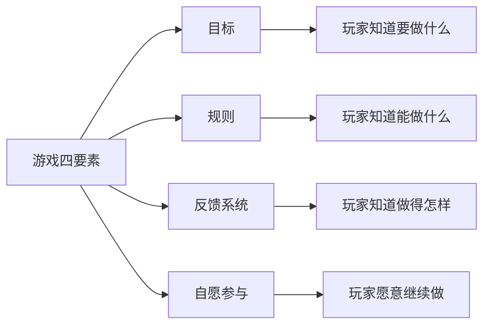
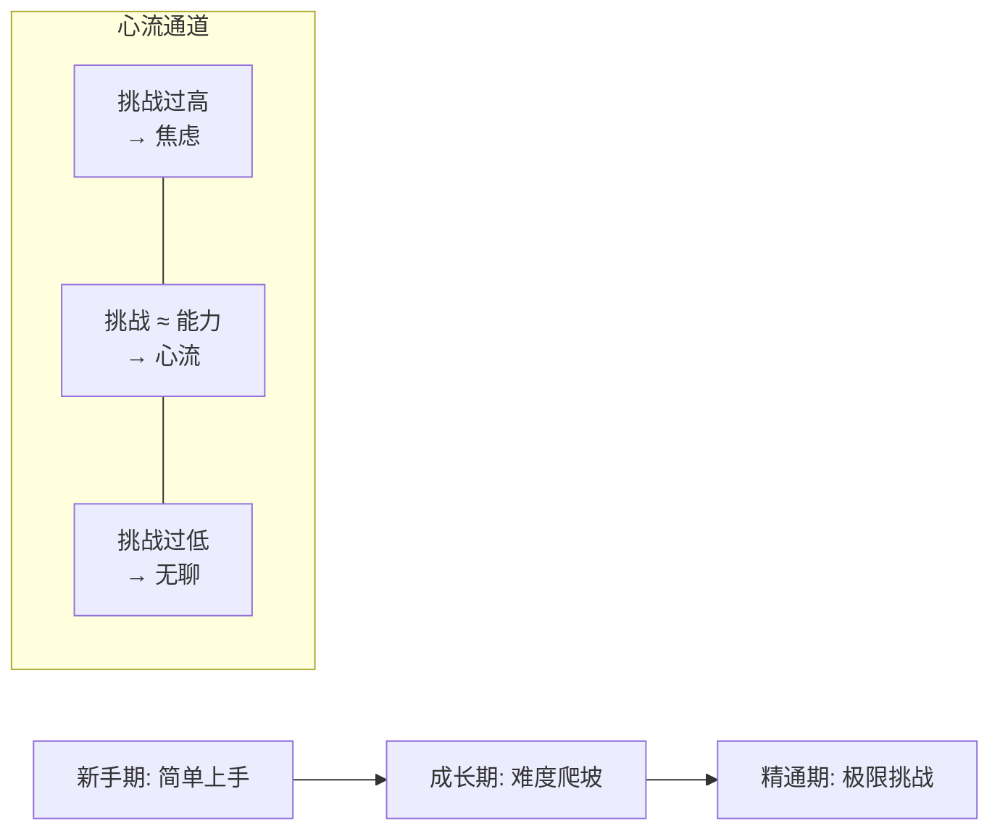
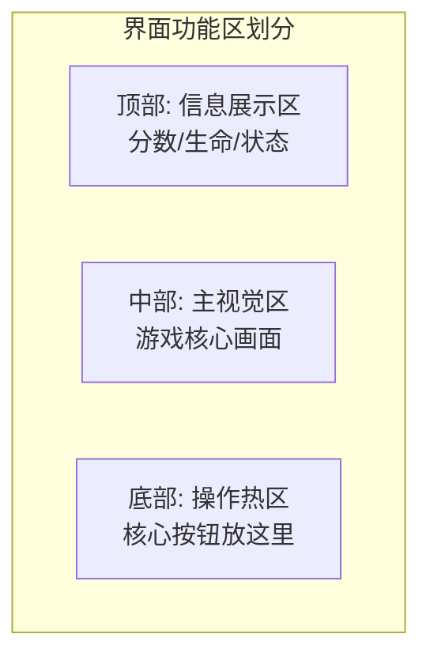
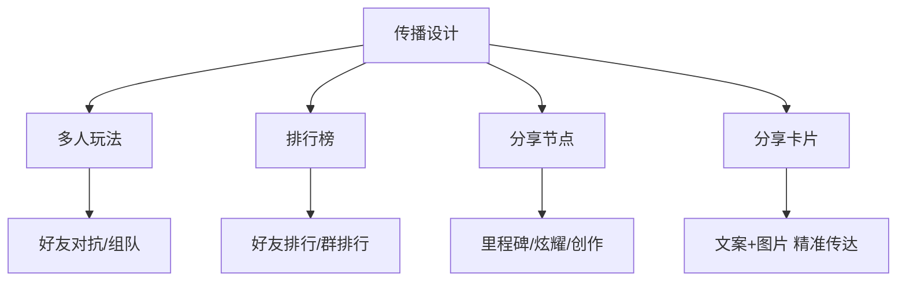
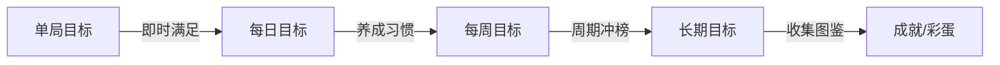
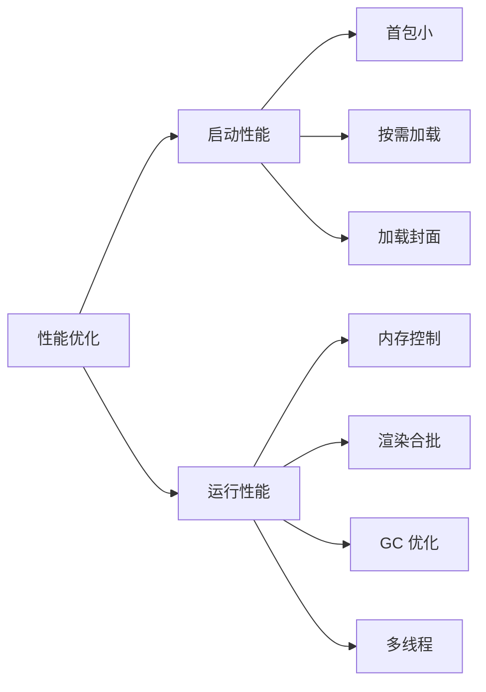

# 分类：前端

共 2 篇文章

---

# 微信登录统一接入：扫码登录 + 小程序登录的安全架构实战
Date: 2026-07-03 | Tags: 安全, 前端, 微信登录, OAuth2, Vue3, Spring Boot | URL: https://bsheepcoder.github.io/2026/07/03/frontend-wechat-unified-login/

## 一、元认知：微信登录到底在解决什么问题

> 登录的本质不是"让用户进来"，而是"确认这个人是谁"。

这句话看似废话，但它揭示了微信登录体系最令人困惑的设计：**同一个用户，在公众号、小程序、网站应用、移动应用中有四个不同的 openid**。如果你不理解为什么，后面的实现做得再好也是空中楼阁。

### 1.1 openid 的分裂：设计哲学而非技术缺陷

微信的 openid 是**应用维度**的，不是**用户维度**的。一个用户在你的小程序里是 `oxABC123`，在你的网站应用里是 `oxDEF456`，在你的公众号里是 `oxGHI789`——三个完全不同的字符串，指向同一个人。

为什么这么设计？**隔离性**。每个应用只能看到自己的 openid，无法跨应用追踪用户。这是隐私保护的第一道防线：你的小程序无法知道用户在另一个小程序里是谁。

但业务需要打通。所以微信提供了 **UnionID 机制**：只要多个应用绑定到同一个微信开放平台账号，就能获取一个全局唯一的 `unionid`，作为用户身份的统一标识。

```
用户（张三）
  ├── 小程序 openid: oxAAA    ──┐
  ├── 网站应用 openid: oxBBB  ──┼── 都绑定到同一个开放平台 → unionid: ou_唯一
  └── 公众号 openid: oxCCC    ──┘
```

> **小而美原则**：如果你只有一个应用（纯小程序或纯网站），不需要 UnionID，直接用 openid 就够了。只有当你的产品矩阵需要跨端打通时，才值得引入 UnionID。

### 1.2 三种登录方式的本质

微信提供的登录能力可以归为三类：

| 方式 | 本质 | 适用场景 | 前提条件 |
|------|------|---------|---------|
| 网页扫码登录 | OAuth2（开放平台） | PC 网站、H5（非微信内） | 开放平台注册「网站应用」 |
| 小程序登录 | 微信私有协议 | 微信小程序 | 小程序 AppID |
| 网页授权登录 | OAuth2（服务号） | 公众号 H5 页面 | 已认证服务号 |

本文聚焦前两种——它们是"小而美"产品最常见的组合：**PC 端扫码 + 小程序端一键登录**。

---

## 二、搭积木：统一认证服务架构

### 2.1 数据库设计：一张表搞定

不需要两张表、三张表。一张 `user` 表，核心字段只有三个：

| 字段 | 类型 | 说明 |
|------|------|------|
| `unionid` | VARCHAR(64) UNIQUE | 微信统一标识，可为空 |
| `web_openid` | VARCHAR(64) | 网站应用的 openid |
| `mini_openid` | VARCHAR(64) | 小程序的 openid |

**设计决策**：`unionid` 允许为空。如果用户只用过小程序登录，且小程序没有绑定开放平台，就没有 unionid。用 openid 也能正常工作，只是无法跨端打通。

其余字段按需添加：`nickname`、`avatar_url`、`phone`、`created_at`、`last_login_at`、`last_login_src`（记录最近登录来源，方便分析）。

索引策略：
- `unionid` 唯一索引（主查询路径）
- `web_openid` 普通索引（兜底查询）
- `mini_openid` 普通索引（兜底查询）

### 2.2 后端架构（Spring Boot）

```
com.example.auth
├── controller/AuthController          ← API 端点（5个接口）
├── service/WechatWebAuthService       ← 网页扫码登录核心逻辑
├── service/WechatMiniAuthService      ← 小程序登录核心逻辑
├── security/JwtTokenProvider          ← JWT 签发/验证
└── config/WechatProperties            ← 微信配置（appid/secret）
```

配置结构（`application.yml`）：

```yaml
wechat:
  web:
    app-id: ${WECHAT_WEB_APP_ID}       # 开放平台网站应用 AppID
    app-secret: ${WECHAT_WEB_APP_SECRET}
    redirect-uri: https://yourdomain.com/api/auth/wechat/web/callback
  mini:
    app-id: ${WECHAT_MINI_APP_ID}      # 小程序 AppID
    app-secret: ${WECHAT_MINI_APP_SECRET}
  jwt:
    secret: ${JWT_SECRET}               # 至少 256 bit
    access-token-expire: 7200           # 2 小时
    refresh-token-expire: 2592000       # 30 天
```

> **安全原则**：所有密钥通过环境变量注入，绝不硬编码。Spring Boot 的 `@ConfigurationProperties` 自动绑定，配合 Docker/K8s 的 secret 管理，密钥不出现在代码和配置文件中。

---

## 三、案例即原理：核心实现步骤

### 3.1 网页扫码登录：六步完成

> **端点选择**：开放平台网站应用用 `connect/qrconnect`（scope=`snsapi_login`），服务号网页授权用 `connect/oauth2/authorize`（scope=`snsapi_userinfo`）。两者都能扫码，但前者是 PC 端专用，后者仅限微信内置浏览器。本文用前者。

网页扫码有两种呈现方式，选哪种取决于你的产品需求：

| 方式 | 体验 | 适用场景 |
|------|------|---------|
| 跳转式 | 跳到微信页面扫码，再跳回来 | 简单快速，适合 MVP |
| 内嵌式 | 二维码直接嵌在你的页面里 | 体验更好，适合正式产品 |

**跳转式流程**（六步）：

```
浏览器                    你的后端                    微信服务器
  │                         │                          │
  │  1. 点击"微信登录"        │                          │
  │ ──────────────────────> │                          │
  │                         │                          │
  │  2. 302 重定向到微信授权页  │                          │
  │ <────────────────────── │                          │
  │                         │                          │
  │  3. 用户扫码确认           │                          │
  │ ─────────────────────────────────────────────────> │
  │                         │                          │
  │  4. 微信回调 redirect_uri?code=xxx&state=yyy        │
  │ <───────────────────────────────────────────────── │
  │                         │                          │
  │  5. 前端将 code 发到后端    │                          │
  │ ──────────────────────> │                          │
  │                         │  6. 用 code 换 access_token │
  │                         │ ────────────────────────> │
  │                         │ <──────────────────────── │
  │                         │                          │
  │                         │  7. 查找/创建用户，签发 JWT   │
  │  8. 返回 JWT              │                          │
  │ <────────────────────── │                          │
```

**每一步做什么**：

**第一步：前端生成 state 并跳转**

前端生成一个随机字符串作为 `state`（防 CSRF），存入 `sessionStorage`，然后将用户重定向到后端的 `/api/auth/wechat/web/login?state=xxx`。

后端收到后，将 `state` 存入 Redis（设 5 分钟过期），然后 302 重定向到微信授权页：

```
https://open.weixin.qq.com/connect/qrconnect
  ?appid=你的网站应用AppID
  &redirect_uri=你的回调地址（需 URL 编码）
  &response_type=code
  &scope=snsapi_login
  &state=刚才的随机字符串
  #wechat_redirect
```

**第二步：用户扫码授权**

用户在微信中确认授权后，微信会将浏览器重定向到你配置的 `redirect_uri`，并附带 `code` 和 `state` 参数。

**第三步：后端校验 state 并换取 token**

后端收到回调后，先检查 Redis 中是否存在这个 `state`——存在则删除（一次性使用），不存在则拒绝请求（可能是 CSRF 攻击）。

校验通过后，用 `code` 调用微信接口换取 `access_token`：

```
GET https://api.weixin.qq.com/sns/oauth2/access_token
  ?appid=你的网站应用AppID
  &secret=你的网站应用Secret
  &code=回调带回的code
  &grant_type=authorization_code
```

返回结果包含：`access_token`（用户授权凭证）、`openid`（该用户在你网站应用中的标识）、`unionid`（如果已绑定开放平台）。

**第四步：查找或创建用户**

用 `unionid`（优先）或 `web_openid` 查询数据库：
- 找到 → 更新 `last_login_at`，补充缺失的 `unionid`
- 没找到 → 插入新用户记录

**第五步：签发 JWT**

生成两个 Token：
- `access_token`：有效期 2 小时，用于接口认证
- `refresh_token`：有效期 30 天，用于刷新 access_token

**第六步：前端存储 Token**

前端收到 JWT 后存入 `localStorage`（或 HttpOnly Cookie），后续请求通过 `Authorization: Bearer <token>` 头携带。

**内嵌式方案**（推荐用于正式产品）：

跳转式的体验不好——用户被带离你的页面，扫码后又跳回来，中间有白屏闪烁。微信提供了内嵌二维码方案，用户始终留在你的页面上。

步骤很简单：
1. 在页面中引入微信提供的 JS 文件：`http://res.wx.qq.com/connect/zh_CN/htmledition/js/wxLogin.js`
2. 在登录区域创建一个容器 `<div id="login_container"></div>`
3. 实例化 `WxLogin` 对象，传入你的 appid、scope、redirect_uri 等参数

二维码会自动渲染到容器中。用户扫码授权后，微信通过 **JS 跨域回调**将 `code` 返回给当前页面（而非跳转 redirect_uri），前端直接拿到 `code` 发给后端。

> **本地开发注意**：内嵌式方案的 `redirect_uri` 必须与当前页面同域。如果你在 `localhost:5173` 开发，redirect_uri 也必须是 `localhost:5173` 下的路径。这意味着后端回调接口需要在前端同域下，或者用 Vite proxy 转发。

### 3.2 小程序登录：三步完成

小程序登录比网页扫码简单得多——用户无感知，后台静默完成。

**第一步：小程序端调用 wx.login()**

```javascript
wx.login({
  success(res) {
    // res.code 是一次性凭证，有效期 5 分钟
    // 将 code 发送到你的后端
  }
})
```

**第二步：后端用 code 换取用户标识**

调用微信接口：

```
GET https://api.weixin.qq.com/sns/jscode2session
  ?appid=你的小程序AppID
  &secret=你的小程序Secret
  &js_code=前端传来的code
  &grant_type=authorization_code
```

返回结果包含：`session_key`（会话密钥，用于解密敏感数据）、`openid`（小程序维度的用户标识）、`unionid`（如果已绑定开放平台）。

> **安全红线**：`session_key` 绝不能返回给前端。它是解密 `encryptedData` 的密钥，泄露等于用户数据裸奔。只存在后端，建议存 Redis。

**第三步：查找或创建用户 + 签发 JWT**

逻辑与网页登录完全一致：用 `unionid` 或 `mini_openid` 查找用户，签发双 Token。

### 3.3 手机号获取：新版 vs 旧版

小程序获取手机号有两种方式，2023 年后微信改了接口：

**旧版（已废弃，但存量代码仍大量存在）**：
- 前端获取 `encryptedData` + `iv`
- 后端用 `session_key` 做 AES-128-CBC 解密
- 问题：`session_key` 需要在后端存储和传输，增加了泄露风险

**新版（推荐）**：
- 前端点击 `<button open-type="getPhoneNumber">`，获取 `code`
- 后端用 `code` 直接调 `getuserphonenumber` 接口换取手机号
- 无需 `session_key` 参与，更安全

```
POST https://api.weixin.qq.com/wxa/business/getuserphonenumber
  ?access_token=小程序全局access_token
Body: { "code": "前端传来的code" }
```

> **注意**：这里的 `access_token` 是小程序全局接口调用凭据（通过 appid + secret 获取），不是用户授权的 access_token。两者完全不同，别搞混。

### 3.4 前端 Token 管理：双 Token 刷新机制

单 Token 的困境：有效期短则频繁登录，有效期长则泄露风险大。

**双 Token 方案**：

```
access_token:   有效期 2 小时，每次请求携带
refresh_token:  有效期 30 天，仅在 access_token 过期时使用
```

**刷新流程**：

1. 请求返回 401 → 前端拦截器检测到
2. 用 `refresh_token` 调 `/api/auth/refresh` 获取新的双 Token
3. 用新的 `access_token` 重试原请求
4. 如果 `refresh_token` 也过期 → 跳转登录页

**关键细节**：
- 刷新过程中如果有多个并发 401 请求，只发一次 refresh 请求，其他请求排队等待
- `refresh_token` 一次性使用——每次刷新后旧的立即失效，返回新的
- 这是微信自己的做法：refresh_token 每次使用后都会更新

### 3.5 小程序端 Token 存储

小程序没有 `localStorage`，用 `wx.setStorageSync` 存 Token。后续请求在 header 中携带：

```javascript
// 封装请求方法
function request(url, data) {
  return new Promise((resolve, reject) => {
    wx.request({
      url: API_BASE + url,
      data,
      header: {
        'Authorization': 'Bearer ' + wx.getStorageSync('accessToken')
      },
      success: (res) => {
        if (res.statusCode === 401) {
          // 尝试刷新 token
          refreshToken().then(() => request(url, data).then(resolve).catch(reject))
        } else {
          resolve(res.data)
        }
      },
      fail: reject
    })
  })
}
```

---

## 四、缺陷与安全：文档不会告诉你的事

### 4.1 state 参数：你以为的 CSRF 防护够了吗

微信 OAuth2 要求 `state` 参数必填，用于防止 CSRF 攻击。但很多开发者只是随便传个固定字符串。

**正确做法**：
1. 前端生成随机 `state`，存入 `sessionStorage`
2. 后端同时在 Redis 中存一份（设 5 分钟过期）
3. 回调时双重校验：前端校验 `sessionStorage` 中的值，后端校验 Redis 中的值
4. 校验通过后立即删除，不可重复使用

### 4.2 session_key 绝不能下发前端

这是微信安全规范中最容易踩的坑。小程序的 `session_key` 是解密 `encryptedData` 的密钥，如果泄露，攻击者可以伪造任意用户数据。

**正确做法**：`session_key` 只存在后端（推荐 Redis），通过 openid 关联，有效期 30 分钟。前端需要解密数据时，把 `encryptedData` 和 `iv` 发给后端，后端用存储的 `session_key` 解密后返回明文。

### 4.3 两种 access_token 的区别

微信体系中有两种名字相同但完全不同的 `access_token`：

| 类型 | 用途 | 获取方式 | 有效期 |
|------|------|---------|--------|
| 用户 access_token | 换取用户信息、刷新授权 | 用 code 换取 | 2 小时 |
| 小程序全局 access_token | 调用服务端 API（如获取手机号） | 用 appid + secret 获取 | 2 小时 |

**别搞混**。用户 access_token 是用户维度的，全局 access_token 是应用维度的。后者建议缓存到 Redis，定时刷新。

### 4.4 防重放攻击

微信的 `code` 参数有一个重要特性：**只能使用一次，5 分钟过期**。但如果你的后端没有做好幂等性，攻击者可以在 code 被使用前抢先把请求发到你的服务器。

**防御方案**：用 Redis 做幂等锁。收到 code 后，先 `SETNX` 一个 key（key = code，过期 5 分钟），设置成功才继续处理，设置失败说明已被使用。

### 4.5 微信"快照页模式"的影响

2022 年 7 月起，微信对不规范使用 `snsapi_userinfo` 授权的网页，会默认打开"快照页模式"——用户看到的是静态页面快照，无法完成授权。

**触发条件**：页面一打开就直接跳转授权，没有任何用户交互。

**规避方法**：扫码登录必须由用户主动点击按钮触发，不要做页面加载时自动跳转。

### 4.6 JWT 安全要点

| 风险点 | 防御措施 |
|--------|---------|
| JWT 被盗 | 存 HttpOnly Cookie（防 XSS 读取），或短期有效 + refresh 机制 |
| JWT 泄露后无法撤销 | 维护一个 Redis 黑名单，logout 时将 token 加入 |
| secret 被破解 | 至少 256 bit，通过环境变量注入，定期轮换 |
| 并发刷新互踢 | refresh 请求加锁（Redis 分布式锁），只允许一个请求执行刷新 |

### 4.7 接口限流

登录接口是攻击者的重点目标。建议：
- 同一 IP 每分钟最多 10 次登录请求
- 同一 openid 每小时最多 20 次
- 触发限流后返回 429，前端提示"操作过于频繁"

---

## 五、总结：小而美的登录系统应该具备什么

### 最小可用功能清单

| 功能 | 必要性 | 说明 |
|------|--------|------|
| 网页扫码登录 | 必须 | PC 端主入口 |
| 小程序一键登录 | 必须 | 小程序端主入口 |
| JWT 双 Token | 必须 | 安全 + 体验的平衡 |
| UnionID 打通 | 推荐 | 跨端用户统一 |
| 手机号绑定 | 推荐 | 兜底登录方式 |
| Token 自动刷新 | 必须 | 前端无感续期 |
| 接口限流 | 必须 | 防暴力破解 |

### 扩展路径

```
v1: 小程序登录 + JWT
  ↓
v2: 加网页扫码登录 + UnionID 打通
  ↓
v3: 加手机号验证码登录（兜底）
  ↓
v4: 加 Apple 登录（iOS 必备）
  ↓
v5: 加多设备管理 + 踢人下线
```

### 本地开发：完整端到端流程

网页扫码登录的核心难题：微信回调需要一个**公网可访问的域名**，但你的后端跑在 `localhost:8080`。解决方案是**内网穿透**——把本地端口映射到公网域名。

**工具选择**：

| 工具 | 免费版 | 固定域名 | 速度 | 推荐场景 |
|------|--------|---------|------|---------|
| ngrok | 有 | 付费版才有（$8/月） | 快 | 海外项目、临时测试 |
| cpolar | 有 | 免费版支持 | 中等 | 国内项目首选 |
| frp | 开源 | 自建服务器 | 最快 | 有公网服务器时最自由 |

**完整步骤**（以 cpolar 为例）：

```
步骤 1: 启动后端
  Spring Boot → localhost:8080

步骤 2: 启动内网穿透
  cpolar http 8080
  → 获得公网地址，如 https://xxxx.cpolar.top

步骤 3: 配置微信开放平台
  登录 open.weixin.qq.com
  → 网站应用 → 授权回调域 → 填 xxxx.cpolar.top

步骤 4: 启动前端
  Vite dev server → localhost:5173
  vite.config.ts 中配置 proxy：
    /api → http://localhost:8080

步骤 5: 测试扫码登录
  浏览器打开 localhost:5173
  → 点击"微信登录"按钮
  → 跳转到微信扫码页（或内嵌二维码）
  → 手机扫码确认
  → 微信回调到 xxxx.cpolar.top/api/auth/wechat/web/callback
  → cpolar 转发到 localhost:8080
  → 后端处理，返回 JWT
  → 前端登录成功
```

**常见坑**：

| 问题 | 原因 | 解决 |
|------|------|------|
| "该链接无法访问" | redirect_uri 域名与开放平台配置不一致 | 确保回调域名完全匹配（不含 http:// 和路径） |
| 回调后页面白屏 | 前端没有处理回调路由 | 在 Vue Router 中添加 `/callback` 路由 |
| 内网穿透重启后失效 | 免费版域名变了 | 更新开放平台配置，或升级付费版固定域名 |
| 扫码后无反应 | state 校验失败 | 检查 sessionStorage 和 Redis 中的 state 是否一致 |

**小程序本地开发**：

小程序登录没有域名限制——微信开发者工具运行在本地，可以直接调用你的 `localhost:8080` 后端。只需在开发者工具中勾选「不校验合法域名」即可。

### 安全检查清单

上线前逐项确认：

- [ ] `state` 参数随机生成 + 一次性校验（Redis）
- [ ] `session_key` 只存后端，不下发前端
- [ ] JWT secret 至少 256 bit，通过环境变量注入
- [ ] `refresh_token` 一次性使用（刷新后旧的失效）
- [ ] `code` 做幂等锁，防重放
- [ ] 登录接口限流（10次/分钟/IP）
- [ ] 日志记录所有登录事件（不记录 token 本身）
- [ ] 敏感操作二次验证（如解绑手机号）
- [ ] 定期轮换 JWT secret（需考虑存量 token 兼容）


---

# 小游戏设计之道：从零理解游戏设计的灵魂
Date: 2026-06-23 | Tags: 前端, 小游戏, 游戏设计, 微信小游戏 | URL: https://bsheepcoder.github.io/2026/06/23/frontend-minigame-design/

## 为什么开发者应该懂游戏设计

很多开发者有个误区：游戏设计是策划的事，我只要把功能实现出来就行。但小游戏领域恰恰相反——这是一个**一个人就能独立完成产品**的赛道，没有专职策划替你思考"好不好玩"。你不理解设计，做出来的就只是"能跑的代码"，而不是"能留住人的游戏"。

微信小游戏自 2017 年《跳一跳》上线至今，用户规模已达 10 亿，平台累计服务超过 40 万开发者。它无需下载安装、即点即玩，且天然绑定微信关系链。这个生态最迷人的地方在于：**一款好小游戏，可以由一个小团队甚至个人做出爆款**。

但前提是——你得懂设计。本文结合微信官方小游戏设计指南、法国超休闲游戏之王 Voodoo 的设计理念，以及 Cocos 引擎社区的开发实践，从"设计灵魂"出发，带你建立完整的游戏设计思维。

## 一、游戏设计的灵魂：四要素

先回答最根本的问题：**什么才叫一个游戏？**

微信官方设计指南引用了游戏设计师 Jane McGonigal 的理论——构成一个游戏，需要四个基本要素：



这四点就是游戏设计的灵魂，缺一不可：

- **目标**——给玩家明确的获胜条件。没有目标，玩家不知道自己在干什么。《跳一跳》的目标是"跳得更远得更高分"，简单到一句话能说清。很多新手做游戏失败，第一个原因就是目标模糊，玩家玩了两分钟还不知道"我到底要干嘛"。
- **规则**——制定清晰的游戏规则，定义玩家"能做什么"和"不能做什么"。规则是创造挑战的来源，也是乐趣的边界。规则越简单清晰，门槛越低；但规则组合的深度，决定了游戏的上限。
- **反馈系统**——对玩家的每一次操作及时响应，给予激励反馈。你点了一下屏幕，角色跳了、分数涨了、音效响了、粒子飞了——这就是反馈。**反馈越及时、越丰富，玩家越沉浸。** 这是制造"爽快感"的核心机制。
- **自愿参与**——当玩家清楚了前三点后，能够自发地继续玩下去。好的游戏不是靠强迫留人，而是让玩家"自己想再来一局"。

> **设计检查清单**：做任何游戏前，先用一句话回答这四个问题——玩家要完成什么目标？遵循什么规则？操作后能得到什么反馈？为什么会想继续玩？如果答不清楚，说明设计还没想透。

这四要素不是理论口号，而是检验设计的**第一性原理**。后面所有的设计维度——体验、传播、留存、创收——都是在这四点基础上的展开和细化。

## 二、体验设计：让玩家"爽"的四个维度

四要素是骨架，体验设计是血肉。微信官方把游戏体验的创新拆成四个维度：玩法、剧情、美术、音乐。

### 2.1 玩法创新——游戏的引擎

玩法是游戏的核心驱动力。创新可以是全新品类，比如《跳舞的线》开创的音乐节奏玩法；也可以是**经典玩法 + 改造**，比如《五子棋大作战》在传统五子棋上叠加新规则。

对个人开发者和小团队来说，**从零创造全新玩法难度极高、风险极大**，更务实的路径是"微创新"：在已被验证的经典玩法（消除、跑酷、放置、塔防）上，叠加一个独特的变化点。

玩法设计的核心是打磨**心流体验**——让难度曲线与玩家能力同步增长：



难度太高玩家焦虑流失，太低玩家无聊流失，只有在"挑战约等于能力"的通道里，玩家才会进入忘我的心流状态。这就是为什么很多游戏要做"动态难度"——根据玩家表现实时调节。

### 2.2 剧情创新——沉浸的钩子

不是所有小游戏都需要剧情，但有剧情的游戏能让玩家更有代入感。设计剧情围绕四个要素展开：

| 要素 | 作用 | 示例 |
|------|------|------|
| 背景设定 | 创造独特世界观，让游戏"有故事" | 末日废土、奇幻王国 |
| 角色带入 | 刻画角色个性，给玩家代入感 | 主角有性格、有目标 |
| 剧情递进 | 丰富情节与反转，激发探索欲 | 支线任务、隐藏结局 |
| 情节发散 | 留白让玩家自行想象和发挥 | 多结局、开放叙事 |

例如《甜蜜糖果屋》将插画与真人剧情结合，带给玩家独特的沉浸感，成功吸引了女性玩家群体。

### 2.3 美术创新——第一眼的吸引力

美术是玩家接触游戏的第一印象，突破固有风格的美术能瞬间抓住眼球。创新范围包括 UI 界面、色彩、原画、风格、氛围和动效。

经典案例是《蛇它虫》——它本质是个推箱子游戏，但采用"皮影戏 + 剪纸"的传统艺术风格，浓浓的中国风让一个老玩法焕发新生。

**对小团队的关键启示**：美术资源有限时，不要追求"大而全的写实"，而要追求"一个强烈的风格标签"。一个鲜明的风格比平庸的高精度更有记忆点。

### 2.4 音乐创新——看不见的氛围营造

音乐和音效是常被新手忽略的维度，但它们对沉浸感的影响巨大。切合内容的背景音乐能定义游戏情绪——

《木水火土》的背景音乐用空山鸟鸣，操作音效用悦耳的木鱼声，营造了禅意氛围，让玩家更专注。这说明音效不需要"好听"，而需要"贴题"。有时候一个简单的木鱼声，比一段交响乐更能定义游戏气质。

> **体验设计总结**：四个维度不必面面俱到，但至少有一个维度做到"有记忆点"。玩法是地基，美术是门面，剧情是钩子，音乐是氛围。一个有灵魂的游戏，往往是某一个维度做到了极致。

## 三、新手引导与界面布局：降低流失的第一道关

### 3.1 新手引导的四条原则

玩家打开你的游戏后，前 30 秒决定去留。新手引导的好坏直接影响次留。微信官方给出四条原则：

**① 渐进式引导，不要一次性灌入**
玩法复杂时分步骤教学，让玩家一步步上手，而不是一上来甩出满屏文字说明。

**② 边玩边学，不要用文本描述规则**
最好的引导是让玩家在做中学会。用高亮、箭头、手势提示引导操作，而不是弹出一个对话框写"请点击右下角的按钮进行攻击"。

**③ 教程要有明确的入口**
玩家如果忘了规则，应该能随时找到重新学习的路径。很多游戏把"帮助"藏在三层菜单里，这是设计缺陷。

**④ 只教必要规则，保留探索空间**
不要把所有技巧都罗列出来。告知基本规则，剩下的让玩家自己发现——探索本身是乐趣的一部分。

### 4.2 界面布局：拇指热区与设计基准

界面布局直接影响操作体验。微信基于用户数据分析给出建议：

- **设计稿基准**：4.7 寸屏幕的 750 × 1334（多数用户屏幕比例 9:16），以此为基准等比缩放兼容其他设备，刘海屏等特殊机型单独适配。
- **拇指热区**：单手握持手机时，拇指自然触达区域有限。核心操作按钮应放在拇指易触达区域，次要功能放在边缘。



> **布局原则**：主视觉区域始终为游戏内容本身，功能按钮不喧宾夺主，互推跳转等推广元素更不能遮挡游戏画面。

## 四、超休闲游戏设计哲学：Voodoo 的"简单即真理"

法国超休闲游戏之王 Voodoo（《黑洞大作战》《Stack》等爆款的缔造者）的发行经理分享了一个核心设计理念：**简单就是最好的**。

### "地铁上的人群"思维

Voodoo 的目标玩家定义极其朴素——**所有人**。从 7 岁小孩到 77 岁老奶奶，本质就是"使用智能手机的人"。他们的设计场景假设是：

> 想象一个在地铁上单手拿手机的年轻人，他每段乘车时间可能只有几分钟。

这个场景假设直接推导出了超休闲游戏的硬约束：
- **必须单手操作**——不能要求双手摇杆射击
- **单局时间短**——地铁几站路就要能玩完一局
- **几秒内理解机制**——没有时间看长篇教程

### Voodoo 超休闲游戏五大原则

| 原则 | 含义 | 设计启示 |
|------|------|----------|
| 快餐化 | 单局时间短，奖励丰厚 | 90秒一局，每局都有获得感 |
| 易上手 | 几秒内理解机制 | 一句话能说清玩法 |
| 动画有趣 | 操作反馈花哨丰富 | 反馈系统要做得"爽" |
| 对玩家友好 | 允许失误，惩罚不重 | 失败不挫败，鼓励重试 |
| 玩法优先 | 先好玩再好看 | 核心循环比画面重要 |

### 雷区：不要涉足的区域

Voodoo 特别强调了"反例"：有些游戏开局简单、节奏好，但加入了"碰到火焰/流沙就死"的元素，让整体氛围变得压抑。超休闲游戏要给玩家带来轻松，**凡是让玩家"百分百集中精力才能活"的设计，都不适合这个品类**。

> **灵魂拷问**：你的游戏能在摇晃的地铁里单手玩吗？如果答案是"勉强"或"不行"，对超休闲品类来说就需要做减法。

这五大原则和"地铁思维"看似简单，但它回答了超休闲游戏最根本的问题：**在什么场景下，给什么样的人，提供什么样的体验。** 这就是设计的灵魂——永远从用户场景出发倒推设计，而不是从技术能力出发堆砌功能。

## 五、传播设计：社交裂变的引擎

微信小游戏平台没有中心化的流量入口——这意味着你不能指望"上架就有量"。小游戏的分发靠的是**玩法驱动用户自发社交传播**。这是微信生态最大的红利，也是设计的硬要求。

### 5.1 传播的四大武器



### 5.2 排行榜：激发胜负欲

排行榜是小游戏的标配。朋友间的对比能有效激发游戏动力和传播动力：

- **好友排行榜 + 世界排行榜**：在用户排名变化时主动告知，超越好友时标识出来，形成个性化里程碑记忆
- **群排行榜**：微信群内成员排行，能直接调动游戏话题，增加传播度。群关系比好友关系更能激发"我也来试试"的冲动
- **周期性冲榜**：设置排行榜清除周期（每日/每周），制造周期性的冲榜目标，每次超越/登顶都重新引发讨论

### 5.3 分享节点：少而精

分享设计的核心原则——**分享应是用户的真实意愿表达，不能利诱或强制**。

分享点数量要"宜少宜精不宜多"，**每次游戏过程不宜超过 1 个分享点**。过多的分享点反而会降低分享欲望（选择的悖论）。用户更愿意分享以下内容：

| 分享动机 | 说明 | 示例 |
|----------|------|------|
| 知识分享 | 学到东西有通用性 | 测出你的性格类型 |
| 炫耀性分享 | 创造里程碑节点 | 创造新纪录、超越好友 |
| 个人创作 | 含个人创作性信息 | 自定义角色/关卡 |
| 创造反差 | 与普世认知有反差 | "我竟然是XX型人格" |
| 物品收集 | 收集进度展示 | 图鉴完成度 |

关键红线：**不要设置强迫分享的节点，分享奖励不应损害游戏平衡性**，否则只会加速玩家流失。

### 5.4 分享卡片：聊天里的第一印象

分享卡片是用户在微信聊天里看到的第一眼，它由"分享文案 + 分享图"组成：

- 为不同场景设计不同卡片（邀请 vs 互动）
- 文案口语化、情感化，体现用户情绪
- 图片融入用户个性化内容，增强代入感
- **点击进入后的体验要与卡片内容呼应**，前后不一致会导致秒退

> **传播设计的灵魂**：不是"怎么让玩家分享"，而是"设计什么内容让玩家自己想分享"。前者是套路，后者才是设计。

## 六、留存设计：让玩家回不来

拉新难，留存更难。玩家第一天来了，第二天为什么还要回来？微信官方给出了目标体系设计思路。

### 6.1 多周期目标体系

为游戏设置不同周期的目标，让玩家始终有"要做的事"：



- **单局目标**：每局都有明确的小目标，即时反馈即时满足
- **每日目标**：每日任务、签到奖励，培养每日打开习惯
- **每周目标**：周排行榜重置、周期性活动，制造"这周要冲一波"的动力
- **长期目标**：收集图鉴、解锁角色，在主界面体现进度，给玩家长期追求

### 6.2 收集与成就：长期粘性

**收集图鉴**是最有效的长期留存手段之一。在游戏过程中收集元素，图鉴同时在主界面展示，让玩家随时看到"我集齐了多少"。这种可见的进度感能持续驱动玩家回归。

**成就系统和特殊目标**则提供主线之外的趣味挑战——完成特殊操作、发现彩蛋、达成极限条件，给予额外奖励，给硬核玩家深度内容。

### 6.3 维护用户关系

通过游戏圈、客服等沟通渠道收集反馈、与用户互动。根据玩家反馈调整设计，能提升满意度，让玩家感到"被重视"，更愿意持续投入。

> **留存设计的灵魂**：核心不是"奖励让玩家回来"，而是"目标让玩家有期待"。奖励是手段，目标感才是粘性。玩家留下的原因永远是"还有想完成的事"。

## 七、创收设计：商业化的艺术

小游戏要活下去，就必须考虑变现。微信平台提供两条创收路径：虚拟支付和广告。

### 7.1 虚拟支付（内购）

需先开通虚拟支付能力。常见的商业系统设计：

| 模式 | 说明 | 适用 |
|------|------|------|
| 英雄/皮肤解锁 | 外观个性化，满足炫耀需求 | 有角色系统 |
| 游戏币 | 通用货币，灵活消费 | 经济系统复杂 |
| 功能道具 | 一次性功能增强（复活/提示） | 闯关型 |
| 周期性增值服务 | 月卡/通行证，持续付费 | 长线运营 |
| 抽卡 | 随机获取，刺激付费 | 收集向 |

### 7.2 广告变现

对不想/不能做内购的玩家，广告是替代方案。微信提供 Banner 广告和激励视频广告。

**激励视频广告是最推荐的广告形式**——它是"用户主动选择观看"的广告，体验破坏最小，完播率和转化率最高。关键是把广告嵌入"玩家本就想要的奖励"节点：

| 激励视频场景 | 价值交换 |
|--------------|----------|
| 提高过关奖励 | 看广告 → 奖励翻倍 |
| 再获一次机会 | 看广告 → 续命重来 |
| 获得游戏提示 | 看广告 → 通关帮助 |
| 替代货币消费 | 看广告 → 获得虚拟币 |

> **创收设计的灵魂**：好的商业化不是"从玩家口袋里掏钱"，而是"设计玩家愿意付费的价值交换"。激励视频之所以有效，是因为它让玩家用"注意力"换"游戏收益"——双方都觉得自己赚了。损害体验的强制广告和破坏平衡的付费设计，短期赚钱，长期杀鸡取卵。

## 八、开发者的技术视角：把设计变成现实

理解了设计灵魂，还要能落地。从开发角度看，有几件事必须想清楚。

### 8.1 引擎选择

小游戏开发主流引擎：

| 引擎 | 特点 | 适合 |
|------|------|------|
| Cocos Creator | 国产主流，社区活跃，原生小游戏导出 | 大多数 2D/3D 小游戏首选 |
| Laya | 性能导向，2D 表现好 | 性能敏感的 2D 游戏 |
| Unity WebGL 转化 | 团结引擎适配微信 | 已有 Unity 项目迁移 |
| 原生 Canvas/WebGL | 零依赖，体积最小 | 超轻量小游戏/试玩广告 |

Cocos Creator 是微信小游戏生态里最主流的选择，社区（forum.cocos.org）活跃，资源加载、分包、性能优化都有成熟方案。从社区讨论看，开发者最常遇到的问题集中在：资源首包加载优化、ASTC 纹理压缩、跨平台适配（鸿蒙/PC）、骨骼动画内存等——这些都是上线前必须攻克的工程课题。

### 8.2 微信小游戏运行环境

理解运行环境是做好小游戏的技术前提：

- **即点即玩**：无需下载安装，但意味着首包要小、加载要快
- **关系链能力**：好友列表、排行榜、开放数据域是微信独有红利
- **分包加载**：主包 + 分包，按需下载，控制首包体积
- **云开发/云托管**：免服务器后端，降低个人开发者的运维门槛

### 8.3 性能优化：体验的隐形保障

性能不是"锦上添花"，而是"留存生死线"。卡顿 1 秒可能就流失一批玩家。微信官方把性能分为两块：

**启动性能**——玩家从点击到可玩的时间：
- 控制首包体积，资源按需加载（AssetBundle/Addressable）
- 定制启动封面/启动剧情，掩盖加载等待
- 首场景最小化，只加载必需资源

**运行性能**——游戏过程中的流畅度：
- 内存管理：及时释放、控制峰值、注意 GC 抖动
- 纹理压缩：ASTC 等格式减小内存占用
- 渲染优化：合批、减少 DrawCall
- Worker 多线程：把重计算移出主线程



### 8.4 开放能力地图

微信小游戏提供丰富的开放能力，设计时应提前规划如何利用：

- **社交**：转发分享、关系链数据、排行榜、擂台赛组件
- **留存**：订阅消息、游戏圈、流失用户召回
- **商业化**：虚拟支付、广告组件、CPS 推荐
- **安全**：代码加固、内容安全、反外挂
- **数据**：数据助手、性能监控、异常告警

> **技术视角的灵魂**：技术是设计的脚手架，不是设计本身。先想清楚"做什么游戏、给谁玩、怎么传播怎么留存"，再选引擎、做性能、接能力。本末倒置地先堆技术，往往会做出"技术上很酷但没人想玩"的产品。

## 九、设计灵魂清单：从小白到懂设计

最后，把全文浓缩成一份可执行的设计自检清单。做任何小游戏前，逐条对照：

### 核心设计（灵魂）

- [ ] 能用一句话说清玩家要完成的**目标**吗？
- [ ] **规则**是否清晰，玩家几秒内能理解？
- [ ] 每次操作的**反馈**是否及时、丰富、有满足感？
- [ ] 玩家凭什么**自愿**继续玩下去？

### 体验设计

- [ ] 玩法/剧情/美术/音乐中，至少有一个"有记忆点"的维度？
- [ ] 难度曲线是否匹配玩家成长（心流通道）？
- [ ] 新手引导是否"边玩边学"，而非文字堆砌？
- [ ] 界面布局是否符合拇指热区，主视觉不被遮挡？

### 场景适配

- [ ] 目标用户是谁？在什么场景下玩？
- [ ] 能在地铁里单手玩几分钟一局吗？
- [ ] 失败惩罚是否友好，鼓励重试而非挫败？

### 传播设计

- [ ] 是否有社交传播的设计元素（排行榜/多人/分享）？
- [ ] 分享点是玩家"想分享"还是"被逼分享"？
- [ ] 分享卡片内容与进入后体验是否一致？

### 留存设计

- [ ] 是否有单局/每日/每周/长期的目标层次？
- [ ] 是否有收集图鉴或成就系统提供长期追求？
- [ ] 玩家明天回来，有什么"想完成的事"？

### 商业化

- [ ] 变现方式是否与游戏类型匹配？
- [ ] 激励视频是否嵌入"玩家本就想要的奖励"节点？
- [ ] 付费/广告是否损害了游戏平衡和体验？

### 技术落地

- [ ] 引擎选择是否匹配游戏类型和团队情况？
- [ ] 首包体积是否可控，启动是否够快？
- [ ] 运行性能是否流畅，内存是否达标？
- [ ] 是否规划了开放能力的接入（社交/数据/安全）？

---

## 写在最后

游戏设计的灵魂，归根到底是三个字：**懂玩家**。

Voodoo 想到的是地铁上单手刷手机的人群；微信想到的是用关系链让朋友一起玩的乐趣；《跳一跳》想到的是一个人等电梯时打发时间的 30 秒。**每一个成功的小游戏，都始于对一个具体场景、一类具体人群的深刻理解。**

技术能帮你把游戏做出来，但只有理解了"目标、规则、反馈、自愿"这四要素，理解了体验、传播、留存、创收这四大设计维度，理解了"从用户场景出发倒推设计"这个根本思维——你才能做出**不只是能跑，而是能打动人**的游戏。

从今天起，玩任何小游戏时，试着用这套框架拆解它：它的目标是什么？规则怎么定？反馈做得爽不爽？靠什么传播？靠什么留人？这样拆过十款游戏，你就已经不是一个只懂写代码的开发，而是一个**懂设计灵魂的开发者**了。

> 本文设计原则综合整理自：微信小游戏官方设计指南、微信小游戏开发指南、Voodoo 超休闲游戏设计理念分享、Cocos 中文社区开发实践。


