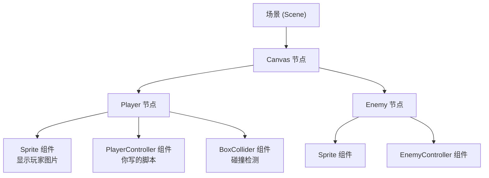
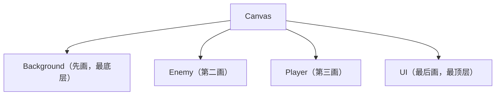
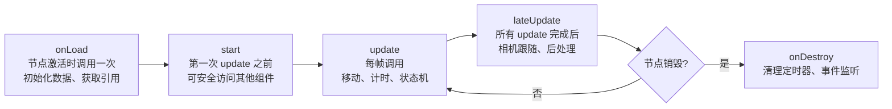
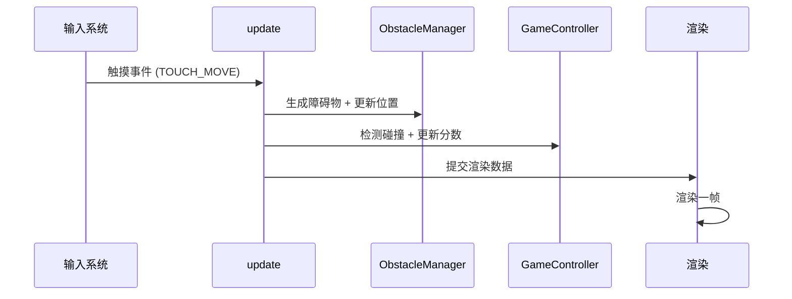

# 分类：游戏开发

共 1 篇文章

---

# Cocos Creator 小游戏开发入门：从节点组件到微信发布
Date: 2026-06-24 | Tags: 小游戏, 微信小游戏, 游戏开发, Cocos Creator | URL: https://bsheepcoder.github.io/2026/06/24/game-dev-cocos-creator-guide/

## 为什么小游戏开发选择 Cocos Creator

小游戏赛道（微信、抖音、支付宝）有一个尴尬的现实：原生 Canvas 太底层， Phaser 缺乏编辑器， Unity 包体过大且 WebGL 兼容性差， Laya 引擎社区萎缩。 Cocos Creator 是目前唯一一个**原生支持小游戏发布、有完整可视化编辑器、社区活跃、且背靠 Cocos 引擎多年沉淀**的方案。

3.8 是当前 LTS（长期支持）版本，意味着 API 稳定、bug 修复有保障、教程资源最多。如果你要开始一个小游戏项目，没有理由选其他版本。

| 引擎 | 编辑器 | 小游戏支持 | 包体大小 | TypeScript | 适用场景 |
|------|--------|-----------|---------|-----------|---------|
| Cocos Creator 3.8 | 完整可视化 | 原生一键发布 | ~1.5MB（引擎插件后） | 一等公民 | 小游戏首选 |
| Unity | 完整 | 需 WebGL 转换 | 10MB+ | 支持 | 3D 重度游戏 |
| Phaser | 无 | 需手动适配 | ~1MB | 支持 | 纯代码 2D |
| Laya | 有 | 支持 | ~2MB | 支持 | 社区萎缩 |

> **选型决策**：如果你的目标是微信/抖音小游戏， Cocos Creator 不是"之一"而是"唯一"的合理选择。下文所有内容基于 3.8 LTS。

## 核心架构：节点 + 组件

理解 Cocos Creator 的关键是理解**节点（Node）+ 组件（Component）**模式。这不是 Cocos 发明的—— Unity 用了十几年，但 Cocos Creator 3.x 把它做得比 Unity 更纯粹。

**Node 是容器**，只负责"存在性"：位置、旋转、缩放、层级关系。 Node 本身不渲染任何东西。

**Component 是功能**，挂在 Node 上赋予它能力： `Sprite` 让它显示图片， `Label` 让它显示文字， `Script`（你写的 TypeScript 组件）让它有逻辑。

一个 Node 可以挂多个 Component，就像一个人可以同时是"程序员""父亲""篮球爱好者"。组件之间通过 `node` 属性共享同一个宿主。



### 坐标系：与 Web 的关键差异

如果你从 Web 前端转来，这里有一个必须记住的差异：

| | Web DOM / Canvas | Cocos Creator |
|---|---|---|
| 原点 | 左上角 | **左下角** |
| Y 轴方向 | 向下为正 | **向上为正** |
| 单位 | px | **px（设计分辨率）** |

这意味着 `y = 100` 在 Cocos 里是"距底部 100px"，在 Web 里是"距顶部 100px"。新手常在这里栽跟头。

### 渲染顺序：节点树决定绘制顺序

Cocos Creator 的渲染顺序遵循**节点树先序遍历**：父节点先画，子节点后画；同一层按从上到下顺序。后画的覆盖先画的——和 CSS `z-index` 完全不同的心智模型。



调整渲染顺序 = 在层级管理器里拖动节点位置。不需要碰任何 `z-index`。

> **架构心智模型**：Node 是"在哪"， Component 是"是什么"，节点树顺序是"谁先画"。把这三句话刻在脑子里。

## 脚本系统：TypeScript + 装饰器

Cocos Creator 3.x 全面拥抱 TypeScript。你写的每个脚本都是一个 Component 类，继承自 `cc.Component`。

### 装饰器：连接代码与编辑器

装饰器是 Cocos Creator 的核心机制，它让代码与编辑器面板无缝衔接：

```typescript
import { _decorator, Component, Sprite, Node, SpriteFrame } from 'cc'
const { ccclass, property } = _decorator

@ccclass('PlayerController')
export class PlayerController extends Component {
    // @property 让这个字段出现在编辑器属性面板，可直接拖拽赋值
    @property({ type: Sprite })
    sprite: Sprite = null!

    @property({ type: Node })
    enemy: Node = null!

    @property
    speed: number = 200

    // 节点引用的两种方式：拖拽（推荐）vs 查找（避免）
    @property({ type: Node, tooltip: '障碍物父节点' })
    obstacleParent: Node = null!
}
```

`@property` 暴露的字段可以直接在编辑器里拖拽赋值。这是 Cocos Creator 的核心工作流：**声明依赖 → 编辑器拖拽 → 运行时自动注入**。

### 生命周期回调：从创建到销毁

组件有严格的生命周期时序，理解它才能把逻辑放对位置：



| 回调 | 调用时机 | 典型用途 | 注意事项 |
|------|---------|---------|---------|
| `onLoad` | 节点激活时，仅一次 | 初始化变量、获取组件引用 | 此时其他组件可能未 `start` |
| `start` | 第一次 `update` 前 | 跨组件初始化、延迟逻辑 | 可安全访问其他组件状态 |
| `update(dt)` | 每帧，参数为 deltaTime | 移动、计时、输入处理 | `dt` 单位秒，用它做帧率无关动画 |
| `lateUpdate(dt)` | 所有 `update` 后 | 相机跟随、依赖其他组件的逻辑 | 避免在 `update` 里改相机位置 |
| `onEnable/onDisable` | 节点激活/取消激活 | 订阅/取消订阅事件 | 配对使用，防止内存泄漏 |
| `onDestroy` | 节点销毁时 | 清理定时器、移除事件监听 | **必须手动清理**，引擎不会自动做 |

### 组件间通信：拖拽引用 vs 查找

获取其他组件引用有两种方式，优先级天差地别：

```typescript
// 差：运行时查找，性能差、耦合强、容易因重命名失效
const player = this.node.parent!.getChildByName('Player')!
    .getComponent(PlayerController)!

// 好：编辑器拖拽注入，类型安全、零运行时开销
@property({ type: PlayerController })
playerCtrl: PlayerController = null!
```

`@property` 拖拽是 Cocos Creator 的灵魂工作流。它把"依赖查找"从运行时移到了编辑时，既安全又高效。唯一例外是**动态生成的节点**（如实例化的预制体），这时才需要 `getComponent` 或 `find`。

> **脚本系统心法**：能用 `@property` 拖拽的，绝不运行时 `find`。能用 `getComponent` 的，绝不字符串 `getChildByName`。

## 资源系统：预制体、图集与动态加载

### 预制体（Prefab）：模板化复用

预制体是把一个节点（连同其所有子节点和组件）保存为 `.prefab` 文件，可以反复实例化。小游戏里敌人、子弹、道具等重复对象都应该是预制体。

```typescript
import { Prefab, instantiate } from 'cc'

@property({ type: Prefab })
enemyPrefab: Prefab = null!

spawnEnemy() {
    // instantiate 克隆预制体，返回一个新的 Node
    const enemy = instantiate(this.enemyPrefab)
    enemy.setPosition(Math.random() * 400, 300)
    this.node.addChild(enemy)
}
```

### 图集（Auto Atlas）：合批的关键

小游戏的性能瓶颈几乎总是 Draw Call。每次渲染切换纹理都会产生一次 Draw Call，而图集把多张小图合并为一张大纹理，让引擎可以批量提交渲染。

Cocos Creator 的 Auto Atlas 会自动把 `assets` 文件夹下的散图打包成图集，无需手动操作。但你需要确保：

- 同一时刻渲染的精灵来自**同一图集**
- 使用相同的**材质**（Material）
- 不被 **Mask** 组件裁剪（Mask 会打断合批）

### 动态加载：resources.load

静态资源（拖拽到 `@property`）会随场景加载，简单但缺乏灵活性。动态加载用 `resources` 目录：

```typescript
import { resources, Prefab } from 'cc'

// 动态加载预制体
resources.load('prefabs/Boss', Prefab, (err, prefab) => {
    if (err) { console.error(err); return }
    const boss = instantiate(prefab)
    this.node.addChild(boss)
})

// 加载图集中的 SpriteFrame
resources.load('textures/items/spriteFrame', SpriteFrame, (err, frame) => {
    if (err) return
    this.sprite.spriteFrame = frame
})
```

`resources` 目录下的文件会被打包进游戏，可通过路径动态加载。但要注意：**`resources` 目录越大，首包越大**。小游戏有 4MB 首包限制，大型资源应放远程 CDN 用 `assetManager.loadRemote` 拉取。

> **资源管理经验**：静态引用优先（简单、类型安全）；动态加载用于按需加载的资源和远程资源；`resources` 目录要克制，能用分包就不用 `resources`。

## UI 系统：多分辨率适配

小游戏运行在从 iPhone SE 到 iPad Pro 的各种屏幕上。适配的核心是**设计分辨率 + 适配策略**。

### Canvas + 设计分辨率

Canvas 组件是 UI 的根节点。你设定一个设计分辨率（如 720×1280），引擎根据屏幕尺寸自动缩放。

| 适配策略 | 效果 | 适用场景 |
|---------|------|---------|
| `fitWidth` | 宽度铺满，高度可能留黑边 | 竖屏游戏，宽屏设备 |
| `fitHeight` | 高度铺满，宽度可能留黑边 | 横屏游戏，高屏设备 |
| `fitWidth + fitHeight` | 完全铺满，可能裁切边缘 | 内容居中、边缘可裁的场景 |
| 都不选 | 保持设计分辨率比例，黑边最多 | 像素艺术游戏 |

绝大多数竖屏小游戏用 `fitWidth`，横屏用 `fitHeight`。

### Widget：边缘对齐

Widget 组件让节点"吸附"到父节点的边缘。顶部血条、底部摇杆、右上角金币数都靠它：

```typescript
// 顶部居中的血条
// 在编辑器里给节点加 Widget 组件：
// top: 20px, left: 0, right: 0 → 顶部贴边，左右拉伸
```

### SafeArea：刘海屏适配

iPhone 刘海、底部横条会遮挡内容。 `SafeArea` 组件自动获取安全区域，把内容限制在可见范围内。所有 UI 根节点都应该挂 `SafeArea`。

> **UI 适配检查清单**：设计分辨率是否设定？适配策略是否符合游戏朝向？ UI 根节点是否挂 SafeArea？边缘元素是否用 Widget？不同比例屏幕是否真机测试过？

## 事件系统：触摸输入与节点交互

### 触摸事件

```typescript
import { EventTouch, v3 } from 'cc'

onLoad() {
    // 监听整个节点的触摸事件
    this.node.on(Node.EventType.TOUCH_START, this.onTouchStart, this)
    this.node.on(Node.EventType.TOUCH_MOVE, this.onTouchMove, this)
    this.node.on(Node.EventType.TOUCH_END, this.onTouchEnd, this)
}

onDestroy() {
    // 必须手动取消监听，否则节点销毁后回调仍会触发
    this.node.off(Node.EventType.TOUCH_START, this.onTouchStart, this)
    this.node.off(Node.EventType.TOUCH_MOVE, this.onTouchMove, this)
    this.node.off(Node.EventType.TOUCH_END, this.onTouchEnd, this)
}

onTouchStart(event: EventTouch) {
    const uiPos = event.getUILocation()  // UI 坐标
    const worldPos = event.getLocation()  // 世界坐标
}

onTouchMove(event: EventTouch) {
    const delta = event.getUIDelta()
    // delta.x / delta.y 是上一帧到本帧的位移
}

onTouchEnd(event: EventTouch) {
    // 触摸结束
}
```

### 事件冒泡

触摸事件会从被触摸的节点向上冒泡到根节点。如果子节点处理了事件但不阻止冒泡，父节点也会收到。用 `event.propagationStopped = true` 阻止冒泡。

### 全局监听 vs 节点监听

```typescript
// 全局触摸（整个屏幕）
import { systemEvent, SystemEventType } from 'cc'
systemEvent.on(SystemEventType.TOUCH_START, this.onTouch, this)

// 节点触摸（仅该节点区域）
this.node.on(Node.EventType.TOUCH_START, this.onTouch, this)
```

小游戏触摸交互几乎都用全局监听，因为玩家手指可能滑出玩家节点范围。

## 实战：从零做一个躲避小游戏

现在把前面的概念串起来。我们要做一个**躲避掉落物**小游戏：玩家在屏幕底部左右移动，躲避从顶部掉落的障碍物，存活时间越长分数越高。

### 项目搭建与场景

1. 新建项目，选 2D 模板
2. 设计分辨率：720×1280，竖屏，`fitWidth`
3. 场景结构：
```
Canvas
├── Background（Sprite，全屏纯色）
├── Player（Sprite，玩家飞机）
├── ObstacleContainer（空节点，障碍物父节点）
└── GameUI
    ├── ScoreLabel（Label，分数）
    └── GameOverPanel
        ├── GameOverLabel
        └── RestartButton（Button + Label）
```

### 玩家控制

```typescript
import { _decorator, Component, Node, EventTouch, Vec3, sys } from 'cc'
const { ccclass, property } = _decorator

@ccclass('PlayerController')
export class PlayerController extends Component {
    @property speed: number = 400

    private _targetX: number = 0

    onLoad() {
        this._targetX = this.node.position.x
        // 全局触摸监听
        sys.on(SystemEventType.TOUCH_MOVE, this.onTouchMove, this)
    }

    onDestroy() {
        sys.off(SystemEventType.TOUCH_MOVE, this.onTouchMove, this)
    }

    private onTouchMove(event: EventTouch) {
        const delta = event.getUIDelta()
        this._targetX += delta.x
        // 限制在屏幕范围内（设计分辨率 720 宽，半宽 360）
        this._targetX = Math.max(-300, Math.min(300, this._targetX))
    }

    update(dt: number) {
        const pos = this.node.position
        // 平滑移动到目标位置
        const newX = Math.Lerp(pos.x, this._targetX, dt * 10)
        this.node.setPosition(newX, pos.y, pos.z)
    }
}
```

### 障碍物生成与对象池

频繁 `instantiate` + `destroy` 会导致 GC 卡顿。对象池是小游戏必备优化：

```typescript
import { _decorator, Component, Prefab, instantiate, Vec3, Node } from 'cc'
const { ccclass, property } = _decorator

@ccclass('ObstacleManager')
export class ObstacleManager extends Component {
    @property({ type: Prefab })
    obstaclePrefab: Prefab = null!

    @property spawnInterval: number = 0.8
    @property fallSpeed: number = 300

    private _pool: Node[] = []
    private _activeObstacles: Node[] = []
    private _timer: number = 0

    update(dt: number) {
        // 定时生成
        this._timer += dt
        if (this._timer >= this.spawnInterval) {
            this._timer = 0
            this.spawnObstacle()
        }

        // 更新所有障碍物位置
        for (let i = this._activeObstacles.length - 1; i >= 0; i--) {
            const obs = this._activeObstacles[i]
            obs.setPosition(obs.position.x, obs.position.y - this.fallSpeed * dt)
            // 掉出屏幕，回收到池
            if (obs.position.y < -700) {
                obs.active = false
                this._activeObstacles.splice(i, 1)
                this._pool.push(obs)
            }
        }
    }

    private spawnObstacle() {
        let obs: Node
        if (this._pool.length > 0) {
            obs = this._pool.pop()!
        } else {
            obs = instantiate(this.obstaclePrefab)
            this.node.addChild(obs)
        }
        obs.active = true
        const x = Math.random() * 600 - 300
        obs.setPosition(x, 700, 0)
        this._activeObstacles.push(obs)
    }

    getActiveObstacles(): Node[] {
        return this._activeObstacles
    }
}
```

### 碰撞检测：AABB 包围盒

简单矩形碰撞用 AABB 足够，不需要物理引擎：

```typescript
import { UITransform } from 'cc'

function checkAABB(a: Node, b: Node): boolean {
    const aT = a.getComponent(UITransform)!
    const bT = b.getComponent(UITransform)!
    const aRect = aT.getBoundingBoxToWorld()
    const bRect = bT.getBoundingBoxToWorld()
    return aRect.intersects(bRect)
}

// 在 GameController 里每帧检测
update(dt: number) {
    for (const obs of this.obstacleManager.getActiveObstacles()) {
        if (checkAABB(this.playerNode, obs)) {
            this.gameOver()
            return
        }
    }
}
```

### 分数与游戏结束

```typescript
import { _decorator, Component, Label, director } from 'cc'
const { ccclass, property } = _decorator

@ccclass('GameController')
export class GameController extends Component {
    @property({ type: Label })
    scoreLabel: Label = null!

    @property({ type: Node })
    gameOverPanel: Node = null!

    @property({ type: Node })
    playerNode: Node = null!

    @property({ type: ObstacleManager })
    obstacleManager: ObstacleManager = null!

    private _score: number = 0
    private _isGameOver: boolean = false

    onLoad() {
        this.gameOverPanel.active = false
    }

    update(dt: number) {
        if (this._isGameOver) return
        this._score += dt
        this.scoreLabel.string = Math.floor(this._score).toString()

        // 碰撞检测
        for (const obs of this.obstacleManager.getActiveObstacles()) {
            if (checkAABB(this.playerNode, obs)) {
                this.gameOver()
                return
            }
        }
    }

    private gameOver() {
        this._isGameOver = true
        this.gameOverPanel.active = true
    }

    restart() {
        director.loadScene(director.getScene()!.name)
    }
}
```

### 一帧内发生了什么



> **实战避坑要点**：对象池不是可选项而是必选项——`instantiate/destroy` 在小游戏里会导致明显 GC 卡顿；碰撞检测先做粗粒度距离判断再做精确 AABB，避免每帧 N×M 次检测；`update` 里不要 `new` 对象，用复用变量。

## 发布到微信小游戏

### 构建配置

1. 菜单 → 项目 → 构建发布 → 平台选"微信小游戏"
2. 填入 AppID（微信公众平台注册获得）
3. 远程服务地址：填你的 CDN 域名（用于远程资源加载，必须 HTTPS）
4. 引擎模块裁剪：只勾选用到的模块，减小包体

### 引擎插件：减小 2.5MB 包体

微信提供了"Cocos Creator 引擎插件"，开启后引擎代码不打包进游戏包，由微信平台提供。包体可从 ~4MB 降到 ~1.5MB。

开启方式：构建面板 → 勾选"分离引擎" → 构建后在微信开发者工具中首次上传会提示生成引擎插件。

### 分包策略

微信小游戏限制：首包 ≤ 4MB，总包 ≤ 20MB（含分包）。超过首包限制的部分用分包：

```
/
├── main/           ← 首包，必须 < 4MB
│   ├── 启动场景
│   ├── 核心脚本
│   └── 首页 UI 资源
├── level1/         ← 分包1
│   └── 第1关场景和资源
└── level2/         ← 分包2
    └── 第2关场景和资源
```

```typescript
import { assetManager } from 'cc'

// 加载分包
assetManager.loadBundle('level1', (err, bundle) => {
    // 加载分包内的场景
    bundle.loadScene('Level1Scene')
})
```

### 调试

| 方法 | 用途 | 操作 |
|------|------|------|
| 微信开发者工具 | 模拟器运行、Console、断点 | 构建后用微信开发者工具打开 `.deploy` 目录 |
| vConsole | 真机浮层日志 | 构建选项勾选"调试" |
| 远程调试 | 真机断点 | Chrome → chrome://inspect → 微信小程序 |

### 常见构建错误

| 错误信息 | 原因 | 解决 |
|---------|------|------|
| `game.js not found` | 构建路径含中文/空格 | 用纯英文路径 |
| `xxx is not defined` | 引擎模块未勾选 | 构建面板重新勾选 |
| `超过 4MB 限制` | 首包过大 | 启用引擎插件 + 分包 |
| `纹理格式不支持` | 用了不支持的压缩格式 | 小游戏用 ASTC 或不压缩 |

## 性能优化实战经验

### Draw Call 与合批

Draw Call 是 CPU 给 GPU 发送渲染命令的次数，小游戏里 50 个以下为宜。每次纹理切换都打断合批，增加 Draw Call。

**合批条件**：相同图集 + 相同材质 + 不被 Mask 裁剪 + 不透明。

```typescript
// 差：每个障碍物用不同 SpriteFrame → 无法合批
obstacles.forEach(o => o.getComponent(Sprite)!.spriteFrame = randomFrame)

// 好：所有障碍物用同一图集的 SpriteFrame → 自动合批
obstacles.forEach(o => o.getComponent(Sprite)!.spriteFrame = sameAtlasFrame)
```

### 压缩纹理

小游戏的纹理是内存大户。一张 1024×1024 RGBA 纹理 = 4MB。压缩纹理可减少 4-8 倍：

| 格式 | Android | iOS | 压缩比 | 兼容性 |
|------|---------|-----|--------|--------|
| ASTC | ✓ | ✓ | 8-12× | 最好，通用 |
| ETC2 | ✓ | ✗ | 6× | 仅 Android |
| PVR | ✗ | ✓ | 6× | 仅 iOS |

微信小游戏优先用 **ASTC**，几乎所有设备都支持。

### 内存管理

微信小游戏 iOS 内存上限约 150-200MB，超限会被系统杀进程（白屏）。

| 操作 | 内存释放 | 注意事项 |
|------|---------|---------|
| `node.destroy()` | 立即释放节点和组件 | 不会释放资源 |
| `assetManager.releaseAsset()` | 释放资源 | 确保无引用 |
| `director.loadScene()` | 释放旧场景资源 | 手动 `release` 仍需 |
| `Texture.destroy()` | 释放纹理 GPU 内存 | 切换场景时清理 |

> **性能优化优先级**：① 图集合批（减少 Draw Call）→ ② 对象池（减少 GC）→ ③ 压缩纹理（减少内存）→ ④ 逻辑优化（减少 update 开销）。按这个顺序，前一项没做完别急着做后一项。

## 避坑指南

### 编辑器相关

- **中文路径**：项目路径含中文/空格会导致构建失败，务必纯英文路径
- **资源丢失**：删除文件时如果场景里有引用，会报 `Missing`，用编辑器的"查找引用"批量清理
- **Meta 文件**：每个资源有 `.meta` 文件，记录 GUID，不要手动删除或重命名

### 脚本相关

- **TypeScript 严格模式**：`@property` 声明的字段必须赋初始值或用 `!` 断言，否则编译报错
- **`null` 检查**：`getComponent` 可能返回 `null`，尤其在 `onLoad` 里访问其他节点组件时
- **`this` 绑定**：事件回调里 `this` 指向问题，用箭头函数或第三个参数 `this` 绑定

### 小游戏 API 差异

- **`document` / `window`**：部分属性不可用（如 `window.location`），用引擎 API 替代
- **`XMLHttpRequest`**：可用但受限，推荐 `assetManager.loadRemote` 加载远程资源
- **本地存储**：用 `sys.localStorage.setItem/getItem`，不是 `localStorage` 直接调用
- **音频播放**：iOS 首次播放需用户交互触发，否则会被静音策略阻止

## 总结

| 知识点 | 核心原理 | 实践要点 | 优化方向 |
|--------|---------|---------|---------|
| 节点+组件 | Node 是容器， Component 是功能 | `@property` 拖拽引用 | 避免 `find` 查找 |
| 脚本系统 | 生命周期回调驱动逻辑 | `onLoad` 初始化， `update` 逐帧 | `lateUpdate` 做依赖逻辑 |
| 资源系统 | 预制体复用 + 图集合批 | 静态引用优先，动态加载按需 | 对象池减少 GC |
| UI 适配 | 设计分辨率 + 适配策略 | `fitWidth` 竖屏， SafeArea 防遮挡 | 真机测试 |
| 事件系统 | 触摸事件 + 冒泡 | 全局监听用于全屏交互 | `onDestroy` 清理监听 |
| 小游戏发布 | 引擎插件 + 分包 | 首包 < 4MB | 远程 CDN 加载大资源 |
| 性能优化 | Draw Call + 内存 | 图集 + 压缩纹理 + 对象池 | ASTC 格式 |

**学习路径建议**：官方 2D 快速上手教程 → 本文躲避小游戏案例 → 自己改案例加新功能 → 独立做一个完整项目 → 研究官方示例库 `creator-docs` 仓库。

> **核心原则**：Cocos Creator 小游戏开发的心智模型是"节点挂组件、编辑器拖拽、生命周期驱动"。把这三件事变成肌肉记忆，剩下的都是细节查文档。

## 参考资料

- [Cocos Creator 3.8 官方文档（中文）](https://docs.cocos.com/creator/3.8/manual/zh/) — 完整的 API 和概念说明，本文的原理基础
- [Cocos Creator 3.8 Getting Started（英文）](https://docs.cocos.com/creator/3.8/manual/en/getting-started/) — 官方入门指南，含 Hello World 和第一个 2D 游戏
- [微信小游戏文档](https://developers.weixin.qq.com/minigame/dev/guide/) — 微信平台特有 API、分包、开放数据域
- [Cocos 官方示例与教程](https://docs.cocos.com/creator/3.8/manual/zh/cases-and-tutorials/) — 官方提供的完整案例项目
- [Cocos 论坛](https://forum.cocos.org/) — 遇到问题首先搜索，90% 的坑都有人踩过


