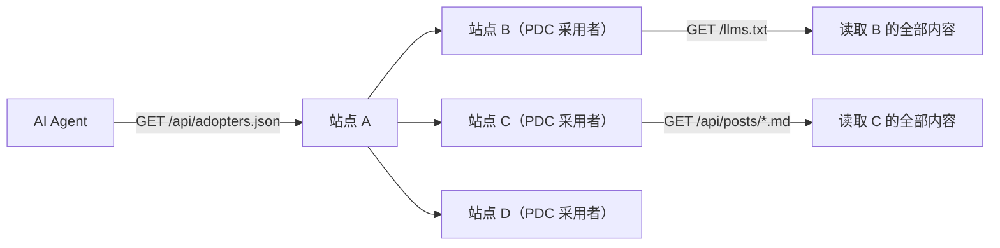

# 分类：建站

共 9 篇文章

---

# llmstxt.site 收录站速览与有趣网站精选
Date: 2026-06-26 | Tags: AI, llms.txt, 信息获取 | URL: https://bsheepcoder.github.io/2026/06/26/hexo-llmstxt-sites/

## llmstxt.site 是什么

[llmstxt.site](https://llmstxt.site/) 是一个第三方目录站，专门收录全球部署了 `/llms.txt` 文件的网站。llms.txt 是 Jeremy Howard（Answer.AI 联合创始人、fast.ai 创始人）于 2024 年 9 月提出的标准：在网站根路径放一个 Markdown 格式的 `/llms.txt`，为 LLM 提供干净的内容入口，让 AI 在推理时零噪音获取网站内容。

目前有两个独立的目录站收录 llms.txt 采用者：

| 目录 | 收录量 | 特点 |
|------|--------|------|
| [directory.llmstxt.cloud](https://directory.llmstxt.cloud/) | 849 站 | 高质量策展，有审核团队，收录 Anthropic、Cursor、Cloudflare 等一线品牌 |
| [llmstxt.site](https://llmstxt.site/) | 1600+ 站 | 开放收录，门槛低，量大但 SEO/营销站占比高 |

llmstxt.site 的特点在于**收录量大、覆盖广**。它的页面是一个长表格，每行一个站点，列出名称、主站 URL、`llms.txt` URL、token 数，以及可选的 `llms-full.txt` URL 和 token 数。token 数由爬虫自动统计，能直观反映每个站点给 AI 提供了多少内容。

不过门槛低也意味着泥沙俱下——大量收录是酒店、本地商家、SEO 营销页这类对 AI 生态毫无价值的站点。真正有意思的站点需要从 1600+ 条记录里淘出来。

## 有趣网站精选

我翻完了 llmstxt.site 的全部记录，过滤掉噪音，选出真正值得关注的站点。以下是按类别整理的结果。

## AI 平台与 LLM 工具

这个类别是 llms.txt 最自然的受众——AI 公司需要让其他 AI 能读懂自己的平台。

| 站点 | llms.txt tokens | 说明 |
|------|:-:|------|
| [Anthropic](https://claude.com/llms.txt) | 8.4K | Claude 母公司，AI 安全实验室（full 481K） |
| [Fireworks AI](https://fireworks.ai/llms.txt) | 4.4K | Serverless LLM 推理平台（full 88K） |
| [Langbase](https://langbase.com/llms.txt) | 367K | 可组合 AI pipes，LLM 开发平台 |
| [AgentDock](https://agentdock.ai/llms.txt) | 293K | AI Agent 构建框架 |
| [ZenML](https://www.zenml.io/llms.txt) | 98K | 开源 ML pipeline 框架（full 575K） |
| [Maxim AI](https://getmaxim.ai/llms.txt) | 46K | LLM 评估与可观测性（full 410K） |
| [deepset](https://deepset.ai/llms.txt) | 1.6K | Haystack/RAG 框架厂商 |
| [Keywords AI](https://www.keywordsai.co/llms.txt) | 316 | LLM 日志/可观测性（极简） |
| [Tenthe AI Dictionary](https://tenthe.com/llms.txt) | 47K | AI 术语词典（full 3.6M tokens） |

几个观察：

- **Anthropic 的 llms.txt 约 8K tokens**，作为 Claude 的母公司，内容适中——既提供导航，也附带一定量的核心文档
- **Langbase 367K tokens** 是 AI 平台中最重的，说明它把大量 API 文档和示例都塞进了 llms.txt
- **Keywords AI 仅 316 tokens**，证明即使是很小的公司也可以快速接入

## 开发者工具与 SaaS

开发者工具是 llms.txt 采纳最积极的传统行业——文档站天然适合 Markdown 化。

| 站点 | llms.txt tokens | 说明 |
|------|:-:|------|
| [Sourcegraph](https://sourcegraph.com/docs) | 1.2M | 代码搜索平台（语料最大之一） |
| [Cloudflare Docs](https://developers.cloudflare.com/llms.txt) | 34K | 边缘平台文档（full 3.8M） |
| [Retool](https://docs.retool.com/llms.txt) | 32K | 内部应用构建器 |
| [Better Auth](https://better-auth.com/llms.txt) | 174K | 开源认证框架 |
| [CircleCI](https://circleci.com/llms.txt) | 1.2K | CI/CD 平台 |
| [Apify](https://apify.com/llms.txt) | 2.5K | 爬虫/自动化平台 |
| [Axiom](https://axiom.co/llms.txt) | 10K | 日志/可观测性 |
| [Activepieces](https://activepieces.com/llms.txt) | 4.6K | 开源 Zapier 替代品 |
| [Terminal Trove](https://terminaltrove.com/llms.txt) | 360 | CLI/TUI 工具目录（极简） |
| [Unkey](https://unkey.com/llms.txt) | 4K | API key 管理服务 |
| [liblab](https://liblab.com/llms.txt) | 9.3K | 从 API 自动生成 SDK |
| [DeployHQ](https://www.deployhq.com/llms.txt) | 3.3K | 自动化代码部署 |

**Sourcegraph 以 1.2M tokens 位居全目录语料量前列**。作为一个代码搜索平台，它把几乎所有文档都开放给了 AI——这本身就是对"AI 时代文档该怎么写"的一种表态。

**Terminal Trove 只有 360 tokens**，但它是一个 CLI 工具目录站，用极简的 llms.txt 就能让 LLM 知道"有哪些好用的命令行工具"。小而美的典范。

## 开源框架与文档

前端框架和开源项目是 llms.txt 最早一批采纳者。

| 站点 | llms.txt tokens | 说明 |
|------|:-:|------|
| [Next.js](https://nextjs.org/docs/llms.txt) | 14K | React 框架文档 |
| [Svelte](https://svelte.dev/llms.txt) | 281 | Svelte 框架（极简典范） |
| [Angular](https://angular.dev/llms.txt) | 1.5K | Angular 框架文档 |
| [Astro](https://astro.build/llms.txt) | 556 | 内容导向 Web 框架 |
| [Strapi](https://strapi.io/llms.txt) | 3.8K | Headless CMS |
| [Hugging Face Transformers](https://huggingface.co/) | 809K | Transformers 库文档（语料最大） |
| [Hugging Face Diffusers](https://huggingface.co/) | 383K | Diffusers 库文档 |
| [Meilisearch](https://www.meilisearch.com/llms.txt) | 331 | 开源搜索引擎 |
| [Apache Camel](https://camel.apache.org/llms.txt) | 1.1K | 集成框架 |
| [Stripe](https://docs.stripe.com/llms.txt) | 17K | 支付 API 文档 |
| [NVIDIA Developer](https://developer.nvidia.com/llms.txt) | 5.5K | NVIDIA 开发平台 |

**Svelte 的 281 tokens 是全目录最极简的前端框架实现**。对比 Next.js 的 14K tokens，Svelte 选择只放最核心的导航链接。两种策略各有道理——Next.js 文档量大需要详细索引，Svelte 文档结构简单不需要。

**Hugging Face 三件套（Transformers 809K + Diffusers 383K + Hub 72K）加起来超过 1.2M tokens**，是目前开源生态中对 llms.txt 投入最重的。作为模型托管平台，让 AI 能直接读取模型文档是刚需。

## 金融与加密

金融科技类站点对 llms.txt 的采纳出乎意料地积极。

| 站点 | llms.txt tokens | 说明 |
|------|:-:|------|
| [Bitcoin.com](https://www.bitcoin.com/llms.txt) | 722K | 加密新闻/钱包/交易所 |
| [Chainspect](https://chainspect.app/llms.txt) | 938K | 区块链分析平台 |
| [Mangopay](https://mangopay.com/llms.txt) | 11K | 嵌入式支付（full 1.7M） |
| [FinFeedAPI](https://finfeedapi.com/llms.txt) | 8K | 金融市场数据 API |
| [KuCoin API](https://www.kucoin.com/llms.txt) | 15K | 加密交易所 API |
| [Method Financial](https://methodfi.com/llms.txt) | 3.6K | 嵌入式金融 API |
| [Paysafe](https://developer.paysafe.com/llms.txt) | 6.2K | 支付网关 API |

**Bitcoin.com 和 Chainspect 的语料量（722K 和 938K）甚至超过很多技术文档站**。加密行业对"让 AI 读懂自己"有异常强的动力——可能是因为加密项目的技术叙事复杂，需要 AI 能准确理解其机制而非依赖媒体二手报道。

## MCP 生态

MCP（Model Context Protocol）相关的目录站已经出现在 llms.txt 收录中，说明两个标准正在交汇。

| 站点 | llms.txt tokens | 说明 |
|------|:-:|------|
| [MCP Server Space](https://mcpserver.space/llms.txt) | 1.2K | MCP 服务器目录 |
| [uminai MCP Directory](https://mcp.umin.ai/llms.txt) | 1K | MCP 服务器目录 |

MCP 是 Anthropic 提出的 AI 应用上下文接口标准，和 llms.txt 解决的是不同层面的问题——llms.txt 解决"AI 怎么读网站内容"，MCP 解决"AI 怎么调用工具和数据源"。两者的交汇点在于：一个 llms.txt 文件可以声明本站提供 MCP 适配器，让 AI 知道这里不仅可读，还可调用。

## 个人与小众站点

个人技术博客在 llms.txt 收录中凤毛麟角——大多数实现要么是大公司的深度文档站，要么是蹭热度的营销页。以下是少数有真正价值的个人/小众站：

| 站点 | llms.txt tokens | 说明 |
|------|:-:|------|
| [Huberman Lab](https://www.hubermanlab.com/llms.txt) | 14K | 神经科学播客（名人站） |
| [Readwise](https://readwise.io/llms.txt) | 96K | 稍后读/笔记应用 |
| [Listen Notes](https://www.listennotes.com/llms.txt) | 1K | 播客搜索引擎 |
| [Light Pollution Map](https://lightpollutionmap.app/llms.txt) | 544 | 光污染地图（新颖用例） |
| [Aurora Map](https://auroramap.app/llms.txt) | 463 | 极光预报地图 |
| [Rasul Kireev](https://www.rasulkireev.com/llms.txt) | 127K | 知名开发者个人站 |
| [MASI Longevity](https://masi.eu/llms.txt) | 1.1K | 长寿科学研究 |

**Light Pollution Map 和 Aurora Map 是两个非常规用例**——它们不是技术文档站，而是数据可视化工具。通过 llms.txt，它们让 AI 知道"这里有一个光污染/极光数据源"，拓宽了 llms.txt 的应用边界。

**Huberman Lab 是唯一的名人个人站**——Andrew Huberman 是斯坦福神经科学家，他的播客有大量科学内容。用 llms.txt 让 AI 能准确引用他的观点，而非依赖二手转述，是对抗信息失真的好方法。

## 三个观察

### 1. Token 数量两极分化

全目录的 token 分布呈双峰：

- **巨无霸**：Sourcegraph 1.2M、HF Transformers 809K、Bitcoin.com 722K——这些是文档站，llms.txt 只是冰山一角
- **极简派**：Svelte 281、Terminal Trove 360、Keywords AI 316——证明 llms.txt 不需要大才有价值

**llms.txt 的价值不在于自身包含多少内容，而在于它是一个精确的导航入口。** Svelte 只用 281 tokens 就让 LLM 知道去哪里找框架文档，这比塞 10 万 tokens 的全文更高效。

### 2. 中间地带缺失

收录站点要么是 Anthropic / Cloudflare / Next.js 这类一线技术品牌深度实现，要么是填表蹭热度的营销站。**独立开发者博客、中小技术站点是缺失的中间层。** 这不是好事——llms.txt 的价值需要更多真实内容生产者参与才能体现。

### 3. MCP 与 llms.txt 正在交汇

MCP 目录站已出现在 llms.txt 收录中。两个标准解决不同层面的问题（llms.txt = AI 读内容，MCP = AI 调工具），但正在产生交集——一个站点可以同时提供 llms.txt（可读）和 MCP 适配器（可调用），形成完整的 AI 可交互内容栈。

本站的 PDC 协议正处在这个交汇点上：基于 llms.txt 标准提供内容通道，同时通过 MCP 适配层让 Claude Desktop、Cursor 等客户端可直接访问。如果你也在做类似的事，欢迎交流。


---

# llms.txt 收录目录里有哪些有趣的网站
Date: 2026-06-26 | Tags: AI, Hexo, llms.txt, PDC | URL: https://bsheepcoder.github.io/2026/06/26/hexo-llmstxt-guide/

## 两个收录目录

llms.txt 是 Jeremy Howard（Answer.AI）提出的网站约定，在根路径放一个 `/llms.txt` 文件，为 LLM 提供 Markdown 格式的内容入口。目前有两个第三方目录站收录这些文件，都独立于标准官方运营：

- **directory.llmstxt.cloud**：由 `@ifox` 和 `@joyceverheije` 创建，有审核团队，收录标准偏向有影响力的公司/产品，质量较高，收录了 Anthropic、Cursor、Cloudflare、Next.js 等一线品牌，分类统计 849 个 Websites、447 个 Products、358 个 Developer tools、187 个 AI、167 个 Finance。
- **llmstxt.site**：独立运营，收录门槛低、量大（1600+ 站点），但 SEO/营销型站点占比高。

本文从 llmstxt.site 的 1600+ 站点中筛选出有趣的，按类别介绍。

## AI 平台与 LLM 工具

### Anthropic

- 站点：[anthropic.com](https://anthropic.com/)
- llms.txt：8K tokens / llms-full.txt：481K tokens

Claude 的母公司，AI 安全实验室。作为 llms.txt 标准最早的一批采纳者，Anthropic 的 llms.txt 提供了公司理念、研究方向和 Claude 模型信息的结构化入口。有趣的是，它和 Cursor、Cloudflare 一起构成了"AI 公司自己用 llms.txt 服务 AI"的闭环——AI 公司最懂 AI 需要什么。

### Fireworks AI

- 站点：[fireworks.ai](https://fireworks.ai/)
- llms.txt：4K tokens / llms-full.txt：88K tokens

Serverless LLM 推理平台，主打"以 1/10 成本跑开源模型"。它的 llms.txt 是标准的 API 文档入口风格，帮助 LLM 快速定位模型列表、定价、推理端点。

### Langbase

- 站点：[langbase.com](https://langbase.com)
- llms.txt：367K tokens

可组合 AI pipes / LLM 开发平台。367K tokens 的 llms.txt 在 AI 类里算巨无霸，说明它把大量文档内容直接塞进了入口文件——这对一次性读取全站的 AI Agent 很友好，但也意味着每次请求都要消耗大量 token。

### AgentDock

- 站点：[agentdock.ai](https://agentdock.ai)
- llms.txt：293K tokens

AI Agent 构建框架。293K tokens 的体量同样偏大，推测是把完整的框架文档、API 参考和示例都合并进了 llms.txt。

### ZenML

- 站点：[zenml.io](https://www.zenml.io/)
- llms.txt：98K tokens / llms-full.txt：575K tokens

开源 ML pipeline 框架，定位类似"ML 工程界的 Terraform"。它同时提供了 llms.txt（精简入口）和 llms-full.txt（完整文档合并），是标准规范的最佳实践样本——让 AI 先读精简版定位，再按需读完整版。

### Maxim AI

- 站点：[getmaxim.ai](https://getmaxim.ai)
- llms.txt：46K tokens / llms-full.txt：410K tokens

LLM 评估与可观测性平台。作为"给 AI 做监控"的公司，用 llms.txt 给 AI 提供自己的文档，有"监控 AI 的工具被 AI 监控"的递归意味。

### deepset

- 站点：[deepset.ai](https://deepset.ai/)
- llms.txt：1.6K tokens

Haystack 框架厂商，做 RAG 和搜索。1.6K tokens 的极简 llms.txt 是另一种风格——只提供导航入口，让 AI 按需去读具体页面，不把所有内容塞进一个文件。

## 开发者工具与 SaaS

### Sourcegraph

- 站点：[sourcegraph.com/docs](https://sourcegraph.com/docs)
- llms.txt：1.2M tokens

代码搜索与导航平台。1.2M tokens 是整个目录里语料最大的之一，说明 Sourcegraph 把完整的 API 文档、使用指南全部铺进了 llms.txt。对于被 Cursor / Copilot 这类代码 AI 调用的场景，这是最直接的内容投喂。

### Cloudflare Docs

- 站点：[developers.cloudflare.com](https://developers.cloudflare.com)
- llms.txt：34K tokens / llms-full.txt：3.8M tokens

Cloudflare 边缘平台文档。3.8M tokens 的 llms-full.txt 是目录里最大的文件之一，覆盖了 Workers、Pages、R2、D1、KV 等全部产品文档。Cloudflare 是少数同时提供精简版和超大全文版的厂商——让 AI 根据上下文窗口灵活选择。

### Retool

- 站点：[docs.retool.com](https://docs.retool.com)
- llms.txt：32K tokens / llms-full.txt：399K tokens

内部应用构建器平台。Retool 的 llms.txt 实现比较规范，同时提供精简入口和完整文档。

### Better Auth

- 站点：[better-auth.com](https://better-auth.com/)
- llms.txt：174K tokens

开源认证框架。作为一个独立开源项目，174K tokens 的 llms.txt 体量不小，说明作者认真对待 AI 可读性——认证库的文档被 AI 正确理解，直接影响 AI 生成代码的安全性。

### CircleCI

- 站点：[circleci.com](https://circleci.com/)
- llms.txt：1.2K tokens

CI/CD 平台。CircleCI 选择了极简路线，1.2K tokens 只够放一个导航入口。这适合"让 AI 知道 CircleCI 文档在哪"的场景，但要深入配置细节仍需 AI 去爬具体页面。

### Apify

- 站点：[apify.com](https://apify.com/)
- llms.txt：2.5K tokens

爬虫与自动化平台。Apify 做爬虫工具，自己用 llms.txt 给 AI 提供文档——"爬虫公司被 AI 爬"。

### Axiom

- 站点：[axiom.co](https://axiom.co/)
- llms.txt：10K tokens / llms-full.txt：398K tokens

日志与可观测性平台，和 Datadog / Grafana 同赛道。llms.txt 实现规范，同时提供精简和完整版。

### Activepieces

- 站点：[activepieces.com](https://activepieces.com/)
- llms.txt：4.6K tokens / llms-full.txt：57K tokens

开源 Zapier 替代品。作为自动化工具，它的 llms.txt 帮助 AI 理解如何配置各种集成节点——AI 写自动化流程时直接读取文档。

### Terminal Trove

- 站点：[terminaltrove.com](https://terminaltrove.com/)
- llms.txt：360 tokens / llms-full.txt：1.4K tokens

CLI/TUI 工具精选目录。整个目录里最极简的实现之一，360 tokens 只够放一句介绍和几个分类链接。但 Terminal Trove 本身就是工具导航站，llms.txt 极简反而合理——它的价值是"让 AI 知道有哪些 CLI 工具存在"。

### Bun

- 站点：[bun.sh](https://bun.sh)
- 站点：JS 运行时（Node.js 替代品）

Bun 在 llmstxt.site 目录的文件末尾，是最后一个条目。作为新兴 JS 运行时，Bun 的文档本身就很受 AI 关注——大量开发者在用 AI 写 Bun 代码时需要准确的 API 参考。

## 开源框架与文档

### Next.js

- 站点：[nextjs.org/docs](https://nextjs.org/docs)
- llms.txt：14K tokens / llms-full.txt：676K tokens

React 框架文档。Next.js 是 llms.txt 最常被引用的案例之一——前端开发者大量使用 AI 辅助编码，App Router 的配置复杂度高，准确的 Markdown 文档直接提升 AI 生成代码质量。

### Svelte

- 站点：[svelte.dev](https://svelte.dev/)
- llms.txt：281 tokens / llms-full.txt：226K tokens

Svelte UI 框架。281 tokens 是整个目录里最极简的 llms.txt 之一，但它是官方框架文档入口，足够让 LLM 知道去哪找。这证明 llms.txt 不需要大才有价值——它的核心作用是**精确的导航入口**，而非内容仓库。

### Angular

- 站点：[angular.dev](https://angular.dev/)
- llms.txt：1.5K tokens / llms-full.txt：152K tokens

Angular 框架文档。Google 出品，文档规范度高。

### Astro

- 站点：[astro.build](https://astro.build/)
- llms.txt：556 tokens / llms-full.txt：591K tokens

内容导向 Web 框架，做博客和文档站很流行。Astro 自己用 llms.txt 服务 AI，形成"做博客框架的博客被 AI 读取"的循环。

### Hugging Face Transformers

- 站点：[huggingface.co](https://huggingface.co/)
- llms.txt：809K tokens

Transformers 库文档。809K tokens 是整个目录里语料最大的之一，覆盖了完整的模型 API、训练指南、推理示例。Hugging Face 同时为 Transformers、Diffusers、Accelerate、Hub Python Library 四个项目分别提供 llms.txt，是标准的多项目实践。

### Meilisearch

- 站点：[meilisearch.com](https://www.meilisearch.com/)
- llms.txt：331 tokens / llms-full.txt：298K tokens

开源搜索引擎。331 tokens 的极简 llms.txt 和 Svelte 一样走"只做导航"路线。作为搜索引擎项目，用 llms.txt 给 AI 提供搜索入口，有"搜索引擎被 AI 搜索"的意味。

### Stripe

- 站点：[docs.stripe.com](https://docs.stripe.com)
- llms.txt：17K tokens

Stripe 支付 API 文档。支付 API 的准确性要求极高，AI 生成 Stripe 集成代码时必须读准确文档——Stripe 提供 llms.txt 直接解决了"AI 从 HTML 里提取 API 参数容易出错"的问题。

### NVIDIA Developer

- 站点：[developer.nvidia.com](https://developer.nvidia.com)
- llms.txt：5.5K tokens

NVIDIA 开发平台。作为 GPU 厂商，NVIDIA 的 llms.txt 帮助 AI 定位 CUDA、cuDNN、TensorRT 等开发文档。

## 金融与加密

### Bitcoin.com

- 站点：[bitcoin.com](https://www.bitcoin.com/)
- llms.txt：722K tokens

加密新闻、钱包和交易所。722K tokens 的 llms.txt 体量惊人，说明 Bitcoin.com 把大量新闻内容塞进了入口文件——这更像一个"内容投喂"策略，让 AI 一次读取就能覆盖大量加密资讯。

### Chainspect

- 站点：[chainspect.app](https://chainspect.app/)
- llms.txt：938K tokens

区块链分析平台。938K tokens 在金融类里最大，推测包含完整的链上数据分析方法和 API 参考。

### Mangopay

- 站点：[mangopay.com](https://mangopay.com/)
- llms.txt：11K tokens / llms-full.txt：1.7M tokens

嵌入式支付平台。1.7M tokens 的 llms-full.txt 是目录里最大的文件之一，覆盖完整的支付 API、合规流程、沙箱测试指南。

### FinFeedAPI

- 站点：[finfeedapi.com](https://finfeedapi.com)
- llms.txt：8K tokens / llms-full.txt：1.1M tokens

金融市场数据 API。1.1M tokens 的完整文档，涵盖股票、期货、外汇等市场数据接口。金融数据 API 对准确性要求极高，llms.txt 让 AI 获取准确的接口定义而非猜测。

### KuCoin API

- llms.txt：15K tokens

加密交易所 API。交易所 API 的参数复杂（签名、时间戳、限频），AI 生成交易代码时必须读准确文档。

## MCP 生态

### MCP Server Space

- 站点：[mcpserver.space](https://mcpserver.space/)
- llms.txt：1.2K tokens / llms-full.txt：1.2K tokens

MCP 服务器目录站。本身就是为 AI Agent 服务的目录，用 llms.txt 给 AI 提供目录索引——"给 AI 看的 AI 工具目录"。

### uminai MCP Directory

- 站点：[mcp.umin.ai](https://mcp.umin.ai)
- llms.txt：1K tokens

另一个 MCP 服务器目录。MCP 目录站出现在 llms.txt 收录中，说明 MCP 生态与 llms.txt 标准正在交汇——AI Agent 既可以通过 llms.txt 发现网站内容，也可以通过 MCP 目录找到可调用的工具。

## 个人与小众站点

### Huberman Lab

- 站点：[hubermanlab.com](https://www.hubermanlab.com/)
- llms.txt：14K tokens

斯坦福神经科学家 Andrew Huberman 的播客站。名人站使用 llms.txt 比较少见，14K tokens 覆盖了播客集数和主题索引。这让 AI 在被问"Huberman 说过什么关于睡眠的"时能准确定位到具体集数。

### Readwise

- 站点：[readwise.io](https://readwise.io)
- llms.txt：96K tokens

稍后读与笔记应用。96K tokens 的 llms.txt 体量不小，覆盖完整的产品文档。作为"帮人读东西"的工具，用 llms.txt 帮 AI 读自己的文档。

### Listen Notes

- 站点：[listennotes.com](https://www.listennotes.com/)
- llms.txt：1K tokens

播客搜索引擎。1K tokens 的极简入口，让 AI 知道"有一个播客搜索引擎，API 在这里"。

### Light Pollution Map

- 站点：[lightpollutionmap.app](https://lightpollutionmap.app)
- llms.txt：544 tokens / llms-full.txt：1.9K tokens

光污染地图。一个非技术类的数据可视化工具用 llms.txt 比较少见，说明 llms.txt 正在从开发者文档扩展到更广泛的"让 AI 理解我的数据服务"场景。

### Rasul Kireev

- 站点：[rasulkireev.com](https://www.rasulkireev.com/)
- llms.txt：127K tokens

知名开发者个人站。127K tokens 的个人站 llms.txt 是目录里少见的"独立开发者深度实现"——大部分个人站要么不做 llms.txt，要么随便写几行，但这位把博客、项目、笔记都结构化塞了进去。

## 几个观察

### Token 数量两极分化

整个目录的 token 分布呈现明显的双峰：

- **巨无霸派**：Sourcegraph 1.2M、HF Transformers 809K、Bitcoin.com 722K、Cloudflare full 3.8M——这些是文档站，llms.txt 只是冰山一角
- **极简派**：Svelte 281、Terminal Trove 360、Meilisearch 331、Light Pollution Map 544——只做导航入口

两种策略各有道理。巨无霸派适合"一次性读取全站"的 AI Agent，极简派适合"按需深入"的交互式查询。关键是和自己的内容形态匹配——文档站可以做大，工具站适合做小。

### 中间地带缺失

整个目录里，真正的"中小技术博客"很少。要么是 Anthropic / Cloudflare / Next.js 这类一线品牌的深度实现，要么是"填个表蹭热度"的营销页。独立开发者博客、技术笔记站、个人知识库是缺失的那层——这正是本站 PDC 协议想要补的空缺。

### AI 公司自己用 llms.txt

一个有趣的现象：AI 公司（Anthropic、Cursor、Fireworks AI、Hugging Face）是最早采纳 llms.txt 的群体。因为他们最清楚 AI 读 HTML 有多痛苦。这形成了一个信号：**一个网站是否有 llms.txt，某种程度上反映了它的技术团队是否理解 AI 的工作方式。**

## 本站的实践

本站基于 llms.txt 标准，通过 PDC（Parallel Data Channel）协议做了扩展实现，覆盖了标准未涉及的三个空白：

1. **加密文章保护**：加密文章在 API 中返回 `encrypted: true` + 空内容，不泄露正文
2. **分类聚合端点**：自动生成 `/api/categories/<slug>.json` 和 `.md`，按分类聚合全文
3. **MCP 适配层**：生成 `/api/mcp.json` 清单，可通过薄适配器接入 Claude Desktop、Cursor 等

如果你也在做类似的事情，欢迎加入 PDC 采用者网络。完整规范文档位于 `/pdc-protocol.md`。


---

# 邀请你加入 PDC 采用者网络：让 AI 零噪音读取你的博客
Date: 2026-06-26 | Tags: AI, Hexo, llms.txt, PDC | URL: https://bsheepcoder.github.io/2026/06/26/hexo-pdc-adopters-network/

## 为什么需要 PDC

AI 时代，你的博客文章不仅是写给人类看的。越来越多的读者通过 AI 助手获取信息——它们帮你总结、检索、引用。但 AI 读取博客时面临一个尴尬的现实：它必须解析 HTML，剥离导航栏、侧边栏、广告、字数统计等 UI 噪音，才能拿到文章正文。这个过程不可靠、低效，且经常丢失格式。

**PDC**（Parallel Data Channel，平行数据通道（PDC））解决了这个问题：在构建时自动生成一套与 HTML 平行的机器通道（JSON/MD/TXT），AI 直接读取这些端点，零噪音、零解析损耗。

```
传统方式：AI → 解析 HTML → 剥离噪音 → 可能丢失格式 → 得到正文
PDC 方式：AI → GET /api/posts/<slug>.md → 直接拿到纯 Markdown 正文
```

## llms.txt 采用者网络是什么

PDC 不仅是技术实现，也是一个**开放互链网络**。

当你的博客实现了 PDC 后，你可以加入采用者网络：

- 你的站点出现在[友链页](/flink/)，获得反向链接
- 你的站点列入 [`/api/adopters.json`](/api/adopters.json)，其他 AI/Agent 可自动发现你
- 网络成员之间形成内容互链，提升整体搜索可见性

这意味着：**一个 AI 读者访问任何一个 PDC 采用者站点，就能发现整个网络的所有成员**。



## 如何加入（4 步）

### 第 1 步：实现 llms.txt + PDC 扩展端点

PDC 的核心是 3 个必需端点：

| 端点 | 格式 | 用途 | 最简实现 |
|------|------|------|---------|
| `/llms.txt` | TXT | AI 入口：站点概览 + 文章列表 | 手写或脚本生成 |
| `/api/index.json` | JSON | 结构化文章列表（title/url/tags/categories） | 脚本生成 |
| `/api/posts/<slug>.md` | MD | 单篇纯 Markdown 正文（零噪音） | 脚本生成 |

如果你用的是 Hexo，可以直接复用本站的脚本（开源在 [pdc-protocol-verify](https://github.com/Bsheepcoder/pdc-protocol-verify) 仓库有完整规范）。其他静态站点生成器（Hugo/Jekyll）也可以参照规范实现。

完整协议规范见 [`/pdc-protocol.md`](/pdc-protocol.md)。

### 第 2 步：提交申请

在 [GitHub Issues](https://github.com/Bsheepcoder/Bsheepcoder.github.io/issues) 创建 Issue，填写以下信息：

```
站点名称：你的博客名
站点 URL：https://your-blog.com/
头像 URL：https://your-blog.com/avatar.png
一句话描述：50 字以内的站点描述
```

### 第 3 步：自动验证

维护者会运行验证脚本检查你的端点是否可访问：

```bash
git clone https://github.com/Bsheepcoder/pdc-protocol-verify.git
cd pdc-protocol-verify
node verify.js https://your-blog.com/
```

脚本检查两个核心端点：

- `GET <url>/llms.txt` — 返回 200 且内容包含文章列表
- `GET <url>/api/index.json` — 返回 200 且 JSON 结构正确

输出示例：

```
✓ Q's blog (https://bsheepcoder.github.io/)
  /llms.txt → 200 OK
  /api/index.json → 200 OK (24 posts)

✗ Example Blog (https://example.com/)
  /llms.txt → 404 Not Found
  /api/index.json → 404 Not Found
```

不传参数时，脚本会从 `https://bsheepcoder.github.io/api/adopters.json` 拉取全部采用者列表并逐一验证：

```bash
node verify.js
```

### 第 4 步：互链

验证通过后，你的站点会被添加到友链数据中。下次 `hexo g` 构建时：

- 你的站点出现在 [友链页](/flink/) 的"llms.txt 采用者"分类下
- 你的站点列入 [`/api/adopters.json`](/api/adopters.json)
- 你的 `llms_txt` 和 `api_index` 端点自动追加到采用者 JSON 中

## 验证脚本详解

验证脚本（[pdc-protocol-verify](https://github.com/Bsheepcoder/pdc-protocol-verify)）是零依赖的 Node.js 脚本，无需 `npm install`，直接 `node verify.js` 运行。

### 前提条件

- Node.js 18+
- 网络可访问待验证站点

### 验证单个站点

```bash
node verify.js https://your-blog.com/
```

退出码：`0` = 全部通过，`1` = 有失败项。可用于 CI/CD 流水线。

### 验证全部采用者

```bash
node verify.js
```

不传参数时，脚本自动从 `https://bsheepcoder.github.io/api/adopters.json` 拉取采用者列表，逐一检查并输出汇总报告：

```
Found 3 adopter(s). Verifying...

✓ Q's blog (https://bsheepcoder.github.io/)
  /llms.txt → 200 OK
  /api/index.json → 200 OK (24 posts)

✓ Another Blog (https://another.com/)
  /llms.txt → 200 OK
  /api/index.json → 200 OK (12 posts)

✗ Broken Site (https://broken.com/)
  /llms.txt → 0 ERR timeout
  /api/index.json → 0 ERR timeout

==================================================
Total: 3 | Passed: 2 | Failed: 1
```

### 检查项

| 检查项 | 通过条件 | 失败原因 |
|--------|---------|---------|
| `/llms.txt` 可访问 | HTTP 200 | 404/超时/DNS 解析失败 |
| `/api/index.json` 可访问 | HTTP 200 | 404/超时/DNS 解析失败 |
| `/api/index.json` 格式正确 | 可解析为 JSON | 非 JSON/结构错误 |

## 采用者的权利与义务

### 权利

- **反向链接**：出现在友链页面，SEO 友好的 dofollow 链接
- **AI 可发现**：列入 `/api/adopters.json`，其他 AI/Agent 自动发现你的站点
- **网络效应**：成员越多，每个成员被 AI 发现的概率越高
- **MCP 生态接入**：PDC 可通过适配器接入 MCP 生态（Claude Desktop、Cursor 等）

### 义务

- **维持端点可访问**：`/llms.txt` 和 `/api/index.json` 必须长期可用
- **标注 PDC 采用**：在站点可见位置（关于页/页脚/公告）标注 llms.txt 采用

## 为什么不用 RSS 就够了

RSS 解决的是**人类订阅**问题，PDC 解决的是**AI 检索**问题：

| | RSS | PDC |
|---|---|---|
| 目标读者 | 人类（RSS 阅读器） | AI/Agent |
| 内容格式 | HTML 或截断文本 | 纯 Markdown（零噪音） |
| 结构化程度 | 低（title + content） | 高（title/tags/categories/description/加密状态） |
| 分类聚合 | 不支持 | `/api/categories/<slug>.json` |
| 提示词提取 | 不支持 | `<prompt>` 标签自动提取 |
| MCP 适配 | 不支持 | `/api/mcp.json` 清单 |

两者互补，不是替代关系。你的博客应该同时提供 RSS（给人类）和 PDC（给 AI）。

## 一个真实的 AI 检索场景

假设一个用户问 AI："Hexo 博客如何让 AI 读取文章内容？"

没有 PDC 网络时，AI 只能搜索网页、解析 HTML、从噪音中提取信息。

有了 PDC 网络后，AI 的流程是：

1. `GET https://bsheepcoder.github.io/llms.txt` → 发现站点概览和文章索引
2. `GET /api/index.json` → 筛选 tags 含 "AI" 的文章 → 找到 `hexo-ai-data-channel`
3. `GET /api/posts/hexo-ai-data-channel.md` → 直接拿到纯 Markdown 正文
4. `GET /api/adopters.json` → 发现其他 PDC 采用者 → 可继续检索他们的内容

整个流程**零 HTML 解析、零噪音、零格式丢失**。这就是 PDC 网络的价值。

## 现在就开始

1. 阅读 [PDC 规范](/pdc-protocol.md)
2. 在你的 Hexo/静态站点上实现 3 个必需端点
3. 运行 `node verify.js https://your-blog.com/` 自检
4. 在 [GitHub Issues](https://github.com/Bsheepcoder/Bsheepcoder.github.io/issues) 提交申请

期待你的加入。

> **核心原则**：PDC 网络的力量在于互链。每一个新成员不仅自己变得 AI 可发现，还让整个网络的所有成员都更容易被发现。这是正和游戏，不是零和博弈。


---

# PDC 协议接入 MCP 生态：两种部署模式实战
Date: 2026-06-22 | Tags: MCP, Hexo, PDC, Cloudflare, Qoder | URL: https://bsheepcoder.github.io/2026/06/22/hexo-pdc-mcp-adapter/

## 问题：静态博客如何接入 MCP

[上一篇文章](/2026/06/22/ai-mcp-protocol/)解析了 MCP 协议的核心设计。MCP 需要 JSON-RPC 服务端处理 POST 请求，而 [PDC](/pdc-protocol.md)的站点是纯静态文件（GitHub Pages），没有服务端逻辑。

这是所有静态站点的共同困境：内容在 GitHub Pages 上，AI 想通过 MCP 标准协议访问，但静态托管不支持 POST 请求。

PDC 的解法是**薄适配器**——一个无状态的中间层，所有数据来自 PDC 静态端点，只做 JSON-RPC 协议转换。适配器支持两种部署模式，覆盖从个人开发到团队共享的全部场景。

## 架构总览

```
模式一（本地 stdio）：
  MCP Host（Qoder / Claude Desktop / Cursor）
      │ stdin/stdout（JSON-RPC 2.0）
      ▼
  mcp-server/index.js（Node.js，零依赖）
      │ fetch → GitHub Pages
      ▼
  /api/mcp.json, /api/index.json, /api/posts/*.md

模式二（远程 HTTP）：
  MCP Host
      │ HTTP POST（JSON-RPC 2.0）
      ▼
  mcp-server/worker.js（Cloudflare Worker）
      │ fetch → GitHub Pages
      ▼
  /api/mcp.json, /api/index.json, /api/posts/*.md
```

两种模式业务逻辑完全相同，区别仅在传输层。核心设计原则：

- **无状态**——适配器不存储任何内容，所有数据来自 PDC 静态端点
- **manifest 驱动**——构建时生成 `/api/mcp.json`，适配器启动时一次性读取
- **零依赖**——纯 JavaScript，不依赖 MCP SDK 或任何 npm 包

## 前置：MCP 清单端点

适配器的一切行为由 `/api/mcp.json` 驱动。这个文件在 `hexo generate` 时由 `scripts/ai-mcp.js` 自动生成，包含 MCP 三大原语的完整定义：

```json
{
  "protocolVersion": "2025-06-18",
  "serverInfo": { "name": "Q's blog-mcp", "version": "1.0.0" },
  "capabilities": {
    "resources": { "subscribe": false, "listChanged": false },
    "tools": { "listChanged": false },
    "prompts": { "listChanged": false }
  },
  "resources": [
    {
      "uri": "https://bsheepcoder.github.io/api/posts/pdc-protocol.md",
      "name": "PDC 协议：让博客同时服务人类与 AI",
      "mimeType": "text/markdown"
    }
  ],
  "resourceTemplates": [
    {
      "uriTemplate": "https://bsheepcoder.github.io/api/posts/{slug}.md",
      "name": "文章正文"
    }
  ],
  "tools": [
    {
      "name": "search_posts",
      "description": "按关键词/分类/标签搜索文章",
      "inputSchema": { "type": "object", "properties": { "query": { "type": "string" } } }
    }
  ],
  "prompts": [
    {
      "name": "prompt-code-review",
      "description": "PR 提交后自动化代码审查",
      "arguments": [{ "name": "diff", "required": true }]
    }
  ]
}
```

适配器读取这个清单后，就能响应 MCP 客户端的所有请求——`resources/list` 返回 `resources` 数组，`tools/list` 返回 `tools` 数组，`prompts/list` 返回 `prompts` 数组。文章更新后只需 `hexo g` 重新生成清单，重启适配器即可。

## PDC → MCP 三原语映射

适配器的核心工作是把 PDC 静态端点映射为 MCP 三大原语：

| PDC 端点 | MCP 原语 | 适配器处理方式 |
|---------|---------|--------------|
| `/api/posts/<slug>.md` | Resources | `resources/read` 时 fetch 该 URI，返回 text |
| `/api/categories/<slug>.md` | Resources | 同上，分类聚合作为 Resource |
| `/llms.txt`、`/ai-context.md`、`/pdc-protocol.md` | Resources | 站点级文档 |
| `/api/index.json` + 内存过滤 | Tools | `tools/call search_posts` 时 fetch index.json，过滤后返回 |
| `/api/posts/<slug>.md` 的 `<prompt>` 标签 | Prompts | `prompts/get` 时 fetch .md，正则提取 `<prompt>` |
| front-matter 的 `prompt_args` | Prompts arguments | 构建时写入 manifest，适配器直接返回 |

### 提示词文章的 front-matter 扩展

PDC 为提示词文章新增了 `prompt_args` 字段，让机器可解析提示词参数：

```yaml
---
title: "提示词：代码审查助手"
categories:
  - [技术, 提示词]
prompt_args:
  - name: diff
    description: "待审查的代码差异（git diff 输出）"
    required: true
---
```

Markdown 的"变量"表格保留给人类读者，`prompt_args` 供 MCP 客户端消费——平行通道理念的延伸。`scripts/ai-mcp.js` 构建时读取此字段，生成 MCP Prompts 的 `arguments` 定义。

## 模式一：本地 stdio

### 适用场景

- 个人开发者本地使用
- 开发调试（配合 `hexo s` 本地预览）
- 不想部署云服务

### 实现

`mcp-server/index.js`，零依赖纯 Node.js，~200 行。核心是一个 stdin 读取循环：

```javascript
process.stdin.on('data', function (chunk) {
  buffer += chunk
  let idx
  while ((idx = buffer.indexOf('\n')) !== -1) {
    const line = buffer.slice(0, idx).trim()
    buffer = buffer.slice(idx + 1)
    if (!line) continue
    handleMessage(line)  // JSON.parse → 分发到 handler → stdout 写响应
  }
})
```

JSON-RPC 2.0 over stdio 的规则很简单：每行一个 JSON 消息，stdin 读请求，stdout 写响应。MCP 规范要求 stdio 传输时 stdout 不能有非 JSON-RPC 内容，所以日志走 stderr。

### 配置

Qoder：Settings → MCP → My Servers → Add：

```json
{
  "mcpServers": {
    "bsheepcoder-blog": {
      "command": "node",
      "args": ["D:/Code/Hexo/blog/mcp-server/index.js"]
    }
  }
}
```

Claude Desktop：编辑 `claude_desktop_config.json`：

```json
{
  "mcpServers": {
    "bsheepcoder-blog": {
      "command": "node",
      "args": ["D:/Code/Hexo/blog/mcp-server/index.js"]
    }
  }
}
```

Cursor：Settings → MCP → Add Server，格式同上。

### 本地开发

配合 `hexo s` 本地预览时，添加环境变量指向 localhost：

```json
{
  "mcpServers": {
    "bsheepcoder-blog": {
      "command": "node",
      "args": ["D:/Code/Hexo/blog/mcp-server/index.js"],
      "env": { "SITE_URL": "http://localhost:4000" }
    }
  }
}
```

### 限制

- 需要本地安装 Node.js 18+
- 需要克隆博客仓库（至少 `mcp-server/` 目录）
- 每台设备都要单独配置
- 文章更新后需重启适配器刷新 manifest 缓存

## 模式二：远程 HTTP（Cloudflare Worker）

### 适用场景

- 跨设备使用
- 团队共享
- 不想安装 Node.js
- 在移动端 MCP 客户端使用

### 为什么选 Cloudflare Workers

| 平台 | 免费额度 | 冷启动 | 部署难度 | 适合 |
|------|---------|--------|---------|------|
| **Cloudflare Workers** | 10 万请求/天 | ~5ms | 粘贴代码即可 | ✅ |
| Vercel | 100 次/天 | ~500ms | 需 npm 项目 | ❌ 额度太低 |
| 自建 VPS | 按月付费 | 无 | 需运维 | ❌ 成本高 |

Workers 的 V8 运行时原生支持 `fetch`，零依赖代码可直接运行，5 秒内完成部署。

### 实现

`mcp-server/worker.js`，与 `index.js` 业务逻辑完全相同，传输层从 stdio 改为 HTTP：

```javascript
export default {
  async fetch(request) {
    if (request.method === 'OPTIONS') {
      return new Response(null, { headers: corsHeaders })
    }

    if (request.method !== 'POST') {
      // GET 请求返回服务信息（方便浏览器直接访问验证）
      return new Response(JSON.stringify({
        server: 'PDC MCP Server',
        site: SITE_URL,
        manifest: MANIFEST_URL
      }), { headers: { 'Content-Type': 'application/json', ...corsHeaders } })
    }

    // POST 请求：解析 JSON-RPC 消息，分发处理
    const msg = await request.json()
    const response = await handleMessage(msg)

    if (response === null) {
      // notification（无 id）返回 202 Accepted
      return new Response(null, { status: 202, headers: corsHeaders })
    }

    return new Response(JSON.stringify(response), {
      headers: { 'Content-Type': 'application/json', ...corsHeaders }
    })
  }
}
```

关键设计点：

1. **CORS 支持**——`Access-Control-Allow-Origin: *`，允许任意 MCP 客户端跨域访问
2. **OPTIONS 预检**——响应 CORS 预检请求
3. **GET 健康检查**——浏览器直接访问 Worker URL 可看到服务信息
4. **Notification 处理**——JSON-RPC notification（无 `id`）返回 202 Accepted 无响应体

### 部署步骤

1. 登录 [Cloudflare Dashboard](https://dash.cloudflare.com) → Workers & Pages → Create

2. 创建 Worker，名称如 `bsheepcoder-blog-mcp`

3. 将 `mcp-server/worker.js` 的完整内容粘贴到编辑器中

4. 保存部署，记下 URL：

   ```
   https://bsheepcoder-blog-mcp.<你的子域>.workers.dev
   ```

5. 验证：浏览器访问该 URL，应返回 JSON 服务信息

### 配置

Qoder（`type: "sse"`，Qoder 会自动检测 Streamable HTTP）：

```json
{
  "mcpServers": {
    "bsheepcoder-blog": {
      "type": "sse",
      "url": "https://bsheepcoder-blog-mcp.your-subdomain.workers.dev"
    }
  }
}
```

Claude Desktop / Cursor：

```json
{
  "mcpServers": {
    "bsheepcoder-blog": {
      "url": "https://bsheepcoder-blog-mcp.your-subdomain.workers.dev"
    }
  }
}
```

### 优势

- **零安装**——用户只需填 URL，无需 Node.js 或本地文件
- **跨设备**——任意设备、任意位置可用
- **免费**——10 万请求/天足够个人使用
- **全球 CDN**——Cloudflare 边缘节点低延迟
- **自动 HTTPS**——无需配置证书

### 限制

- Worker 运行时无状态，manifest 缓存在请求级别（每次冷启动重新 fetch）
- 需要注册 Cloudflare 账号（免费）
- Worker 代码更新需手动同步（博客更新 `worker.js` 后需重新粘贴到 Cloudflare）

## 暴露的 MCP 能力

### Resources（17 个）

每篇文章映射为一个 MCP Resource，`uri` 指向 `/api/posts/<slug>.md`。客户端通过 `resources/read` 获取纯 Markdown 正文。

```
resources/list  → 返回 manifest.resources 数组
resources/read  → fetch uri 对应的静态文件 → 返回 { uri, mimeType, text }
```

### Tools（3 个）

| 工具 | 输入 | 执行逻辑 |
|------|------|---------|
| `search_posts` | query?, category?, tag? | fetch `/api/index.json` → 内存过滤 title/description/tags |
| `get_post` | slug | fetch `/api/posts/<slug>.md` → 返回正文 |
| `list_categories` | 无 | fetch `/api/index.json` → 聚合分类计数 |

```
tools/call search_posts
  → fetch /api/index.json
  → 按 query/category/tag 过滤
  → 返回 { content: [{ type: "text", text: "找到 3 篇文章：..." }] }
```

### Prompts（2 个）

| Prompt | 参数 | 来源 |
|--------|------|------|
| `prompt-code-review` | diff（required） | 提示词：代码审查助手 |
| `prompt-weekly-report` | records（required） | 提示词：工作周报助手 |

```
prompts/get prompt-code-review { diff: "diff --git a/test.py ..." }
  → fetch /api/posts/prompt-code-review.md
  → 正则提取 <prompt>...</prompt>
  → 替换 {{DIFF}} 为实际参数
  → 返回 { messages: [{ role: "user", content: { type: "text", text: "..." } }] }
```

## 手动测试

### 本地 stdio

```bash
# 启动并发送 initialize
echo '{"jsonrpc":"2.0","id":1,"method":"initialize","params":{"protocolVersion":"2025-06-18","capabilities":{},"clientInfo":{"name":"test","version":"1.0.0"}}}' | node mcp-server/index.js

# 测试搜索
echo '{"jsonrpc":"2.0","id":2,"method":"tools/call","params":{"name":"search_posts","arguments":{"query":"PDC"}}}' | node mcp-server/index.js
```

### 远程 HTTP

```bash
# 测试 initialize
curl -X POST https://your-worker.workers.dev \
  -H "Content-Type: application/json" \
  -d '{"jsonrpc":"2.0","id":1,"method":"initialize","params":{"protocolVersion":"2025-06-18","capabilities":{},"clientInfo":{"name":"test","version":"1.0.0"}}}'

# 测试搜索
curl -X POST https://your-worker.workers.dev \
  -H "Content-Type: application/json" \
  -d '{"jsonrpc":"2.0","id":2,"method":"tools/call","params":{"name":"search_posts","arguments":{"query":"PDC"}}}'
```

### 预期输出

`initialize` 返回：

```json
{
  "jsonrpc": "2.0", "id": 1,
  "result": {
    "protocolVersion": "2025-06-18",
    "capabilities": { "resources": {}, "tools": {}, "prompts": {} },
    "serverInfo": { "name": "Q's blog-mcp", "version": "1.0.0" }
  }
}
```

`search_posts` 返回：

```json
{
  "jsonrpc": "2.0", "id": 2,
  "result": {
    "content": [{
      "type": "text",
      "text": "找到 1 篇文章：\n\n- **PDC 协议：让博客同时服务人类与 AI** (`pdc-protocol`)\n  ..."
    }]
  }
}
```

## 两种模式对比

| 维度 | 本地 stdio | 远程 HTTP |
|------|-----------|-----------|
| 配置方式 | 本地文件路径 | URL |
| 前置条件 | Node.js 18+ | 无 |
| 部署成本 | 零 | Cloudflare 免费账号 |
| 跨设备 | ❌ 每台设备单独配 | ✅ 填 URL 即用 |
| 团队共享 | ❌ | ✅ |
| 本地开发 | ✅ 配合 hexo s | ❌ 需部署后测试 |
| 延迟 | 本地零延迟 | ~50ms（CDN 边缘） |
| 离线使用 | ✅ | ❌ |
| 文件 | `mcp-server/index.js` | `mcp-server/worker.js` |

**推荐策略**：

- 开发者自己用 → 本地 stdio（配合 `hexo s` 调试）
- 分享给团队或社区 → 远程 HTTP（填 URL 即用）
- 两者同时配置 → 完美兼容所有场景

## 与 PDC 的关系

本文的适配器是 PDC **第五层（MCP 适配层，可选）**的实现。PDC 五层架构：

| 层 | 职责 | 必需 |
|----|------|------|
| 数据通道层 | 8 个静态端点 | 是 |
| 文章格式层 | front-matter schema | 是 |
| 注入层 | after_post_render | 是 |
| 兼容性层 | .nojekyll、neat、robots | 是 |
| **MCP 适配层** | **MCP 清单 + 适配器** | **否** |

MCP 适配层是可选的——不接入 MCP 生态的站点可以忽略此层，PDC 的前四层已完整覆盖 AI 数据通道需求。接入 MCP 的好处是获得标准化协议入口，Qoder、Claude Desktop、Cursor 等客户端开箱即用，无需手动 fetch API。

## 总结

PDC 接入 MCP 生态的核心思路是**薄适配器**：

- **不重写数据层**——所有内容来自 PDC 静态端点
- **不依赖 SDK**——零依赖纯 JavaScript，~200 行
- **两种部署模式**——本地 stdio 和远程 HTTP，覆盖全部场景
- **manifest 驱动**——构建时预计算 MCP 三原语定义，适配器只读取

核心原则：**PDC 负责内容生成，MCP 适配器负责协议转换，GitHub Pages 负责静态托管。三者各司其职，互不耦合。**

## 参考资料

- [PDC 规范](/pdc-protocol.md) — 本站 PDC 完整规范
- [MCP 协议详解：AI 应用的 USB-C 接口](/2026/06/22/ai-mcp-protocol/) — MCP 协议深入解析
- [MCP 官方文档](https://modelcontextprotocol.io/) — 协议规范、SDK、教程
- [Qoder MCP 配置指南](https://docs.qoder.com/user-guide/chat/model-context-protocol) — Qoder 接入 MCP
- [Cloudflare Workers](https://workers.cloudflare.com/) — Serverless 部署平台
- [mcp-server/README.md](https://github.com/Bsheepcoder/Bsheepcoder.github.io) — 完整部署指南


---

# PDC 协议：让博客同时服务人类与 AI 的平行数据通道
Date: 2026-06-22 | Tags: AI, 协议, Hexo, PDC | URL: https://bsheepcoder.github.io/2026/06/22/pdc-protocol/

## 问题：一个页面服务两类读者

传统博客只为人类设计。当 AI Agent 尝试读取博客内容时，面临三个核心矛盾：

| 矛盾 | 人类需求 | AI 需求 |
|------|---------|---------|
| 格式 | HTML（富渲染、样式、交互） | Markdown（纯结构、零噪音） |
| 噪音 | 导航栏、侧边栏、评论框是必要 UI | 同样的内容是 80% 噪音 |
| 加密 | 密码解锁后可读正文 | API 不应泄露任何加密内容 |

PDC 的核心洞察是：**不要试图在同一个通道里同时满足两类读者**。为人类和 AI 各建一条独立的数据通道，构建时一次生成，互不干扰。

## PDC 是什么

**PDC（Parallel Data Channel，平行数据通道（PDC））** 是 llms.txt 标准的 Hexo 增强实现。它定义了如何让同一份内容以两种形态并行输出：

```
hexo generate
  ├── 生成 HTML 页面（人类通道）      ← 主题渲染 + after_post_render 注入
  └── 生成 AI 数据文件（机器通道）    ← scripts/ai-api.js 构建
      ├── /llms.txt                  ← AI 入口
      ├── /ai-context.md             ← 站点规范
      ├── /llms-full.txt             ← 全文合并
      ├── /api/index.json            ← 结构化索引
      ├── /api/posts/<slug>.json     ← 单篇 JSON
      ├── /api/posts/<slug>.md       ← 单篇纯 Markdown
      ├── /api/categories/<slug>.json ← 分类列表
      └── /api/categories/<slug>.md  ← 分类全文
```

两条通道在构建时分叉，在部署时合并（同一个 `public/` 目录），在运行时完全独立。

## 四层架构

PDC 由四层组成，每层解决一个独立问题。

### 第一层：数据通道（Data Channel）

8 个静态端点，覆盖从发现到获取的完整链路。

| 端点 | 格式 | 用途 | 渐进式层级 |
|------|------|------|-----------|
| `/llms.txt` | TXT | AI 入口：站点概览 + 资源指针 + 文章索引 | 入口 |
| `/ai-context.md` | MD | 站点写作规范与分类体系 | 入口 |
| `/llms-full.txt` | TXT | 全部文章全文合并（一个文件） | 索引 |
| `/api/index.json` | JSON | 结构化文章列表（含元数据 + API 地址） | 索引 |
| `/api/posts/<slug>.json` | JSON | 单篇：元数据 + 原始 Markdown 正文 | 内容 |
| `/api/posts/<slug>.md` | MD | 单篇：纯 Markdown 正文，零噪音 | 内容 |
| `/api/categories/<slug>.json` | JSON | 按分类聚合的文章列表 | 索引 |
| `/api/categories/<slug>.md` | MD | 按分类聚合的全文合并 | 内容 |

设计遵循**渐进式披露**：AI 先读入口（站点概览），再读索引（文章列表），最后读内容（单篇正文）。每层 token 开销递增，AI 按需获取。

### 第二层：文章格式（Content Schema）

数据通道的质量取决于输入内容的质量。PDC 定义了严格的文章格式规范。

**Front-Matter 必填字段**：

```yaml
---
title: "文章标题"
date: 2026-06-22 10:30:00
categories:
  - [技术, 建站]
tags:
  - Hexo
  - AI
description: "50-150 字摘要，供搜索索引和 AI 检索"
---
```

**文件命名规范**：`{领域前缀}-{子主题}.md`，全小写连字符，前缀与分类对齐。例如 `ai-history.md` → 分类 `[技术, 人工智能]`。

**分类映射**：`category_map` 和 `tag_map` 将中文分类名映射为英文 slug，保证 API 路径全 ASCII。

**提示词文章扩展**：`prompt-` 前缀文章是可复用结构化文本，用 `<prompt>...</prompt>` 包裹整段提示词，内部用 XML 标签组织（`<role>`/`<context>`/`<instructions>`/`<output_format>`/`<stop_rules>`），AI 可通过 API 直接提取使用。

### 第三层：内容注入（Injection）

人类页面需要显示 AI 数据通道链接（方便复制 URL），但 AI 读取的 Markdown 不能包含这些链接（否则自我引用循环）。

PDC 的解决方案是利用 Hexo 的 `after_post_render` 过滤器，**只改 `data.content`（渲染后 HTML），不碰 `data.raw`（源 Markdown）**：

```javascript
hexo.extend.filter.register('after_post_render', function (data) {
  if (data.layout !== 'post') return data
  const slug = data.slug
  if (!slug) return data

  const siteUrl = (hexo.config.url || '').replace(/\/$/, '')
  const aiLinks = `<span class="ai-data-links">...JSON/MD 链接...</span>`
  const meta = `<div class="post-header-meta">${aiLinks}</div>`

  data.content = meta + data.content  // HTML 通道：注入链接
  // data.raw 不变 → AI 通道：零污染
  return data
})
```

结果：人类看到的 HTML 文章开头有「AI 数据通道：JSON · Markdown」链接；AI 读取的 `/api/posts/<slug>.md` 是纯净的原始 Markdown，不含任何注入内容。

### 第四层：兼容性（Compatibility）

静态托管平台（如 GitHub Pages）有特定限制，PDC 定义了兼容性规范：

| 规范 | 配置 | 原因 |
|------|------|------|
| `.nojekyll` 必须存在 | `_config.yml` 的 `include` 中 | GitHub Pages 默认用 Jekyll，会忽略 `_` 开头和部分 `.json` 文件 |
| hexo-neat 排除 API | `neat_html.exclude` 加 `**/api/**` | API 文件是纯文本，HTML 压缩会破坏 JSON 结构 |
| robots.txt 禁止 `/api/` | `source/robots.txt` 的 `Disallow` | 搜索引擎走 HTML 通道，AI 通道不进搜索索引 |
| 加密文章保护 | `password` 字段 → `encrypted: true` | JSON `content` 为空，MD 为 HTML 注释，不泄露正文 |

## AI 检索流程

PDC 定义了标准的 AI 检索流程：

```
第 1 步：GET /llms.txt
         → 站点概览 + AI Resources 指针 + 文章索引
         → 知道有哪些文章、有哪些 API 端点

第 2 步：GET /ai-context.md
         → 站点写作规范与分类体系
         → 了解命名规则、分类映射、加密策略

第 3 步：获取内容（三选一）
         ├── GET /llms-full.txt          ← 全站一次性获取（< 50 篇推荐）
         ├── GET /api/index.json          → 筛选 → GET /api/posts/<slug>.md
         └── GET /api/categories/<slug>.md ← 按分类批量获取
```

**小站策略**（< 50 篇）：直接 `GET /llms-full.txt` 一次获取全站内容。现代 LLM 上下文窗口可容纳。

**大站策略**（> 50 篇）：`GET /api/index.json` → 按需 `GET /api/posts/<slug>.md`，避免一次性传输过大文件。

## 加密文章处理

PDC 明确定义了加密文章的处理规则，确保 AI 通道不泄露加密内容：

```json
{
  "title": "加密文章标题",
  "slug": "encrypted-post",
  "encrypted": true,
  "content": ""
}
```

- JSON：`encrypted: true`，`content` 为空字符串
- MD：内容为 `<!-- This post is encrypted. Content is not available. -->`
- AI 知道文章存在（有元数据），但无法获取正文
- 人类通道：密码解锁后正常阅读

## 与 llms.txt 标准的关系

[llms.txt](https://llmstxt.org) 是一个提议中的标准，定义了 `/llms.txt` 文件的格式。PDC 基于 llms.txt 标准，同时扩展了更多端点：

| 维度 | llms.txt 标准 | PDC |
|------|--------------|---------|
| 入口文件 | `/llms.txt` | `/llms.txt`（兼容） |
| 结构化索引 | 未定义 | `/api/index.json` |
| 单篇内容 | 未定义 | `/api/posts/<slug>.{json,md}` |
| 分类聚合 | 未定义 | `/api/categories/<slug>.{json,md}` |
| 加密保护 | 未定义 | `encrypted: true` + content 为空 |
| 内容注入 | 未定义 | `after_post_render` 规范 |

PDC 是 llms.txt 的增强实现。

## 设计原则

### 1. 平行通道，非转换通道

不是「把 HTML 转成 Markdown」，而是「构建时从源 Markdown 分叉出两条通道」。转换会损失信息（代码围栏、表格格式），分叉不会。

### 2. 构建时生成，非运行时计算

所有 AI 数据文件在 `hexo generate` 时一次性生成，部署后是纯静态文件。无服务端逻辑，无运行时开销，完美兼容 GitHub Pages。

### 3. 渐进式披露

AI 不需要一次获取所有内容。入口 → 索引 → 内容三层结构，token 开销逐层递增，AI 按需获取。

### 4. 源与渲染分离

`data.raw`（源 Markdown）是 AI 通道的数据源，`data.content`（渲染后 HTML）是人类通道的数据源。两者独立，注入只改后者。

## 容量分析

| 指标 | 数值 |
|------|------|
| 单篇增量开销 | ~102 KB（HTML + MD + JSON + 索引分摊） |
| GitHub Pages 上限 | 1 GB |
| 固定开销（主题等） | ~1.13 MB |
| 理论最大文章数 | ~10,275 篇 |
| 月带宽限制 | 100 GB（约 8.5 万次访问） |

按每天写 1 篇计算，可写 28 年才会触及容量上限。

## 本站实现

本站是 PDC 的参考实现，完整实现清单：

| 组件 | 文件 | 职责 |
|------|------|------|
| 数据通道生成 | `scripts/ai-api.js` | 生成 llms.txt、llms-full.txt、api/index.json、api/posts/*.{json,md} |
| 分类聚合生成 | `scripts/ai-category.js` | 生成 api/categories/*.{json,md} |
| 内容注入 | `scripts/post-header-inject.js` | after_post_render 注入 AI 数据通道链接 |
| 样式 | `source/css/custom.css` | 注入块的样式（暗色模式自适应） |
| 站点规范 | `source/ai-context.md` | 站点写作规范与分类体系 |
| 协议文档 | `source/pdc-protocol.md` | PDC 完整规范（skip_render） |
| Hexo 配置 | `_config.yml` | skip_render、include .nojekyll、neat 排除 |
| 主题配置 | `_config.butterfly.yml` | inject.head 引入 custom.css |

## 协议规范文档

本文是 PDC 的读者向介绍。完整的协议规范文档（面向 AI 和开发者）位于：

```
GET /pdc-protocol.md
```

该文档定义了所有端点的格式、字段、生成规则，可作为实现 llms.txt + PDC 扩展端点的参考。

## 总结

PDC 的核心价值：

- **平行通道** — 人类看 HTML，AI 读 Markdown，互不干扰
- **零噪音** — AI 读到的是原始 Markdown，不是 HTML
- **零运行时开销** — 构建时生成静态文件，无服务端逻辑
- **加密保护** — 加密文章不泄露正文
- **静态托管兼容** — 完美适配 GitHub Pages
- **渐进式披露** — AI 按需获取，token 开销可控

核心原则：**为人类和 AI 提供平行的数据通道，各取所需，互不干扰。**


---

# Hexo AI 数据通道：让 AI 零噪音读取博客内容
Date: 2026-06-17 | Tags: AI, Hexo, API, llms.txt | URL: https://bsheepcoder.github.io/2026/06/17/hexo-ai-data-channel/

## 问题：AI 读到的不是文章，是噪音

Hexo 生成的 HTML 页面中，正文内容只占约 30%，其余全是导航栏、侧边栏、页脚、JavaScript 脚本、CSS 样式等 UI 元素。当 AI Agent 尝试读取文章时，必须从一堆 HTML 标签中提取正文，效率低且容易丢失格式。

### 现有数据源的问题

| 数据源 | 问题 |
|--------|------|
| HTML 页面 | 80% 是 UI 噪音，AI 要从 HTML 中捞正文 |
| search.json | 所有文章挤一个文件；内容被截断；混入 UI 噪音；表格/代码格式丢失 |
| atom.xml | XML 开销；仅限 20 篇；仍含 HTML 标签 |
| ai-index.json | 只有元数据，没有正文 |

核心矛盾：**人类需要丰富的 UI，AI 需要干净的纯内容。两者不能在同一个 HTML 里兼得。**

## 解决方案：平行数据通道

为 AI 提供一条独立的数据通道——人类看 HTML，AI 读 JSON/MD。两条通道并行，互不干扰。

```
hexo generate
  ├── 生成 HTML 页面（人类阅读）     ← Butterfly 主题渲染
  └── 生成 AI 数据文件（机器阅读）   ← scripts/ai-api.js
      ├── /llms.txt                  ← AI 入口
      ├── /llms-full.txt             ← 全文合并
      ├── /api/index.json            ← 文章列表
      └── /api/posts/<slug>.json     ← 单篇 JSON
      └── /api/posts/<slug>.md       ← 单篇纯 Markdown
```

## 实现原理

### 1. Hexo Generator 注册

在 `scripts/` 目录下创建 `ai-api.js`，注册 Hexo 的 generator 钩子：

```javascript
'use strict'

hexo.extend.generator.register('ai-api', function (locals) {
  const posts = locals.posts
  // ... 遍历文章，生成 JSON/MD/TXT 文件
})
```

这个钩子在 `hexo generate` 时自动执行，无需额外命令。

### 2. 原始 Markdown 提取

```javascript
let rawMd = ''
if (post.raw) {
  rawMd = post.raw.replace(/^---[\s\S]*?---\s*/, '')
}
```

用正则去掉 front-matter，保留纯正文。代码围栏、表格、列表等 Markdown 格式完好无损。

### 3. 加密文章保护

```javascript
const isEncrypted = !!post.password
const content = isEncrypted ? '' : rawMd
```

有 `password` 字段的文章（hexo-blog-encrypt），`content` 为空，`encrypted: true`。AI 知道文章存在但无法获取正文。

## 生成的文件

### /llms.txt — AI 入口

类似 `robots.txt` 但面向 AI/LLM。放在站点根目录，包含站点概览和文章索引：

```
# Q's blog

> Bsheepcoder 的技术博客，记录 AI、编程、计算机科学的学习笔记

## Articles

- [RSS 源大全](/api/posts/rss-source-collection.md): 经过实际验证的 RSS 源大全
- [GitHub Pages 完全指南](/api/posts/hexo-github-pages-guide.md): GitHub Pages 原理与限制
- [用 Hexo 搭建认知管理系统](/api/posts/hexo-cognitive-management.md): AI 索引友好的认知管理系统
```

### /api/index.json — 结构化文章列表

```json
{
  "site": "Q's blog",
  "description": "Bsheepcoder 的技术博客",
  "url": "https://bsheepcoder.github.io",
  "post_count": 5,
  "posts": [
    {
      "title": "RSS 源大全：可信信息获取的数据源清单",
      "slug": "rss-source-collection",
      "date": "2026-06-17",
      "categories": ["技术", "建站"],
      "tags": ["RSS", "信息获取", "数据源"],
      "description": "经过实际验证的 RSS 源大全...",
      "url": "https://bsheepcoder.github.io/2026/06/17/rss-source-collection/",
      "api_json_url": "https://bsheepcoder.github.io/api/posts/rss-source-collection.json",
      "api_md_url": "https://bsheepcoder.github.io/api/posts/rss-source-collection.md",
      "encrypted": false
    }
  ]
}
```

### /api/posts/<slug>.json — 单篇结构化数据

```json
{
  "title": "RSS 源大全：可信信息获取的数据源清单",
  "slug": "rss-source-collection",
  "date": "2026-06-17",
  "categories": ["技术", "建站"],
  "tags": ["RSS", "信息获取", "数据源"],
  "description": "经过实际验证的 RSS 源大全...",
  "url": "https://bsheepcoder.github.io/2026/06/17/rss-source-collection/",
  "api_json_url": "https://bsheepcoder.github.io/api/posts/rss-source-collection.json",
  "api_md_url": "https://bsheepcoder.github.io/api/posts/rss-source-collection.md",
  "encrypted": false,
  "content": "## 为什么需要 RSS\n\n在算法推荐泛滥的时代..."
}
```

`content` 字段是完整原始 Markdown，保留代码围栏、表格、列表等格式。

### /api/posts/<slug>.md — 纯 Markdown

零包装、零噪音的纯正文：

```markdown
## 为什么需要 RSS

在算法推荐泛滥的时代，RSS 是唯一让你**主动选择信息源**的方式...

## 可信度分级

| 级别 | 说明 | 特征 |
|------|------|------|
| ⭐⭐⭐ | 源头直供 | 官方机构/学术/大厂自家博客 |
```

### /llms-full.txt — 全文合并

所有文章的完整内容合并到一个文件中，方便 AI 一次性获取全站内容。

## AI 获取文章的标准流程

```
第 1 步：fetch /llms.txt
         → 站点概览 + 所有文章标题和 MD 链接

第 2 步：fetch /api/index.json
         → 结构化文章列表（含元数据和 API 地址）

第 3 步：fetch /api/posts/<slug>.md
         → 纯 Markdown 正文，零噪音

   或：fetch /api/posts/<slug>.json
         → 结构化 JSON（元数据 + Markdown 正文）
```

## 加密文章处理

有 `password` 字段的文章：

```json
{
  "title": "Hexo 博客文章加密实现",
  "encrypted": true,
  "content": ""
}
```

- JSON 中 `encrypted: true`，`content` 为空字符串
- MD 文件内容为 HTML 注释：`<!-- This post is encrypted. Content is not available. -->`
- AI 知道文章存在但无法获取正文
- 不泄露任何加密内容

## 与其他插件的兼容性

| 插件 | 关系 | 处理方式 |
|------|------|---------|
| hexo-blog-encrypt | 加密文章不泄露 | `encrypted: true`，content 为空 |
| hexo-neat | 不压缩 API 文件 | neat 配置中排除 `**/api/**`、`llms.txt`、`llms-full.txt` |
| hexo-generator-searchdb | search.json 仍生成 | 人类搜索用 search.json，AI 用 /api/ 通道 |
| hexo-deployer-git | API 文件随部署推送 | 在 public/ 目录中，自动包含 |
| Butterfly 主题 | 完全不变 | 人类页面不受任何影响 |

### hexo-neat 排除配置

```yaml
# _config.yml
neat_html:
  enable: true
  exclude:
    - '**/lib/**'
    - '**/hbe.*'
    - '**/api/**'
    - 'llms.txt'
    - 'llms-full.txt'
```

## GitHub Pages 兼容性

所有文件都是静态文件（.json/.md/.txt），完美兼容 GitHub Pages：

| 检查项 | 状态 |
|--------|------|
| 静态文件托管 | ✅ 无服务端代码 |
| CORS / 跨域 | ✅ 同域，无跨域问题 |
| 运行时开销 | ✅ 零开销，构建时生成 |
| 部署 | ✅ 随 hexo deploy 一起推送 |
| HTTPS | ✅ GitHub Pages 自动提供 |

## 容量分析

| 指标 | 数值 |
|------|------|
| 单篇增量开销 | ~102 KB（HTML + MD + JSON + 索引分摊） |
| GitHub Pages 上限 | 1 GB |
| 固定开销（主题等） | ~1.13 MB |
| 理论最大文章数 | ~10,275 篇 |
| 月带宽限制 | 100 GB（约 8.5 万次访问） |

按每天写 1 篇计算，可写 28 年才会触及容量上限。

## 完整实现代码

```javascript
// scripts/ai-api.js
'use strict'

hexo.extend.generator.register('ai-api', function (locals) {
  const posts = locals.posts
  const config = hexo.config
  const siteUrl = (config.url || '').replace(/\/$/, '')
  const resultList = []
  const jsonList = []
  const mdList = []
  let llmsLines = []
  let llmsFullLines = []

  const siteTitle = config.title || 'Blog'
  const siteDesc = config.description || ''
  llmsLines.push(`# ${siteTitle}`, '')
  llmsLines.push(`> ${siteDesc}`, '')
  llmsLines.push('', '## Articles', '')
  llmsFullLines.push(`# ${siteTitle}`, '')
  llmsFullLines.push(`> ${siteDesc}`, '')

  posts.sort('-date').forEach(function (post) {
    const slug = post.slug
    const title = post.title || slug
    const dateStr = post.date ? post.date.format('YYYY-MM-DD') : ''
    const updatedStr = post.updated ? post.updated.format('YYYY-MM-DD') : dateStr
    const categories = (post.categories && post.categories.data)
      ? post.categories.data.map(function (c) { return c.name }) : []
    const tags = (post.tags && post.tags.data)
      ? post.tags.data.map(function (t) { return t.name }) : []
    const desc = post.description || ''
    const isEncrypted = !!post.password
    const postUrl = siteUrl + '/' + post.path
    const apiJsonUrl = '/api/posts/' + slug + '.json'
    const apiMdUrl = '/api/posts/' + slug + '.md'

    // 提取原始 Markdown（去掉 front-matter）
    let rawMd = ''
    if (post.raw) {
      rawMd = post.raw.replace(/^---[\s\S]*?---\s*/, '')
    } else if (post.content) {
      rawMd = post.content
    }

    // JSON 对象
    const jsonObj = {
      title: title,
      slug: slug,
      date: dateStr,
      updated: updatedStr,
      categories: categories,
      tags: tags,
      description: desc,
      url: postUrl,
      api_json_url: siteUrl + apiJsonUrl,
      api_md_url: siteUrl + apiMdUrl,
      encrypted: isEncrypted,
      content: isEncrypted ? '' : rawMd
    }

    // MD 内容
    const mdContent = isEncrypted
      ? '<!-- This post is encrypted. Content is not available. -->'
      : rawMd

    // 列表条目
    const listEntry = {
      title: title,
      slug: slug,
      date: dateStr,
      categories: categories,
      tags: tags,
      description: desc,
      url: postUrl,
      api_json_url: siteUrl + apiJsonUrl,
      api_md_url: siteUrl + apiMdUrl,
      encrypted: isEncrypted
    }
    resultList.push(listEntry)

    // llms.txt 条目
    llmsLines.push(`- [${title}](${apiMdUrl}): ${desc || title}`)

    // llms-full.txt 条目
    if (!isEncrypted) {
      llmsFullLines.push('', '---', '')
      llmsFullLines.push(`# ${title}`, '')
      llmsFullLines.push(`Date: ${dateStr} | Tags: ${tags.join(', ')} | URL: ${postUrl}`, '')
      llmsFullLines.push(mdContent)
    }

    // 生成单篇 JSON
    jsonList.push({
      path: 'api/posts/' + slug + '.json',
      data: JSON.stringify(jsonObj, null, 2)
    })

    // 生成单篇 MD
    mdList.push({
      path: 'api/posts/' + slug + '.md',
      data: mdContent
    })
  })

  // api/index.json
  const apiIndex = {
    site: siteTitle,
    description: siteDesc,
    url: siteUrl,
    post_count: resultList.length,
    posts: resultList
  }

  const result = [
    { path: 'api/index.json', data: JSON.stringify(apiIndex, null, 2) },
    { path: 'llms.txt', data: llmsLines.join('\n') + '\n' },
    { path: 'llms-full.txt', data: llmsFullLines.join('\n') + '\n' }
  ]

  jsonList.forEach(function (f) { result.push(f) })
  mdList.forEach(function (f) { result.push(f) })

  return result
})
```

## 验证方法

### 本地验证

```powershell
# 构建后检查文件存在
Test-Path public\llms.txt, public\api\index.json, public\api\posts

# 检查加密文章 content 为空
$json = Get-Content public\api\posts\encrypted-post.json -Raw | ConvertFrom-Json
$json.encrypted  # 应为 true
$json.content    # 应为空字符串
```

### 线上验证

| 端点 | URL |
|------|-----|
| llms.txt | `https://bsheepcoder.github.io/llms.txt` |
| api/index.json | `https://bsheepcoder.github.io/api/index.json` |
| 单篇 MD | `https://bsheepcoder.github.io/api/posts/<slug>.md` |
| 单篇 JSON | `https://bsheepcoder.github.io/api/posts/<slug>.json` |
| 全文合并 | `https://bsheepcoder.github.io/llms-full.txt` |

## 总结

这个方案的核心价值：

- **零噪音** — AI 读到的是原始 Markdown，不是 HTML
- **零运行时开销** — 构建时生成静态文件，无服务端逻辑
- **完美兼容 GitHub Pages** — 纯静态文件，随部署推送
- **加密保护** — 加密文章不泄露正文
- **不改主题** — 人类看到的页面完全不变
- **容量无忧** — 单篇仅 ~102 KB，1GB 限制可存 1 万+ 篇

核心原则：**为人类和 AI 提供平行的数据通道，各取所需，互不干扰。**


---

# GitHub Pages 完全指南：原理、配置与使用限制
Date: 2026-06-17 | Tags: GitHub, GitHub Pages, 建站 | URL: https://bsheepcoder.github.io/2026/06/17/hexo-github-pages-guide/

## 什么是 GitHub Pages

GitHub Pages 是 GitHub 提供的**静态网站托管服务**。它直接从 GitHub 仓库读取 HTML/CSS/JS 文件，通过 CDN 分发到全球，无需自己搭建服务器。

核心定位：**为项目文档、个人博客、开源项目主页提供零成本的静态站点托管**。

## 工作原理

### 请求流程

```
用户访问 https://username.github.io/repo/
          ↓
GitHub Pages CDN 节点（全球分布）
          ↓
从仓库的特定分支读取静态文件
          ↓
返回 HTML/CSS/JS 给浏览器
```

### 构建方式

GitHub Pages 支持两种模式：

**1. 直接部署模式（Deploy from a branch）**

```
仓库分支（如 master/main 或 gh-pages）
  ↓ 直接提供文件
GitHub Pages CDN
```

适用于已经构建好的静态文件（如 Hexo 的 `public/` 目录直接推送到仓库）。

**2. GitHub Actions 构建模式**

```
源码分支（如 main）
  ↓ GitHub Actions 自动构建
构建产物
  ↓
GitHub Pages CDN
```

适用于需要编译的项目（如 Jekyll、Hugo、Next.js 等），GitHub 自动运行构建流程。

### 域名机制

| 类型 | 域名 | 说明 |
|------|------|------|
| 用户/组织站点 | `username.github.io` | 仓库名必须是 `username.github.io` |
| 项目站点 | `username.github.io/repo` | 任意仓库名，路径为仓库名 |
| 自定义域名 | `blog.example.com` | CNAME 指向 `username.github.io` |

用户站点（`username.github.io`）是特殊的：
- 仓库名必须与用户名完全匹配
- 访问根域名 `https://username.github.io` 时直接提供内容
- 每个账户只能有一个用户站点

项目站点的 URL 格式是 `https://username.github.io/repo-name/`，注意末尾的路径前缀。如果使用 Hexo，需要在 `_config.yml` 中配置 `root: /repo-name/`。

## 配置方法

### 1. 通过分支直接部署

最常见的 Hexo 部署方式：

```yaml
# _config.yml
deploy:
  type: git
  repo: https://github.com/username/username.github.io.git
  branch: master
```

执行 `hexo deploy` 后，`public/` 目录的内容会被推送到仓库的 `master` 分支，GitHub Pages 直接从该分支提供文件。

### 2. 通过 GitHub Actions 部署

在仓库中创建 `.github/workflows/pages.yml`：

```yaml
name: Deploy to GitHub Pages

on:
  push:
    branches: [ main ]

permissions:
  contents: read
  pages: write
  id-token: write

jobs:
  build:
    runs-on: ubuntu-latest
    steps:
      - uses: actions/checkout@v4
      - uses: actions/setup-node@v4
        with:
          node-version: '20'
      - run: npm ci
      - run: npx hexo generate
      - uses: actions/upload-pages-artifact@v3
        with:
          path: public

  deploy:
    needs: build
    runs-on: ubuntu-latest
    environment:
      name: github-pages
      url: ${{ steps.deployment.outputs.page_url }}
    steps:
      - id: deployment
        uses: actions/deploy-pages@v4
```

### 3. 自定义域名

在仓库的 Settings → Pages → Custom domain 填入域名，然后：

DNS 配置（二选一）：

```
# 方式一：CNAME 记录（推荐）
blog.example.com  CNAME  username.github.io

# 方式二：A 记录（指向 GitHub Pages IP）
blog.example.com  A  185.199.108.153
blog.example.com  A  185.199.109.153
blog.example.com  A  185.199.110.153
blog.example.com  A  185.199.111.153
```

GitHub 会自动为自定义域名签发 HTTPS 证书（通过 Let's Encrypt）。

## 使用限制

### 免费账户 vs 付费账户

| 特性 | 免费 (GitHub Free) | GitHub Pro ($4/月) |
|------|-------------------|-------------------|
| 公开仓库的 Pages | ✅ 支持 | ✅ 支持 |
| 私有仓库的 Pages | ❌ 不支持 | ✅ 支持 |
| 构建频率 | 每小时最多 10 次 | 每小时最多 10 次 |
| 站点大小 | 最大 1GB | 最大 1GB |
| 带宽 | 每月 100GB | 每月 100GB |
| 构建时间 | 每次最长 10 分钟 | 每次最长 10 分钟 |

**关键限制：免费账户的私有仓库不能使用 GitHub Pages。** 这意味着如果想用加密功能保护源码，必须升级到 GitHub Pro。

### 流量限制

- **每月 100GB 带宽**：超过后站点会被暂时禁用，下月自动恢复
- **每小时 10 次构建**：频繁推送会触发限制
- **站点大小上限 1GB**：包括所有 HTML/CSS/JS/图片文件

对于个人博客来说，100GB/月的带宽绑绑有余。正常访问量（每天几百到几千 PV）不会触及限制。

### 内容限制

GitHub Pages 明确禁止以下用途：

- **商业交易**：不能用作在线商店、支付页面
- **内容分发网络（CDN）**：不能纯粹作为文件下载服务
- **非法内容**：违反 GitHub 服务条款的内容
- **自动化生成的低质量内容**：SEO 垃圾站

GitHub Pages 的定位是**项目文档和个人博客**，不是通用的 Web 托管服务。

### 技术限制

| 限制项 | 说明 |
|--------|------|
| 仅支持静态内容 | 不能运行服务端代码（PHP、Node.js、Python 等） |
| 无数据库 | 只能用客户端存储（localStorage）或外部 API |
| 无服务端渲染 | 所有内容必须是预构建的 HTML |
| 文件大小 | 单文件建议不超过 50MB |
| 构建超时 | 单次构建最长 10 分钟 |
| Jekyll 限制 | 默认使用 Jekyll 构建，非 Jekyll 项目需要添加 `.nojekyll` 文件 |

### Jekyll 与非 Jekyll

GitHub Pages 默认使用 Jekyll 构建仓库中的文件。如果使用 Hexo、Hugo 等其他静态生成器，需要在仓库根目录添加一个空的 `.nojekyll` 文件，告诉 GitHub 不要用 Jekyll 处理。

Hexo 的 `hexo-deployer-git` 会自动处理这个问题。

## 私有仓库的 Pages 问题

这是用户最常遇到的坑：

```
公开仓库 + GitHub Pages → ✅ 正常工作
私有仓库 + GitHub Pages + 免费账户 → ❌ 404
私有仓库 + GitHub Pages + GitHub Pro → ✅ 正常工作
```

如果你把仓库改成私有后发现站点 404，原因就是免费账户不支持私有仓库的 Pages。

### 解决方案

**方案一：改回公开**

Settings → Danger Zone → Change visibility → Make public

**方案二：升级 GitHub Pro**

$4/月，支持私有仓库的 Pages，同时获得更多功能（更多 Actions 分钟数、更大存储等）。

**方案三：用其他托管服务**

- **Vercel**：免费支持私有仓库部署，自动 HTTPS，全球 CDN
- **Netlify**：类似 Vercel，免费套餐也很慷慨
- **Cloudflare Pages**：免费，带宽无限制

这些服务对私有仓库的静态站点部署都是免费的。

## 与 Hexo 的配合

Hexo + GitHub Pages 是最常见的静态博客组合：

```
hexo clean && hexo generate && hexo deploy
  ↓
public/ 目录推送到 GitHub 仓库
  ↓
GitHub Pages 自动部署
```

### 常见问题

**1. 部署后页面 404**

检查 `_config.yml` 中的 `root` 配置：
- 用户站点（`username.github.io`）：`root: /`
- 项目站点（`username.github.io/blog`）：`root: /blog/`

**2. 样式丢失**

通常也是 `root` 配置错误，导致 CSS 路径不对。

**3. 自定义域名后 404**

仓库中需要有 `CNAME` 文件，内容为你的域名。Hexo 的 `hexo-deployer-git` 会自动创建。

**4. HTTPS 证书未生效**

GitHub 会自动签发证书，但 DNS 传播需要时间，通常等 1-24 小时。

## 总结

GitHub Pages 的核心价值：

- **零成本**：公开仓库免费托管静态站点
- **零运维**：不需要自己管理服务器、CDN、SSL 证书
- **与 GitHub 生态集成**：代码和站点在同一个地方

核心限制：

- **仅支持静态内容**：不能运行后端代码
- **私有仓库需要付费**：免费账户只能用公开仓库的 Pages
- **流量上限 100GB/月**：对个人博客绑绑有余

适用场景：个人博客、项目文档、开源项目主页。不适用：商业网站、需要服务端逻辑的应用、高流量站点。


---

# Hexo 博客文章加密实现
Date: 2026-06-17 | Tags: Hexo, 安全, 加密 | URL: https://bsheepcoder.github.io/2026/06/17/hexo-blog-encryption/

<!-- This post is encrypted. Content is not available. -->

---

# 用 Hexo 搭建认知管理系统
Date: 2026-06-17 | Tags: AI, Hexo, 认知管理 | URL: https://bsheepcoder.github.io/2026/06/17/hexo-cognitive-management/

## 为什么用 Hexo 做认知管理

知识管理的核心痛点不是"存"，而是"找"。传统的笔记软件（Notion、Obsidian、语雀）各自封闭，数据无法被搜索引擎和 AI 直接检索。而 Hexo 作为一个静态博客生成器，天然具备三个优势：

1. **数据即文件** — 所有内容是本地 Markdown，无平台锁定
2. **结构化索引** — `search.json` 提供机器可读的全文索引
3. **公开可检索** — 部署到 GitHub Pages 后，内容可被 Google 和 AI 搜索引擎索引

这个项目不是"写博客"，而是构建一个**个人知识的外化系统**：把学过的知识用结构化的方式记录下来，既便于自己检索，也能被 AI 工具消费。

## 技术栈

| 组件 | 选型 | 说明 |
|------|------|------|
| 框架 | Hexo 8.x | 静态站点生成器 |
| 主题 | Butterfly 5.5.5 | 暗色模式，通过 npm 安装 |
| 搜索 | hexo-generator-searchdb | 生成本地搜索索引 `search.json` |
| 字数统计 | hexo-wordcount | 文章阅读时长估算 |
| 部署 | hexo-deployer-git | 一键推送 GitHub Pages |
| CDN | jsDelivr | 第三方资源加速 |
| 数学公式 | MathJax | 按文章按需加载 |

## 项目结构

```
blog/
├── _config.yml                # Hexo 主配置（站点信息、URL、部署）
├── _config.butterfly.yml      # 主题配置（导航、侧边栏、评论）
├── scaffolds/post.md          # 文章模板（含 front-matter 骨架）
├── source/
│   ├── _posts/                # 文章 Markdown 源文件
│   ├── about/                 # 关于页
│   ├── categories/            # 分类页
│   ├── tags/                  # 标签页
│   └── img/                   # 图片资源
├── public/                    # 构建产物（hexo g 生成）
└── .deploy_git/               # 部署临时目录（自动生成）
```

配置原则：**主题配置改 `_config.butterfly.yml`，不改 `node_modules/` 里的默认文件**。

## 文章命名规范

文件名是 URL slug 的来源，直接决定可检索性。采用 `{领域前缀}-{子主题}.md` 格式：

| 前缀 | 对应分类 | 前缀 | 对应分类 |
|------|---------|------|---------|
| `ai-` | 人工智能 | `cpp-` | C/C++ |
| `python-` | Python | `java-` | Java |
| `linux-` | Linux | `hexo-` | 建站 |
| `algo-` | 算法 | `db-` | 数据库 |
| `frontend-` | 前端 | `ros-` | 机器人 |

规则：
- 全小写**英文**，连字符分隔
- **文件名必须全英文**，禁止中文（`计算机基础-tee.md` ✗ → `cs-tee.md` ✓）
- 禁止纯数字后缀（`Python1.md` ✗ → `python-intro.md` ✓）
- 禁止下划线（`AI_History.md` ✗ → `ai-history.md` ✓）
- 子主题描述性强，能从文件名推断内容

## Front-Matter 设计

每篇文章的 YAML 头部是 AI 和搜索引擎消费的元数据，所有字段必填：

```yaml
---
title: "文章标题"
date: 2026-06-17 12:00:00
categories:
  - [技术, 人工智能]
tags:
  - AI
  - 强化学习
description: "50-150字摘要，会被 search.json 索引，供本地搜索和 AI 检索使用。"
---
```

设计要点：

- **categories** 用二级分类 `[大类, 子类]`，与文件名前缀对齐，分类页据此自动组织
- **tags** 2-5 个，第一个必须与文件名领域前缀对齐
- **description** 是最重要的字段 — 被 `search.json` 全文索引，AI 检索时优先读取。必须 50-150 字，单行不换行，引号成对闭合
- **mathjax: true** 按需添加（因 `per_page: false`，需逐文章开启）

## 内容索引策略

系统提供三种检索方式，覆盖不同场景：

### 策略一：读取源文件（最可靠）

直接读取 `source/_posts/` 下的 Markdown 源文件，数据最新、含完整 front-matter 和原始内容。适合修改单篇已知文章。

### 策略二：解析 search.json（最轻量）

```json
{
  "title": "文章标题",
  "url": "/2026/06/17/hexo-cognitive-management/",
  "content": "纯文本内容（去除HTML标签）",
  "tags": ["Hexo", "认知管理"]
}
```

构建后生成在 `public/search.json`，含 title、url、content（纯文本）、tags。适合全文搜索和按标签筛选。

### 策略三：解析 db.json（最完整）

`db.json` 是 Hexo 的数据库快照，含 Post（完整元数据 + 原始 Markdown + 渲染 HTML）、Tag、PostTag 三张表，适合需要精确查询或获取渲染后 HTML 的场景。

## 自动化部署流程

修改文章或配置后，执行标准部署流程：

```bash
hexo clean          # 清理 public/ 和 db.json
hexo generate       # 重新构建
hexo deploy         # 推送到 GitHub Pages
```

部署是幂等的 — `hexo-deployer-git` 会自动清空 `.deploy_git/` 目录，复制 `public/` 内容，生成提交信息 `Site updated: YYYY-MM-DD HH:mm:ss`，然后 force push 到远程 master 分支。

GitHub Pages 收到推送后自动构建，1-2 分钟后线上生效。

## 认知管理的闭环

这个系统的价值在于形成闭环：

```
学习 → 记录（Markdown + 规范化 front-matter）
     → 索引（search.json + db.json）
     → 检索（本地搜索 / AI 工具 / 搜索引擎）
     → 复用（找到旧知识，应用到新问题）
```

传统笔记的问题在于"写了就忘"。这个系统通过结构化命名、强制 description、机器可读索引三个机制，确保写下的知识**可被找到、可被 AI 消费、可被搜索引擎收录**。

## 总结

这个 Hexo 项目不是传统博客，而是一个**面向 AI 时代的个人知识库**：

- 文件即数据，无平台锁定
- 命名规范保证 URL 可读性和分类一致性
- description 字段是 AI 检索的关键入口
- search.json 提供机器可读的全文索引
- 一条命令完成构建和部署

核心原则：**如果知识不能被找到，就等于没有记录。**


