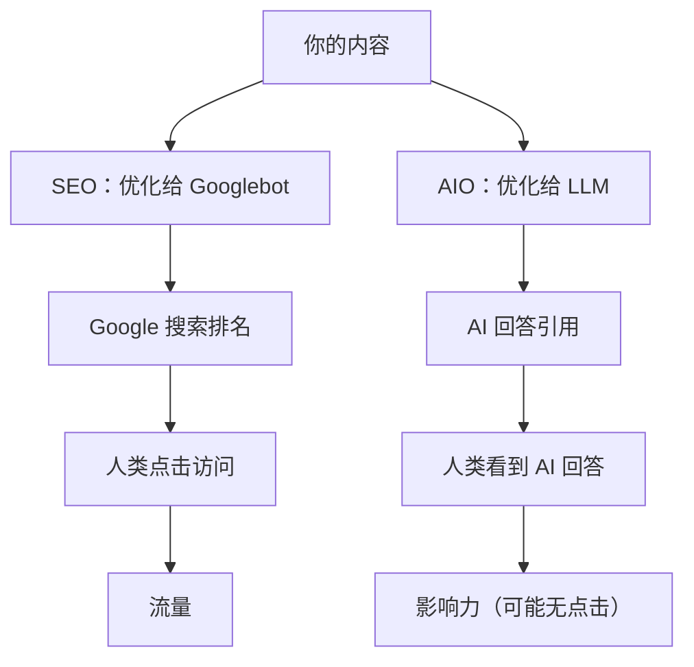
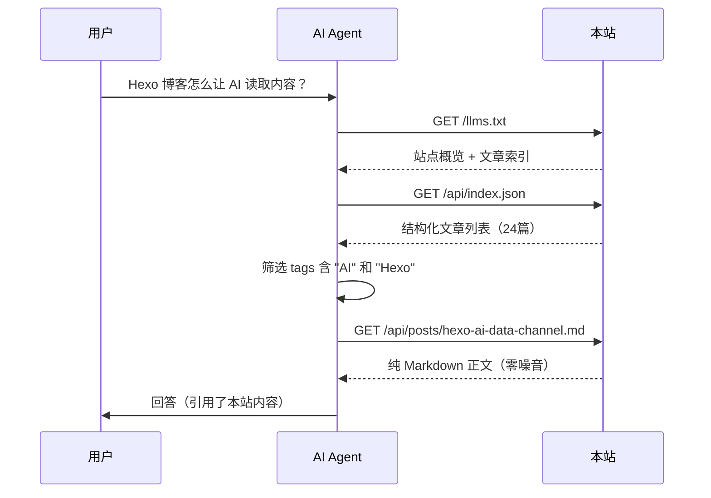

# 分类：信息获取

共 5 篇文章

---

# AIO：AI 时代的 SEO，从搜索排名到 AI 引用
Date: 2026-06-26 | Tags: llms.txt, 信息获取, AIO, SEO | URL: https://bsheepcoder.github.io/2026/06/26/信息获取-aio-ai-seo/

## 搜索正在变天

2024 年开始，一个不可逆的趋势：**用户不再搜索，而是直接问 AI**。

传统搜索流程：

```
用户 → Google 搜索 → 10 条蓝色链接 → 点开网站 → 自己找答案
```

AI 时代的新流程：

```
用户 → 问 AI（ChatGPT/Claude/Gemini/Perplexity）→ AI 直接回答
```

区别在于：用户**不再访问你的网站**。AI 代替用户阅读、筛选、总结，直接给出答案。如果你的内容被 AI 引用了，用户看到的是 AI 的回答——不会点开你的链接。

这意味着：**点击率在下降，但"被引用率"成了新的流量指标**。

| 指标 | 传统 SEO 时代 | AI 时代 |
|------|-------------|---------|
| 核心指标 | 搜索排名（SERP position） | AI 引用率（citation rate） |
| 用户行为 | 搜索 → 点击 → 阅读 | 提问 → AI 回答（可能不点击） |
| 内容消费 | 用户主动阅读 | AI 代理读取 |
| 优化对象 | Googlebot 爬虫 | LLM / AI Agent |
| 内容格式 | HTML（含导航/广告/侧边栏） | 纯文本/Markdown（零噪音） |

## AIO 是什么

**AIO（AI Optimization，AI 优化）** 是让内容被 AI 更容易发现、理解、引用的优化策略。它不是 SEO 的替代品，而是 SEO 的延伸——**SEO 优化给搜索引擎看，AIO 优化给 AI 看**。

行业里也有人叫它 **GEO（Generative Engine Optimization，生成式引擎优化）**，但本质是同一件事：**让你的内容出现在 AI 的回答里**。

### AIO 与 SEO 的关系



两者不矛盾——**做好 SEO 的同时做好 AIO，双通道并行**。但策略不同：

| 维度 | SEO | AIO |
|------|-----|-----|
| 优化对象 | Googlebot / Bingbot | GPT / Claude / Gemini / Perplexity |
| 内容格式 | HTML + meta 标签 | Markdown / JSON / 纯文本 |
| 关键因素 | 关键词密度、外链、页面速度 | 内容质量、结构化程度、可引用性 |
| 排名信号 | PageRank、外链数量 | AI 训练数据覆盖 + 实时检索 |
| 新增手段 | sitemap.xml、robots.txt | llms.txt、结构化 JSON 端点 |
| 测量方式 | Search Console 点击/展示 | AI 引用监测（新兴领域） |

## 为什么 llms.txt 是 AIO 的基础设施

[llms.txt](https://llmstxt.org) 由 Jeremy Howard（fast.ai 创始人）于 2024 年 9 月提出。它的核心洞察是：

> **AI 读取 HTML 太低效了。与其让 AI 解析网页，不如直接给它一个 Markdown 文件。**

llms.txt 的作用类似 sitemap.xml 之于搜索引擎——但服务对象是 LLM：

| 标准 | 服务对象 | 位置 | 格式 | 用途 |
|------|---------|------|------|------|
| robots.txt | 爬虫 | /robots.txt | TXT | 告诉爬虫能抓什么 |
| sitemap.xml | 搜索引擎 | /sitemap.xml | XML | 列出所有页面 URL |
| llms.txt | LLM/AI | /llms.txt | Markdown | 提供站点概览 + 内容索引 |

### llms.txt 的 AIO 价值

1. **零噪音**：AI 直接读 Markdown，不需要解析 HTML、剥离导航栏和广告
2. **结构化索引**：AI 一次请求就能获得站点全部内容概览，减少多轮 fetch
3. **标准化的发现机制**：像 sitemap.xml 一样，AI 知道去 `/llms.txt` 找入口
4. **社区生态**：VitePress、Docusaurus、Drupal 等已内置支持

## 本站实践：从 SEO 到 AIO 的完整路径

本站是一个完整的 AIO 实践案例。以下是实施路径：

### 第一步：基础 SEO（已有）

```yaml
# _config.yml
sitemap:
  path: sitemap.xml
pretty_urls:
  trailing_index: false  # canonical 与 sitemap 一致
```

```text
# robots.txt
User-agent: *
Allow: /
Disallow: /api/
Sitemap: https://bsheepcoder.github.io/sitemap.xml
```

这是传统 SEO 基础——Googlebot 能正确抓取和索引 HTML 页面。

### 第二步：llms.txt（AIO 起点）

```
# Q's blog

> Bsheepcoder 的技术博客，记录 AI、编程、计算机科学的学习笔记

## 文章索引

- [Hexo AI 数据通道实现](/api/posts/hexo-ai-data-channel.md): 构建...
- [什么是好的提示词](/api/posts/ai-prompt-engineering.md): 从 Token...
...
```

AI 读 `/llms.txt` 一次，就能知道这个站点有什么内容、每篇文章在哪里。等价于给 AI 一份"目录"。

### 第三步：PDC 扩展端点（AIO 深化）

llms.txt 是入口，但 AI 需要更结构化的数据。本站基于 llms.txt 标准扩展了 PDC 端点：

| 端点 | AIO 价值 |
|------|---------|
| `/api/index.json` | 结构化文章列表（含 tags/categories/description），AI 可精确筛选 |
| `/api/posts/<slug>.md` | 单篇纯 Markdown，零噪音，AI 直接消费 |
| `/api/categories/<slug>.json` | 按分类聚合，AI 可按主题批量获取 |
| `/llms-full.txt` | 全站全文合并，小站点一次获取 |
| `/api/adopters.json` | 采用者列表，AI 可发现整个 llms.txt 网络 |

### AI 检索流程（真实场景）

当用户问 AI："Hexo 博客怎么让 AI 读取文章内容？"



整个流程：**3 次 HTTP 请求，零 HTML 解析，零噪音**。这就是 AIO 的效果——AI 用最低成本获取你的内容，并引用在回答中。

## AIO 的 5 个实践原则

### 1. 内容要"可引用"

SEO 时代优化关键词密度。AIO 时代优化**可引用性**——AI 更倾向于引用结构清晰、论点明确、有数据支撑的内容。

```markdown
# 差：模糊、主观、不可引用
Hexo 的 AI 数据通道挺好的，大家可以试试。

# 好：具体、可验证、可引用
本站通过 scripts/ai-api.js 在 hexo generate 时自动生成 8 个静态端点，
包括 /llms.txt（AI 入口）、/api/index.json（结构化索引）、
/api/posts/<slug>.md（单篇纯 Markdown）。零运行时开销。
```

### 2. 给 AI 一个干净的入口

HTML 页面有导航栏、侧边栏、广告、字数统计——对 AI 来说全是噪音。`/llms.txt` 提供一个零噪音入口，AI 一次请求就能理解站点。

### 3. 结构化 > 纯文本

`/api/index.json` 比 `/llms.txt` 更高效——AI 可以按 tags、categories 精确筛选，不需要读完全文再判断是否相关。

```json
{
  "title": "什么是好的提示词",
  "url": "/2026/06/18/ai-prompt-engineering/",
  "tags": ["AI", "提示词工程"],
  "categories": ["技术", "人工智能"],
  "description": "从 Token 分词、注意力机制出发..."
}
```

AI 拿到这个 JSON 就能决定是否需要读全文，省 token、省时间。

### 4. 加密内容也要"声明存在"

加密文章的 AI 通道返回 `encrypted: true` + 空 content。AI 知道文章存在，但不泄露正文。这比直接 404 好——AI 能在回答中说"该站点有一篇关于 X 的加密文章"，而不是完全不知道。

### 5. 互链即发现

`/api/adopters.json` 列出所有 llms.txt 采用者。AI 访问任何一个站点，都能发现整个网络的所有成员。这是**网络效应**——成员越多，每个成员被 AI 发现的概率越高。

## AIO vs SEO：不是替代，是叠加

| 场景 | 只做 SEO | 只做 AIO | SEO + AIO |
|------|---------|---------|-----------|
| Google 搜索 | ✅ 有排名 | ❌ 无排名 | ✅ 有排名 |
| AI 回答引用 | ❌ AI 需解析 HTML | ✅ AI 读干净 Markdown | ✅ AI 读干净 Markdown |
| 用户搜索后点击 | ✅ 有点击 | ❌ 可能无点击 | ✅ 有点击 |
| 用户问 AI 后看到 | ❌ 可能不被引用 | ✅ 被引用 | ✅ 被引用 |

**结论**：SEO 和 AIO 不矛盾。SEO 让人类通过搜索引擎找到你，AIO 让 AI 在回答中引用你。两者叠加 = 最大曝光。

## AIO 的测量难题

SEO 有 Google Search Console——你知道每个关键词的展示次数、点击率、排名位置。

AIO 目前**没有标准工具**。你不知道 AI 是否引用了你的内容、引用了多少次、在什么问题上引用的。这是 AIO 最大的未解问题。

**可行的临时方案**：

1. **手动测试**：定期问 ChatGPT/Claude/Gemini 你的领域问题，看回答里是否出现你的内容
2. **API 端点监控**：如果用 Cloudflare Workers 代理 `/llms.txt` 和 `/api/*`，可以统计 AI Agent 的 User-Agent 访问
3. **AI Citation Audit**：Neil Patel 等工具商正在开发"AI 引用审计"工具，可以监测品牌在 AI 回答中的出现频率

## 未来展望

### 短期（6-12 个月）

- llms.txt 被更多 CMS 和文档站采用（VitePress/Docusaurus 已支持）
- Google AI Overviews / Perplexity / ChatGPT Search 开始主动读取 llms.txt
- 出现第一批 AIO 分析工具

### 中期（1-2 年）

- llms.txt 成为网站标配（类似 robots.txt 和 sitemap.xml）
- AI 搜索引擎将"是否提供 llms.txt"作为内容质量信号
- AIO 从"可选优化"变为"必做项"

### 长期（2-3 年）

- AI Agent 直接通过 llms.txt + JSON API 获取内容，绕过搜索引擎
- "AI 引用率"取代"搜索排名"成为内容价值的核心指标
- 内容创作者优化对象从 Googlebot 变为 AI Agent

## 本站的 AIO 实施清单

| 项目 | 状态 | 说明 |
|------|------|------|
| sitemap.xml | ✅ | 传统 SEO 基础 |
| robots.txt | ✅ | 允许爬取，禁止 /api/ |
| Google Search Console | ✅ | 已提交 sitemap |
| /llms.txt | ✅ | AI 入口，站点概览 + 文章索引 |
| /api/index.json | ✅ | 结构化文章列表 |
| /api/posts/*.md | ✅ | 单篇纯 Markdown |
| /api/categories/*.json | ✅ | 分类聚合 |
| /llms-full.txt | ✅ | 全文合并 |
| /api/adopters.json | ✅ | 采用者网络 |
| AI 引用监测 | ❌ | 待 AIO 工具成熟后接入 |
| 提交 llmstxt.site 目录 | ❌ | 待提交 |

## 总结

| 维度 | SEO 时代 | AIO 时代 |
|------|---------|---------|
| 用户行为 | 搜索 → 点击 → 阅读 | 提问 → AI 回答 |
| 优化对象 | Googlebot | LLM / AI Agent |
| 内容格式 | HTML | Markdown / JSON |
| 发现机制 | sitemap.xml | llms.txt |
| 核心指标 | 搜索排名 + 点击率 | AI 引用率 |
| 新标准 | robots.txt + sitemap.xml | + llms.txt |

**AIO 的核心原则**：让 AI 用最低成本获取你的内容。llms.txt 提供入口，结构化 JSON 提供索引，纯 Markdown 提供正文。三条通道并行，AI 想怎么读就怎么读。

> **一句话**：SEO 让 Google 找到你，AIO 让 AI 引用你。在 AI 时代，两者缺一不可。

## 参考资料

- [llms.txt 官方规范](https://llmstxt.org) — Jeremy Howard 提出的 llms.txt 标准
- [AnswerDotAI/llms-txt](https://github.com/AnswerDotAI/llms-txt) — llms.txt GitHub 仓库
- [本站 PDC 规范](/pdc-protocol.md) — llms.txt 的 Hexo 增强实现
- [本站 /llms.txt](/llms.txt) — 实际运行的 llms.txt 文件
- [llmstxt.site](https://llmstxt.site) — llms.txt 站点目录


---

# NFT 与数字藏品：从疯狂到清醒的五年
Date: 2026-06-26 | Tags: 信息获取, NFT, 数字藏品 | URL: https://bsheepcoder.github.io/2026/06/26/信息获取-nft-2026-status/

## 一个周期结束了

2021 年 3 月，Beeple 的 NFT 作品《Everydays》以 6934 万美元拍卖成交，震动全球。同月，BAYC（无聊猿）以 0.08 ETH（约 250 美元）铸造发行。此后两年，NFT 成为加密世界最疯狂的财富叙事——全球 NFT 市值峰值约 400 亿美元，OpenSea 月交易量一度突破 50 亿美元，估值 133 亿美元。

五年后的 2026 年，这个周期已经走完。OpenSea 月交易量跌至 1.95 亿美元，跌幅 96%。BAYC 地板价从峰值超 150 ETH 跌至 2023 年 30 ETH 后持续下滑。国内 500 余家数字藏品平台倒闭至不足 100 家，iBox 流通市值从 100 亿元跌至 2.88 亿元，蒸发 97%。

但 NFT 并没有死。它从"投机 JPEG"褪变为"数字确权工具"，在博物馆文创、门票通行证、版权管理等场景中安静地活着。本文用真实数据复盘这五年。

## 国内：数字藏品的合规生存

### 鲸探——活下来的大厂平台

蚂蚁集团的鲸探是目前国内唯一活跃的头部大厂平台。截至 2025 年底，鲸探全网持有数字资产用户达 **1.38 亿**，应用注册用户 3600 万，合作文博机构 166 家，累计发行文物/非遗类藏品超 12000 款。2025 年四周年之际，鲸探藏品入藏国家版本馆。

鲸探的存活逻辑很清晰：**不开二级交易**。用蚂蚁链与至信链双重存证，严格执行无二级市场机制。藏品绑定线下权益——苏州博物馆吴王剑数字藏品绑定线下讲解和文创折扣，复购率达 30%；敦煌研究院数字供养人项目购买后获得修复壁画电子证书。这些是用例，不是炒作标的。

但鲸探也面临挑战。用户复购率从 2022 年的 35% 降至 2024 年的 8%，天花板已现。

### 幻核——腾讯的战略放弃

腾讯旗下的幻核于 **2022 年 8 月**宣布停止数字藏品发行。这不是监管逼停，而是腾讯主动撤退——判断这块业务 ROI 不高且合规风险大，不值得继续投入。用户可选择继续持有或退款。

腾讯的退出是中国数字藏品行业的分水岭。最大厂放弃意味着：纯平台模式的数字藏品生意，在不开二级交易的前提下，收入无法覆盖合规成本。

### iBox——炒作崩盘的标本

iBox（链盒）是反面教材。注册用户超 1000 万，流通市值峰值逼近 100 亿元（2022 年 5 月），到 2024 年 2 月跌至 2.88 亿元，蒸发超 97%。2023 年 3 月关闭寄售后，多地警方以涉嫌诈骗立案——广州花都区分局、成都新都区分局相继介入。10 余位玩家以信息网络买卖合同纠纷起诉，海南省第一中级人民法院审理。

iBox 创始团队与西安纸贵（2017 年 INK 币 ICO，被央行定性为非法集资）高度重合，公司从海南链盒更名为江苏南通链盒再迁至霍尔果斯链疆科技。这是一条完整的"发币 → 炒作 → 崩盘 → 维权"轨迹。

### 数藏中国——合规卡位的幸存者

数藏中国（海南数藏文化科技有限公司）至今仍在运营。它的存活靠三件事：

1. **国家网信办区块链信息服务备案**（2022 年 11 月，第十批）
2. **底层链为 BSN-DDC**（国家信息中心打造的 BSN 网络中的数字凭证层）
3. **不开二级交易**，仅限持有满期后转赠

BSN-DDC 是中国版的"合规 NFT 基础设施"——把区块链确权能力保留，但把公链的去中心化、匿名性、加密货币全部去掉，换成国家管控的联盟链 + 实名制 + 人民币计价 gas 费。截至 2026 年，BSN-DDC 官方存证系统 `e.bsnddc.com` 仍可访问。

### 行业洗牌数据

| 指标 | 峰值期 | 2024-2026 | 变化 |
|------|--------|-----------|------|
| 平台数量 | 500+ | 不足 100 | 缩减 80%+ |
| 用户留存率 | — | 不足 5% | — |
| iBox 流通市值 | 100 亿元 | 2.88 亿元 | -97% |
| 据行业媒体报道，2026 年市场规模 | — | 约 342 亿元 | 发行口径，非交易口径 |

> 注：342 亿元数据来源为行业媒体报道，非权威机构报告，可能反映的是发行规模而非二级交易量，口径与 DappRadar 的交易量数据不同。

## 海外：投机退潮后的废墟

### OpenSea 的衰落

| 时间节点 | 数据 |
|---------|------|
| 2022 年初峰值月交易量 | 50 亿美元 |
| 2025 年 1 月月交易量 | 1.95 亿美元 |
| 跌幅 | **96%** |
| 估值变化 | 133 亿 → 约 15 亿美元 |
| 市场份额 | 曾 95% → 29% |

2025 年 2 月 13 日，OpenSea 发布 OS2 平台和 SEA 代币，试图通过发币自救。发币后单日交易量飙升至约 2980 万美元，占比 70.6%——但这种激励驱动的流量能否持续，仍是问号。

### 平台格局

| 平台 | 年交易量（截至 2025 年 2 月） | 市场份额 |
|------|------|---------|
| Blur | 38 亿美元 | ~36% |
| Magic Eden | 32 亿美元 | ~30% |
| OpenSea | 12 亿美元 | <12% |

Blur 靠代币激励抢占了大量份额，Magic Eden 凭借 Solana 低成本交易保持活跃。但整个市场已从"三足鼎立"变成"无人盈利"——Bybit、Kraken、X2Y2 等平台在 2025 年直接关停了 NFT 市场，X2Y2 在关停声明中直言："NFT 交易量自巅峰缩减 90%"。

### PFP NFT 的价值归零

BAYC 地板价从 2021 年铸造价 0.08 ETH 到 2022 年峰值超 150 ETH，再到 2023 年 7 月跌至 30 ETH（约 5.7 万美元），此后持续下滑。2025 年行业媒体报道"大量蓝筹 NFT 地板价跌到惨不忍睹"，仅 Pudgy Penguins 因有空投预期维持了一定热度。

PFP NFT 的悲剧在于其经济结构：供给端零边际成本无限发行，需求端买入动机是"有人接盘"而非"我要使用"，价格纯靠共识支撑——典型的庞氏结构，后来者供养先行者，泡沫必然破裂。

## 2026 年监管定调

### 八部委 42 号文

2026 年 2 月，央行、发改委、工信部、公安部、市场监管总局、金融监管总局、证监会、外汇局等 **8 部门联合发布《关于进一步防范和处置虚拟货币等相关风险的通知》（银发〔2026〕42 号）**，经国务院同意，正式废止 2021 年的 924 公告。

42 号文首次将 RWA（真实世界资产上链）和稳定币纳入核心监管范围，明确了法律定性：

| 场景 | 定性 |
|------|------|
| RWA 项目在境内、服务商在境内 | 非法 |
| RWA 项目在境内、服务商在境外 | 非法 |
| 同类性质 NFT 项目，涉嫌非法发售代币票券 | 非法 |
| RWA 项目在境外、涉嫌境内非法集资 | 非法 |
| 经证监会备案的境外资产支持证券代币 | **可合法**（需严格备案程序） |

此外，证监会 2026 年第 1 号公告发布了《关于境内资产境外发行资产支持证券代币的监管指引》，为合规 RWA 留了一条极窄的口子。

### 七家协会风险提示

在 42 号文之前，2025 年 12 月 5 日，中国互联网金融协会、中国银行业协会等 **7 家行业协会联合发布风险提示**，明确所有境内 RWA 活动均属非法。阿里和京东在 2025 年 10 月即提前感知政策风向，退出 RWA 业务。

值得注意的是：七家协会文件是行业自律声明，非法律规范性文件；42 号文才是真正的法律武器。两者的叠加效应使国内 RWA 赛道基本关闭。

### 执法案例

2025 年 4 月，湖北远安数字藏品诈骗案宣判——8 人获刑 1.5 至 8 年，涉案 8000+ 投资人，涉案金额 1000 万余元。iBox 多地警方立案。这些案例标志着执法已从"专项整治"转入"常态化打击"。

## 什么活了下来

NFT 的价值不在于 JPEG，而在于**数字确权**。投机泡沫退去后，真正存活的是有实际效用的用例：

| 场景 | 案例 | 效果 |
|------|------|------|
| 博物馆文创 | 苏州博物馆吴王剑 | 绑定线下讲解+文创折扣，复购率 30% |
| 文化遗产 | 敦煌研究院数字供养人 | 购买获得修复壁画电子证书 |
| 景区门票 | 泰山景区数字藏品 | 扫码呈现历史背景+书法解读 |
| 文博元宇宙 | 300+ 博物馆合作平台 | 62% 用户参与线下活动 |
| 政策支持 | 北京通州区 | 鼓励数字孪生景区、数字藏品 |

这些案例的共同特征：NFT 不是投资品，而是**权益凭证**——持有它获得的不是"涨价预期"，而是线下服务、文化体验或会员权益。这才是数字确权技术的真实价值。

## 趋势观察

用三维框架复盘 NFT 领域的窗口期：

| 维度 | 评估 | 依据 |
|------|------|------|
| **立法空白度** | 低 | 42 号文已覆盖虚拟货币/RWA/稳定币，数字藏品有完整备案体系 |
| **执法可行性** | 低盲区 | 大数据风控已覆盖，多地警方立案常态化 |
| **商业变现能力（个人）** | 弱 | 无 IP 储备和流量优势，个人发行无商业回报 |
| **综合判断** | 窗口已关闭 | 投机窗口 2022 年关闭，合规窗口 2026 年定型 |

### 窗口期时间线

```
2021  爆发期（空白窗口打开）→ 法律完全空白
2022  国内监管介入 → 三协会倡议，幻核关停
2023  崩塌期 → 交易量暴跌 87%，iBox 关闭寄售
2024  清退期 → 平台 500→100，用户留存不足 5%
2025  RWA 最后挣扎 → 七家协会定性非法
2026  定型期 → 八部委 42 号文，窗口完全关闭
```

从爆发到关闭，NFT 的窗口期约 **5 年**，比加密货币交易所（4 年）和直播带货（3 年）都长。原因是 NFT 的法律定性比加密货币更模糊——它到底是"数字商品"还是"代币"，各国花了很长时间才厘清。

## 个人可行路径

在当前合规框架下，个人的选择非常有限但并非为零：

### 作为收藏者

在鲸探等合规平台购买数字藏品，合法但不可二级交易。本质和买邮票、球鞋一样——纯爱好，不要抱投资心态。如果想展示，可以在个人博客/网站嵌入 NFT 图片。

### 作为创作者

在没有 IP 储备和粉丝基础的情况下，发行数字藏品基本没有商业回报。鲸探 2025 年开放了个人创作者"数字艺术展"入口，戴敦邦作品 3 小时预订超 4000 份——但这是大师级 IP 的号召力，普通人难以复制。

### 作为开发者

这是个人最有可能切入的方向。学 BSN-DDC 开发，帮博物馆、文创品牌、景区做数字藏品发行技术服务，收取技术服务费。这本质是 to B 技术服务——卖铲子，不淘金。

### 不建议的方向

| 方向 | 原因 |
|------|------|
| 海外平台炒 NFT | 翻墙 + 加密货币，法律风险高，42 号文已定性 |
| 国内平台二级交易 | 合规平台不开二级交易，开二级的均为违规 |
| RWA 项目 | 七家协会 + 八部委双重定性非法 |
| 自建 NFT 交易平台 | 需区块链信息服务备案 + 无牌交易风险 |

## 尾声

NFT 这五年，本质上是一场关于"技术价值"与"投机泡沫"的社会实验。技术本身有真实价值——数字世界确实需要确权机制，游戏道具归玩家所有、创作者绕过平台分账、数字艺术品有可验证的"原作"——这些需求是真实的。

但 B 圈把 NFT 扭曲成了暴富工具。无限的 JPEG 发行 + 纯共识定价 + 庞氏式接盘逻辑，制造了一场注定破裂的泡沫。泡沫破裂后，技术信用被透支，真正有用的应用反而被污名化。

2026 年的中国，数字确权技术以"数字藏品"的形态在国家管控的联盟链上安静运行。没有 2021 年那种疯狂的财富效应，但博物馆的吴王剑、敦煌的壁画、泰山的日出，以数字凭证的形式被 1.38 亿人持有——这或许才是 NFT 该有的样子。

> 本文数据来源：新华网、南方周末、腾讯新闻/PANews、CSDN、人人都是产品经理、搜狐等公开报道。部分数据标注为"行业媒体报道"的，因非权威机构报告，仅供参考。


---

# 免费公开 API 收集：国内可直连的数据源索引
Date: 2026-06-25 | Tags: Agent, RAG, API, 信息获取, 数据源 | URL: https://bsheepcoder.github.io/2026/06/25/信息获取-public-api-collection/

每条 API 经实测验证（2026-06-25），国内直连可用。不可用的一律不收。从 GitHub 仓库中直接拿接口，不只列仓库链接。

---

## 金融行情

| API | 请求示例 | 说明 |
|-----|---------|------|
| 腾讯财经 | `https://qt.gtimg.cn/q=hf_GC` | 无需 Key，浏览器端可用，支持批量 `q=hf_GC,hf_SI` |
| 新浪财经 | `https://hq.sinajs.cn/list=hf_GC` | 需 Referer 头，仅服务端可用 |
| TwelveData | `https://api.twelvedata.com/price?symbol=XAU/USD&apikey=KEY` | 免费注册 800 次/天，有 [ClawHub 技能](https://github.com/twelvedata/twelvedata-clawhub) |
| SEC EDGAR | `https://data.sec.gov/submissions/CIK0000320193.json` | 美国上市公司年报/财报，无需 Key |
| Econdb | `https://www.econdb.com/api/series/` | 全球宏观经济数据，需免费注册 |

**腾讯品种代码**：`hf_GC` 黄金 · `hf_SI` 白银 · `hf_CL` 原油 · `sh000001` 上证 · `sz399001` 深成 · `hkHSI` 恒生

**腾讯返回字段**（逗号分隔）：`[0]当前价 [1]涨跌额 [4]最高 [5]最低 [6]时间 [7]开盘 [8]昨结 [12]日期 [13]品名`

> 以上来自 [public-apis/public-apis](https://github.com/public-apis/public-apis) ★444K Finance 分类

---

## 天气

| API | 请求示例 | 说明 |
|-----|---------|------|
| Open-Meteo | `https://api.open-meteo.com/v1/forecast?latitude=39.9&longitude=116.4&current=temperature_2m` | 全球天气预报，无需 Key，CORS ✅ |
| wttr.in | `https://wttr.in/Beijing?format=j1` | 终端天气，支持 JSON，无需 Key，CORS ✅ |
| US Weather | `https://api.weather.gov/points/39.7,-104.9` | 美国国家气象局，无需 Key，CORS ✅ |

> 以上来自 [public-apis/public-apis](https://github.com/public-apis/public-apis) ★444K Weather 分类

---

## 地理与 IP 定位

| API | 请求示例 | 说明 |
|-----|---------|------|
| REST Countries | `https://restcountries.com/v3.1/all?fields=name,capital` | 国家信息（首都/货币/语言/国旗），无需 Key，CORS ✅ |
| ip-api.com | `http://ip-api.com/json/1.1.1.1` | IP 地理定位，无需 Key，仅 HTTP |
| GeoJS | `https://get.geojs.io/v1/ip/geo.json` | IP 地理定位，无需 Key，CORS ✅ |
| Nominatim | `https://nominatim.openstreetmap.org/search?q=beijing&format=json&limit=1` | OpenStreetMap 地理编码/逆地理编码，无需 Key |
| OnWater | `https://api.onwater.io/api/v1/results/40.7,-74.0` | 判断经纬度是否在水上，无需 Key |
| Open Topo Data | `https://api.opentopodata.org/v1/srtm90m?locations=39.9,116.4` | 海拔/海洋深度查询，无需 Key |

> 以上来自 [public-apis/public-apis](https://github.com/public-apis/public-apis) ★444K Geocoding 分类

---

## 学术与医疗

| API | 请求示例 | 说明 |
|-----|---------|------|
| OpenAlex | `https://api.openalex.org/works?search=brain+rehabilitation` | 2.5 亿篇论文，无需 Key，RAG 采集首选 |
| NCBI PubMed | `https://eutils.ncbi.nlm.nih.gov/entrez/eutils/esearch.fcgi?db=pubmed&term=brain+injury` | 生物医学文献权威，无 Key 3 次/秒 |
| Wikidata | `https://www.wikidata.org/w/api.php?action=wbgetentities&ids=Q42&format=json` | 知识图谱，支持 SPARQL，无需 Key |
| FDA openfda | `https://api.fda.gov/drug/event.json?limit=5` | 药品不良事件/标签/召回，无 Key 1000 次/天 |
| Open Disease | `https://disease.sh/v3/covid-19/all` | COVID-19 和流感实时数据，无需 Key |
| Clinical Trials | `https://trials.starfile.org/api` | 临床试验数据，按疾病/赞助者索引，无需 Key |

> 以上来自 [public-apis/public-apis](https://github.com/public-apis/public-apis) ★444K Health 分类

---

## 航天

| API | 请求示例 | 说明 |
|-----|---------|------|
| NASA | `https://api.nasa.gov/planetary/apod?api_key=DEMO_KEY` | 天文一图/火星照片/小行星，DEMO_KEY 可用 |
| Spaceflight News | `https://api.spaceflightnewsapi.net/v4/articles/?limit=5` | 全球航天新闻聚合，无需 Key |

---

## 新闻

| API | 请求示例 | 说明 |
|-----|---------|------|
| Noozra | `https://noozra.com/api` | 200+ RSS 源新闻标题，无需 Key，CORS ✅ |

> 以上来自 [public-apis/public-apis](https://github.com/public-apis/public-apis) ★444K News 分类

---

## 开放数据

| API | 请求示例 | 说明 |
|-----|---------|------|
| Wikipedia | `https://en.wikipedia.org/w/api.php?action=query&list=search&srsearch=brain&format=json` | 维基百科全文搜索，无需 Key |
| Archive.org | `https://archive.org/wayback/available?url=example.com` | 互联网档案馆 Wayback Machine，无需 Key |
| Nobel Prize | `https://api.nobelprize.org/v1/prize.json?limit=1` | 诺贝尔奖数据，无需 Key |
| Universities | `https://raw.githubusercontent.com/Hipo/university-domains-list/master/world_universities_and_domains.json` | 全球大学域名列表，无需 Key |
| Statistics World | `https://statisticsoftheworld.com/api/v1/countries?limit=1` | 218 国经济数据（GDP/人口/通胀），无需 Key |
| Microlink.io | `https://api.microlink.io/?url=https://example.com` | 从任意 URL 提取结构化数据，无需 Key，CORS ✅ |

> 以上来自 [public-apis/public-apis](https://github.com/public-apis/public-apis) ★444K Open Data 分类

---

## 测试数据

| API | 请求示例 | 说明 |
|-----|---------|------|
| JSONPlaceholder | `https://jsonplaceholder.typicode.com/posts/1` | 假 REST API（posts/users/comments/todos），无需 Key |
| DummyJSON | `https://dummyjson.com/products/1` | 假数据（产品/用户/帖子/评论），无需 Key，CORS ✅ |
| RandomUser | `https://randomuser.me/api/?results=1` | 随机用户数据生成，无需 Key |
| RoboHash | `https://robohash.org/test.png` | 随机头像生成，无需 Key |
| Yes No | `https://yesno.wtf/api` | 随机返回 yes/no/maybe（含 GIF），无需 Key |

> 以上来自 [public-apis/public-apis](https://github.com/public-apis/public-apis) ★444K Test Data 分类

---

## 机器学习

| API | 请求示例 | 说明 |
|-----|---------|------|
| Jina AI | `https://api.jina.ai/v1/embeddings` | 免费 Embedding/Reranking API，需 Key |

> 以上来自 [public-apis/public-apis](https://github.com/public-apis/public-apis) ★444K Machine Learning 分类

---

## 免费 LLM API

从 [free-llm-api-resources](https://github.com/cheahjs/free-llm-api-resources) ★24K 和 [awesome-free-llm-apis](https://github.com/mnfst/awesome-free-llm-apis) ★5K 两个仓库直接提取，经国内可达性验证。

所有 API 均兼容 OpenAI SDK 格式，切换 `base_url` 即可。

### 无需注册

| API | Base URL | 免费模型 | 限制 |
|-----|----------|---------|------|
| LLM7.io | `https://api.llm7.io/v1` | DeepSeek-R1, DeepSeek-V3, GPT-4o-mini, Gemini 2.5 Flash Lite | 30 RPM（有 Token 120 RPM） |

### 注册即用（免费额度）

| API | Base URL | 模型 | 免费额度 |
|-----|----------|------|---------|
| OpenRouter | `https://openrouter.ai/api/v1` | Llama 3.3 70B, Qwen3 Coder, GPT-OSS 120B 等 20+ 免费模型 | 50 req/天（充 $10 终身提至 1000/天） |
| GitHub Models | `https://models.github.ai/inference` | GPT-5, GPT-4.1, o4-mini, DeepSeek-R1, Llama 4 等 45+ 模型 | 10-15 RPM, 50-150 req/天 |
| Cloudflare Workers AI | `https://api.cloudflare.com/client/v4/accounts/{id}/ai/run` | Llama 3.3 70B, GPT-OSS 120B, GLM-4.7-Flash, DeepSeek R1 等 50+ 模型 | 10K neurons/天 |
| Groq | `https://api.groq.com/openai/v1` | Llama 3.3 70B, Llama 4 Scout, Qwen3-32B, GPT-OSS 120B | 30 RPM, 1000 req/天 |
| Cerebras | `https://api.cerebras.ai/v1` | GPT-OSS 120B, GLM-4.7（超快推理 ~2600 tok/s） | 30 RPM, 14,400 req/天, 1M tokens/天 |
| Cohere | `https://api.cohere.com/v2` | Command A+ (218B), Command A, Command R | 20 RPM, 1000 calls/月 |
| 智谱 AI (Z AI) | `https://open.bigmodel.cn/api/paas/v4` | GLM-4.7-Flash (200K context), GLM-4.6V-Flash (图文) | 永久免费，1 并发 |
| NVIDIA NIM | `https://integrate.api.nvidia.com/v1` | 各种开源模型 | 40 RPM |
| Kilo Code | `https://api.kilo.ai/api/gateway` | Grok Code Fast, Minimax M2.5, Nemotron 3 Super 120B | ~200 req/时 |

### 有试用额度

| API | 信用额度 | 模型 |
|-----|---------|------|
| Fireworks | $1 | 各种开源模型 |
| Baseten | $30 | 按计算时间计费 |
| Nebius | $1 | 各种开源模型 |
| Novita | $0.5 (1 年) | 各种开源模型 |
| AI21 | $10 (3 个月) | Jamba 系列 |
| Modal | $5/月 | 按计算时间计费 |
| SambaNova Cloud | $5 (3 个月) | DeepSeek V3.1, Llama 3.3 70B |
| Scaleway | 1M tokens | Llama 3.3 70B, Qwen3 Coder, Mistral 等 |

> 不可用：Google AI Studio（超时）· Mistral（超时）· HuggingFace（超时）

---

## 国产 LLM API

均兼容 OpenAI API 格式。

| API | 域名 | 免费 | 模型 |
|-----|------|------|------|
| 智谱 AI | `open.bigmodel.cn` | GLM-4-Flash 永久免费 | GLM-4 / GLM-4-Flash |
| DeepSeek | `api.deepseek.com` | 新用户赠 Token | DeepSeek-V3 / R1 |
| Moonshot | `api.moonshot.cn` | 新用户赠 Token | Moonshot-v1（128K） |
| 通义千问 | `dashscope.aliyuncs.com` | 新用户赠 Token | Qwen-Plus / Qwen-Turbo |

---

## AI Agent 技能生态

- [ClawHub](https://github.com/openclaw/clawhub) ★9K — OpenClaw 官方技能注册表，[clawhub.ai](https://clawhub.ai)，CLI：`clawhub install/search`
- [Cow Skill Hub](https://github.com/zhayujie/cow-skill-hub) — 跨平台技能市场，[skills.cowagent.ai](https://skills.cowagent.ai)
- [Skills Manager](https://github.com/cchao123/skills-manager) ★135 — 桌面端跨 Agent 技能管理器（Claude Code/Cursor/OpenClaw/OpenCode 等）
- [OpenClaw Medical Skills](https://github.com/FreedomIntelligence/OpenClaw-Medical-Skills) ★2.7K — 最大开源医疗 AI 技能库
- [MCP Servers](https://github.com/modelcontextprotocol/servers) ★88K — MCP 官方服务器仓库，开箱即用

---

## GitHub 公开 API 汇总仓库

以下仓库持续更新，更多分类的 API 直接去看。

### 综合

- [public-apis/public-apis](https://github.com/public-apis/public-apis) ★444K — 51 个分类 1400+ API，标注 Key/HTTPS/CORS（本文 50+ 接口取自此处）
- [n0shake/Public-APIs](https://github.com/n0shake/Public-APIs) ★23K
- [public-api-lists/public-api-lists](https://github.com/public-api-lists/public-api-lists) ★15K — 48 分类，提供可搜索 JSON API
- [TonnyL/Awesome_APIs](https://github.com/TonnyL/Awesome_APIs) ★13K
- [255kb/stack-on-a-budget](https://github.com/255kb/stack-on-a-budget) ★12K — 免费层服务汇总
- [cporter202/API-mega-list](https://github.com/cporter202/API-mega-list) ★7K
- [APIs-guru/graphql-apis](https://github.com/APIs-guru/graphql-apis) ★5K — GraphQL API 列表
- [wdhdev/free-for-life](https://github.com/wdhdev/free-for-life) ★2K — 终身免费资源

### LLM 专项

- [cheahjs/free-llm-api-resources](https://github.com/cheahjs/free-llm-api-resources) ★24K — 免费 LLM API 资源（本文 LLM 接口取自此处）
- [mnfst/awesome-free-llm-apis](https://github.com/mnfst/awesome-free-llm-apis) ★5K — 永久免费 LLM API（本文 LLM 接口取自此处）
- [deepseek-ai/awesome-deepseek-integration](https://github.com/deepseek-ai/awesome-deepseek-integration) ★38K

### 金融 / 医疗

- [theOGognf/finagg](https://github.com/theOGognf/finagg) ★539 — Python 金融 API 聚合
- [quantmind/awesome-open-finance](https://github.com/quantmind/awesome-open-finance) ★164
- [FDA/openfda](https://github.com/FDA/openfda) ★682

---

## 避坑

- **User-Agent**：调用学术 API 带上 `User-Agent: MyProject/1.0 (mailto:you@email.com)`，避免被限流封禁
- **Referer**：新浪财经需 Referer，浏览器端不可用，改用腾讯
- **限流**：PubMed 无 Key 3 次/秒 · NASA DEMO_KEY 30 次/时 · FDA 无 Key 1000 次/天 — 注册免费 Key 均可提升
- **RAG 管道**：OpenAlex 抓取 → 智谱 GLM-4-Flash（永久免费）或 LLM7.io（无需注册）清洗 → 本地 Embedding → 静态 JSON / 向量库

---

## 验证

**最近验证日期**：2026-06-25 | 全部 ✅ 直连可用

**不可用（已移除）**：TradingView（超时）· Yahoo Finance（403）· Binance（超时）· OKEx（DNS 不可达）· CoinGecko（超时）· CoinCap（DNS 不可达）· 网易财经（DNS 不可达）· Google Gemini（超时）· Mistral（超时）· HuggingFace（超时）· Launch Library 2（429）· Dicebear（410）

**重测脚本**：

```powershell
# 金融
Invoke-WebRequest "https://qt.gtimg.cn/q=hf_GC" -TimeoutSec 10
Invoke-WebRequest "https://data.sec.gov/submissions/CIK0000320193.json" -TimeoutSec 10 -Headers @{"User-Agent"="Mozilla/5.0"}

# 天气
Invoke-WebRequest "https://api.open-meteo.com/v1/forecast?latitude=39.9&longitude=116.4&current=temperature_2m" -TimeoutSec 10
Invoke-WebRequest "https://wttr.in/Beijing?format=j1" -TimeoutSec 10

# 地理与 IP 定位
Invoke-WebRequest "https://restcountries.com/v3.1/all?fields=name,capital" -TimeoutSec 10
Invoke-WebRequest "https://get.geojs.io/v1/ip/geo.json" -TimeoutSec 10
Invoke-WebRequest "https://nominatim.openstreetmap.org/search?q=beijing&format=json&limit=1" -TimeoutSec 10
Invoke-WebRequest "https://api.opentopodata.org/v1/srtm90m?locations=39.9,116.4" -TimeoutSec 10

# 学术医疗
Invoke-WebRequest "https://api.openalex.org/works?search=test&per-page=1" -TimeoutSec 10
Invoke-WebRequest "https://eutils.ncbi.nlm.nih.gov/entrez/eutils/esearch.fcgi?db=pubmed&term=test&retmax=1" -TimeoutSec 10
Invoke-WebRequest "https://api.fda.gov/drug/event.json?limit=1" -TimeoutSec 10
Invoke-WebRequest "https://disease.sh/v3/covid-19/all" -TimeoutSec 10

# 开放数据
Invoke-WebRequest "https://en.wikipedia.org/w/api.php?action=query&list=search&srsearch=brain&format=json" -TimeoutSec 10
Invoke-WebRequest "https://archive.org/wayback/available?url=example.com" -TimeoutSec 10
Invoke-WebRequest "https://api.nobelprize.org/v1/prize.json?limit=1" -TimeoutSec 10
Invoke-WebRequest "https://api.microlink.io/?url=https://example.com" -TimeoutSec 10

# 测试数据
Invoke-WebRequest "https://jsonplaceholder.typicode.com/posts/1" -TimeoutSec 10
Invoke-WebRequest "https://dummyjson.com/products/1" -TimeoutSec 10
Invoke-WebRequest "https://randomuser.me/api/?results=1" -TimeoutSec 10

# LLM（返回 401/403 = 域名可达，需 Key）
Invoke-WebRequest "https://api.llm7.io/v1/models" -TimeoutSec 10
Invoke-WebRequest "https://openrouter.ai/api/v1/models" -TimeoutSec 10
Invoke-WebRequest "https://models.github.ai/inference/models" -TimeoutSec 10
Invoke-WebRequest "https://api.groq.com/openai/v1/models" -TimeoutSec 10
```

---

## 更新日志

| 日期 | 变更 |
|------|------|
| 2026-06-25 | 初始版本，从 3 个 GitHub 仓库直接提取 API，验证 50+ 个接口，收录 50+ 个可用 API + 12 个免费 LLM 平台，覆盖 13 个分类 |


---

# RSS 日报 · 2026-06-18
Date: 2026-06-18 | Tags: 信息获取, RSS, 日报 | URL: https://bsheepcoder.github.io/2026/06/18/rss-daily-2026-06-18/

> **本期数据**：抓取 16 个源 · 筛选 20 条 · 覆盖 8 个领域
>
> 数据源：OpenAI · Google DeepMind · arXiv · Nature · ScienceDaily · New Scientist · Ars Technica · TechCrunch · GitHub · Stack Overflow · NPR · 阮一峰

---

## 🔥 头条

### 1. SpaceX 估值飙升至 2.6 万亿美元，短暂超过亚马逊

> **来源**：TechCrunch · **领域**：商业 📈

SpaceX 的估值自上周五股票开始交易以来增加了 1 万亿美元，在盘中短暂超过亚马逊。这标志着太空科技公司估值的历史性里程碑——一家从未盈利的火箭公司，市值已逼近全球前五。

**分析师解读**：SpaceX 的估值逻辑已脱离传统航天制造业，更像一家"太空基础设施平台"。Starlink 的经常性收入 + 可重复使用火箭的成本优势 + NASA 合同的现金流，构成了投资者眼中的飞轮效应。但 2.6 万亿的估值意味着市场已定价了至少十年的增长预期，任何发射失败或星链增速放缓都可能引发剧烈回调。

🔗 [阅读原文](https://techcrunch.com/2026/06/16/spacex-valuation-balloons-to-2-6t-briefly-passes-amazon/)

---

### 2. OpenAI 向 SEC 提交保密 S-1，IPO 进程正式启动

> **来源**：OpenAI Blog · **领域**：AI/商业 💰

OpenAI 确认已向美国证券交易委员会提交了保密版 S-1 注册声明。这是 IPO 进程的第一步，具体上市时间尚未确定。

**分析师解读**：保密提交意味着 OpenAI 可以在公开披露前与 SEC 多轮沟通财务细节。考虑到其年化收入已超百亿美元、估值传闻达万亿级别，这将是继 Meta 之后科技界最大的 IPO 之一。但 OpenAI 的治理结构（非营利董事会控制营利实体）将是 SEC 审查的焦点，也是投资者的最大不确定性。

🔗 [阅读原文](https://openai.com/index/openai-submits-confidential-s-1)

---

### 3. 全自主无人机首次杀死人类士兵

> **来源**：New Scientist · **领域**：军事/AI/伦理 ⚠️

乌克兰国防工业高级官员透露，两年前进行了一次测试：全自主无人机被设定为摧毁指定区域内任何目标，并造成了确认的人员伤亡。这是全自主武器系统首次在实战中导致人类死亡。

**分析师解读**：这条新闻的意义远超技术层面。它标志着"人在回路中"原则在实战中首次被突破——机器自主做出致命决策。国际人道法对此几乎没有先例可循。联合国关于致命自主武器系统（LAWS）的讨论已持续十年，但一直停留在道德声明阶段。这一事件可能成为推动国际立法的催化剂，也可能被其他国家视为先例而加速部署。

🔗 [阅读原文](https://www.newscientist.com/article/2529849-fully-autonomous-drones-have-killed-human-soldiers-for-the-first-time/)

---

## 🤖 AI 前沿

### 4. NVIDIA 开源 Nemotron 3 Ultra：550B 参数混合 Mamba-Transformer

> **来源**：arXiv (cs.CL) · **领域**：AI/学术 🔬

NVIDIA 发布 Nemotron 3 Ultra——550B 总参数、55B 活跃参数的 MoE 混合 Mamba-Attention 模型。预训练 20 万亿 token，支持 100 万 token 上下文，推理吞吐量比同级公开 LLM 高约 6 倍。已开源全部检查点和训练数据。

**分析师解读**：Mamba 架构的线性复杂度 + MoE 的稀疏激活 = 推理成本的大幅下降。NVIDIA 的算盘很清楚：卖 GPU 不够，还要做模型生态。开源 550B 模型是针对 Meta Llama 和 Google Gemma 的直接竞争——用"最强开源模型"的标签绑定开发者，反哺 GPU 销售。6 倍吞吐量的说法需要在实际部署中验证，但混合架构方向已被业界广泛认可。

🔗 [阅读原文](https://arxiv.org/abs/2606.15007)

---

### 5. OpenAI 推出部署模拟方法，发布前预测模型行为

> **来源**：OpenAI Blog · **领域**：AI/安全 🛡️

OpenAI 引入"部署模拟"方法，使用真实对话数据在模型发布前预测其行为表现，以提高安全性和评估准确性。

**分析师解读**：这本质上是用"数字孪生"思路做 AI 安全——在模型接触真实用户前，先用历史数据模拟它的行为边界。考虑到 OpenAI 正在准备 IPO，任何安全事故都会直接影响估值，这套方法的推出时机并非巧合。如果有效，它可能成为行业标配的"发布前安全检查"。

🔗 [阅读原文](https://openai.com/index/deployment-simulation)

---

### 6. OpenAI 收购 Ona，扩展 Codex 云环境

> **来源**：OpenAI Blog · **领域**：AI/商业 🏢

OpenAI 计划收购 Ona，为 Codex 提供安全持久的云环境，使长时间运行的 AI Agent 能够跨企业工作流执行。

**分析师解读**：Agent 需要持久化的运行环境——代码要跑、文件要存、状态要保持。Ona 解决的正是这个基础设施问题。这笔收购说明 OpenAI 把 Codex 从"代码助手"升级为"Agent 平台"的战略意图。长期看，AI Agent 的运行环境可能成为新的云服务品类，与 AWS/Azure 形成交叉竞争。

🔗 [阅读原文](https://openai.com/index/openai-to-acquire-ona)

---

### 7. Anthropic 暂停 Claude Agent SDK 按 token 计费

> **来源**：Ars Technica · **领域**：AI/行业 📊

Anthropic 原定 6 月 15 日将 Claude Agent SDK 从订阅制改为按 token 计费，但在生效前一天突然暂停。该变更将大幅增加重度用户成本。

**分析师解读**：这是用户反馈倒逼产品决策的典型案例。按 token 计费在财务上更合理，但对于用 Claude 跑自动化 Agent 的开发者来说，成本可能翻 5-10 倍。暂停说明 Anthropic 在"商业化"和"生态留存"之间选择了后者——在 Agent SDK 市场尚未稳固时，流失开发者比短期收入更重要。但这个决策不会是永久的，他们大概率在重新设计阶梯定价方案。

🔗 [阅读原文](https://arstechnica.com/ai/2026/06/anthropic-pauses-token-based-billing-for-its-claude-agent-sdk/)

---

### 8. rsync 的争论：AI 生成代码引发开源社区激烈辩论

> **来源**：阮一峰 · **领域**：开源/AI 💬

rsync 最新版本 3.4.3 被发现由 Claude 生成，引发开源社区轩然大波。维护者回应称 AI 发现的漏洞大量涌现，精力不足以手动修补，因此转向"AI 写代码 + 人类写测试"模式。

**分析师解读**：这不只是一场技术争论，而是开源维护模式的拐点。像 rsync 这样几十年历史的核心工具，维护者老龄化是现实——没有年轻的志愿者愿意啃几十年前的 C 代码。AI 生成代码可能是唯一的可持续路径，但"谁来负责任"的问题没有答案。Tridgell 的模式（AI 写代码、人写测试）可能成为模板，但需要配套的审计工具和文化转变。短期内，社区信任裂痕会扩大。

🔗 [阅读原文](http://www.ruanyifeng.com/blog/2026/06/weekly-issue-400.html)

---

### 9. AI 客服漏洞：简单提示词即可破解 Instagram 账户

> **来源**：Stack Overflow / 阮一峰 · **领域**：AI/安全 🔓

Meta 的 AI 客服存在严重漏洞：攻击者只需发送一段提示词声称邮箱变更，AI 就会修改目标用户的注册邮箱。美国前总统奥巴马的账户就这样被破解。

**分析师解读**：这是一个经典的"混淆代理"（confused deputy）问题，只是代理变成了 LLM。AI 客服被赋予了修改用户资料的权限，但 LLM 无法可靠地区分"真实用户请求"和"社会工程攻击"。教训很直接：**永远不要让 AI 直接操作有安全后果的动作**。AI 应该是"建议者"而非"执行者"，最终修改操作必须经过传统认证流程。这个漏洞会影响所有正在部署 AI 客服的公司。

🔗 [阅读原文](https://stackoverflow.blog/2026/06/17/ai-agents-expose-the-security-checks-you-never-actually-wrote/)

---

## 🔒 安全

### 10. Secure Boot 证书 6 月 24 日到期，Windows/Linux 用户需紧急更新

> **来源**：Ars Technica · **领域**：安全 ⏰

三个用于验证系统启动固件数字签名的微软证书将于 6 月 24 日过期。未更新的系统可能无法正常启动。

**分析师解读**：这是 IT 运维的"Y2K 式"事件——影响面极广（几乎所有现代 PC），但只要及时更新就没事。问题在于长尾设备：工控机、医疗设备、ATM 机等不常更新的系统。这些设备一旦无法启动，恢复成本极高。企业 IT 部门应在本周内完成全量扫描和更新。

🔗 [阅读原文](https://arstechnica.com/security/2026/06/windows-and-linux-users-the-deadline-to-update-secure-boot-keys-is-near/)

---

### 11. FIFA 世界杯内部系统漏洞可修改全球电视直播信号

> **来源**：TechCrunch · **领域**：安全 🏟️

安全研究人员发现 FIFA 在线平台漏洞，可访问多个内部系统，包括一个可能允许她控制每场世界杯比赛电视直播信号的系统。

**分析师解读**：世界杯正在进行的背景下，这个漏洞的严重性不言而喻。如果被恶意利用，攻击者可以插入虚假内容、中断直播、甚至传播虚假信息。这暴露了大型体育赛事的数字化基础设施安全投入严重不足的问题——转播系统的安全审计往往是赛前几天才做，而非贯穿全年。

🔗 [阅读原文](https://techcrunch.com/2026/06/16/bug-in-fifa-world-cup-internal-system-gave-anyone-ability-to-modify-tv-stream/)

---

## 🔬 科学

### 12. Nature：98 量子比特离子阱量子计算机实现全连接

> **来源**：Nature · **领域**：量子计算 ⚛️

Quantinuum 发布 Helios 量子计算机，基于 QCCD 架构的 98 量子比特离子阱处理器，实现全对全连接，性能超越经典计算能力。

**分析师解读**：全对全连接是离子阱相对于超导量子比特的核心优势——每个量子比特都能直接与任何其他量子比特交互，无需中间转发。98 量子比特的规模虽不及 IBM 的超导芯片（已超 1000），但离子阱的保真度和连接性使它在特定算法上更有优势。Quantinuum 正在走"精度优先"路线，与 IBM 的"规模优先"路线形成差异化竞争。

🔗 [阅读原文](https://www.nature.com/articles/s41586-026-10676-4)

---

### 13. 超导突破：纳米级表面设计显著提高超导温度

> **来源**：ScienceDaily · **领域**：物理 🔋

瑞典研究人员发现，通过在超薄超导材料下方进行纳米级表面雕塑，可使其在更高温度和更强磁场下保持超导状态。

**分析师解读**：室温超导仍然是材料科学的圣杯，但这条路走得很慢。这项工作的亮点不在于温度提升幅度（可能只有几开尔文），而在于方法论——通过几何工程而非化学掺杂来调控超导性质。如果这个方法可以推广到更多材料体系，它可能打开一条全新的超导工程路径。

🔗 [阅读原文](https://www.sciencedaily.com/releases/2026/06/260617032211.htm)

---

### 14. 人类可能拥有隐藏的再生能力

> **来源**：ScienceDaily · **领域**：生物 🧬

科学家通过两阶段治疗，将哺乳动物的愈合反应从疤痕形成转向再生。动物实验中成功恢复了截肢后的骨骼、关节、韧带和肌腱。

**分析师解读**：如果人类确实保留了再生能力的"开关"，这将彻底改变创伤医学。但从小鼠到人类之间的转化率极低——大多数在小鼠身上有效的再生疗法在临床试验中失败。这项研究的价值更多在于机制发现：理解为什么哺乳动物"选择"了疤痕愈合而非再生，可能比直接尝试再生更有临床意义。

🔗 [阅读原文](https://www.sciencedaily.com/releases/2026/06/260617032207.htm)

---

### 15. 北极海洋到达生态临界点

> **来源**：New Scientist · **领域**：环境 🌊

北极海冰消失使更多阳光进入海洋，促进浮游植物生长，但耗尽了关键营养素，可能严重影响食物链上层动物。

**分析师解读**：这是典型的"级联效应"——海冰减少 → 光照增加 → 浮游植物爆发 → 营养素耗尽 → 食物链断裂。问题在于这种转变可能是不可逆的：一旦北极生态系统重组完成，即使气温回落，也回不到原来的状态。对渔业和原住民社区的影响将是深远的。

🔗 [阅读原文](https://www.newscientist.com/article/2530469-arctic-ocean-reaches-tipping-point-that-could-be-dire-for-marine-life/)

---

## 🌍 国际

### 16. 特朗普伊朗协议主导 G7 峰会，重大问题悬而未决

> **来源**：NPR News · **领域**：国际新闻 🌐

美国-以色列主导的伊朗战争震动了全球经济。G7 峰会上特朗普宣扬与伊朗的临时协议，但霍尔木兹海峡的航运仍未恢复正常。

**分析师解读**：霍尔木兹海峡承载着全球约 20% 的石油运输。即使达成停火协议，航运保险费率的上升和船东的观望态度意味着全球供应链的恢复有滞后效应。能源价格的不确定性将持续影响通胀预期，可能推迟各国央行的降息计划。

🔗 [阅读原文](https://www.npr.org/2026/06/17/nx-s1-5860782/trumps-iran-agreement-dominates-g7-but-big-questions-remain)

---

### 17. 五角大楼用 AI 写国会报告，150 万人员使用生成式 AI

> **来源**：Ars Technica · **领域**：AI/政策 🏛️

美国国防部首席技术官表示，五角大楼正使用 Google Gemini for Government 工具生成国会要求的年度报告。原本需要 200 小时人工撰写的报告，现在 5 小时即可完成。

**分析师解读**：用 AI 写政府报告，表面是效率提升，深层是"谁对内容负责"的问题。如果报告中的分析出错（AI 幻觉），导致国会做出错误决策，责任链条如何追溯？更值得关注的是"150 万人员使用"这个数字——意味着美军已在全军范围内部署生成式 AI，这不是试点，而是规模化应用。军用 AI 的治理框架远未跟上部署速度。

🔗 [阅读原文](https://arstechnica.com/ai/2026/06/pentagon-boasts-of-using-ai-to-write-reports-mandated-by-congress/)

---

## 📱 科技产品

### 18. Android 17 推送到 Pixel 手机和手表

> **来源**：Ars Technica · **领域**：科技 📱

Google 发布 Android 17 和 Wear OS 7，引入新多任务处理功能、家长控制、安全工具和智能手表升级，同时将最新 AI 模型带到设备端。

**分析师解读**：Android 17 的关键词是"AI 下沉"——将云端 AI 模型压缩后部署到手机端，实现离线推理。这对隐私保护有利（数据不出设备），但也对芯片 NPU 提出了更高要求。Google 选择 Pixel 优先推送的策略，继续用软件差异化来卖硬件。

🔗 [阅读原文](https://arstechnica.com/gadgets/2026/06/android-17-starts-hitting-pixel-phones-and-watches-today/)

---

### 19. Google Gemini 智能音箱 6 月 25 日上市，售价 $100

> **来源**：Ars Technica · **领域**：科技产品 🔊

Google 发布新一代智能音箱，搭载 Gemini，支持更自然的对话交互。售价 $99.99，这是 Google 近六年来首款新智能音箱。

**分析师解读**：智能音箱市场在 Alexa 疲软后需要一个重新激活的契机。Google 选择 Gemini 驱动而非传统 Assistant，意味着智能音箱从"指令执行器"转向"对话伙伴"。$100 的定价是消费电子的甜点价位，但成功与否取决于 Gemini 在嘈杂家庭环境中的实际表现。

🔗 [阅读原文](https://arstechnica.com/google/2026/06/the-gemini-powered-google-home-speaker-arrives-on-june-25-for-100/)

---

### 20. Snap 发布 AR 眼镜 Specs，研发超十年终于面世

> **来源**：TechCrunch · **领域**：科技产品 👓

Snap 发布了研发超过十年的 AR 眼镜 Specs。这是第六代智能眼镜，首次面向开发者销售，价格不菲。

**分析师解读**：Snap 的坚持值得尊敬——在 Google Glass 失败、Magic Leap 沉寂的背景下，持续迭代了六代产品。但 AR 眼镜的核心瓶颈不是硬件而是"杀手级应用"：没有让人非戴不可的理由。开发者版的面世意味着 Snap 正在构建生态，但距离消费者普及至少还有 3-5 年。

🔗 [阅读原文](https://techcrunch.com/2026/06/16/snap-finally-debuts-its-long-awaited-ar-glasses-specs-and-oof-they-arent-cheap/)

---

## 📊 本期统计

| 领域 | 条目数 | 占比 |
|------|--------|------|
| 🤖 AI | 6 | 30% |
| 🔬 科学 | 4 | 20% |
| 🔒 安全 | 2 | 10% |
| 📈 商业 | 2 | 10% |
| 🌍 国际/政策 | 2 | 10% |
| 📱 科技产品 | 3 | 15% |
| 💬 开源 | 1 | 5% |

> **可信度分布**：⭐⭐⭐ 源头直供 12 条 · ⭐⭐ 高质量媒体 8 条
>
> 本日报基于 [RSS 源大全](/2026/06/17/rss-source-collection/) 中验证通过的 RSS 源生成。筛选标准：重要程度 > 领域多样性 > 时效性。


---

# RSS 源大全：可信信息获取的数据源清单
Date: 2026-06-17 | Tags: 信息获取, RSS, 数据源 | URL: https://bsheepcoder.github.io/2026/06/17/rss-source-collection/

## 为什么需要 RSS

在算法推荐泛滥的时代，RSS 是唯一让你**主动选择信息源**的方式。没有算法干预、没有广告插入、没有注意力收割——你订阅什么，就收到什么。

本文所有 RSS 源均经过实际访问验证，标注可访问性（✅ 可访问 / ⚠️ 需代理 / ❌ 不可访问），并按可信度分级。

## 可信度分级

| 级别 | 说明 | 特征 |
|------|------|------|
| ⭐⭐⭐ | 源头直供 | 官方机构/学术/大厂自家博客，几乎零噪音 |
| ⭐⭐ | 高质量媒体 | 知名科技/行业媒体，偶有软文但信息密度高 |
| ⭐ | 独立声音 | 个人博客/社区，信号强但需自行过滤立场 |

---

## 一、学术 / 科研（最值得信）

| 名称 | RSS 地址 | 状态 | 可信度 | 介绍 |
|------|---------|------|--------|------|
| arXiv · AI | `https://rss.arxiv.org/rss/cs.AI` | ✅ | ⭐⭐⭐ | 每日 AI 预印本论文，学术界源头 |
| arXiv · 机器学习 | `https://rss.arxiv.org/rss/cs.LG` | ✅ | ⭐⭐⭐ | 机器学习方向论文 |
| arXiv · NLP | `https://rss.arxiv.org/rss/cs.CL` | ✅ | ⭐⭐⭐ | 自然语言处理论文 |
| arXiv · 计算机视觉 | `https://rss.arxiv.org/rss/cs.CV` | ✅ | ⭐⭐⭐ | 计算机视觉方向论文 |
| arXiv · 系统与网络 | `https://rss.arxiv.org/rss/cs.NI` | ✅ | ⭐⭐⭐ | 网络与系统方向 |
| Nature · News | `https://www.nature.com/nature/articles.rss` | ✅ | ⭐⭐⭐ | 顶刊最新文章与新闻 |
| ScienceDaily | `https://www.sciencedaily.com/rss/all.xml` | ✅ | ⭐⭐⭐ | 科研进展通俗报道，覆盖面广 |
| New Scientist | `https://www.newscientist.com/section/news/feed/` | ✅ | ⭐⭐ | 科普杂志，可读性强 |
| MIT Technology Review | `https://www.technologyreview.com/feed/` | ⚠️ | ⭐⭐ | 麻省理工科技评论，深度科技报道 |

---

## 二、AI 方向 · 官方 & 一线机构

| 名称 | RSS 地址 | 状态 | 可信度 | 介绍 |
|------|---------|------|--------|------|
| OpenAI Blog | `https://openai.com/blog/rss.xml` | ✅ | ⭐⭐⭐ | OpenAI 官方动态，必订 |
| Google DeepMind | `https://deepmind.google/blog/rss.xml` | ✅ | ⭐⭐⭐ | 研究前沿，AlphaGo/Gemini 等 |
| Google AI Blog | `https://blog.google/technology/ai/rss/` | ✅ | ⭐⭐⭐ | Google AI 综合动态 |
| Hugging Face Blog | `https://huggingface.co/blog/feed.xml` | ⚠️ | ⭐⭐⭐ | 开源 AI 社区，实操向 |
| Meta AI Blog | `https://ai.meta.com/blog/rss/` | ⚠️ | ⭐⭐⭐ | Meta AI（FAIR）研究 |
| Microsoft Research | `https://www.microsoft.com/en-us/research/feed/` | ⚠️ | ⭐⭐⭐ | 微软研究院 |
| Hacker News · AI | `https://hnrss.org/newest?q=AI` | ✅ | ⭐⭐ | HN 中 AI 相关讨论帖 |
| Hacker News · Front | `https://hnrss.org/frontpage` | ✅ | ⭐⭐⭐ | 技术风向标，社区共识最强 |

---

## 三、技术 / 编程 / 开发者

### 综合技术媒体

| 名称 | RSS 地址 | 状态 | 可信度 | 介绍 |
|------|---------|------|--------|------|
| GitHub Blog | `https://github.blog/feed/` | ✅ | ⭐⭐⭐ | GitHub 平台官方动态 |
| TechCrunch | `https://techcrunch.com/feed/` | ✅ | ⭐⭐ | 创投/科技商业新闻 |
| Ars Technica | `https://feeds.arstechnica.com/arstechnica/index` | ✅ | ⭐⭐⭐ | 深度技术报道 |
| The Verge | `https://www.theverge.com/rss/index.xml` | ⚠️ | ⭐⭐ | 科技产品与文化 |
| Wired | `https://www.wired.com/feed/rss` | ⚠️ | ⭐⭐ | 科技文化长文 |
| Hacker News（安全） | `https://feeds.feedburner.com/TheHackersNews` | ⚠️ | ⭐⭐ | 信息安全资讯（Feedburner 需代理） |
| Krebs on Security | `https://krebsonsecurity.com/feed/` | ⚠️ | ⭐⭐⭐ | 顶级网络安全调查报道 |

### 编程语言官方博客

| 名称 | RSS 地址 | 状态 | 介绍 |
|------|---------|------|------|
| Rust Blog | `https://blog.rust-lang.org/feed.xml` | ✅ | 版本说明与安全公告 |
| Go Blog | `https://go.dev/blog/feed.atom` | ✅ | Go 官方博客 |
| Python Blog | `https://blog.python.org/feeds/posts/default` | ✅ | Python 版本与社区动态 |
| TypeScript Blog | `https://devblogs.microsoft.com/typescript/feed/` | ✅ | TS 版本发布说明 |
| C++ Standard | `https://isocpp.org/blog/rss` | ⚠️ | C++ 标准委员会 |
| Swift Blog | `https://www.swift.org/atom.xml` | ⚠️ | Swift 官方 |
| Kotlin Blog | `https://blog.jetbrains.com/kotlin/feed/` | ✅ | Kotlin 官方 |
| Java Blog | `https://blogs.oracle.com/java/post/feed/entries` | ⚠️ | Oracle Java 官方 |

### 开发者社区

| 名称 | RSS 地址 | 状态 | 介绍 |
|------|---------|------|------|
| V2EX 热门 | `https://www.v2ex.com/feed/tab/hot.xml` | ⚠️ | 中文技术社区（需代理） |
| LinuxDo | `https://linux.do/latest.rss` | ⚠️ | 中文 Linux/自部署圈（需登录） |
| Stack Overflow Blog | `https://stackoverflow.blog/feed/` | ✅ | SO 官方博客 |
| Dev.to | `https://dev.to/feed/` | ✅ | 开发者社区 |

---

## 四、中文高质量博客

| 名称 | RSS 地址 | 状态 | 可信度 | 介绍 |
|------|---------|------|--------|------|
| 阮一峰 | `https://www.ruanyifeng.com/blog/atom.xml` | ✅ | ⭐⭐⭐ | 技术思考·周报，中文博客常青树 |
| 酷壳 CoolShell | `https://coolshell.cn/feed` | ✅ | ⭐⭐⭐ | 陈皓（左耳朵耗子），底层·系统·硬核（已停更） |
| OneV's Den | `https://onevcat.com/atom.xml` | ✅ | ⭐⭐⭐ | 王巍，Swift/iOS/AI 开发 |
| Phodal | `https://www.phodal.com/feed/` | ❌ | ⭐⭐ | 架构·DDD（Feed 路径已失效） |
| Matrix67 | `https://www.matrix67.com/feed/` | ❌ | ⭐⭐ | 数学·算法（站点疑似下线） |
| DIYGod | `https://diygod.cc/atom.xml` | ❌ | ⭐ | 开源·独立开发（Feed 路径失效） |

> 更多中文独立博客：访问 [chinese-independent-blogs](https://github.com/timqian/chinese-independent-blogs)，含数百个带 RSS 的中文博客 OPML 导入包。

---

## 五、综合新闻（选订 2-3 个即可）

| 名称 | RSS 地址 | 状态 | 可信度 | 介绍 |
|------|---------|------|--------|------|
| NPR News | `https://feeds.npr.org/1001/rss.xml` | ✅ | ⭐⭐ | 美国公共媒体，偏理性 |
| BBC World | `http://feeds.bbci.co.uk/news/world/rss.xml` | ⚠️ | ⭐⭐ | 国际视野（需代理） |
| Al Jazeera | `https://www.aljazeera.com/xml/rss/all.xml` | ⚠️ | ⭐⭐ | 全球南方视角（需代理） |
| The Guardian | `https://www.theguardian.com/world/rss` | ⚠️ | ⭐⭐ | 调查报道强（需代理） |
| Reuters | `https://feeds.reuters.com/reuters/topNews` | ❌ | ⭐⭐⭐ | 已停用 RSS |
| NHK World | `https://www3.nhk.or.jp/rss/news/cat0.xml` | ✅ | ⭐⭐ | 日本 NHK 新闻（日语） |
| 联合早报 | `https://www.zaobao.com.sg/rss.xml` | ⚠️ | ⭐⭐ | 新加坡华文媒体 |

> 新闻类建议少而精，2-3 个足矣。多了只会制造焦虑。

---

## 六、播客 RSS（音频内容）

| 名称 | RSS 地址 | 介绍 |
|------|---------|------|
| Lex Fridman | `https://lexfridman.com/feed/podcast/` | 深度访谈，AI/科技/哲学 |
| Latent Space | `https://www.latent.space/feed` | AI 工程实践播客 |
| Practical AI | `https://feeds.fireside.fm/practicalai/rss` | AI 实践与应用 |
| Software Engineering Daily | `https://softwareengineeringdaily.com/feed/podcast/` | 软件工程深度访谈 |

---

## 七、RSSHub 路由（网站不提供 RSS 时）

很多平台原生不带 RSS，用 RSSHub 桥接。建议**自建 RSSHub** 实例（`docker run -d -p 1200:1200 diygod/rsshub`），公共实例不稳定。

| 内容 | RSSHub 路由 | 说明 |
|------|------------|------|
| GitHub Trending 日榜 | `https://rsshub.app/github/trending/daily` | 每日热门项目 |
| 知乎热榜 | `https://rsshub.app/zhihu/hot` | 知乎热榜 |
| 少数派专栏 | `https://rsshub.app/sspai/matrix` | 少数派优质文章 |
| B站 UP 主动态 | `https://rsshub.app/bilibili/user/dynamic/UID` | 替换 UID |
| 微博用户 | `https://rsshub.app/weibo/user/UID` | 替换 UID |
| YouTube 频道 | `https://rsshub.app/youtube/user/用户名` | YouTube 视频 |
| Reddit 子版 | `https://rsshub.app/reddit/subreddit/名称` | Reddit 帖子 |

完整路由表：https://docs.rsshub.app/

---

## 八、RSS 聚合 API

不想自建 RSS 阅读器，但想用程序化方式获取 RSS 内容时，以下 API 可直接调用（国内直连验证 ✅，2026-06-25）：

| API | 请求示例 | 说明 |
|-----|---------|------|
| Noozra | `https://noozra.com/api` | 聚合 200+ 精选 RSS 源的新闻标题，无需 Key，CORS ✅ |

> 来源：[public-apis/public-apis](https://github.com/public-apis/public-apis) ★444K News 分类。更多免费 API 见 [免费公开 API 收集](/2026/06/25/信息获取-public-api-collection/)。

---

## 九、安全 / 资讯

| 名称 | RSS 地址 | 状态 | 介绍 |
|------|---------|------|------|
| CVE 公告 | `https://nvd.nist.gov/feeds/xml/cve/misc/nvd-rss-analyzed.xml` | ⚠️ | 官方漏洞公告 |
| CISA Alerts | `https://www.cisa.gov/cybersecurity-advisories/all.xml` | ⚠️ | 美国网络安全局警报 |
| Krebs on Security | `https://krebsonsecurity.com/feed/` | ⚠️ | 顶级安全调查报道 |
| BleepingComputer | `https://www.bleepingcomputer.com/feed/` | ✅ | 安全资讯与教程 |
| Dark Reading | `https://www.darkreading.com/rss.xml` | ⚠️ | 企业安全 |

---

## 推荐订阅组合

不要贪多。以下是一个合理的起步组合（约 15 个源）：

```
学术源头（3个）
├── arXiv cs.AI / cs.LG
└── Nature News

AI 官方（3个）
├── OpenAI Blog
├── Google DeepMind
└── Hacker News frontpage

技术媒体（3个）
├── GitHub Blog
├── Ars Technica
└── 阮一峰

编程语言（2个，按你用的语言选）
├── Rust / Go / Python / TypeScript（选1-2）

新闻锚点（1-2个）
├── NPR News
└── BBC World（需代理）

播客（1-2个）
├── Lex Fridman
└── Latent Space
```

一天信息量约 50-100 条，30 分钟可扫完。

## RSS 阅读器推荐

| 阅读器 | 类型 | 特点 |
|--------|------|------|
| **Feedly** | 在线 | 最流行，免费版 100 源 |
| **Inoreader** | 在线 | 过滤规则强大，免费版 150 源 |
| **NetNewsWire** | macOS/iOS | 开源免费，本地优先 |
| **Fluent Reader** | 跨平台 | 开源，支持自部署后端 |
| **Miniflux** | 自部署 | 极简，Go 写的，资源占用极低 |
| **FreshRSS** | 自部署 | 功能全面，支持多用户 |
| **Tiny Tiny RSS** | 自部署 | 老牌，插件丰富 |

## 信息过滤策略

订阅只是第一步，真正的价值在于过滤：

```
RSS 抓取
  ↓
按可信度加权（⭐⭐⭐ 保留正文，⭐⭐ 给摘要，⭐ 只给标题）
  ↓
LLM 去重 + 摘要
  ↓
输出每日信息简报
```

这个流程可以用 Python + feedparser + LLM API 实现，形成一个个性化的信息聚合器。


