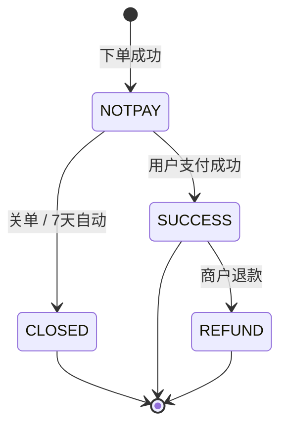

# 分类：微信开发

共 1 篇文章

---

# 微信小程序支付实战：全链路坑点与工程经验
Date: 2026-07-06 | Tags: 安全, 微信开发, 微信小程序, 微信支付, 支付 | URL: https://bsheepcoder.github.io/2026/07/06/wechat-miniprogram-payment/

## 一、元认知：微信支付在解决什么问题

> 支付的本质不是"把钱从 A 移到 B"，而是"在一个不可信的分布式系统里，让三方对同一笔交易达成唯一共识"。

这句话看似抽象，但它是理解微信支付所有设计的钥匙。参与的「三方」是：**商户系统、微信支付系统、用户**。它们分布在不同进程、不同网络、不同时间点，各自看到的订单状态永远存在偏差。你以为支付集成的难点是「调通一个 API」，其实真正难的是——**当三方状态不一致时，如何收敛出唯一的真相**。

微信支付 V3 文档（截至 2026.06 更新）里那些让人困惑的设计——前端回调不可靠、prepay_id 只有 2 小时、签名探测流量、商户休眠关停——没有一个是随便定的，它们都是在解决"分布式状态一致性"这个根本矛盾时留下的痕迹。

### 1.1 三套订单号：三种生命周期的并存

很多人被微信支付里的订单号搞晕。其实它有三套，对应三种生命周期：

| 标识 | 谁生成 | 何时诞生 | 有效期 | 作用 |
|------|--------|----------|--------|------|
| `out_trade_no` | 商户 | 商户下单时 | 7 天（默认） | 商户维度的订单号，业务的唯一锚 |
| `prepay_id` | 微信 | 下单成功返回 | **2 小时** | 拉起收银台的"临时门票" |
| `transaction_id` | 微信 | 支付成功后 | 永久 | 微信维度的交易号，对账依据 |

这套设计揭示了一个关键认知：**下单 ≠ 交易**。下单只是商户向微信"声明一个支付意图"，`prepay_id` 是兑现这个意图的临时凭证，真正的交易 `transaction_id` 只在用户付钱成功的那一刻才诞生。

理解了这一点，"prepay_id 为什么只有 2 小时"就不再是问题——它本来就不是订单，而是一张会过期的门票。用户停留超过 2 小时？用原参数重新下单换一张新门票即可，订单（`out_trade_no`）本身还活着，7 天内都能继续付。

### 1.2 为什么前端回调天然不可靠

小程序里 `wx.requestPayment` 的 `success`/`fail` 回调，是新手最依赖、也是最不可靠的状态来源。文档里有一句被很多人忽略的提醒：

> 前端回调并不保证绝对可靠，不可只依赖前端回调判断订单支付状态，订单状态需以后端查询订单和支付成功回调通知为准。

为什么不可靠？因为**前端是整个系统里权威性最低的节点**。用户付完款立刻杀进程、网络在回调返回前断开、JS 执行报错——都会让前端拿不到"支付成功"的信号。把订单终态寄托在一个随时可能消失的节点上，是工程上的原罪。

所以微信设计了**三条独立信道**来收敛状态：

1. **前端回调**：给用户看即时反馈，仅此而已；
2. **后端异步通知**：支付成功后微信主动 POST 到商户服务器，这是权威信号；
3. **主动查单**：商户调 `查询订单` 接口，兜底一切。

这三条信道互相独立、互为保险。任何一条断了，另外两条仍能让状态收敛。**支付集成的核心架构，就是把"信任"从前端迁移到后端**——前端只负责表演，后端才是账本。

## 二、搭积木：全链路工程实现

在认知地基上，我们把全链路搭一遍。不是 API 罗列，而是讲每一步的工程约束。

### 2.1 下单：声明意图

商户后端调 `JSAPI/小程序下单` 拿 `prepay_id`。三个约束必须刻进肌肉记忆：

- **openid 与 appid 强绑定**：下单传的 `openid` 必须从调起支付的同一个 `appid` 下获取。换了 appid 或换了用户，就会报"下单账号与支付账号不一致"。
- **`time_expire` 的两条路**：传了它，用户超过这个时间就付不了（报"订单已超过最晚支付成功时间"），商户需关单；不传，默认 7 天有效。
- **按钮防抖**：官方明确提示，前端下单按钮不做防抖，用户连点会产生重复订单，造成资金损失。这不是建议，是血泪教训。

### 2.2 调起：递交门票

小程序前端用 `wx.requestPayment` 调起收银台，核心参数是 `package: "prepay_id=xxx"`。两个坑：

- `package` 格式必须是 `prepay_id=xxx`，少一个等号、多一个空格都会报"缺少参数 package"。
- 门票 2 小时过期。用户在支付页犹豫太久，拿到的就是一张废票，需要后端用原参数重新下单换新票——别让用户对着过期单干等。

### 2.3 回调与查单：双保险对账

用户支付/取消后回到前端，前端收到回调；同时，支付成功时微信会向后端发异步通知。订单的真实状态，以后端为准：

三个终态：`CLOSED`、`SUCCESS`、`REFUND`。**只有终态才可信**。非终态（`NOTPAY`）随时会变，不能据此做业务决策。

异步通知和查单怎么配合？正确姿势是：**收到通知 → 验签 → 解密 → 幂等检查 → 落库 → 5 秒内返回 200**。返回慢了或返回非 2xx，微信会重试，重试再来一次你要能扛住——这就是幂等设计的来源。查单则是兜底：通知丢了、延迟了、乱序了，定时任务轮询查单能把状态补齐。

### 2.4 关单与退款：终态管理

- **关单接口支持重入**：调多少次都安全，这是官方给的幂等承诺。用户超时不想付了，关单，把它当失败终态处理。
- **退款仅支持支付成功后 1 年内**：超过 1 年的订单退不了，得走人工。
- **退款也要幂等**：用唯一的 `out_refund_no`，重复调返回同一结果，而不是退两次。
- **金额单位是分**：`amount.total` 最小值 1，传 0 直接 `PARAM_ERROR`。前后端契约里金额统一用整数分，避免浮点误差。

## 三、案例即原理：从坑点讲原理

坑点不是用来背的，每个坑背后都是一条原理。看懂原理，换个支付系统你一样能避。

### 3.1 签名探测流量：微信在替你做混沌工程

回调验签时报错 `Last unit does not have enough valid bits`？查回调头 `Wechatpay-Signature`，如果以 `WECHATPAY/SIGNTEST/` 开头——这是微信主动发的**探测流量**。

它的签名值不是合法 Base64，会触发解码错误。微信在故意给你制造故障，检验你的回调够不够健壮。正确处理：**对探测流量返回非 2xx，绝不按业务成功处理**，等微信后续发来带正确签名的正式回调。

这个坑的原理是**混沌工程**。成熟系统都会主动注入故障验证健壮性，微信只是把这件事做到了商户侧。把探测流量误当真实订单、给用户发货了的，都是没理解"幂等 + 验签"的后果。

### 3.2 out_trade_no 重复：幂等的边界

"第一次下单未支付，第二次用同一个 `out_trade_no` 再调可以吗？" 文档说：可以，但所有参数必须与首次完全一致，否则报"201 商户订单号重复"。

这条规则的本质是：**`out_trade_no` 是幂等键，但它绑定了一组参数快照**。你想用同一个单号换金额、换商品描述？不行——那等于篡改历史意图。安全做法是：换一个新 `out_trade_no`，旧的调关单。别在同一单号上反复横跳。

### 3.3 openid 与 appid 的强绑定

报"下单账号与支付账号不一致"或"appid 与 openid 不匹配"，根因都是**身份是应用维度的**。同一个用户，在你的小程序、公众号、网站应用里有三个不同的 openid（这是微信的隐私隔离设计，详见统一登录那篇）。

下单时传的 openid 必须来自"调起支付的那个 appid"下获取的同一个用户。跨应用拿来的 openid，微信不认。这条原理迁移到任何 OAuth 体系都成立：**身份凭证永远绑定签发它的应用**。

### 3.4 回调解密失败：密钥与密文完整性

V3 回调解密报 `message authentication failed`，官方给出两条原因：APIv3 密钥错，或密文被截断。`ciphertext`、`associated_data`、`nonce` 三个字段必须完整传递，少一个就解不开。

这背后是 AEAD（AES-256-GCM）认证加密的原理：密文和认证标签是一体的，篡改或截断都会让认证失败。这不是微信的 bug，是密码学在保护你——它在告诉你"这份数据被动过手脚，别信"。

## 四、缺陷与批判：体系的不足

诚实地说，微信支付的体系并非完美，有些缺陷是结构性的，理解它们比假装看不见更重要。

### 4.1 没有回调沙箱

> 微信支付未提供线上测试回调接口。如需测试支付回调功能，建议通过生产环境验证，在真实支付场景中测试回调地址是否能正常接收通知。

这是开发体验上最大的硬伤。回调涉及真实资金流，无法模拟，可以理解；但代价是——**整条最关键的链路（异步通知 → 验签 → 解密 → 幂等 → 落库）只能上生产用小额真金白银验证**。对测试覆盖率、灰度策略都是挑战。成熟的支付体系应该提供可控的回调沙箱，而不是让开发者用钱试错。

### 4.2 商户休眠阶梯关停

官方明确：连续 30 天无收单交易关闭信用卡支付；连续 90 天无交易且资料异常、或连续 365 天无交易关闭收单权限；入驻以来连续 180 天无交易进入"不收不付"管控。

这个规则的痛点在**测试/预发环境的商户号**：本来就没真实交易，养着养着就被阶梯式关停，某天突然不能付了，排查半天才发现是休眠。惩罚"非活跃但无恶意"的商户，增加了纯运维负担。保活脚本成了隐形成本。

### 4.3 微信支付公钥迁移痛点

2024 年起微信主推「微信支付公钥」，与「平台证书」并列作为验签凭据。背景是平台证书自动轮换时，大量商户因没及时拉取新证书导致验签批量失败。公钥模式是补救——公钥稳定不频繁轮换。

但补救本身也是成本：迁移期两套凭据并存，老接口看证书、新接口看公钥，`Wechatpay-Serial` 头的语义变了，凭据管理复杂度翻倍。**一个本该由 SDK 透明解决的问题，把心智负担摊给了商户**。理想状态是：凭据轮换对业务完全无感，而不是让大家在两种模式间迁移。

### 4.4 V2/V3 混用的历史包袱

"支付和退款可以分别使用不同版本（v2 和 v3）的接口吗？" 文档答：可以，但不建议。现实是——**现金红包、付款码、清关报关仍只有 V2**，做营销或跨境的业务被迫混用。

官方留了口子，但"可以"不等于"应该"。两套签名算法（V2 MD5、V3 RSA-SHA256）、两套密钥体系、两套回调格式，混用就是给系统埋不一致的雷。这是历史包袱让"统一"成为不可能，诚实地讲：短期内无解，只能在架构上把 V2 收敛到隔离的模块里。

## 五、总结事物本身：支付集成的本质

回到事物本身。做完一次小程序支付集成，你获得的究竟是什么？

不是"会调微信的 API"——API 会变，V2 变 V3，证书变公钥，参数增增减减。真正可迁移的是三件事：

1. **幂等**——任何操作重复执行，结果一致。`out_trade_no`、`out_refund_no`、回调通知去重，全是幂等键的不同化身。掌握了幂等，你就掌握了所有写操作的安全边界。
2. **对账**——多源状态收敛到唯一真相。前端回调、异步通知、主动查单，三条信道互相校验，以终态为准。这套"多源校验"的思路，放到对账系统、数据同步、事件溯源里全部成立。
3. **凭据分离**——密钥、证书、公钥、序列号各司其职，私钥绝不落前端。这是最小权限原则在支付领域的具象。

更深一层：这三件事背后是同一个哲学——**在不可信的分布式系统里，不信任任何单一节点，用多重独立信道交叉验证，用幂等扛住重复，用终态终结不确定性**。

这套哲学不姓"微信"。把它搬到支付宝、Stripe、PayPal，你会发现调用的 API 不同，但应对的状态不一致、回调丢失、重复请求、凭据轮换问题，是同一批。支付集成做完后，你练就的是对"分布式状态一致性"的工程直觉——这才是这门手艺真正值钱的资产。

> 文档能查到的是参数，文档不告诉你的是原理。参数会过期，原理不会。

