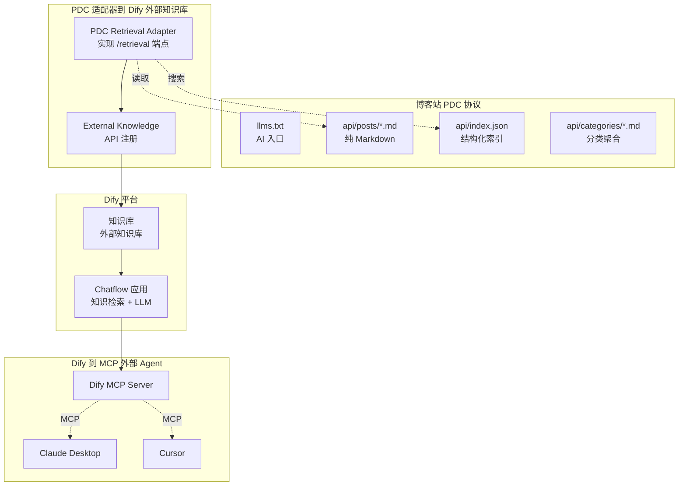

## 一、Dify 是什么：背景与现状

[Dify](https://github.com/langgenius/dify) 是一个开源 AI 应用编排平台，名字来自 **Do It For You**。它解决的核心问题是：把 LLM 从"问一句答一句"变成能检索私有知识、调用外部工具、多步推理的生产级应用，且不需要写大量代码。

### 编排平台，非代码框架

理解 Dify 的关键，是认清它和 LangChain / LlamaIndex 的区别：

| 维度 | LangChain / LlamaIndex | Dify |
|------|----------------------|------|
| 形态 | 代码框架（Python/JS 库） | 可视化平台 + API 服务 |
| 使用方式 | 写代码编排链 | 拖拽节点编排画布 |
| 知识库 | 需自行集成向量库 | 内置 RAG 引擎，开箱即用 |
| 部署 | 嵌入应用代码 | 独立服务，前端 + API |
| 受众 | 开发者 | 开发者 + 产品经理 |

一句话：**LangChain 是写代码造工具，Dify 是拖画布造应用**。Dify 把编排、知识、工具、发布四件事打包成一个完整平台。

### 当前版本与特性

截至本文撰写，Dify 最新版本为 1.10.x，核心特性：

- **可视化编排**：拖拽 Workflow（单次任务）/ Chatflow（多轮对话）
- **内置 RAG**：文档上传 → 分块 → 索引 → 检索，零代码完成
- **多模型支持**：OpenAI / Anthropic / Gemini / 本地模型，插件化接入
- **插件生态**：工具、模型、Agent 策略、数据源（1.9.0+）、触发器（1.10.0+）六类插件
- **MCP 双向支持**：既能消费外部 MCP 工具，也能将应用暴露为 MCP Server
- **多端发布**：Web App、API、MCP Server
- **开源协议**：Apache 2.0，可商用

## 二、Cloud 还是自托管？

这是用 Dify 的第一个决策。选错会踩很多不必要的坑。

### Cloud 三档定价

| 维度 | Sandbox（免费） | Professional（$59/月） | Team |
|------|----------------|----------------------|------|
| 成员 | 1 | 3 | 50 |
| 应用数 | 5 | 50 | 200 |
| API 调用 | 5000 次/天 | 无限 | 无限 |
| AI 额度 | 200（一次性，不续） | 按需付费 | 按需付费 |
| 支持 | 社区 | 优先邮件 | 邮件 + Slack |

### Cloud 的限制

官方文档明确以下功能仅自托管可用：

- **Q&A 模式**（Q to Q 匹配策略）—— 仅自托管
- **摘要自动生成**（为分块生成检索摘要）—— 仅自托管
- **知识请求频率**—— 按 Cloud 套餐限流
- **数据隐私**—— 数据托管在 Dify 服务器

### 自托管成本

- **硬件最低**：CPU 2 核 + RAM 4GB
- **运行 11 个 Docker 容器**：5 核心服务（api、worker、worker_beat、web、plugin_daemon）+ 6 依赖（weaviate 向量库、postgres 数据库、redis 缓存、nginx 反代、ssrf_proxy 安全、sandbox 沙箱）
- **需自行运维**：数据库备份、Redis 持久化、向量库迁移、版本升级

### 决策矩阵

| 你的情况 | 推荐 | 理由 |
|---------|------|------|
| 个人尝鲜 / 原型验证 | Cloud Sandbox | 零成本，200 额度够试 |
| 小团队生产用 | Cloud Professional | 免运维，无限 API 调用 |
| 企业内部知识库（需 Q&A 模式） | 自托管 | Q&A 模式仅自托管可用 |
| 数据不能出内网 | 自托管 | 数据完全本地 |
| 需要深度定制 / 插件开发 | 自托管 | 可改源码 |

**小白下一步**：先注册 [Dify Cloud](https://cloud.dify.ai) 用 Sandbox 免费跑通流程，确认满足需求后再决定是否自托管。

## 三、自托管避坑指南

选了自托管，这章救命。

### 部署三步

```bash
git clone https://github.com/langgenius/dify.git
cd dify/docker && cp .env.example .env
docker compose up -d
```

访问 `http://localhost/install` 初始化管理员账号。详见[官方部署文档](https://docs.dify.ai/en/self-host/quick-start/docker-compose)。

### 五个必踩的坑

以下全部来自官方 FAQ 和环境变量文档，是真实部署中最频繁的问题：

| 坑 | 后果 | 避坑方法 |
|----|------|---------|
| **SECRET_KEY 部署后修改** | 全员登出、文件 URL 全失效、OAuth 凭据不可恢复 | 首次部署前用 `openssl rand -base64 42` 生成，之后**永不改** |
| **reset-encrypt-key-pair 误操作** | 所有 LLM 凭据、工具凭据（含 MCP）被清空 | 仅在密钥丢失时用，操作前导出所有凭据 |
| **升级不备份 + 不对比 .env** | 数据丢失 / 新变量缺失导致异常 | 升级前 `cp -r dify dify.bak.日期`，升级后对比 `.env.example` |
| **拆分子域名不设 COOKIE_DOMAIN** | 登录成功但下次请求 401 掉线 | 设 `COOKIE_DOMAIN=你的域名` + `NEXT_PUBLIC_COOKIE_DOMAIN=1` |
| **SSRF 代理拦截内网** | 外部知识库连接超时 | 在 `docker/ssrf_proxy/squid.conf.template` 的 `allowed_domains` 加白名单 |

**其他常见问题**：

- 改域名后 401：需同步更新 `CONSOLE_API_URL`、`CONSOLE_WEB_URL`、`SERVICE_API_URL` 等 7 个 URL 环境变量
- 文件上传超限：`UPLOAD_FILE_SIZE_LIMIT` 和 `NGINX_CLIENT_MAX_BODY_SIZE` 必须同时改
- 数据库连接数不够：`POSTGRES_MAX_CONNECTIONS` 需 >= API worker × 连接数 + Celery worker 数
- 重置管理员密码：`docker exec -it docker-api-1 flask reset-password`

## 四、知识库 RAG 引擎

知识库是 Dify 最核心的功能模块。它通过 RAG（检索增强生成）让 LLM 基于你的私有知识回答问题。本站已有 [深入浅出 RAG](/posts/ai-rag-engineering/) 讲解理论演进，这里聚焦 Dify 的工程实现。

**RAG 工作流**（一句话）：用户提问 → 检索知识库相关分块 → 分块作为上下文注入 LLM → 生成回答。

### 三个环节

| 环节 | 选项 | 推荐 |
|------|------|------|
| **分块** | General（通用单层）/ Parent-child（父子两层）/ Q&A（问答对，仅自托管） | 技术文档用 Parent-child，FAQ 用 Q&A |
| **索引** | High-Quality（Embedding 向量）/ Economical（关键词倒排） | High-Quality（Economical 不可降级回退） |
| **检索** | 向量检索 / 全文检索 / 混合检索 + Rerank | 混合检索 + Rerank（精度最高） |

**分块模式核心差异**：

- **General**：单层分块，匹配到什么返回什么。适合术语表、FAQ
- **Parent-child**：小块匹配、大块返回。子块精准定位查询词，父块提供完整上下文。适合技术手册、论文
- **Q&A**：自动生成问答对，Q to Q 匹配。适合 FAQ 类文档（仅自托管）

**检索策略核心差异**：

- **向量检索**：语义匹配，"检索增强"能命中"RAG"，但精确术语可能漏匹配
- **全文检索**：关键词精确匹配，但无法理解语义
- **混合检索**：向量 + 全文同时执行，融合重排，两者兼得

### 外部知识库 API

Dify 不仅支持内置知识库，还支持通过 External Knowledge API 连接外部 RAG 系统。

**契约极简**：你的服务只需实现一个端点。

```
POST {your-endpoint}/retrieval
Authorization: Bearer {API_KEY}

请求体：{ "knowledge_id", "query", "retrieval_setting": {"top_k", "score_threshold"} }
返回体：{ "records": [{ "content", "score", "title", "metadata" }] }
```

Dify 负责把返回的 `content` 作为上下文注入 LLM。你的外部系统保留对检索逻辑的完全控制权——Dify 只有检索权限，无法修改外部内容。

**连接三步**：构建检索 API → 在 Dify 注册 External Knowledge API（URL + Key）→ 创建外部知识库（选 API + 填 Knowledge ID）。

这是第七章创新灵感的关键接口。

## 五、知识库 API 实战

本章基于 [Dify Knowledge Base API 官方文档](https://docs.dify.ai/api-reference/knowledge-bases/list-knowledge-bases)，用 curl 演示四个核心操作。不需要写代码，跟着命令走即可。

### 5.1 准备：API Key 与 Base URL

| 项 | 说明 |
|----|------|
| API Key 位置 | Dify → Settings → API Keys → **Knowledge Base API Key**（注意：不是 App API Key） |
| Base URL（Cloud） | `https://api.dify.ai/v1` |
| Base URL（自托管） | `http://your-host/v1` |
| 认证方式 | 每个请求头带 `Authorization: Bearer {API_KEY}` |

> **安全警告**：官方 OpenAPI 规范明确指出——一个 Knowledge Base API Key 可操作同账户下**所有**知识库。注意数据隔离，生产环境建议按职责分账户。

### 5.2 四步操作

#### 步骤一：创建知识库

```
POST /datasets
```

```bash
curl -X POST 'https://api.dify.ai/v1/datasets' \
  -H 'Authorization: Bearer {API_KEY}' \
  -H 'Content-Type: application/json' \
  -d '{
    "name": "产品文档库",
    "description": "产品 API 技术文档",
    "indexing_technique": "high_quality",
    "embedding_model": "text-embedding-3-small",
    "embedding_model_provider": "openai",
    "retrieval_model": {
      "search_method": "hybrid_search",
      "reranking_enable": true,
      "reranking_mode": "reranking_model",
      "reranking_model": {
        "reranking_provider_name": "cohere",
        "reranking_model_name": "rerank-multilingual-v3.0"
      },
      "top_k": 3,
      "score_threshold_enabled": true,
      "score_threshold": 0.5
    }
  }'
```

关键字段：

| 字段 | 必填 | 说明 |
|------|------|------|
| `name` | 是 | 知识库名称（1-40 字符），唯一不可重名 |
| `indexing_technique` | 否 | `high_quality`（向量索引）或 `economy`（关键词倒排） |
| `embedding_model` | high_quality 时必填 | Embedding 模型名（如 `text-embedding-3-small`） |
| `embedding_model_provider` | high_quality 时必填 | 模型提供商（如 `openai`） |
| `retrieval_model.search_method` | 否 | `hybrid_search` / `semantic_search` / `full_text_search` / `keyword_search` |
| `retrieval_model.top_k` | 否 | 返回最大块数（默认 3） |
| `retrieval_model.score_threshold` | 否 | 最低相似度门槛（默认 0.5） |

返回的 `id` 字段就是**知识库 ID**，后续所有操作都要用它。

#### 步骤二：上传文档

```
POST /datasets/{dataset_id}/document/create-by-text
```

```bash
curl -X POST 'https://api.dify.ai/v1/datasets/{dataset_id}/document/create-by-text' \
  -H 'Authorization: Bearer {API_KEY}' \
  -H 'Content-Type: application/json' \
  -d '{
    "name": "产品使用指南",
    "text": "Dify 是一个开源 AI 应用编排平台...",
    "indexing_technique": "high_quality",
    "doc_form": "text_model",
    "doc_language": "Chinese",
    "process_rule": {
      "mode": "automatic"
    }
  }'
```

关键字段：

| 字段 | 说明 |
|------|------|
| `text` | 文档正文（必填） |
| `doc_form` | `text_model`（通用分块）/ `hierarchical_model`（父子分块）/ `qa_model`（问答对提取） |
| `process_rule.mode` | `automatic`（自动）/ `custom`（自定义分隔符+长度）/ `hierarchical`（父子模式，配合 `doc_form: hierarchical_model`） |
| `process_rule.rules.segmentation` | custom 模式下设 `separator`（分隔符）、`max_tokens`（最大块长）、`chunk_overlap`（重叠字符） |

返回的 `batch` 字段是**批次 ID**，用于查索引状态。

如果是上传 PDF/DOCX 等文件，改用 `create-by-file` 端点，multipart/form-data 格式，`file` 字段传文件，`data` 字段传 JSON 配置（同上，但不要 `name` 和 `text`）。支持 PDF、TXT、DOCX、MD 等格式。

> **注意**：添加第一篇文档时必须指定 `indexing_technique`，后续文档若省略则继承知识库的设置。

#### 步骤三：查索引状态

```
GET /datasets/{dataset_id}/documents/{batch}/indexing-status
```

```bash
curl -X GET 'https://api.dify.ai/v1/datasets/{dataset_id}/documents/{batch}/indexing-status' \
  -H 'Authorization: Bearer {API_KEY}'
```

文档处理是异步的，状态流转如下（来自官方）：

```
waiting → parsing → cleaning → splitting → indexing → completed
                                                         ↘ error
```

| 状态 | 含义 |
|------|------|
| `waiting` | 排队等待 |
| `parsing` | 解析文件内容 |
| `cleaning` | 清理噪音（去空行、URL） |
| `splitting` | 按规则分块 |
| `indexing` | 构建向量索引 |
| `completed` | 完成，可检索 |
| `error` | 失败，看 `error` 字段 |

返回的 `completed_segments` / `total_segments` 可看进度。重复调用直到 `indexing_status` 为 `completed`。

#### 步骤四：检索测试

```
POST /datasets/{dataset_id}/retrieve
```

```bash
curl -X POST 'https://api.dify.ai/v1/datasets/{dataset_id}/retrieve' \
  -H 'Authorization: Bearer {API_KEY}' \
  -H 'Content-Type: application/json' \
  -d '{
    "query": "如何配置知识库分块",
    "retrieval_model": {
      "search_method": "hybrid_search",
      "reranking_enable": true,
      "reranking_mode": "reranking_model",
      "reranking_model": {
        "reranking_provider_name": "cohere",
        "reranking_model_name": "rerank-multilingual-v3.0"
      },
      "top_k": 5,
      "score_threshold_enabled": true,
      "score_threshold": 0.5
    }
  }'
```

返回结果说明：

| 字段 | 说明 |
|------|------|
| `records[].segment.content` | 匹配到的文本块内容 |
| `records[].score` | 相似度分数（0-1，越高越相关） |
| `records[].segment.document.name` | 来源文档名 |
| `records[].segment.keywords` | 关键词（Economical 模式才有） |
| `records[].child_chunks` | 子块列表（`hierarchical_model` 模式才有） |

**元数据过滤**：在 `retrieval_model.metadata_filtering_conditions` 中加条件，可实现只搜特定分类的文档。支持 `contains`、`is`、`before`、`after` 等 15 种比较运算符。

### 5.3 其他端点速查

| 端点 | 方法 | 用途 |
|------|------|------|
| `/datasets` | GET | 列出知识库（分页、关键词搜索、标签过滤） |
| `/datasets/{id}/documents` | GET | 列出文档（分页、按状态过滤） |
| `/datasets/{id}/documents/{doc_id}/segments` | GET | 列出分块（检查分块效果、看内容） |
| `/datasets/{id}/documents/{doc_id}/segments` | POST | 手动创建分块（可指定关键词和答案） |
| `/datasets/{id}/documents/{batch}/indexing-status` | GET | 查索引状态（轮询用） |
| `/datasets/{id}/retrieve` | POST | 检索（生产环境 + 测试都用这个） |

### 5.4 应用集成

API 验证检索效果后，在 Dify 界面中把知识库集成到应用，三步：

1. 创建 **Chatflow** 应用
2. 添加 **Knowledge Retrieval** 节点：Query 选 `sys.query`，知识库选刚创建的
3. 添加 **LLM** 节点：Context 选 Knowledge Retrieval 的 `result` 变量，System 指令写"基于检索到的知识回答，无相关信息则说明"

测试提问，观察回答是否引用了知识库内容（Chatflow 默认显示引用来源）。

## 六、MCP 双向支持

Dify 对 [MCP 协议](/posts/ai-mcp-protocol/) 的支持是**双向**的——既能消费外部 MCP 工具，也能将自身应用暴露为 MCP Server。

### 消费侧：在 Dify 中使用 MCP 工具

| 项 | 说明 |
|----|------|
| 配置位置 | Tools → MCP → Add MCP Server (HTTP) |
| 传输限制 | **仅支持 HTTP 传输**，不支持 stdio（本地 stdio Server 需代理转 HTTP） |
| Server ID | **创建后不可改**，改了会断开所有依赖该 Server 的应用 |
| 工具定制 | 描述可覆盖；参数可设 Auto（AI 决定值）或 Fixed（固定值不变） |
| OAuth | Dify 自动处理认证流程 |

配置后，MCP 工具在 Agent、Workflow 节点中与内置工具无异。

### 生产侧：将 Dify 应用暴露为 MCP Server

| 项 | 说明 |
|----|------|
| 配置位置 | 应用配置界面 → MCP Server 模块（默认关闭） |
| URL 性质 | **URL 即凭据**，等同于 API Key，泄露即 Regenerate |
| 接入 Claude Desktop | Profile → Settings → Integrations → Add integration，替换 URL |
| 接入 Cursor | `.cursor/mcp.json` 中加配置 |

Cursor 配置示例：

```json
{
  "mcpServers": {
    "my-dify-app": {
      "url": "your-dify-mcp-server-url"
    }
  }
}
```

**双向价值**：Dify 可同时是 MCP 消费者和生产者——一个 Chatflow 调用 GitHub MCP 查代码、调用 Sentry MCP 查报错，同时自身又被 Cursor 当工具调用，形成 AI 工具的网状协同。

## 七、创新灵感：PDC × MCP × Dify

本站已实践 [PDC 协议](/pdc-protocol.md)（平行数据通道，让静态博客零噪音服务 AI）和 [MCP 协议](/posts/ai-mcp-protocol/)（AI 应用的 USB-C 接口）。将 Dify 纳入这个生态，可以产生多个创新架构。

### 整体架构



### 灵感一：PDC 博客 → Dify 外部知识库

**思路**：Dify 的 External Knowledge API 契约极简（一个 `/retrieval` 端点）。本站 PDC 协议已生成 `/api/index.json`（结构化索引）和 `/api/posts/<slug>.md`（纯内容）。写一个薄适配器，把 PDC 端点翻译为 Dify 的 `/retrieval` 契约，即可让 Dify 把本站作为外部知识库。

**价值**：无需把博客内容导入 Dify 内置知识库（避免重复维护），Dify 实时检索最新的博客内容。

**适配器代码**（Node.js，可部署到 Cloudflare Workers）：

```javascript
const BLOG_BASE = 'https://bsheepcoder.github.io'

export default {
  async fetch(request, env) {
    if (request.method !== 'POST') return new Response('Method Not Allowed', { status: 405 })
    const auth = request.headers.get('Authorization')
    if (auth !== `Bearer ${env.API_KEY}`) return Response.json({ error_code: 1002, error_msg: 'Auth failed.' }, { status: 401 })

    const { query, retrieval_setting } = await request.json()
    const topK = retrieval_setting?.top_k || 3
    const threshold = retrieval_setting?.score_threshold || 0

    // 从 PDC 获取文章索引
    const posts = await (await fetch(`${BLOG_BASE}/api/index.json`)).json()
    const terms = query.toLowerCase().split(/\s+/)

    const results = posts.map(p => {
      let score = 0
      for (const t of terms) {
        if (p.title?.toLowerCase().includes(t)) score += 0.3
        if (p.description?.toLowerCase().includes(t)) score += 0.2
        if (p.tags?.some(tag => tag.toLowerCase().includes(t))) score += 0.15
      }
      return { p, score }
    }).filter(x => x.score >= threshold).sort((a, b) => b.score - a.score).slice(0, topK)

    // 获取匹配文章的纯 Markdown 正文
    const records = await Promise.all(results.map(async ({ p, score }) => {
      const content = await (await fetch(`${BLOG_BASE}/api/posts/${p.slug}.md`)).text()
      return {
        content: content.slice(0, 2000),
        score: +score.toFixed(2),
        title: p.title,
        metadata: { slug: p.slug, url: `${BLOG_BASE}/posts/${p.slug}/`, tags: p.tags }
      }
    }))

    return Response.json({ records })
  }
}
```

**注册到 Dify**：Knowledge → External Knowledge API → 添加适配器 URL + API Key → 创建外部知识库 → 填 Knowledge ID。

### 灵感二：Dify 应用 → MCP Server → 外部 Agent

**思路**：在 Dify 中构建一个"博客问答 Chatflow"，知识库接入灵感一的适配器。然后开启 MCP Server，把这个 Chatflow 暴露为 MCP 工具。Claude Desktop、Cursor 等外部 AI 工具就能直接"问博客"。

**Chatflow 编排**：User Input → Knowledge Retrieval（外部知识库，query=sys.query）→ LLM（Context=result）→ Answer

**开启 MCP Server 后**，Cursor 的 `.cursor/mcp.json` 加一条配置即可。在 Cursor 中写代码时，直接问"本站有没有讲 RAG 的文章？"——Cursor 调用 Dify MCP Server → Dify 检索博客 PDC 端点 → 返回相关文章摘要和 URL。

### 灵感三：知识管道处理 llms-full.txt

**思路**：PDC 协议会生成 `/llms-full.txt`（全站文章合并）。用 Dify 知识管道编排导入，利用管道的分块、摘要生成等高级处理，比手动导入更灵活。

**管道编排**：数据源（HTTP 获取 `/llms-full.txt`）→ Doc Extractor 解析 → 按文章分隔符分块 + 摘要自动生成 → 知识存储（高质量索引）

与灵感一的差异：

| 维度 | 灵感一（外部知识库） | 灵感三（知识管道导入） |
|------|-------------------|---------------------|
| 数据位置 | 博客（外部） | Dify（内部） |
| 检索精度 | 中（关键词匹配） | 高（Embedding + Rerank） |
| 实时性 | 实时 | 需定期同步 |
| 维护成本 | 低（适配器一次开发） | 中（定期重导入） |
| 适用场景 | 日常问答、最新内容 | 深度研究、多模态 |

### 灵感四：多模态知识库 + 博客配图

**思路**：博客文章常含配图（架构图、截图）。Dify 支持多模态知识库——选择带 Vision 标识的 Embedding 模型后，文档中的图片也会被索引。问"Dify 节点体系"不仅返回文字描述，还返回架构图。

**实践**：创建知识库时选多模态 Embedding 模型 → 导入含图片的文档 → 检索设置选多模态 Rerank 模型 → LLM 节点开启 Vision。

## 八、发展方向与总结

### 发展方向

| 方向 | 版本 | 趋势 |
|------|------|------|
| 知识管道 | 1.9.0+ | 知识库从固定流程走向可编排工作流，Datasource 插件扩展数据来源 |
| 触发器 | 1.10.0+ | Workflow 从用户主动触发扩展到事件驱动（Webhook / 定时 / 插件） |
| 插件市场 | 持续 | 从内置工具走向第三方插件生态（模型、工具、策略均可发布） |
| Human-in-the-loop | 持续 | Human Input 节点支持工作流暂停等待人工输入 |
| 协作编辑 | 持续 | 团队成员实时协同编辑 Workflow，画布内评论 |
| MCP 生态 | 持续 | 双向 MCP 让 Dify 成为 AI 工具网络的关键节点 |
| 多模态 | 持续 | 知识库支持图文混合检索，跨模态召回 |

核心趋势：**Dify 正在从"AI 应用构建器"演进为"AI 应用生态枢纽"**——通过插件、MCP、外部知识库 API 等开放接口，连接外部工具、数据源和 AI 应用。

### 避坑总结

- **先 Cloud 试，再决定自托管**——别一上来就搭 Docker，先用 Sandbox 跑通流程
- **自托管必改 SECRET_KEY**——用 `openssl rand -base64 42` 生成，之后永不改
- **升级前备份，升级后对比 .env**——`cp -r dify dify.bak.日期`，对比 `.env.example`
- **KB API Key 权限大**——一个 Key 管所有知识库，生产环境按职责分账户
- **MCP Server ID 不可改、URL 即凭据**——ID 创建后冻结，URL 泄露立即 Regenerate

### 核心原则

Dify 的价值不在单点能力，而在**编排**——把编排、知识、工具、发布连接成完整的生产链路。它不是"更好的 LangChain"，而是让不写代码的人也能构建生产级 AI 应用。

### 与 PDC / MCP 协同

| 协议 | 解决的问题 | 与 Dify 的关系 |
|------|-----------|---------------|
| [PDC 协议](/pdc-protocol.md) | 静态博客零噪音服务 AI | Dify 通过外部知识库 API 检索 PDC 端点 |
| [MCP 协议](/posts/ai-mcp-protocol/) | AI 标准化连接外部系统 | Dify 双向支持，既是消费者也是生产者 |
| [RAG 工程实践](/posts/ai-rag-engineering/) | 给 LLM 装上可更新外部记忆 | Dify 是 RAG 理论的工程化平台实现 |

三者协同形成完整闭环：PDC 让博客内容以零噪音形态被 AI 读取，Dify 把这些内容编排进 AI 应用并增强检索，MCP 让这些应用被外部 AI 工具标准化调用。

## 参考资料

- [Dify 官方文档](https://docs.dify.ai/) — 完整文档中心
- [Dify GitHub](https://github.com/langgenius/dify) — 开源仓库
- [Docker Compose 部署](https://docs.dify.ai/en/self-host/quick-start/docker-compose) — 自托管部署
- [环境变量参考](https://docs.dify.ai/en/self-host/configuration/environments) — 所有环境变量
- [常见问题](https://docs.dify.ai/en/self-host/troubleshooting/common-issues) — 部署排障
- [知识库文档](https://docs.dify.ai/en/use-dify/knowledge/readme) — RAG 引擎
- [分块设置](https://docs.dify.ai/en/use-dify/knowledge/create-knowledge/chunking-and-cleaning-text) — General / Parent-child 模式
- [索引与检索设置](https://docs.dify.ai/en/use-dify/knowledge/create-knowledge/setting-indexing-methods) — 向量 / 全文 / 混合检索
- [外部知识库 API](https://docs.dify.ai/en/use-dify/knowledge/external-knowledge-api) — /retrieval 契约规范
- [知识管道](https://docs.dify.ai/en/use-dify/knowledge/knowledge-pipeline/readme) — 可编排文档处理
- [Knowledge Base API](https://docs.dify.ai/api-reference/knowledge-bases/list-knowledge-bases) — 知识库 API 完整规范
- [使用 MCP 工具](https://docs.dify.ai/en/use-dify/build/mcp) — 消费侧 MCP 配置
- [发布为 MCP Server](https://docs.dify.ai/en/use-dify/publish/publish-mcp) — 生产侧 MCP 暴露
- [定价方案](https://docs.dify.ai/en/use-dify/workspace/subscription-management) — Cloud 三档对比
- 本站 [深入浅出 RAG](/posts/ai-rag-engineering/) — RAG 理论演进与本站 MVP
- 本站 [MCP 协议详解](/posts/ai-mcp-protocol/) — AI 应用的 USB-C 接口
- 本站 [PDC 协议](/pdc-protocol.md) — 平行数据通道协议