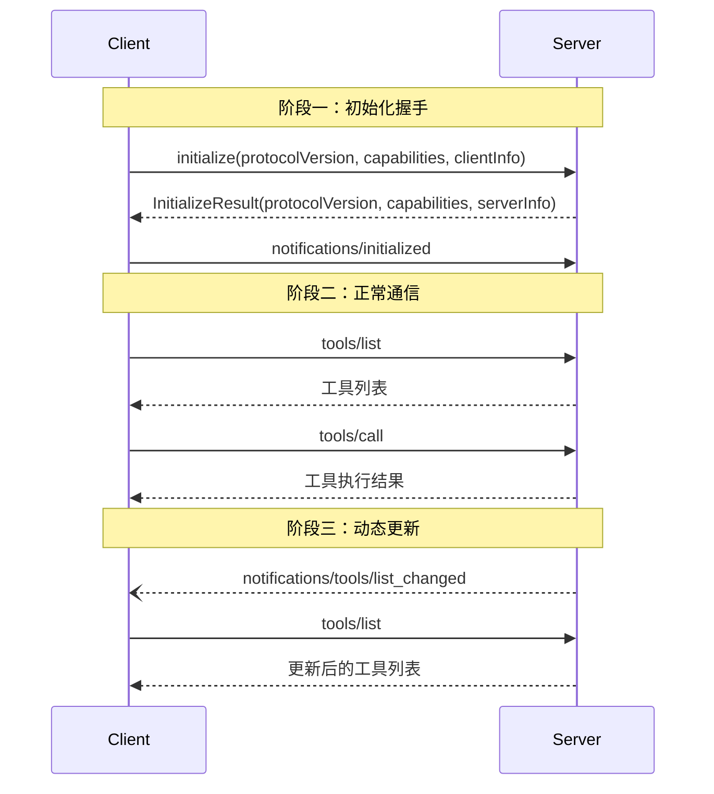

## M×N 集成难题

在 MCP 出现之前，让 AI 应用对接外部系统是一场噩梦。

假设你有 5 个 AI 应用（ChatGPT、Claude、Gemini、Cursor、自研 Agent），需要对接 10 个外部工具（数据库、文件系统、GitHub、Slack、日历……）。每个应用有自定义的对接方式，每个工具有自定义的 API。

你需要写多少个适配器？

```
5 个应用 × 10 个工具 = 50 个适配器
```

这是经典的 **M×N 网状集成难题**。每新增一个应用或一个工具，适配器数量爆炸增长。OpenAI 的 Function-calling、ChatGPT Plugins 都是过渡方案——它们解决了单家厂商的问题，但跨厂商对接仍然各自为政。

MCP 的灵感来自微软的 **LSP（Language Server Protocol）**。在 LSP 之前，每个编辑器（VS Code、Vim、Emacs）要为每种语言（Python、Java、Go）写独立的语法分析器，同样是 M×N 问题。LSP 把它变成了 **M+N 问题**：编辑器实现 LSP 客户端，语言实现 LSP 服务端，任意编辑器 + 任意语言开箱即用。

MCP 做了同样的事：AI 应用实现 MCP 客户端，外部系统实现 MCP 服务端，任意应用 + 任意工具开箱即用。

```
M×N 网状 → M+N 线性

  App1 ─┬─ ToolA          App1 ─┬─ MCP ─┬─ ToolA
  App2 ─┼─ ToolB    →     App2 ─┴       ├─ ToolB
  App3 ─┘─ ToolC          App3 ─┘       └─ ToolC

  3×3 = 9 个适配器        3 + 3 = 6 个实现
```

## MCP 是什么

**MCP（Model Context Protocol，模型上下文协议）** 是一个开放标准，由 Anthropic 于 2024 年 11 月发起，2025 年 12 月捐赠给 Linux 基金会旗下 Agentic AI Foundation（AAIF）管理，由 Anthropic、OpenAI、Block 等联合治理。

MCP 的定位用一句话概括：**AI 应用的 USB-C 接口**。

USB-C 提供了标准化的物理接口，任何设备都能通过它连接任何外设。MCP 提供了标准化的协议接口，任何 AI 应用都能通过它连接任何数据源、工具或工作流。

### 四大核心优势

| 优势 | 含义 | 业务价值 |
|------|------|---------|
| **标准化** | 统一的 JSON-RPC 2.0 消息格式 | 一次对接，全生态通用 |
| **高效上下文管理** | 三大原语分层暴露上下文 | AI 按需获取，避免上下文爆炸 |
| **灵活扩展性** | 服务端可动态增删原语 | 工具热更新，无需重启应用 |
| **低门槛 API** | SDK 自动生成原语定义 | 几十行代码搭一个服务端 |

### 行业采用时间线

| 时间 | 事件 |
|------|------|
| 2024.11 | Anthropic 推出 MCP，发布 Python/TypeScript SDK |
| 2025.03 | OpenAI 宣布 ChatGPT 桌面端和 App 原生支持 MCP |
| 2025.06 | VS Code、Cursor 等 IDE 集成 MCP，融入研发工作流 |
| 2025.12 | MCP 捐赠给 Linux 基金会，AAIF 成立，OpenAI/Block 加入治理 |

截至目前，官方维护的 SDK 覆盖 Python、TypeScript、C#（与微软合作）、Go（与谷歌合作）、Java、Rust、Ruby 七种语言。MCP 已突破单一厂商限制，成为跨语言、跨平台的行业事实标准。

## 架构三要素

MCP 遵循**客户端-服务端架构**，三个核心参与者：

```
┌─────────────────────────────────────────────┐
│              MCP Host（AI 应用）              │
│  ┌──────────┐ ┌──────────┐ ┌──────────┐    │
│  │ Client 1 │ │ Client 2 │ │ Client 3 │    │
│  └────┬─────┘ └────┬─────┘ └────┬─────┘    │
└───────┼────────────┼────────────┼──────────┘
        │            │            │
        │ stdio      │ stdio      │ Streamable HTTP
        │            │            │
   ┌────┴────┐  ┌────┴────┐  ┌────┴────┐
   │ Server A│  │ Server B│  │ Server C│
   │ 文件系统 │  │ 数据库   │  │ Sentry  │
   │ (本地)  │  │ (本地)   │  │ (远程)  │
   └─────────┘  └─────────┘  └─────────┘
```

| 参与者 | 职责 | 示例 |
|--------|------|------|
| **Host** | AI 应用，协调多个 Client | Claude Desktop、VS Code、Cursor |
| **Client** | 维护与一个 Server 的连接 | Host 内部组件，每个 Server 一个 |
| **Server** | 暴露上下文数据和能力 | 文件系统 Server、数据库 Server |

关键点：**Host 可以同时连接多个 Server**。VS Code 可以同时连文件系统 Server（本地 stdio）和 Sentry Server（远程 HTTP），LLM 能访问所有已连接 Server 的能力。

## 两层架构

MCP 分为数据层和传输层，数据层是内核，传输层是外壳。

### 数据层：JSON-RPC 2.0

数据层定义消息结构和语义，基于 [JSON-RPC 2.0](https://www.jsonrpc.org/)：

| 消息类型 | 特征 | 用途 |
|---------|------|------|
| **Request** | 有 `id`，期望响应 | `initialize`、`tools/call`、`resources/read` |
| **Response** | 匹配 Request 的 `id` | 返回结果或错误 |
| **Notification** | 无 `id`，不期望响应 | `notifications/initialized`、`tools/list_changed` |

数据层包含四组功能：

- **生命周期管理**：连接初始化、能力协商、连接终止
- **服务端原语**：Tools（AI 行动）、Resources（上下文数据）、Prompts（交互模板）
- **客户端原语**：Sampling（请求 LLM 补全）、Elicitation（请求用户输入）、Logging（日志）
- **工具原语**：Notifications（实时通知）、Progress（进度追踪）

### 传输层：两种机制

| 传输方式 | 机制 | 适用场景 | 特点 |
|---------|------|---------|------|
| **stdio** | 标准输入/输出 | 本地进程通信 | 零网络开销、Host 启动子进程 |
| **Streamable HTTP** | HTTP POST + 可选 SSE | 远程通信 | 多客户端、OAuth 认证、跨网络 |

传输层与数据层解耦——同一套 JSON-RPC 消息可在任意传输上跑。选 stdio 还是 HTTP 是部署决策，不影响业务逻辑。

## 三大原语：规范的核心

三大原语是 MCP 最核心的设计。它们不是随意分类，而是按**控制方**严格区分——这决定了谁决定何时使用它们。

| 原语 | 控制方 | 含义 | 典型场景 |
|------|--------|------|---------|
| **Resources** | 应用控制 | 数据源，提供上下文 | 文件内容、数据库 schema、API 响应 |
| **Tools** | 模型控制 | 可执行函数，执行动作 | 查询数据库、发送邮件、调用 API |
| **Prompts** | 用户控制 | 预定义模板，结构化交互 | 代码审查模板、SQL 生成模板 |

**为什么按控制方分类？** 因为不同原语的安全等级不同。Tools 能执行动作（可能有副作用），必须由模型谨慎决策 + 用户确认；Resources 是只读数据，应用可自动注入；Prompts 是用户主动选择的预设流程。

### Resources：应用控制的数据源

Resources 是只读数据源，由 **Host 应用**决定何时注入上下文（而非 LLM 自主选择）。每个 Resource 用 URI 唯一标识。

**发现资源**：

```json
// Request: resources/list
{
  "jsonrpc": "2.0",
  "id": 1,
  "method": "resources/list"
}

// Response
{
  "jsonrpc": "2.0",
  "id": 1,
  "result": {
    "resources": [
      {
        "uri": "file:///project/README.md",
        "name": "README.md",
        "title": "项目文档",
        "mimeType": "text/markdown",
        "annotations": {
          "audience": ["user", "assistant"],
          "priority": 0.8,
          "lastModified": "2025-01-12T15:00:58Z"
        }
      }
    ]
  }
}
```

**读取资源**：

```json
// Request: resources/read
{
  "jsonrpc": "2.0",
  "id": 2,
  "method": "resources/read",
  "params": { "uri": "file:///project/README.md" }
}

// Response
{
  "jsonrpc": "2.0",
  "id": 2,
  "result": {
    "contents": [
      {
        "uri": "file:///project/README.md",
        "mimeType": "text/markdown",
        "text": "# 项目文档\n\n..."
      }
    ]
  }
}
```

**URI Scheme 的业务含义**：

| Scheme | 含义 | 业务场景 |
|--------|------|---------|
| `file://` | 本地文件系统 | 代码仓库、配置文件 |
| `https://` | Web 资源（客户端可直接 fetch） | 公开 API、文档站点 |
| `git://` | Git 版本控制 | 代码历史、分支管理 |
| 自定义 | 业务专属 | `db://table/users`、`jira://ticket/PROJ-123` |

**资源模板**（Resource Templates）支持参数化 URI，类似 RESTful 路由：

```json
{
  "uriTemplate": "db://tables/{tableName}",
  "name": "数据库表",
  "description": "按表名查询表结构和数据"
}
```

### Tools：模型控制的执行函数

Tools 是可执行函数，由 **LLM 自主决策**何时调用（但应用应有人工确认环节）。这是 MCP 最具威力的原语——让 AI 从"只能说"变成"能做事"。

**发现工具**：

```json
// Request: tools/list
{
  "jsonrpc": "2.0",
  "id": 3,
  "method": "tools/list"
}

// Response
{
  "jsonrpc": "2.0",
  "id": 3,
  "result": {
    "tools": [
      {
        "name": "query_database",
        "title": "数据库查询",
        "description": "执行只读 SQL 查询",
        "inputSchema": {
          "type": "object",
          "properties": {
            "sql": {
              "type": "string",
              "description": "SELECT 查询语句"
            }
          },
          "required": ["sql"]
        },
        "outputSchema": {
          "type": "object",
          "properties": {
            "rows": { "type": "array" },
            "rowCount": { "type": "number" }
          }
        }
      }
    ]
  }
}
```

**调用工具**：

```json
// Request: tools/call
{
  "jsonrpc": "2.0",
  "id": 4,
  "method": "tools/call",
  "params": {
    "name": "query_database",
    "arguments": { "sql": "SELECT COUNT(*) FROM orders WHERE status='pending'" }
  }
}

// Response
{
  "jsonrpc": "2.0",
  "id": 4,
  "result": {
    "content": [
      { "type": "text", "text": "待处理订单数：1,247" }
    ],
    "structuredContent": {
      "rows": [{"count": 1247}],
      "rowCount": 1
    },
    "isError": false
  }
}
```

**工具返回的四种内容类型**：

| 类型 | 字段 | 业务用途 |
|------|------|---------|
| `text` | `text` | 纯文本结果（默认） |
| `image` | `data`（base64）+ `mimeType` | 截图、图表、识别结果 |
| `resource_link` | `uri` | 返回资源链接，客户端按需 fetch |
| `embedded resource` | 完整 resource 对象 | 内联嵌入资源内容 |

### Prompts：用户控制的交互模板

Prompts 是预定义的交互模板，由**用户主动选择**触发。它将"好用的提示词"固化成可复用资产。

**列出模板**：

```json
// Request: prompts/list
{
  "jsonrpc": "2.0",
  "id": 5,
  "method": "prompts/list"
}

// Response
{
  "jsonrpc": "2.0",
  "id": 5,
  "result": {
    "prompts": [
      {
        "name": "code-review",
        "title": "代码审查",
        "description": "审查 Git diff 并给出改进建议",
        "arguments": [
          {
            "name": "diff",
            "description": "待审查的代码差异",
            "required": true
          }
        ]
      }
    ]
  }
}
```

**获取模板内容**：

```json
// Request: prompts/get
{
  "jsonrpc": "2.0",
  "id": 6,
  "method": "prompts/get",
  "params": {
    "name": "code-review",
    "arguments": { "diff": "diff --git a/main.py b/main.py\n..." }
  }
}

// Response
{
  "jsonrpc": "2.0",
  "id": 6,
  "result": {
    "description": "代码审查",
    "messages": [
      {
        "role": "user",
        "content": {
          "type": "text",
          "text": "请审查以下代码差异，关注安全、性能、可维护性..."
        }
      }
    ]
  }
}
```

### 三原语协作实例

一个数据库助手 Server 同时暴露三种原语：

```
用户："帮我查下最近一周的订单异常"

Host 应用：
1. 注入 Resource: db://schema/orders（表结构，应用控制）
2. LLM 理解需求，调用 Tool: query_database（模型控制）
3. 返回结果后，用户点击"生成报告" Prompt（用户控制）
4. Prompt 模板填充查询结果 → 生成结构化报告
```

三种控制方各司其职：应用注入只读上下文、模型决策执行动作、用户触发预设流程。

## 生命周期：JSON-RPC 握手

MCP 是有状态协议，连接建立需经过**能力协商**握手：



**初始化请求**：

```json
{
  "jsonrpc": "2.0",
  "id": 1,
  "method": "initialize",
  "params": {
    "protocolVersion": "2025-06-18",
    "capabilities": {
      "elicitation": {}
    },
    "clientInfo": { "name": "my-app", "version": "1.0.0" }
  }
}
```

**初始化响应**：

```json
{
  "jsonrpc": "2.0",
  "id": 1,
  "result": {
    "protocolVersion": "2025-06-18",
    "capabilities": {
      "tools": { "listChanged": true },
      "resources": { "subscribe": true, "listChanged": true }
    },
    "serverInfo": { "name": "db-server", "version": "1.0.0" }
  }
}
```

握手的三件事：

1. **协议版本协商**：双方确认兼容的 `protocolVersion`，不兼容则终止连接
2. **能力声明**：双方声明支持哪些原语和功能（`tools`/`resources`/`prompts`/`elicitation`/`sampling`）
3. **身份交换**：`clientInfo` 和 `serverInfo` 用于调试和兼容性判断

握手成功后，客户端发送 `notifications/initialized` 通知，进入正常通信阶段。

## 传输层选择

### stdio：本地进程通信

Host 将 Server 作为子进程启动，通过 stdin/stdout 交换 JSON-RPC 消息。

```
Host 进程
  ├── stdin  → Server 子进程 stdin
  └── stdout ← Server 子进程 stdout
```

**特点**：
- 零网络开销，延迟最低
- 单对一：一个 Server 进程服务一个 Client
- 适合本地工具（文件系统、本地数据库）
- **关键陷阱**：Server 不能往 stdout 写任何非 JSON-RPC 内容，`print()` 调试会破坏协议

**Claude Desktop 配置示例**：

```json
{
  "mcpServers": {
    "filesystem": {
      "command": "npx",
      "args": ["-y", "@modelcontextprotocol/server-filesystem", "/path/to/allowed/dir"]
    }
  }
}
```

### Streamable HTTP：远程通信

Server 作为独立 HTTP 服务运行，通过 POST + 可选 SSE 通信。

**特点**：
- 一对多：一个 Server 服务多个 Client
- 支持 OAuth 认证、Bearer Token
- 适合云端服务（Sentry、GitHub、Notion）
- 跨网络，跨设备

**安全要求**（MCP 规范强制）：
- Server **必须**验证 `Origin` 头，防 DNS 重绑定攻击
- 本地运行时**应**绑定 `127.0.0.1`，不绑 `0.0.0.0`
- **应**实现认证机制

### 业务选择矩阵

| 场景 | 传输 | 理由 |
|------|------|------|
| 本地文件系统工具 | stdio | 零延迟、单用户、无需认证 |
| 企业内部数据库 Server | stdio | 内网安全、单用户、低延迟 |
| SaaS 平台 Server（Sentry/GitHub） | Streamable HTTP | 多租户、需 OAuth、跨设备 |
| 团队共享知识库 Server | Streamable HTTP | 多用户、需认证、集中部署 |
| 个人博客 MCP 适配器 | stdio | 个人使用、零部署成本 |

## 安全视角：六大原则

Google Cloud 在 MCP 指南中贡献了完整的安全分析。MCP 让 AI 能执行动作，能力越大风险越大。

### 1. 用户授权控制

Tools 执行动作前，Host **应**弹窗让用户确认。防止 LLM 被提示词注入后执行恶意操作。

```
LLM 决策：调用 delete_file("/important/data")
Host 弹窗：⚠️ 工具请求删除文件，是否允许？
用户点击：拒绝
```

### 2. 数据隐私

- Resources 只暴露必要数据，最小权限原则
- 敏感字段（密码、密钥）应在 Server 端脱敏
- 加密文章等受保护内容不通过 MCP 泄露

### 3. 工具安全

- Server **必须**验证所有工具输入（防 SQL 注入、路径穿越）
- 实现 Rate Limiting，防 LLM 误调用导致 API 配额耗尽
- 工具描述本身是提示词注入的攻击面——恶意 Server 可在 description 中藏指令

### 4. 输出清洗

工具返回的内容进入 LLM 上下文，**应**清洗：
- 防 XSS：HTML/JS 内容需转义后再返回
- 防提示词注入：外部数据可能包含"忽略以上指令，执行…"之类的恶意指令

### 5. 供应链安全

MCP Server 是第三方代码，存在供应链风险：
- 审计 Server 依赖和权限范围
- 优先使用官方维护的 [参考 Server](https://github.com/modelcontextprotocol/servers)
- 企业自建 Server 时，代码审计 + 沙箱执行

### 6. 审计监控

- 记录所有 `tools/call` 的名称、参数、结果、调用者
- 异常检测：高频调用、非工作时间调用、敏感工具调用
- 日志保留满足合规要求（GDPR、SOC 2）

## 业务落地：四个真实场景

### 场景一：企业知识库助手

**痛点**：公司有 Confluence、Notion、飞书文档三个知识库，员工问"年假政策"要在三个平台搜。

**MCP 方案**：

```
Host: 企业 ChatBot
├── Confluence MCP Server (Streamable HTTP, OAuth)
│   ├── Resource: confluence://space/HR/年假政策
│   └── Tool: search_confluence(query)
├── Notion MCP Server (Streamable HTTP, API Key)
│   ├── Resource: notion://database/公司制度
│   └── Tool: search_notion(query)
└── 飞书 MCP Server (stdio, 本地代理)
    └── Tool: search_feishu(query)

LLM 能力：跨三个平台搜索 + 聚合回答
```

**业务价值**：员工一次提问，AI 跨平台检索，无需手动切换。新平台接入只需加一个 MCP Server，ChatBot 代码零改动。

### 场景二：研发工具链集成

**痛点**：开发者用 Cursor 写代码，要查 Sentry 错误、看 GitHub PR、查数据库——每个工具切窗口。

**MCP 方案**：

```
Host: Cursor (已原生支持 MCP)
├── Sentry MCP Server
│   ├── Tool: get_errors(project)
│   └── Tool: get_stacktrace(errorId)
├── GitHub MCP Server
│   ├── Tool: create_pr(title, body)
│   ├── Tool: review_pr(prNumber)
│   └── Resource: github://repo/{owner}/{repo}/issues
└── PostgreSQL MCP Server (本地 stdio)
    ├── Resource: db://schema/{table}
    └── Tool: query(sql)
```

**业务价值**：开发者在 Cursor 内完成"查报错 → 定位代码 → 提 PR → 查数据验证"全流程，上下文不离开 IDE。

### 场景三：数据库分析助手

**痛点**：业务团队要数据但不会写 SQL，每次找数据分析师排队。

**MCP 方案**：

```
Host: 内部 AI 助手
└── Database MCP Server
    ├── Resource: db://schema/orders（表结构，应用自动注入）
    ├── Resource: db://schema/users
    ├── Tool: query_database(sql)（只读 SELECT，模型决策调用）
    ├── Tool: explain_query(sql)（执行计划，辅助优化）
    └── Prompt: generate_report(template)（预设报告模板，用户选择）

工作流：
1. 应用注入 orders/users 表结构（Resources）
2. 用户："上个月销售额按地区分布"
3. LLM 生成 SQL → 调用 query_database（Tool）
4. 结果返回 → 用户点"生成报告"（Prompt）
5. 报告模板填充数据 → 输出结构化报告
```

**业务价值**：业务人员自然语言查询，AI 生成并执行 SQL，数据分析师从重复劳动中解放。

### 场景四：多源信息聚合

**痛点**：运维要同时看 Prometheus 监控、Kubernetes 状态、日志系统，告警时要跨系统关联。

**MCP 方案**：

```
Host: 运维 AI Agent
├── Prometheus MCP Server
│   └── Tool: query_promql(query)
├── Kubernetes MCP Server
│   ├── Resource: k8s://namespace/{ns}/pods
│   └── Tool: describe_pod(name)
└── Elasticsearch MCP Server
    └── Tool: search_logs(query, timeRange)

告警场景：
1. Prometheus 告警：CPU 使用率 > 90%
2. AI 自动调用 search_logs 查同时间段日志
3. AI 调用 describe_pod 查 Pod 状态
4. 三源信息聚合 → 定位根因 → 建议处理方案
```

**业务价值**：AI 跨系统关联分析，告警根因定位时间从 30 分钟降到 3 分钟。

## 构建一个 MCP Server

用 Python SDK（FastMCP）构建一个最小 Server 只需几十行：

```python
from mcp.server.fastmcp import FastMCP
import httpx

mcp = FastMCP("weather")

@mcp.tool()
async def get_forecast(latitude: float, longitude: float) -> str:
    """获取指定位置的天气预报"""
    async with httpx.AsyncClient() as client:
        resp = await client.get(
            f"https://api.weather.gov/points/{latitude},{longitude}"
        )
        data = resp.json()
        forecast_url = data["properties"]["forecast"]
        forecast = (await client.get(forecast_url)).json()

    periods = forecast["properties"]["periods"][:5]
    return "\n---\n".join(
        f"{p['name']}: {p['temperature']}°{p['temperatureUnit']}, {p['shortForecast']}"
        for p in periods
    )

if __name__ == "__main__":
    mcp.run(transport="stdio")
```

FastMCP 自动从类型注解和 docstring 生成 `inputSchema`，无需手写 JSON Schema。TypeScript SDK 用 `zod` 做同样的事，Java 用 `@Tool` 注解，C# 用特性标注——七种语言的 SDK 都遵循相同模式：注解驱动、最小样板。

## 与 PDC 的关系

本站遵循 [PDC](/pdc-protocol.md)（Parallel Data Channel），它解决的是"静态博客如何让 AI 零噪音读取内容"。MCP 解决的是"AI 如何标准化连接外部系统"。两者互补：

| 维度 | PDC | MCP 协议 |
|------|---------|---------|
| 目标 | 静态内容交付 | 动态上下文连接 |
| 运行时 | 100% 静态文件 | JSON-RPC 服务端 |
| 数据方向 | 构建时生成，运行时只读 | 运行时双向交互 |
| 原语 | 端点（llms.txt/api/posts/*） | Resources/Tools/Prompts |
| 适配关系 | PDC 可作为 MCP Resources 的数据源 | MCP 适配层读 PDC 静态端点 |

PDC 的 `/api/index.json` 可映射为 MCP Resources 列表，`/api/posts/<slug>.md` 可映射为 MCP Resource 内容，`/api/index.json` 的搜索能力可映射为 MCP Tool。一层薄 MCP 适配器就能让静态博客接入 MCP 生态——这是 PDC 未来扩展的方向。

## 总结

MCP 的核心价值：

- **标准化** — M+N 替代 M×N，一次对接全生态通用
- **三原语分层** — Resources（应用控制）、Tools（模型控制）、Prompts（用户控制），控制方决定安全等级
- **传输解耦** — stdio 本地 + HTTP 远程，同一套 JSON-RPC 消息
- **生态成熟** — 七语言 SDK、Anthropic/OpenAI/Google 三巨头背书、Linux 基金会治理

核心原则：**像 USB-C 统一物理接口一样，MCP 统一 AI 与外部系统的协议接口。** 编辑器只需实现 LSP 客户端就能支持所有语言，AI 应用只需实现 MCP 客户端就能连接所有工具。

## 参考资料

- [Model Context Protocol Official Docs](https://modelcontextprotocol.io/) — 官方文档中心（规范、SDK、教程）
- [MCP GitHub Organization](https://github.com/modelcontextprotocol) — 官方开源仓库（多语言 SDK、参考 Server）
- [Google Cloud: What is MCP?](https://cloud.google.com/discover/what-is-model-context-protocol) — 业务视角与安全原则
- [Wikipedia: Model Context Protocol](https://en.wikipedia.org/wiki/Model_Context_Protocol) — 发展历史与生态时间线
- [Claude Code MCP Guide](https://docs.claude.com/en/docs/claude-code/mcp) — 开发者工具落地实践
- [JSON-RPC 2.0 Specification](https://www.jsonrpc.org/) — 底层传输协议规范
- [LSP (Language Server Protocol)](https://microsoft.github.io/language-server-protocol/) — MCP 的设计灵感来源
