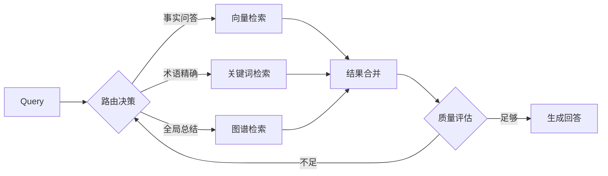
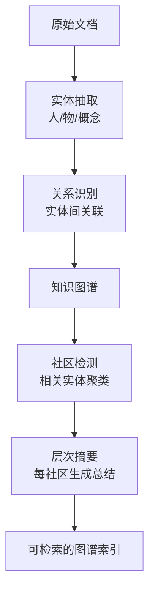
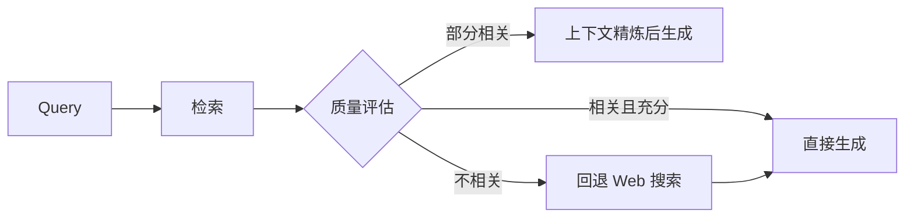

## 一、闭卷考试的困境：LLM 为什么需要"开卷"

想象一场闭卷考试。你背了一本百科全书进考场，但不能带书。题目问"2026 年 6 月 24 日的最新汇率"，你愣住了——因为你背的是 2024 年版本。

LLM 就是这个考生。它的"记忆"是训练时从海量文本中统计出的概率分布，被压缩进模型的参数（权重）里。这种记忆方式叫**参数化记忆**（parametric memory）。

参数化记忆有三个根本缺陷，是"闭卷考试"的必然代价：

| 缺陷 | 根源 | 表现 |
|------|------|------|
| **冻结** | 训练截止后参数不再更新 | 问"最新"必过时 |
| **模糊** | 知识以概率存储，非精确事实 | 一本正经地胡说八道（幻觉） |
| **不可溯源** | 知识融在权重里，无出处 | 答案无法验证，错了不知哪错 |

那扩大参数能解决吗？从 GPT-3 到 GPT-5.5，参数涨了几个数量级，幻觉减少但没消失。为什么？因为再大的模型，知识仍然是**训练时冻结的、概率压缩的、不可溯源的**。规模能缓解症状，治不了病根——这就好比给考生换了个更大的脑子，但他背的还是那本旧版百科，仍然记不准、仍然不能带书、仍然没法说"这条答案出自第几页"。

本质矛盾就在这里：

```
参数化记忆：静态的、模糊的、不可溯源的
真实世界知识：动态的、精确的、需要溯源的
```

### RAG 的解法：非参数化记忆

既然闭卷考不好，那就开卷考。把知识从参数里拿出来，放进外部知识库；考试时先翻书找相关几页，放进上下文，再基于上下文回答。

这就是 **RAG（Retrieval-Augmented Generation，检索增强生成）**——把"检索"和"生成"组合，让模型不再靠死记硬背，而是靠开卷找资料。

从概率角度理解，这是职责的分离：

```
纯 LLM 回答：  P(answer | query)                      ← 只靠参数里的概率
RAG 回答：     P(answer | query, retrieved_context)    ← 参数负责语言能力，外部库负责事实
```

- **语言能力**靠参数（训练时获得）——怎么组织语言、怎么推理
- **事实知识**靠检索（运行时获得）——具体是什么、什么时候、在哪里

这正是 Lewis 等人在 2020 年那篇奠基论文《Retrieval-Augmented Generation for Knowledge-Intensive NLP Tasks》里提出的最纯粹的设计思想。哪怕当时还没有 ChatGPT，作者就看清了：与其无限扩大参数去装下所有知识，不如给模型配一个可随时更新的外部索引。

> **一个关键认知**：RAG 的本质不是"检索 + 生成"这个动作组合，而是**给 LLM 装上可更新的外部记忆**。后续所有演进——三阶段架构、知识图谱、Agent——都是围绕"记忆的质量、结构、主动性"在做文章。看清这一点，后面的发展脉络就一目了然。

### 本站就是一个最朴素的 RAG 知识库

本站遵循 [PDC](/pdc-protocol.md)（平行数据通道（PDC）），构建时为每篇文章生成 `/api/posts/<slug>.md` 纯 Markdown 文件。这本质上就是给 AI 准备的"开卷资料"——AI 检索到文章，读纯 Markdown，再回答用户。一个静态博客，天然就是一个最朴素的 RAG 知识库：人类看 HTML，AI 读 MD，两条通道并行。

## 二、开卷了为何还答非所问：三阶段演进

开卷考试也有考砸的。找到了书，但翻错了页；翻对了页，但没做重点标记；做了标记，但笔记太多淹没了重点。

这就是 RAG 从"能用"到"好用"要跨越的鸿沟。同济大学、复旦大学的综述论文《Retrieval-Augmented Generation for Large Language Models: A Survey》极清晰地把这段演进分成了三个阶段。

### Naive RAG（初级）：翻错页的考生

最朴素的流程，一条直线走到底：

```
文档切块 → 向量化 → 检索 Top-K → 拼进上下文 → 生成回答
```

它失败在三个环节，每个都对应一种"翻错页"：

| 失败模式 | 例子 | 后果 |
|---------|------|------|
| **召回失败** | 用户问"怎么部署"，文档里写"发布流程"，向量相似度低 | 相关内容根本没检索到 |
| **排序失败** | 召回 10 段，最相关的那段排第 8 | 被截断丢弃，喂了次相关的 |
| **上下文污染** | 塞了 10 段进上下文，7 段无关 | 稀释注意力，答非所问 |

第三种失败尤其值得警惕。它正是[提示词工程](/posts/ai-prompt-engineering/)一文讲过的"上下文过载"反模式——上下文窗口是零和博弈，每多一个无关 token，就稀释一次注意力。检索不是越多越好，而是越准越好。

### Advanced RAG（高级）：检索前后各加一道工序

在检索前后各补一道优化：

```
        ┌─────────── 检索前优化 ───────────┐    ┌── 检索后优化 ──┐
Query → │ 重写 / 拓展 / HyDE              │ → 检索 → │ Rerank / 压缩 │ → 生成
        └────────────────────────────────┘    └───────────────┘
```

**检索前优化**——让查询更可能命中：

- **Query 重写**：把口语化提问改写为检索友好的表述（"怎么部署" → "Hexo 部署到 GitHub Pages 的步骤"）
- **Query 拓展**：生成多个同义查询，并行检索取并集
- **HyDE**（Hypothetical Document Embeddings）：先让模型生成一个"假设性答案"，用这个答案去检索——因为答案和文档的表述更接近，比用原始问题检索命中率高

**检索后优化**——让最相关的排前面：

- **Rerank 重排**：召回阶段用轻量向量检索（求快），重排阶段用更重的模型对 Top-K 精排（求准），最相关的排前面
- **上下文压缩**：剔除冗余 token，只保留与问题强相关的句子，避免上下文污染

### Modular RAG（模块化）：从直线到路网

Advanced RAG 仍是固定流程，Modular RAG 打破这一点，支持**动态路由**和**迭代检索**：



判断"该检索哪个源""一轮够不够""要不要换角度重来"——路由决策成了新的核心。

### 看透本质：瓶颈在转移

三阶段演进的驱动力，是**检索质量的瓶颈在逐级转移**：

| 阶段 | 瓶颈在哪 | 优化重心 |
|------|---------|---------|
| Naive | 召回——能不能找到 | 切块、Embedding 质量 |
| Advanced | 精度——找到的够不够准 | Rerank、上下文压缩 |
| Modular | 路由——该不该检索、检索什么 | 动态决策、迭代控制 |

这个洞察的实践价值在于：**优化哪一环，取决于瓶颈在哪**。召回本身就漏了，盲目加 Rerank 是南辕北辙；召回够准但排序混乱，再优化切块也是白费。先定位瓶颈，再对症下药——这是工程思维，不是技术堆砌。

## 三、最后一公里的工程血泪

前面讲的都是干净的检索流程。但真实世界的文档不是干净的 Markdown。PDF 里的表格、扫描件、混合排版、多栏布局——解析它们才是 RAG 落地最脏最累的活。

Anyscale / LlamaIndex 的生产实践文章把这称为"最后一公里"问题：算法再先进，喂进去的是垃圾，出来的也是垃圾（Garbage In, Garbage Out）。

### 文档解析：表格是重灾区

大模型最怕表格数据错乱。一份财务报表，解析后行列错位、数字串了格，检索到了也是错的。

```
原始 PDF 表格：              解析后的"灾难"：
┌────────┬────────┐         项目        金额
│ 项目   │ 金额   │         ─────────────────
│ 营收   │ 1,200  │         营收 1,2     00
│ 成本   │ 800    │         成本 8       00
└────────┴────────┘         净利 4       00
```

数字被拆碎，意义全毁。解法是使用能理解版面结构的解析器（保留表格的行列关系），而非把 PDF 当纯文本流处理。**文档解析的质量，决定了 RAG 的上限**——后面的检索再精妙，也救不回喂错的数据。

### Chunk 策略：怎么切决定怎么找

文档切块（Chunking）直接影响检索精度：

| 策略 | 做法 | 优点 | 缺点 |
|------|------|------|------|
| 固定大小 | 每 512 token 切一刀 | 简单 | 从句子中间切断，破坏语义 |
| 语义切分 | 按段落/标题切 | 保语义完整 | 块大小不均 |
| 递归切分 | 先按大结构，再按小结构 | 兼顾两者 | 实现复杂 |

**切分策略应由知识形态决定**。本站的做法是：一篇文章 = 一个 chunk。因为博客文章本身是完整语义单元，强行切碎反而破坏上下文；检索粒度取整篇，再由 AI 读取全文。这是"知识形态决定架构"的典型例子——没有万能切分法，只有最匹配场景的切分法。

### Hybrid Search：关键词和语义各有所长

单一检索方式都有盲区，混合检索（Hybrid Search）取两者之长：

| 检索方式 | 擅长 | 盲区 |
|---------|------|------|
| **BM25**（关键词） | 术语、专有名词、代码标识符 | 同义改述、跨语言 |
| **Vector**（语义） | 同义、改述、跨语言 | 精确术语命中弱 |

两者互补：用户搜"RAG"，BM25 精确命中含"RAG"的文档；用户搜"检索增强生成"，Vector 找到含"RAG"的文档。混合检索 = 召回并集 + 分数融合重排，保证"该命中的不漏"。

### 看透本质：检索质量是个乘积

```
检索质量 = 文档质量 × 切分质量 × 匹配质量
```

三者任一为短板，整体塌方。这是"木桶效应"在 RAG 里的体现——别只盯着最花哨的那一环，先找到最短的那块板。

## 四、只见树木不见森林：GraphRAG

传统 RAG 有一个绕不开的盲区：它只能找"局部的某几句话"。

问"RAG 的三阶段是什么"——局部检索能答，因为答案就在某一篇文档里。

问"总结我博客过去一年关于系统优化的核心观点"——局部检索无能为力。因为答案不在任何一篇文章里，而散布在几十篇文章中，需要跨文章综合、提炼、归纳。

这就是"只见树木不见森林"的困境。微软研究院的 GraphRAG（*From Local to Global*）改变了游戏规则。

### 从文件柜到知识图谱

传统 RAG 的知识库像一个"文件柜"——只存文档，文档之间没有关系。

GraphRAG 先用 AI 把文档梳理成一张"实体-关系"知识图谱，再做社区检测，为每个社区生成层次摘要：



知识图谱不只是存文档，**还存文档之间的关系**——而关系本身就是知识。"A 依赖 B""A 是 B 的子类"这些关联，在原文里可能是隐含的，图谱把它们显式化。

### Local Search 与 Global Search

检索时分两种模式，对应两类问题：

| 模式 | 回答什么 | 怎么找 |
|------|---------|--------|
| **Local Search** | 具体实体问题（"RAG 三阶段是什么"） | 定位实体，取相关子图 |
| **Global Search** | 全局性问题（"本站技术文章的核心主题有哪些"） | 遍历社区摘要，Map-Reduce 式总结 |

Global Search 是 GraphRAG 的核心创新：它不是检索"某几句话"，而是把所有社区摘要喂给模型做归纳。这让 AI 具备了"宏观大局观"——能从全局视角回答问题，而不只是从一个点找答案。

### 看透本质：关系也是知识

GraphRAG 的本质，是把知识库从"文件柜"升级为"知识图谱"：

```
文件柜：    文档1, 文档2, 文档3 ...（彼此孤立）
知识图谱：  文档1 ──关系── 文档2 ──关系── 文档3（彼此关联）
```

但 GraphRAG 有成本代价：构建图谱需要大量 LLM 调用（抽取实体、生成摘要），索引成本远高于纯向量库。它适合"文档相对稳定、频繁做全局查询"的场景，不适合"文档每天变、只做单点问答"的场景。**技术的选择，永远是问题特征和成本约束的权衡**——没有银弹。

## 五、从被动查资料到主动做研究：RAG 与 Agent

固定流程的 RAG 是一条直线：`query → retrieve → generate`。但真实问题往往需要多步推理、动态决策。

### 翻书员 vs 研究员

固定流程的 RAG 像一个"翻书员"——你告诉他查什么，他去翻，翻完给你。但研究员不是这样工作的：

- 研究员会自己判断"这个问题需要查资料吗"
- 会决定"查哪个库、用什么关键词"
- 会评估"查到的够不够、要不要换个角度再查一轮"
- 会综合多轮检索结果，形成完整答案

这就是 RAG + Agent 的演进方向——把检索决策权从"写死的流程"交给"模型自主决策"。

### 四种 Agent 化 RAG 模式

| 模式 | 核心思想 | 解决什么 |
|------|---------|---------|
| **ReAct** | 思考-行动-观察循环 | 让模型边想边查边看，而非一次定生死 |
| **Self-RAG** | 模型自主决定何时检索、检索结果可不可信 | 避免无谓检索和盲信检索 |
| **Corrective RAG** | 检索结果质量自评，不好就回退 | 带质检的检索，不可靠就换路 |
| **Agentic RAG** | 编排多源多轮检索 | 像研究团队一样协同 |

Corrective RAG（CRAG）值得单独看清，因为它体现了一种通用思维——**带质检的流程**：



不是检索完就盲目用，而是先评估"检索结果靠不靠谱"——靠谱就用，不靠谱就换路。这个"检索-评估-回退"的闭环，比"检索完就塞上下文"可靠得多。

### Agent 的检索需要标准化接口

当 Agent 要检索多个知识库时，每个库都有私有 API，对接成本爆炸——这正是 [MCP 协议](/posts/ai-mcp-protocol/)解决的 M×N 集成难题。

MCP 把检索能力封装为标准 **Tool 原语**：Agent 不需要知道每个知识库的私有 API，只需调用统一的 MCP Tool。本站的 MCP 适配器，正是让 Agent 能通过标准协议检索博客内容——检索从"流程里写死"变成"模型按需调用的工具"。

### 看透本质：记忆的主动性

```
RAG：       给模型"开卷资料"      → 找得到
GraphRAG：  给模型"关系网络"      → 看得全
Agent：     让模型"会自己找"      → 主动找
```

三者不是替代关系，而是同一条记忆进化线的三个维度。Agent + RAG + 知识图谱的组合，才是完整的"主动研究"能力——既找得到、又看得全、还会自己决策怎么找。

## 六、零成本起步：Serverless RAG 实践

想做 RAG，但不想搭服务器、不想运维向量数据库。pgvector + Supabase 是最轻的起步路径。

### 不建图书馆，租个储物柜

pgvector 是 Postgres 的扩展，让数据库原生支持向量存储和相似度查询。Supabase 是开源 Postgres 的托管版，免费额度足够跑通 MVP。

本质是：**用你已有的数据库（Postgres）兼做向量库，零额外运维**。不建图书馆，租个储物柜——先用起来，验证想法，再考虑升级。

### 关键片段示意

建表与索引：

```sql
CREATE EXTENSION vector;

CREATE TABLE documents (
  id BIGSERIAL PRIMARY KEY,
  content TEXT,
  embedding VECTOR(1536)
);

CREATE INDEX ON documents USING ivfflat (embedding vector_cosine_ops);
```

插入数据：

```python
embedding = embed(text)
db.execute(
    "INSERT INTO documents (content, embedding) VALUES (%s, %s)",
    (text, embedding)
)
```

相似度查询：

```sql
SELECT content, 1 - (embedding <=> $1) AS similarity
FROM documents
ORDER BY embedding <=> $1
LIMIT 5;
```

`<=>` 是 pgvector 的余弦距离运算符，越小越相似。`ivfflat` 索引用近似最近邻算法加速搜索，牺牲一点点精度换大幅性能提升。

### MVP 到生产的演进路径

| 阶段 | 存储 | 适用 | 升级信号 |
|------|------|------|---------|
| MVP | pgvector（单机） | 验证想法，< 10 万向量 | 查询变慢 |
| 起步 | Supabase（托管） | 小团队，免运维 | 数据量超免费额度 |
| 生产 | 专用向量库（Milvus/Pinecone） | 大规模、高并发 | 需要分布式检索 |

架构不变，只换存储层——这是渐进式架构的核心：**先用最简方案验证价值，再按需升级**。

## 七、本质回归与路径选择

抽象是理解世界的方式，但本质才是解决问题的关键。RAG 之所以重要，不是因为它"新"，而是因为它精准命中了一个永恒矛盾：**参数化记忆的静态模糊 vs 真实知识的动态精确**。

### 三个本质洞察

**洞察一：RAG 的本质是"可更新的外部记忆"**

所有演进——三阶段、GraphRAG、Agent——都在优化记忆的三个维度：

```
质量：找得准（Advanced RAG 的 Rerank）
结构：看得全（GraphRAG 的关系网络）
主动性：会自己找（Agent 的自主检索）
```

理解了这三个维度，面对任何新框架，你都能问出对的问题：它在优化哪个维度？我的瓶颈在哪个维度？

**洞察二：三阶段驱动力是"瓶颈转移"**

```
Naive    瓶颈在召回 → 优化切块、Embedding
Advanced 瓶颈在精度 → 优化 Rerank、压缩
Modular  瓶颈在路由 → 优化动态决策
```

看不清瓶颈在哪，优化就是盲打。先定位瓶颈，再对症下药——这是工程，不是堆技术。

**洞察三：RAG / GraphRAG / Agent 是一条线的三个维度**

```
RAG       解决"找得到"    → 局部事实
GraphRAG  解决"看得全"    → 全局归纳
Agent     解决"会主动找"  → 多步推理
```

它们不是三个独立技术选 A 还是 B，而是可以组合的能力。一个成熟的知识库系统，往往三者并用。

### 三个可迁移的设计模式

从这些技术里，抽象出三个能跨场景复用的设计模式：

**模式一：平行数据通道（本站 PDC）**

人类看 HTML，AI 读 MD。知识库和展示层分离，互不干扰。构建时一次生成，运行时零开销。这本质上是"为不同消费者提供不同形态的同一份数据"——人需要丰富 UI，AI 需要干净内容，两者不能在同一个 HTML 里兼得。

**模式二：检索-评估-回退（Corrective RAG 的本质）**

检索后先评估质量，不好就回退。这不止用于 RAG——任何"获取外部数据"的流程都适用：先评估数据可不可靠，不可靠就换路。这是"带质检的获取"，比盲目信任外部输入可靠得多。

**模式三：工具化检索（MCP 协议）**

把检索能力封装为标准 Tool，Agent 按需调用。检索从"流程里写死"变成"模型自主决策的工具"。这是 Agent 时代的通用范式——把能力封装为工具，让模型决定何时用、怎么用。

### 工程选型决策矩阵

没有银弹，只有最匹配场景的选择。以知识形态和任务类型为两轴：

| 任务 ＼ 知识 | 结构化（数据库） | 非结构化（文档） | 混合 |
|-------------|----------------|-----------------|------|
| **事实问答** | Text2SQL | Naive / Advanced RAG | Hybrid Search |
| **多跳推理** | Text2SQL + Agent | Modular RAG | Agent + 多源检索 |
| **全局总结** | 聚合查询 | GraphRAG（Global） | GraphRAG |

选型三步法：

1. **看知识形态**：是结构化数据还是文档？决定用 SQL 还是向量检索
2. **看任务类型**：是查事实、多跳推理、还是全局总结？决定用 Naive、Modular 还是 GraphRAG
3. **看成本约束**：文档稳定吗？查询频繁吗？决定要不要上 GraphRAG 的重索引

### 本站就是一个 RAG 的 MVP

把视角拉回本站，你会发现它完整走通了 RAG 的核心链路：

| RAG 环节 | 本站实现 |
|---------|---------|
| 知识库 | `/api/posts/*.md` 纯 Markdown 文章 |
| 平行数据通道 | PDC：人类看 HTML，AI 读 MD |
| 检索入口 | `/api/index.json` 结构化索引 |
| 检索工具化 | MCP 适配器：Agent 通过标准协议检索 |
| 检索权限控制 | 加密文章：正文保护，不泄露 |

一个静态博客，没有向量数据库、没有 Embedding 模型，却完整体现了 RAG 的设计思想——**因为 RAG 的本质不是技术栈，而是"给 AI 提供可更新的外部记忆"这个思路**。技术是手段，思路才是本质。

## 总结

| 本质矛盾 | 破解之道 | 演进方向 |
|---------|---------|---------|
| 参数化记忆静态、模糊、不可溯源 | 非参数化记忆：检索增强 | RAG 诞生 |
| 检索到 ≠ 检索准 | 检索前后优化、动态路由 | 三阶段演进 |
| 真实文档脏乱差 | 解析、切分、混合检索 | 工程实践 |
| 局部检索看不到全局 | 实体关系图谱 + 社区摘要 | GraphRAG |
| 固定流程不会自主决策 | 模型自主决定何时检索 | RAG + Agent |

核心原则：**RAG 的本质是给 LLM 装上可更新的外部记忆。所有演进都在优化记忆的质量（找得准）、结构（看得全）、主动性（会自己找）。**

抽象帮我们理解这条进化线，但落地时永远回归本质——先问"我的瓶颈在哪个维度"，再选对应的技术。不看瓶颈盲目堆技术，是工程上的南辕北辙。

## 参考资料

- Lewis et al. (2020) *Retrieval-Augmented Generation for Knowledge-Intensive NLP Tasks* — RAG 概念起源，参数化与非参数化记忆的奠基论文
- Gao et al. (2023-2024) *Retrieval-Augmented Generation for Large Language Models: A Survey* — 最全面的 RAG 综述，三阶段分类法（Naive / Advanced / Modular）
- Anyscale / LlamaIndex *Building RAG in Production: Lessons Learned* — 一线工程实践，文档解析、Chunk 策略、Hybrid Search
- Edge et al. (2024) *From Local to Global: A Graph RAG Approach to Query-Focused Summarization* — 微软 GraphRAG，知识图谱增强检索
- *The Modern AI Stack: Serverless Vector Search with pgvector, Supabase, and Cohere* — Serverless RAG 实践，零运维向量库
- 本站 [MCP 协议详解](/posts/ai-mcp-protocol/) — 检索能力工具化的标准协议
- 本站 [PDC](/pdc-protocol.md) — 平行数据通道，最朴素的 RAG 知识库实现
