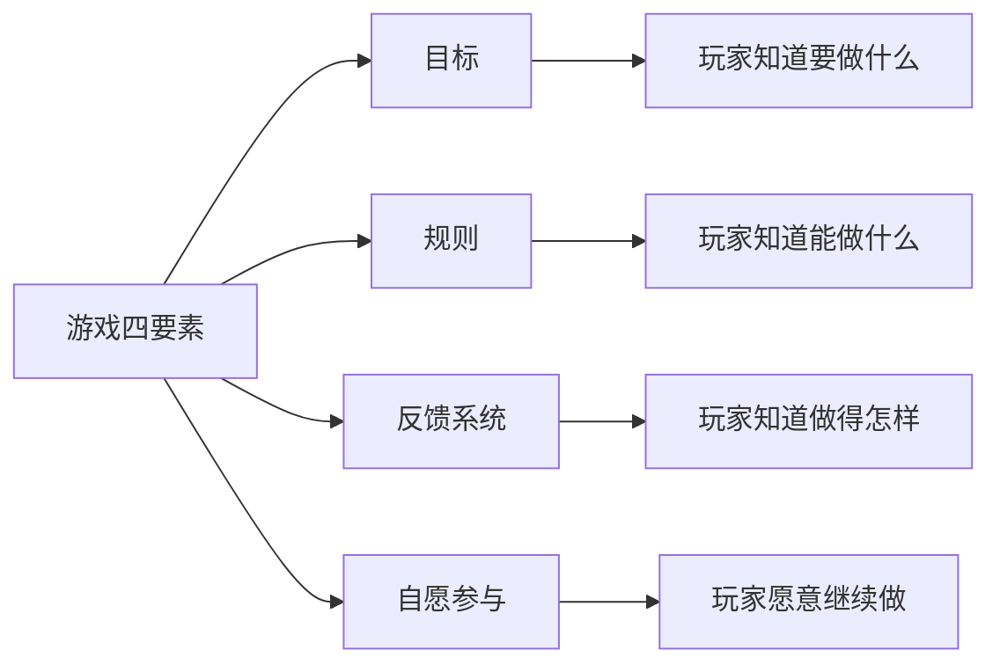
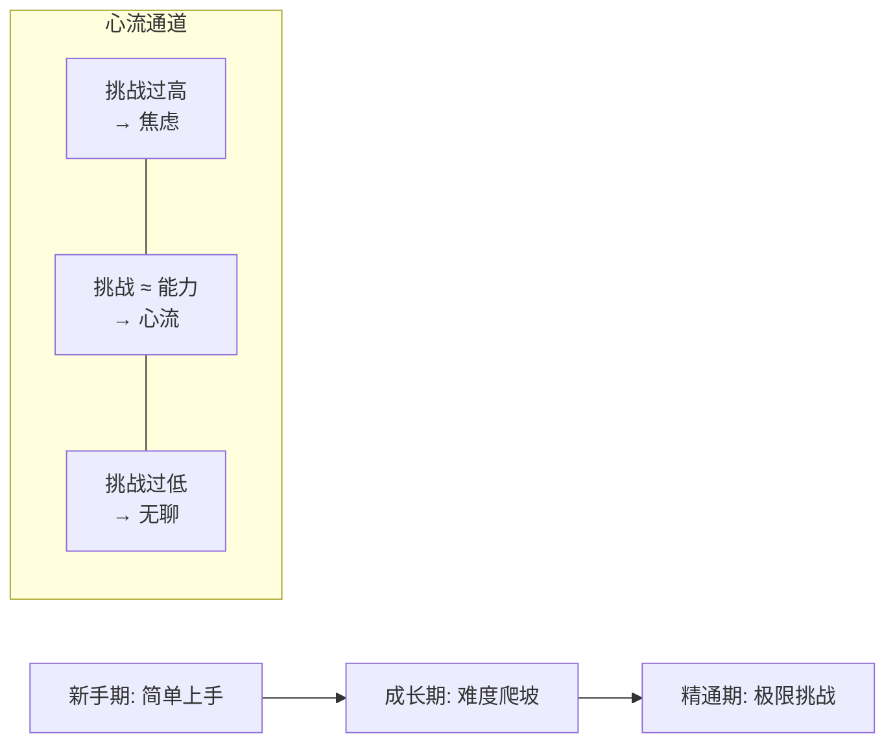
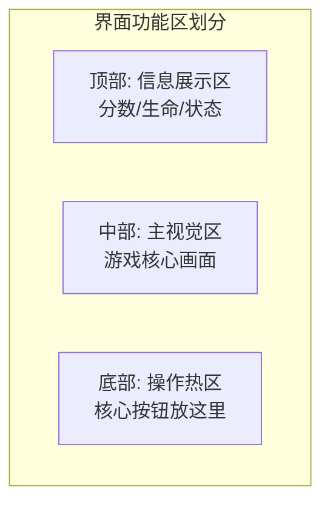
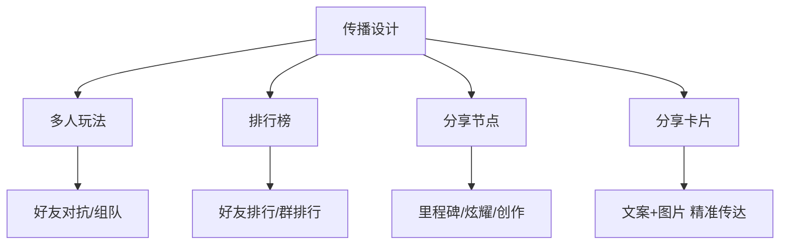
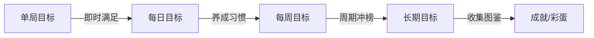
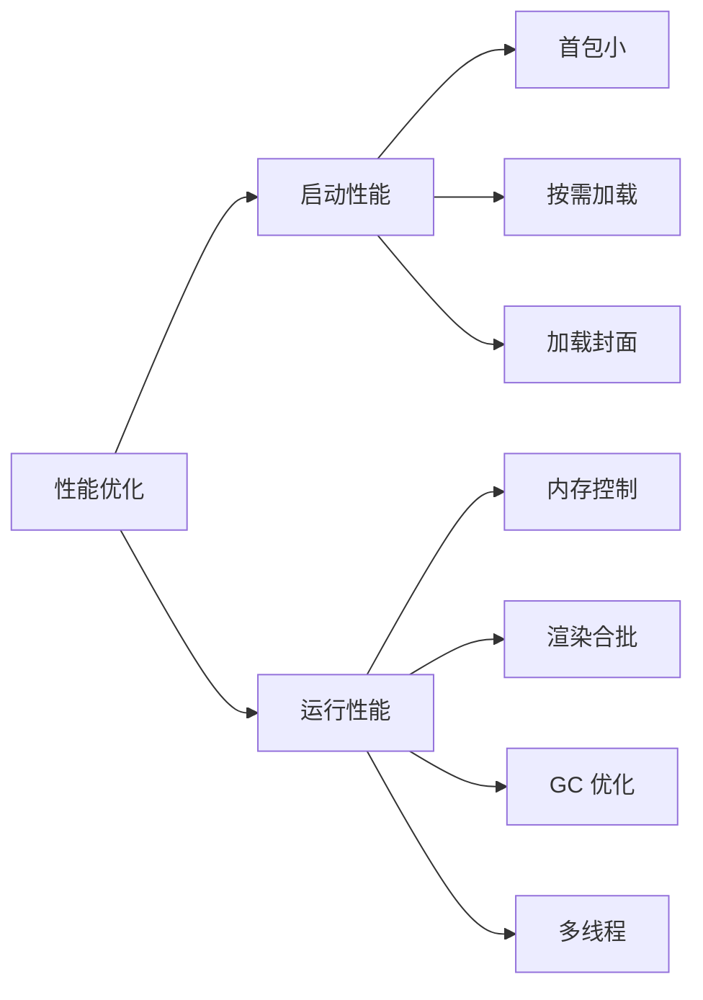

## 为什么开发者应该懂游戏设计

很多开发者有个误区：游戏设计是策划的事，我只要把功能实现出来就行。但小游戏领域恰恰相反——这是一个**一个人就能独立完成产品**的赛道，没有专职策划替你思考"好不好玩"。你不理解设计，做出来的就只是"能跑的代码"，而不是"能留住人的游戏"。

微信小游戏自 2017 年《跳一跳》上线至今，用户规模已达 10 亿，平台累计服务超过 40 万开发者。它无需下载安装、即点即玩，且天然绑定微信关系链。这个生态最迷人的地方在于：**一款好小游戏，可以由一个小团队甚至个人做出爆款**。

但前提是——你得懂设计。本文结合微信官方小游戏设计指南、法国超休闲游戏之王 Voodoo 的设计理念，以及 Cocos 引擎社区的开发实践，从"设计灵魂"出发，带你建立完整的游戏设计思维。

## 一、游戏设计的灵魂：四要素

先回答最根本的问题：**什么才叫一个游戏？**

微信官方设计指南引用了游戏设计师 Jane McGonigal 的理论——构成一个游戏，需要四个基本要素：

这四点就是游戏设计的灵魂，缺一不可：

- **目标**——给玩家明确的获胜条件。没有目标，玩家不知道自己在干什么。《跳一跳》的目标是"跳得更远得更高分"，简单到一句话能说清。很多新手做游戏失败，第一个原因就是目标模糊，玩家玩了两分钟还不知道"我到底要干嘛"。
- **规则**——制定清晰的游戏规则，定义玩家"能做什么"和"不能做什么"。规则是创造挑战的来源，也是乐趣的边界。规则越简单清晰，门槛越低；但规则组合的深度，决定了游戏的上限。
- **反馈系统**——对玩家的每一次操作及时响应，给予激励反馈。你点了一下屏幕，角色跳了、分数涨了、音效响了、粒子飞了——这就是反馈。**反馈越及时、越丰富，玩家越沉浸。** 这是制造"爽快感"的核心机制。
- **自愿参与**——当玩家清楚了前三点后，能够自发地继续玩下去。好的游戏不是靠强迫留人，而是让玩家"自己想再来一局"。

> **设计检查清单**：做任何游戏前，先用一句话回答这四个问题——玩家要完成什么目标？遵循什么规则？操作后能得到什么反馈？为什么会想继续玩？如果答不清楚，说明设计还没想透。

这四要素不是理论口号，而是检验设计的**第一性原理**。后面所有的设计维度——体验、传播、留存、创收——都是在这四点基础上的展开和细化。

## 二、体验设计：让玩家"爽"的四个维度

四要素是骨架，体验设计是血肉。微信官方把游戏体验的创新拆成四个维度：玩法、剧情、美术、音乐。

### 2.1 玩法创新——游戏的引擎

玩法是游戏的核心驱动力。创新可以是全新品类，比如《跳舞的线》开创的音乐节奏玩法；也可以是**经典玩法 + 改造**，比如《五子棋大作战》在传统五子棋上叠加新规则。

对个人开发者和小团队来说，**从零创造全新玩法难度极高、风险极大**，更务实的路径是"微创新"：在已被验证的经典玩法（消除、跑酷、放置、塔防）上，叠加一个独特的变化点。

玩法设计的核心是打磨**心流体验**——让难度曲线与玩家能力同步增长：

难度太高玩家焦虑流失，太低玩家无聊流失，只有在"挑战约等于能力"的通道里，玩家才会进入忘我的心流状态。这就是为什么很多游戏要做"动态难度"——根据玩家表现实时调节。

### 2.2 剧情创新——沉浸的钩子

不是所有小游戏都需要剧情，但有剧情的游戏能让玩家更有代入感。设计剧情围绕四个要素展开：

| 要素 | 作用 | 示例 |
|------|------|------|
| 背景设定 | 创造独特世界观，让游戏"有故事" | 末日废土、奇幻王国 |
| 角色带入 | 刻画角色个性，给玩家代入感 | 主角有性格、有目标 |
| 剧情递进 | 丰富情节与反转，激发探索欲 | 支线任务、隐藏结局 |
| 情节发散 | 留白让玩家自行想象和发挥 | 多结局、开放叙事 |

例如《甜蜜糖果屋》将插画与真人剧情结合，带给玩家独特的沉浸感，成功吸引了女性玩家群体。

### 2.3 美术创新——第一眼的吸引力

美术是玩家接触游戏的第一印象，突破固有风格的美术能瞬间抓住眼球。创新范围包括 UI 界面、色彩、原画、风格、氛围和动效。

经典案例是《蛇它虫》——它本质是个推箱子游戏，但采用"皮影戏 + 剪纸"的传统艺术风格，浓浓的中国风让一个老玩法焕发新生。

**对小团队的关键启示**：美术资源有限时，不要追求"大而全的写实"，而要追求"一个强烈的风格标签"。一个鲜明的风格比平庸的高精度更有记忆点。

### 2.4 音乐创新——看不见的氛围营造

音乐和音效是常被新手忽略的维度，但它们对沉浸感的影响巨大。切合内容的背景音乐能定义游戏情绪——

《木水火土》的背景音乐用空山鸟鸣，操作音效用悦耳的木鱼声，营造了禅意氛围，让玩家更专注。这说明音效不需要"好听"，而需要"贴题"。有时候一个简单的木鱼声，比一段交响乐更能定义游戏气质。

> **体验设计总结**：四个维度不必面面俱到，但至少有一个维度做到"有记忆点"。玩法是地基，美术是门面，剧情是钩子，音乐是氛围。一个有灵魂的游戏，往往是某一个维度做到了极致。

## 三、新手引导与界面布局：降低流失的第一道关

### 3.1 新手引导的四条原则

玩家打开你的游戏后，前 30 秒决定去留。新手引导的好坏直接影响次留。微信官方给出四条原则：

**① 渐进式引导，不要一次性灌入**
玩法复杂时分步骤教学，让玩家一步步上手，而不是一上来甩出满屏文字说明。

**② 边玩边学，不要用文本描述规则**
最好的引导是让玩家在做中学会。用高亮、箭头、手势提示引导操作，而不是弹出一个对话框写"请点击右下角的按钮进行攻击"。

**③ 教程要有明确的入口**
玩家如果忘了规则，应该能随时找到重新学习的路径。很多游戏把"帮助"藏在三层菜单里，这是设计缺陷。

**④ 只教必要规则，保留探索空间**
不要把所有技巧都罗列出来。告知基本规则，剩下的让玩家自己发现——探索本身是乐趣的一部分。

### 4.2 界面布局：拇指热区与设计基准

界面布局直接影响操作体验。微信基于用户数据分析给出建议：

- **设计稿基准**：4.7 寸屏幕的 750 × 1334（多数用户屏幕比例 9:16），以此为基准等比缩放兼容其他设备，刘海屏等特殊机型单独适配。
- **拇指热区**：单手握持手机时，拇指自然触达区域有限。核心操作按钮应放在拇指易触达区域，次要功能放在边缘。

> **布局原则**：主视觉区域始终为游戏内容本身，功能按钮不喧宾夺主，互推跳转等推广元素更不能遮挡游戏画面。

## 四、超休闲游戏设计哲学：Voodoo 的"简单即真理"

法国超休闲游戏之王 Voodoo（《黑洞大作战》《Stack》等爆款的缔造者）的发行经理分享了一个核心设计理念：**简单就是最好的**。

### "地铁上的人群"思维

Voodoo 的目标玩家定义极其朴素——**所有人**。从 7 岁小孩到 77 岁老奶奶，本质就是"使用智能手机的人"。他们的设计场景假设是：

> 想象一个在地铁上单手拿手机的年轻人，他每段乘车时间可能只有几分钟。

这个场景假设直接推导出了超休闲游戏的硬约束：
- **必须单手操作**——不能要求双手摇杆射击
- **单局时间短**——地铁几站路就要能玩完一局
- **几秒内理解机制**——没有时间看长篇教程

### Voodoo 超休闲游戏五大原则

| 原则 | 含义 | 设计启示 |
|------|------|----------|
| 快餐化 | 单局时间短，奖励丰厚 | 90秒一局，每局都有获得感 |
| 易上手 | 几秒内理解机制 | 一句话能说清玩法 |
| 动画有趣 | 操作反馈花哨丰富 | 反馈系统要做得"爽" |
| 对玩家友好 | 允许失误，惩罚不重 | 失败不挫败，鼓励重试 |
| 玩法优先 | 先好玩再好看 | 核心循环比画面重要 |

### 雷区：不要涉足的区域

Voodoo 特别强调了"反例"：有些游戏开局简单、节奏好，但加入了"碰到火焰/流沙就死"的元素，让整体氛围变得压抑。超休闲游戏要给玩家带来轻松，**凡是让玩家"百分百集中精力才能活"的设计，都不适合这个品类**。

> **灵魂拷问**：你的游戏能在摇晃的地铁里单手玩吗？如果答案是"勉强"或"不行"，对超休闲品类来说就需要做减法。

这五大原则和"地铁思维"看似简单，但它回答了超休闲游戏最根本的问题：**在什么场景下，给什么样的人，提供什么样的体验。** 这就是设计的灵魂——永远从用户场景出发倒推设计，而不是从技术能力出发堆砌功能。

## 五、传播设计：社交裂变的引擎

微信小游戏平台没有中心化的流量入口——这意味着你不能指望"上架就有量"。小游戏的分发靠的是**玩法驱动用户自发社交传播**。这是微信生态最大的红利，也是设计的硬要求。

### 5.1 传播的四大武器

### 5.2 排行榜：激发胜负欲

排行榜是小游戏的标配。朋友间的对比能有效激发游戏动力和传播动力：

- **好友排行榜 + 世界排行榜**：在用户排名变化时主动告知，超越好友时标识出来，形成个性化里程碑记忆
- **群排行榜**：微信群内成员排行，能直接调动游戏话题，增加传播度。群关系比好友关系更能激发"我也来试试"的冲动
- **周期性冲榜**：设置排行榜清除周期（每日/每周），制造周期性的冲榜目标，每次超越/登顶都重新引发讨论

### 5.3 分享节点：少而精

分享设计的核心原则——**分享应是用户的真实意愿表达，不能利诱或强制**。

分享点数量要"宜少宜精不宜多"，**每次游戏过程不宜超过 1 个分享点**。过多的分享点反而会降低分享欲望（选择的悖论）。用户更愿意分享以下内容：

| 分享动机 | 说明 | 示例 |
|----------|------|------|
| 知识分享 | 学到东西有通用性 | 测出你的性格类型 |
| 炫耀性分享 | 创造里程碑节点 | 创造新纪录、超越好友 |
| 个人创作 | 含个人创作性信息 | 自定义角色/关卡 |
| 创造反差 | 与普世认知有反差 | "我竟然是XX型人格" |
| 物品收集 | 收集进度展示 | 图鉴完成度 |

关键红线：**不要设置强迫分享的节点，分享奖励不应损害游戏平衡性**，否则只会加速玩家流失。

### 5.4 分享卡片：聊天里的第一印象

分享卡片是用户在微信聊天里看到的第一眼，它由"分享文案 + 分享图"组成：

- 为不同场景设计不同卡片（邀请 vs 互动）
- 文案口语化、情感化，体现用户情绪
- 图片融入用户个性化内容，增强代入感
- **点击进入后的体验要与卡片内容呼应**，前后不一致会导致秒退

> **传播设计的灵魂**：不是"怎么让玩家分享"，而是"设计什么内容让玩家自己想分享"。前者是套路，后者才是设计。

## 六、留存设计：让玩家回不来

拉新难，留存更难。玩家第一天来了，第二天为什么还要回来？微信官方给出了目标体系设计思路。

### 6.1 多周期目标体系

为游戏设置不同周期的目标，让玩家始终有"要做的事"：

- **单局目标**：每局都有明确的小目标，即时反馈即时满足
- **每日目标**：每日任务、签到奖励，培养每日打开习惯
- **每周目标**：周排行榜重置、周期性活动，制造"这周要冲一波"的动力
- **长期目标**：收集图鉴、解锁角色，在主界面体现进度，给玩家长期追求

### 6.2 收集与成就：长期粘性

**收集图鉴**是最有效的长期留存手段之一。在游戏过程中收集元素，图鉴同时在主界面展示，让玩家随时看到"我集齐了多少"。这种可见的进度感能持续驱动玩家回归。

**成就系统和特殊目标**则提供主线之外的趣味挑战——完成特殊操作、发现彩蛋、达成极限条件，给予额外奖励，给硬核玩家深度内容。

### 6.3 维护用户关系

通过游戏圈、客服等沟通渠道收集反馈、与用户互动。根据玩家反馈调整设计，能提升满意度，让玩家感到"被重视"，更愿意持续投入。

> **留存设计的灵魂**：核心不是"奖励让玩家回来"，而是"目标让玩家有期待"。奖励是手段，目标感才是粘性。玩家留下的原因永远是"还有想完成的事"。

## 七、创收设计：商业化的艺术

小游戏要活下去，就必须考虑变现。微信平台提供两条创收路径：虚拟支付和广告。

### 7.1 虚拟支付（内购）

需先开通虚拟支付能力。常见的商业系统设计：

| 模式 | 说明 | 适用 |
|------|------|------|
| 英雄/皮肤解锁 | 外观个性化，满足炫耀需求 | 有角色系统 |
| 游戏币 | 通用货币，灵活消费 | 经济系统复杂 |
| 功能道具 | 一次性功能增强（复活/提示） | 闯关型 |
| 周期性增值服务 | 月卡/通行证，持续付费 | 长线运营 |
| 抽卡 | 随机获取，刺激付费 | 收集向 |

### 7.2 广告变现

对不想/不能做内购的玩家，广告是替代方案。微信提供 Banner 广告和激励视频广告。

**激励视频广告是最推荐的广告形式**——它是"用户主动选择观看"的广告，体验破坏最小，完播率和转化率最高。关键是把广告嵌入"玩家本就想要的奖励"节点：

| 激励视频场景 | 价值交换 |
|--------------|----------|
| 提高过关奖励 | 看广告 → 奖励翻倍 |
| 再获一次机会 | 看广告 → 续命重来 |
| 获得游戏提示 | 看广告 → 通关帮助 |
| 替代货币消费 | 看广告 → 获得虚拟币 |

> **创收设计的灵魂**：好的商业化不是"从玩家口袋里掏钱"，而是"设计玩家愿意付费的价值交换"。激励视频之所以有效，是因为它让玩家用"注意力"换"游戏收益"——双方都觉得自己赚了。损害体验的强制广告和破坏平衡的付费设计，短期赚钱，长期杀鸡取卵。

## 八、开发者的技术视角：把设计变成现实

理解了设计灵魂，还要能落地。从开发角度看，有几件事必须想清楚。

### 8.1 引擎选择

小游戏开发主流引擎：

| 引擎 | 特点 | 适合 |
|------|------|------|
| Cocos Creator | 国产主流，社区活跃，原生小游戏导出 | 大多数 2D/3D 小游戏首选 |
| Laya | 性能导向，2D 表现好 | 性能敏感的 2D 游戏 |
| Unity WebGL 转化 | 团结引擎适配微信 | 已有 Unity 项目迁移 |
| 原生 Canvas/WebGL | 零依赖，体积最小 | 超轻量小游戏/试玩广告 |

Cocos Creator 是微信小游戏生态里最主流的选择，社区（forum.cocos.org）活跃，资源加载、分包、性能优化都有成熟方案。从社区讨论看，开发者最常遇到的问题集中在：资源首包加载优化、ASTC 纹理压缩、跨平台适配（鸿蒙/PC）、骨骼动画内存等——这些都是上线前必须攻克的工程课题。

### 8.2 微信小游戏运行环境

理解运行环境是做好小游戏的技术前提：

- **即点即玩**：无需下载安装，但意味着首包要小、加载要快
- **关系链能力**：好友列表、排行榜、开放数据域是微信独有红利
- **分包加载**：主包 + 分包，按需下载，控制首包体积
- **云开发/云托管**：免服务器后端，降低个人开发者的运维门槛

### 8.3 性能优化：体验的隐形保障

性能不是"锦上添花"，而是"留存生死线"。卡顿 1 秒可能就流失一批玩家。微信官方把性能分为两块：

**启动性能**——玩家从点击到可玩的时间：
- 控制首包体积，资源按需加载（AssetBundle/Addressable）
- 定制启动封面/启动剧情，掩盖加载等待
- 首场景最小化，只加载必需资源

**运行性能**——游戏过程中的流畅度：
- 内存管理：及时释放、控制峰值、注意 GC 抖动
- 纹理压缩：ASTC 等格式减小内存占用
- 渲染优化：合批、减少 DrawCall
- Worker 多线程：把重计算移出主线程

### 8.4 开放能力地图

微信小游戏提供丰富的开放能力，设计时应提前规划如何利用：

- **社交**：转发分享、关系链数据、排行榜、擂台赛组件
- **留存**：订阅消息、游戏圈、流失用户召回
- **商业化**：虚拟支付、广告组件、CPS 推荐
- **安全**：代码加固、内容安全、反外挂
- **数据**：数据助手、性能监控、异常告警

> **技术视角的灵魂**：技术是设计的脚手架，不是设计本身。先想清楚"做什么游戏、给谁玩、怎么传播怎么留存"，再选引擎、做性能、接能力。本末倒置地先堆技术，往往会做出"技术上很酷但没人想玩"的产品。

## 九、设计灵魂清单：从小白到懂设计

最后，把全文浓缩成一份可执行的设计自检清单。做任何小游戏前，逐条对照：

### 核心设计（灵魂）

- [ ] 能用一句话说清玩家要完成的**目标**吗？
- [ ] **规则**是否清晰，玩家几秒内能理解？
- [ ] 每次操作的**反馈**是否及时、丰富、有满足感？
- [ ] 玩家凭什么**自愿**继续玩下去？

### 体验设计

- [ ] 玩法/剧情/美术/音乐中，至少有一个"有记忆点"的维度？
- [ ] 难度曲线是否匹配玩家成长（心流通道）？
- [ ] 新手引导是否"边玩边学"，而非文字堆砌？
- [ ] 界面布局是否符合拇指热区，主视觉不被遮挡？

### 场景适配

- [ ] 目标用户是谁？在什么场景下玩？
- [ ] 能在地铁里单手玩几分钟一局吗？
- [ ] 失败惩罚是否友好，鼓励重试而非挫败？

### 传播设计

- [ ] 是否有社交传播的设计元素（排行榜/多人/分享）？
- [ ] 分享点是玩家"想分享"还是"被逼分享"？
- [ ] 分享卡片内容与进入后体验是否一致？

### 留存设计

- [ ] 是否有单局/每日/每周/长期的目标层次？
- [ ] 是否有收集图鉴或成就系统提供长期追求？
- [ ] 玩家明天回来，有什么"想完成的事"？

### 商业化

- [ ] 变现方式是否与游戏类型匹配？
- [ ] 激励视频是否嵌入"玩家本就想要的奖励"节点？
- [ ] 付费/广告是否损害了游戏平衡和体验？

### 技术落地

- [ ] 引擎选择是否匹配游戏类型和团队情况？
- [ ] 首包体积是否可控，启动是否够快？
- [ ] 运行性能是否流畅，内存是否达标？
- [ ] 是否规划了开放能力的接入（社交/数据/安全）？

---

## 写在最后

游戏设计的灵魂，归根到底是三个字：**懂玩家**。

Voodoo 想到的是地铁上单手刷手机的人群；微信想到的是用关系链让朋友一起玩的乐趣；《跳一跳》想到的是一个人等电梯时打发时间的 30 秒。**每一个成功的小游戏，都始于对一个具体场景、一类具体人群的深刻理解。**

技术能帮你把游戏做出来，但只有理解了"目标、规则、反馈、自愿"这四要素，理解了体验、传播、留存、创收这四大设计维度，理解了"从用户场景出发倒推设计"这个根本思维——你才能做出**不只是能跑，而是能打动人**的游戏。

从今天起，玩任何小游戏时，试着用这套框架拆解它：它的目标是什么？规则怎么定？反馈做得爽不爽？靠什么传播？靠什么留人？这样拆过十款游戏，你就已经不是一个只懂写代码的开发，而是一个**懂设计灵魂的开发者**了。

> 本文设计原则综合整理自：微信小游戏官方设计指南、微信小游戏开发指南、Voodoo 超休闲游戏设计理念分享、Cocos 中文社区开发实践。
