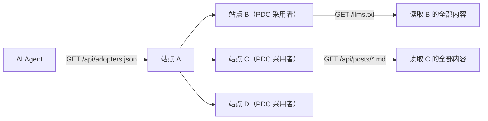

## 为什么需要 PDC

AI 时代，你的博客文章不仅是写给人类看的。越来越多的读者通过 AI 助手获取信息——它们帮你总结、检索、引用。但 AI 读取博客时面临一个尴尬的现实：它必须解析 HTML，剥离导航栏、侧边栏、广告、字数统计等 UI 噪音，才能拿到文章正文。这个过程不可靠、低效，且经常丢失格式。

**PDC**（Parallel Data Channel，平行数据通道（PDC））解决了这个问题：在构建时自动生成一套与 HTML 平行的机器通道（JSON/MD/TXT），AI 直接读取这些端点，零噪音、零解析损耗。

```
传统方式：AI → 解析 HTML → 剥离噪音 → 可能丢失格式 → 得到正文
PDC 方式：AI → GET /api/posts/<slug>.md → 直接拿到纯 Markdown 正文
```

## llms.txt 采用者网络是什么

PDC 不仅是技术实现，也是一个**开放互链网络**。

当你的博客实现了 PDC 后，你可以加入采用者网络：

- 你的站点出现在[友链页](/flink/)，获得反向链接
- 你的站点列入 [`/api/adopters.json`](/api/adopters.json)，其他 AI/Agent 可自动发现你
- 网络成员之间形成内容互链，提升整体搜索可见性

这意味着：**一个 AI 读者访问任何一个 PDC 采用者站点，就能发现整个网络的所有成员**。



## 如何加入（4 步）

### 第 1 步：实现 llms.txt + PDC 扩展端点

PDC 的核心是 3 个必需端点：

| 端点 | 格式 | 用途 | 最简实现 |
|------|------|------|---------|
| `/llms.txt` | TXT | AI 入口：站点概览 + 文章列表 | 手写或脚本生成 |
| `/api/index.json` | JSON | 结构化文章列表（title/url/tags/categories） | 脚本生成 |
| `/api/posts/<slug>.md` | MD | 单篇纯 Markdown 正文（零噪音） | 脚本生成 |

如果你用的是 Hexo，可以直接复用本站的脚本（开源在 [pdc-protocol-verify](https://github.com/Bsheepcoder/pdc-protocol-verify) 仓库有完整规范）。其他静态站点生成器（Hugo/Jekyll）也可以参照规范实现。

完整协议规范见 [`/pdc-protocol.md`](/pdc-protocol.md)。

### 第 2 步：提交申请

在 [GitHub Issues](https://github.com/Bsheepcoder/Bsheepcoder.github.io/issues) 创建 Issue，填写以下信息：

```
站点名称：你的博客名
站点 URL：https://your-blog.com/
头像 URL：https://your-blog.com/avatar.png
一句话描述：50 字以内的站点描述
```

### 第 3 步：自动验证

维护者会运行验证脚本检查你的端点是否可访问：

```bash
git clone https://github.com/Bsheepcoder/pdc-protocol-verify.git
cd pdc-protocol-verify
node verify.js https://your-blog.com/
```

脚本检查两个核心端点：

- `GET <url>/llms.txt` — 返回 200 且内容包含文章列表
- `GET <url>/api/index.json` — 返回 200 且 JSON 结构正确

输出示例：

```
✓ Q's blog (https://bsheepcoder.github.io/)
  /llms.txt → 200 OK
  /api/index.json → 200 OK (24 posts)

✗ Example Blog (https://example.com/)
  /llms.txt → 404 Not Found
  /api/index.json → 404 Not Found
```

不传参数时，脚本会从 `https://bsheepcoder.github.io/api/adopters.json` 拉取全部采用者列表并逐一验证：

```bash
node verify.js
```

### 第 4 步：互链

验证通过后，你的站点会被添加到友链数据中。下次 `hexo g` 构建时：

- 你的站点出现在 [友链页](/flink/) 的"llms.txt 采用者"分类下
- 你的站点列入 [`/api/adopters.json`](/api/adopters.json)
- 你的 `llms_txt` 和 `api_index` 端点自动追加到采用者 JSON 中

## 验证脚本详解

验证脚本（[pdc-protocol-verify](https://github.com/Bsheepcoder/pdc-protocol-verify)）是零依赖的 Node.js 脚本，无需 `npm install`，直接 `node verify.js` 运行。

### 前提条件

- Node.js 18+
- 网络可访问待验证站点

### 验证单个站点

```bash
node verify.js https://your-blog.com/
```

退出码：`0` = 全部通过，`1` = 有失败项。可用于 CI/CD 流水线。

### 验证全部采用者

```bash
node verify.js
```

不传参数时，脚本自动从 `https://bsheepcoder.github.io/api/adopters.json` 拉取采用者列表，逐一检查并输出汇总报告：

```
Found 3 adopter(s). Verifying...

✓ Q's blog (https://bsheepcoder.github.io/)
  /llms.txt → 200 OK
  /api/index.json → 200 OK (24 posts)

✓ Another Blog (https://another.com/)
  /llms.txt → 200 OK
  /api/index.json → 200 OK (12 posts)

✗ Broken Site (https://broken.com/)
  /llms.txt → 0 ERR timeout
  /api/index.json → 0 ERR timeout

==================================================
Total: 3 | Passed: 2 | Failed: 1
```

### 检查项

| 检查项 | 通过条件 | 失败原因 |
|--------|---------|---------|
| `/llms.txt` 可访问 | HTTP 200 | 404/超时/DNS 解析失败 |
| `/api/index.json` 可访问 | HTTP 200 | 404/超时/DNS 解析失败 |
| `/api/index.json` 格式正确 | 可解析为 JSON | 非 JSON/结构错误 |

## 采用者的权利与义务

### 权利

- **反向链接**：出现在友链页面，SEO 友好的 dofollow 链接
- **AI 可发现**：列入 `/api/adopters.json`，其他 AI/Agent 自动发现你的站点
- **网络效应**：成员越多，每个成员被 AI 发现的概率越高
- **MCP 生态接入**：PDC 可通过适配器接入 MCP 生态（Claude Desktop、Cursor 等）

### 义务

- **维持端点可访问**：`/llms.txt` 和 `/api/index.json` 必须长期可用
- **标注 PDC 采用**：在站点可见位置（关于页/页脚/公告）标注 llms.txt 采用

## 为什么不用 RSS 就够了

RSS 解决的是**人类订阅**问题，PDC 解决的是**AI 检索**问题：

| | RSS | PDC |
|---|---|---|
| 目标读者 | 人类（RSS 阅读器） | AI/Agent |
| 内容格式 | HTML 或截断文本 | 纯 Markdown（零噪音） |
| 结构化程度 | 低（title + content） | 高（title/tags/categories/description/加密状态） |
| 分类聚合 | 不支持 | `/api/categories/<slug>.json` |
| 提示词提取 | 不支持 | `<prompt>` 标签自动提取 |
| MCP 适配 | 不支持 | `/api/mcp.json` 清单 |

两者互补，不是替代关系。你的博客应该同时提供 RSS（给人类）和 PDC（给 AI）。

## 一个真实的 AI 检索场景

假设一个用户问 AI："Hexo 博客如何让 AI 读取文章内容？"

没有 PDC 网络时，AI 只能搜索网页、解析 HTML、从噪音中提取信息。

有了 PDC 网络后，AI 的流程是：

1. `GET https://bsheepcoder.github.io/llms.txt` → 发现站点概览和文章索引
2. `GET /api/index.json` → 筛选 tags 含 "AI" 的文章 → 找到 `hexo-ai-data-channel`
3. `GET /api/posts/hexo-ai-data-channel.md` → 直接拿到纯 Markdown 正文
4. `GET /api/adopters.json` → 发现其他 PDC 采用者 → 可继续检索他们的内容

整个流程**零 HTML 解析、零噪音、零格式丢失**。这就是 PDC 网络的价值。

## 现在就开始

1. 阅读 [PDC 规范](/pdc-protocol.md)
2. 在你的 Hexo/静态站点上实现 3 个必需端点
3. 运行 `node verify.js https://your-blog.com/` 自检
4. 在 [GitHub Issues](https://github.com/Bsheepcoder/Bsheepcoder.github.io/issues) 提交申请

期待你的加入。

> **核心原则**：PDC 网络的力量在于互链。每一个新成员不仅自己变得 AI 可发现，还让整个网络的所有成员都更容易被发现。这是正和游戏，不是零和博弈。
