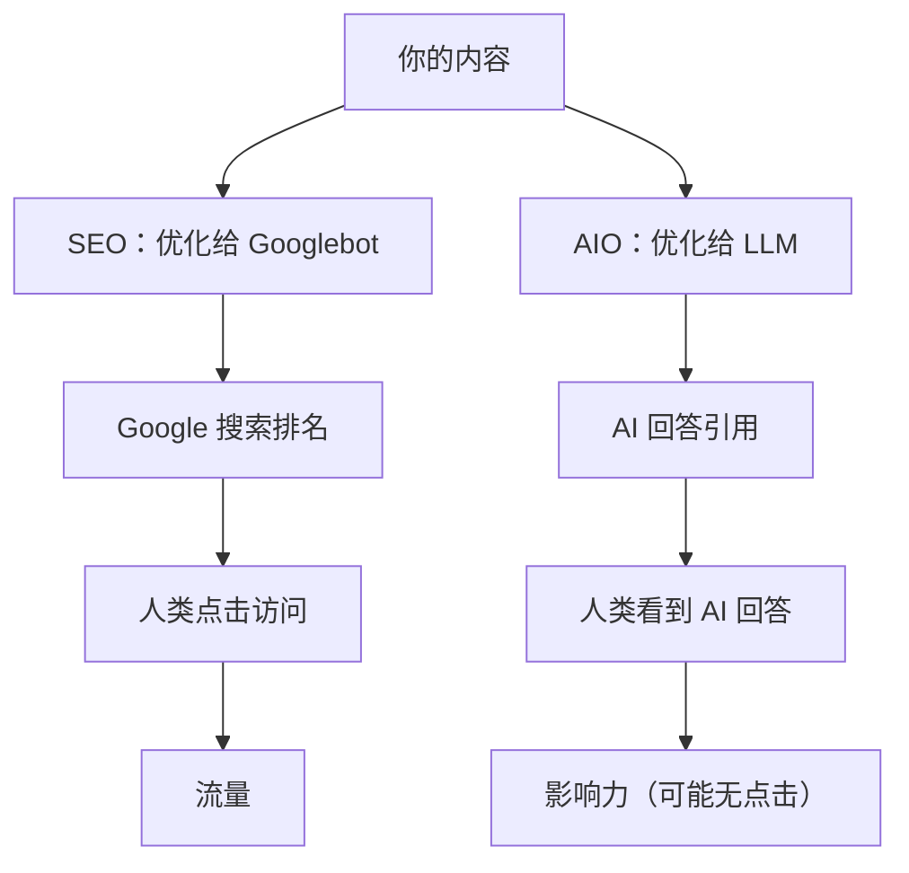
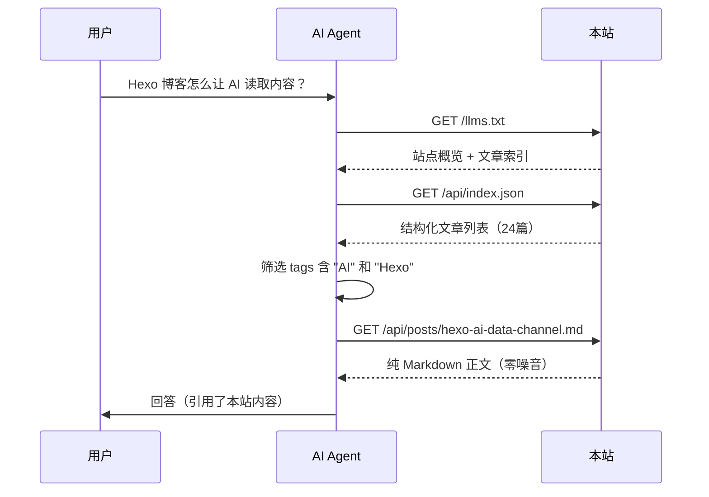

## 搜索正在变天

2024 年开始，一个不可逆的趋势：**用户不再搜索，而是直接问 AI**。

传统搜索流程：

```
用户 → Google 搜索 → 10 条蓝色链接 → 点开网站 → 自己找答案
```

AI 时代的新流程：

```
用户 → 问 AI（ChatGPT/Claude/Gemini/Perplexity）→ AI 直接回答
```

区别在于：用户**不再访问你的网站**。AI 代替用户阅读、筛选、总结，直接给出答案。如果你的内容被 AI 引用了，用户看到的是 AI 的回答——不会点开你的链接。

这意味着：**点击率在下降，但"被引用率"成了新的流量指标**。

| 指标 | 传统 SEO 时代 | AI 时代 |
|------|-------------|---------|
| 核心指标 | 搜索排名（SERP position） | AI 引用率（citation rate） |
| 用户行为 | 搜索 → 点击 → 阅读 | 提问 → AI 回答（可能不点击） |
| 内容消费 | 用户主动阅读 | AI 代理读取 |
| 优化对象 | Googlebot 爬虫 | LLM / AI Agent |
| 内容格式 | HTML（含导航/广告/侧边栏） | 纯文本/Markdown（零噪音） |

## AIO 是什么

**AIO（AI Optimization，AI 优化）** 是让内容被 AI 更容易发现、理解、引用的优化策略。它不是 SEO 的替代品，而是 SEO 的延伸——**SEO 优化给搜索引擎看，AIO 优化给 AI 看**。

行业里也有人叫它 **GEO（Generative Engine Optimization，生成式引擎优化）**，但本质是同一件事：**让你的内容出现在 AI 的回答里**。

### AIO 与 SEO 的关系



两者不矛盾——**做好 SEO 的同时做好 AIO，双通道并行**。但策略不同：

| 维度 | SEO | AIO |
|------|-----|-----|
| 优化对象 | Googlebot / Bingbot | GPT / Claude / Gemini / Perplexity |
| 内容格式 | HTML + meta 标签 | Markdown / JSON / 纯文本 |
| 关键因素 | 关键词密度、外链、页面速度 | 内容质量、结构化程度、可引用性 |
| 排名信号 | PageRank、外链数量 | AI 训练数据覆盖 + 实时检索 |
| 新增手段 | sitemap.xml、robots.txt | llms.txt、结构化 JSON 端点 |
| 测量方式 | Search Console 点击/展示 | AI 引用监测（新兴领域） |

## 为什么 llms.txt 是 AIO 的基础设施

[llms.txt](https://llmstxt.org) 由 Jeremy Howard（fast.ai 创始人）于 2024 年 9 月提出。它的核心洞察是：

> **AI 读取 HTML 太低效了。与其让 AI 解析网页，不如直接给它一个 Markdown 文件。**

llms.txt 的作用类似 sitemap.xml 之于搜索引擎——但服务对象是 LLM：

| 标准 | 服务对象 | 位置 | 格式 | 用途 |
|------|---------|------|------|------|
| robots.txt | 爬虫 | /robots.txt | TXT | 告诉爬虫能抓什么 |
| sitemap.xml | 搜索引擎 | /sitemap.xml | XML | 列出所有页面 URL |
| llms.txt | LLM/AI | /llms.txt | Markdown | 提供站点概览 + 内容索引 |

### llms.txt 的 AIO 价值

1. **零噪音**：AI 直接读 Markdown，不需要解析 HTML、剥离导航栏和广告
2. **结构化索引**：AI 一次请求就能获得站点全部内容概览，减少多轮 fetch
3. **标准化的发现机制**：像 sitemap.xml 一样，AI 知道去 `/llms.txt` 找入口
4. **社区生态**：VitePress、Docusaurus、Drupal 等已内置支持

## 本站实践：从 SEO 到 AIO 的完整路径

本站是一个完整的 AIO 实践案例。以下是实施路径：

### 第一步：基础 SEO（已有）

```yaml
# _config.yml
sitemap:
  path: sitemap.xml
pretty_urls:
  trailing_index: false  # canonical 与 sitemap 一致
```

```text
# robots.txt
User-agent: *
Allow: /
Disallow: /api/
Sitemap: https://bsheepcoder.github.io/sitemap.xml
```

这是传统 SEO 基础——Googlebot 能正确抓取和索引 HTML 页面。

### 第二步：llms.txt（AIO 起点）

```
# Q's blog

> Bsheepcoder 的技术博客，记录 AI、编程、计算机科学的学习笔记

## 文章索引

- [Hexo AI 数据通道实现](/api/posts/hexo-ai-data-channel.md): 构建...
- [什么是好的提示词](/api/posts/ai-prompt-engineering.md): 从 Token...
...
```

AI 读 `/llms.txt` 一次，就能知道这个站点有什么内容、每篇文章在哪里。等价于给 AI 一份"目录"。

### 第三步：PDC 扩展端点（AIO 深化）

llms.txt 是入口，但 AI 需要更结构化的数据。本站基于 llms.txt 标准扩展了 PDC 端点：

| 端点 | AIO 价值 |
|------|---------|
| `/api/index.json` | 结构化文章列表（含 tags/categories/description），AI 可精确筛选 |
| `/api/posts/<slug>.md` | 单篇纯 Markdown，零噪音，AI 直接消费 |
| `/api/categories/<slug>.json` | 按分类聚合，AI 可按主题批量获取 |
| `/llms-full.txt` | 全站全文合并，小站点一次获取 |
| `/api/adopters.json` | 采用者列表，AI 可发现整个 llms.txt 网络 |

### AI 检索流程（真实场景）

当用户问 AI："Hexo 博客怎么让 AI 读取文章内容？"



整个流程：**3 次 HTTP 请求，零 HTML 解析，零噪音**。这就是 AIO 的效果——AI 用最低成本获取你的内容，并引用在回答中。

## AIO 的 5 个实践原则

### 1. 内容要"可引用"

SEO 时代优化关键词密度。AIO 时代优化**可引用性**——AI 更倾向于引用结构清晰、论点明确、有数据支撑的内容。

```markdown
# 差：模糊、主观、不可引用
Hexo 的 AI 数据通道挺好的，大家可以试试。

# 好：具体、可验证、可引用
本站通过 scripts/ai-api.js 在 hexo generate 时自动生成 8 个静态端点，
包括 /llms.txt（AI 入口）、/api/index.json（结构化索引）、
/api/posts/<slug>.md（单篇纯 Markdown）。零运行时开销。
```

### 2. 给 AI 一个干净的入口

HTML 页面有导航栏、侧边栏、广告、字数统计——对 AI 来说全是噪音。`/llms.txt` 提供一个零噪音入口，AI 一次请求就能理解站点。

### 3. 结构化 > 纯文本

`/api/index.json` 比 `/llms.txt` 更高效——AI 可以按 tags、categories 精确筛选，不需要读完全文再判断是否相关。

```json
{
  "title": "什么是好的提示词",
  "url": "/2026/06/18/ai-prompt-engineering/",
  "tags": ["AI", "提示词工程"],
  "categories": ["技术", "人工智能"],
  "description": "从 Token 分词、注意力机制出发..."
}
```

AI 拿到这个 JSON 就能决定是否需要读全文，省 token、省时间。

### 4. 加密内容也要"声明存在"

加密文章的 AI 通道返回 `encrypted: true` + 空 content。AI 知道文章存在，但不泄露正文。这比直接 404 好——AI 能在回答中说"该站点有一篇关于 X 的加密文章"，而不是完全不知道。

### 5. 互链即发现

`/api/adopters.json` 列出所有 llms.txt 采用者。AI 访问任何一个站点，都能发现整个网络的所有成员。这是**网络效应**——成员越多，每个成员被 AI 发现的概率越高。

## AIO vs SEO：不是替代，是叠加

| 场景 | 只做 SEO | 只做 AIO | SEO + AIO |
|------|---------|---------|-----------|
| Google 搜索 | ✅ 有排名 | ❌ 无排名 | ✅ 有排名 |
| AI 回答引用 | ❌ AI 需解析 HTML | ✅ AI 读干净 Markdown | ✅ AI 读干净 Markdown |
| 用户搜索后点击 | ✅ 有点击 | ❌ 可能无点击 | ✅ 有点击 |
| 用户问 AI 后看到 | ❌ 可能不被引用 | ✅ 被引用 | ✅ 被引用 |

**结论**：SEO 和 AIO 不矛盾。SEO 让人类通过搜索引擎找到你，AIO 让 AI 在回答中引用你。两者叠加 = 最大曝光。

## AIO 的测量难题

SEO 有 Google Search Console——你知道每个关键词的展示次数、点击率、排名位置。

AIO 目前**没有标准工具**。你不知道 AI 是否引用了你的内容、引用了多少次、在什么问题上引用的。这是 AIO 最大的未解问题。

**可行的临时方案**：

1. **手动测试**：定期问 ChatGPT/Claude/Gemini 你的领域问题，看回答里是否出现你的内容
2. **API 端点监控**：如果用 Cloudflare Workers 代理 `/llms.txt` 和 `/api/*`，可以统计 AI Agent 的 User-Agent 访问
3. **AI Citation Audit**：Neil Patel 等工具商正在开发"AI 引用审计"工具，可以监测品牌在 AI 回答中的出现频率

## 未来展望

### 短期（6-12 个月）

- llms.txt 被更多 CMS 和文档站采用（VitePress/Docusaurus 已支持）
- Google AI Overviews / Perplexity / ChatGPT Search 开始主动读取 llms.txt
- 出现第一批 AIO 分析工具

### 中期（1-2 年）

- llms.txt 成为网站标配（类似 robots.txt 和 sitemap.xml）
- AI 搜索引擎将"是否提供 llms.txt"作为内容质量信号
- AIO 从"可选优化"变为"必做项"

### 长期（2-3 年）

- AI Agent 直接通过 llms.txt + JSON API 获取内容，绕过搜索引擎
- "AI 引用率"取代"搜索排名"成为内容价值的核心指标
- 内容创作者优化对象从 Googlebot 变为 AI Agent

## 本站的 AIO 实施清单

| 项目 | 状态 | 说明 |
|------|------|------|
| sitemap.xml | ✅ | 传统 SEO 基础 |
| robots.txt | ✅ | 允许爬取，禁止 /api/ |
| Google Search Console | ✅ | 已提交 sitemap |
| /llms.txt | ✅ | AI 入口，站点概览 + 文章索引 |
| /api/index.json | ✅ | 结构化文章列表 |
| /api/posts/*.md | ✅ | 单篇纯 Markdown |
| /api/categories/*.json | ✅ | 分类聚合 |
| /llms-full.txt | ✅ | 全文合并 |
| /api/adopters.json | ✅ | 采用者网络 |
| AI 引用监测 | ❌ | 待 AIO 工具成熟后接入 |
| 提交 llmstxt.site 目录 | ❌ | 待提交 |

## 总结

| 维度 | SEO 时代 | AIO 时代 |
|------|---------|---------|
| 用户行为 | 搜索 → 点击 → 阅读 | 提问 → AI 回答 |
| 优化对象 | Googlebot | LLM / AI Agent |
| 内容格式 | HTML | Markdown / JSON |
| 发现机制 | sitemap.xml | llms.txt |
| 核心指标 | 搜索排名 + 点击率 | AI 引用率 |
| 新标准 | robots.txt + sitemap.xml | + llms.txt |

**AIO 的核心原则**：让 AI 用最低成本获取你的内容。llms.txt 提供入口，结构化 JSON 提供索引，纯 Markdown 提供正文。三条通道并行，AI 想怎么读就怎么读。

> **一句话**：SEO 让 Google 找到你，AIO 让 AI 引用你。在 AI 时代，两者缺一不可。

## 参考资料

- [llms.txt 官方规范](https://llmstxt.org) — Jeremy Howard 提出的 llms.txt 标准
- [AnswerDotAI/llms-txt](https://github.com/AnswerDotAI/llms-txt) — llms.txt GitHub 仓库
- [本站 PDC 规范](/pdc-protocol.md) — llms.txt 的 Hexo 增强实现
- [本站 /llms.txt](/llms.txt) — 实际运行的 llms.txt 文件
- [llmstxt.site](https://llmstxt.site) — llms.txt 站点目录
